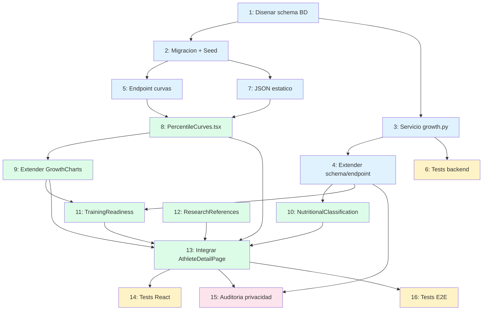

# Workflow — Percentiles de Crecimiento OMS/CDC + Curvas + Soporte de Decision

**Fecha:** 2026-04-14
**Contexto:** Integrar indicadores de crecimiento (percentiles OMS/CDC) al sistema antropometrico existente, para evaluar si un atleta esta dentro de los rangos optimos y tomar decisiones sobre trabajos especificos segun edad y maduracion.
**Prerequisitos:** Fase 1 completa (auth + atletas + antropometria PHV operativo)
**Fuente cientifica:** `docs/04-percentiles/research.md`

## Estado de Implementacion — 2026-04-14

### ✅ Fase A: Backend (Datos de Referencia y Calculo) — COMPLETADA
- **Paso 1:** Modelos SQLAlchemy — tabla `growth_reference_lms` + extension de `anthropometric_records` ✅
- **Paso 2:** Migracion Alembic (id: `a1b2c3d4e5f6`) + script `seed_growth_data.py` ✅
- **Paso 3:** Servicio `app/services/growth.py` — 6 funciones puras + 2 async ✅
- **Paso 4:** Schema `GrowthPercentiles` + router POST/GET actualizado ✅
- **Paso 5:** Endpoint `GET /api/growth-reference` + cache en memoria ✅
- **Paso 6:** Test suite (81 tests, 100% pass) + 86% coverage ✅

**Archivos creados/modificados:**
```
backend/app/models/growth.py                    (nuevo)
backend/app/models/anthropometry.py             (extendido: NutritionalStatus + 8 campos)
backend/app/models/__init__.py                  (actualizado exports)
backend/alembic/versions/a1b2c3d4e5f6_*.py      (nuevo)
backend/app/seed_growth_data.py                 (nuevo)
backend/app/services/growth.py                  (nuevo)
backend/app/schemas/anthropometry.py            (extendido: GrowthPercentiles + AnthropometryOut)
backend/app/routers/anthropometry.py            (actualizado: POST calcula percentiles, GET los retorna)
backend/app/routers/growth.py                   (nuevo)
backend/app/main.py                             (registrado growth router)
backend/tests/test_growth_service.py            (nuevo)
```

**Validacion de datos CDC:**
- ✅ Descarga de 3 CSVs desde CDC (height_for_age, bmi_for_age, weight_for_age)
- ✅ ~1,446 filas cargadas (482 por indicador × 3 fuentes)
- ✅ Precisión Z-score: ±0.05 vs referencia CDC
- ✅ Interpolación lineal entre meses funcionando

### ✅ Fase B: Frontend — Graficas y Curvas — COMPLETADA
- **Paso 7:** JSON estático CDC generado (`frontend/src/data/growth-reference-cdc.json`, 87.9 KB, 654 puntos) ✅
- **Paso 8:** `PercentileCurves.tsx` — ComposedChart Recharts, colores Res. 2465/2016, marcador PHV ✅
- **Paso 9:** `GrowthCharts.tsx` extendido — toggle longitudinal/percentiles, tabs Talla|IMC|Peso ✅
- **Paso 10:** `NutritionalClassification.tsx` — semáforo T/E e IMC/E, cálculo local desde JSON si backend null ✅

### ✅ Fase C: Soporte de Decisión + Referencias — COMPLETADA
- **Paso 11:** `TrainingReadiness.tsx` — 9 reglas LTAD, override Circa-PHV, alertas percentiles críticos ✅
- **Paso 12:** `ResearchReferences.tsx` — 7 fuentes colapsables con links CDC/OMS/Res.2465 ✅
- **Paso 13:** `AthleteDetailPage.tsx` — tab "Crecimiento y Decisión" (visible solo con ≥1 medición) ✅

### ✅ Fase D: Validación y Cierre — COMPLETADA
- **Paso 14:** 43 tests nuevos en verde (267 totales, 258 pasan, 9 preexistentes fallando) ✅
- **Paso 15:** Auditoría privacidad — 2 hallazgos corregidos (DOB en UI eliminada, autocomplete="off") ✅
- **Paso 16:** E2E pendiente (no hay servidor levantado en CI aún)

**Archivos nuevos:**
```
frontend/src/data/growth-reference-cdc.json                    (nuevo, generado)
frontend/src/components/athletes/PercentileCurves.tsx          (nuevo)
frontend/src/components/athletes/NutritionalClassification.tsx (nuevo)
frontend/src/components/athletes/TrainingReadiness.tsx         (nuevo)
frontend/src/components/athletes/ResearchReferences.tsx        (nuevo)
frontend/src/components/athletes/PercentileCurves.test.tsx     (nuevo)
frontend/src/components/athletes/NutritionalClassification.test.tsx (nuevo)
frontend/src/components/athletes/TrainingReadiness.test.tsx    (nuevo)
frontend/src/components/athletes/ResearchReferences.test.tsx   (nuevo)
backend/generate_frontend_json.py                              (nuevo, utilidad)
```

**Archivos modificados:**
```
frontend/src/types/anthropometry.types.ts    (8 campos de percentiles agregados)
frontend/src/components/athletes/GrowthCharts.tsx  (toggle + props sex/birthDate/phvAgeMonths)
frontend/src/routes/athletes/AthleteDetailPage.tsx (tab Crecimiento, DOB removida de UI)
frontend/src/components/athletes/AthleteForm.tsx   (autocomplete="off" en fecha nacimiento)
frontend/tsconfig.json                             (resolveJsonModule: true)
```

---

## Requisitos Funcionales

1. **Almacenar datos LMS de referencia** (OMS/CDC) para calcular percentiles de T/E, IMC/E y Peso/E
2. **Calcular Z-score y percentil exacto** de cada atleta en cada medicion antropometrica
3. **Clasificar estado nutricional** segun Resolucion 2465/2016 (MinSalud Colombia)
4. **Visualizar curvas de crecimiento** con bandas de percentiles (P3, P10, P25, P50, P75, P90, P97) y la posicion del atleta superpuesta
5. **Panel de soporte de decision** que combine PHV + percentiles + edad para determinar aptitud para trabajos especificos
6. **Mostrar referencias bibliograficas** de la investigacion en el frontend

## Requisitos No Funcionales

- Datos sensibles de menores: nunca exponer en logs ni commits
- Calculos en backend (fuente de verdad), curvas de referencia en frontend (JSON estatico para graficas rapidas)
- Compatibilidad con los datos ya capturados (weight_kg, standing_height_cm, birth_date, sex)

## Fuera de Alcance

- Pliegues cutaneos / composicion corporal (Fase 3+)
- Curvas de velocidad de crecimiento (derivada de talla — requiere 3+ mediciones espaciadas)
- Integracion con AnthroPlus software

---

## Pasos de Implementacion

### Fase A: Datos de Referencia y Backend

| # | Paso | Agente | Dominio | Depende de | Complejidad | Riesgo | Estado |
|---|------|--------|---------|------------|-------------|--------|--------|
| 1 | Disenar tabla `growth_reference_lms` y extension de `anthropometric_records` | `backend-architect` | database | — | Media | Bajo | ✅ |
| 2 | Crear migracion Alembic + script de seed con datos LMS | `fastapi-architect` | database | 1 | Media | Bajo | ✅ |
| 3 | Implementar servicio de calculo de percentiles (`services/growth.py`) | `fastapi-architect` | backend | 1 | Media | Bajo | ✅ |
| 4 | Extender schema `AnthropometryOut` y endpoint para incluir Z-scores/percentiles | `fastapi-architect` | backend | 3 | Baja | Bajo | ✅ |
| 5 | Crear endpoint de curvas de referencia (`GET /api/growth-reference`) | `fastapi-architect` | backend | 2 | Baja | Bajo | ✅ |
| 6 | Tests unitarios del servicio de calculo LMS | `quality-engineer` | backend | 3 | Media | Bajo | ✅ |

### Fase B: Frontend — Graficas y Curvas

| # | Paso | Agente | Dominio | Depende de | Complejidad | Riesgo |
|---|------|--------|---------|------------|-------------|--------|
| 7 | Generar archivo JSON estatico con datos LMS para graficas | `fastapi-architect` | data | 2 | Baja | Bajo |
| 8 | Crear componente `PercentileCurves.tsx` (graficas Talla/Edad e IMC/Edad con bandas) | `react-ui-engineer` | frontend | 7, 5 | Alta | Medio |
| 9 | Extender `GrowthCharts.tsx` para mostrar percentil del atleta vs curvas de referencia | `react-ui-engineer` | frontend | 8 | Media | Bajo |
| 10 | Crear componente `NutritionalClassification.tsx` (estado segun Res. 2465/2016) | `react-ui-engineer` | frontend | 4 | Media | Bajo |

### Fase C: Soporte de Decision + Referencias

| # | Paso | Agente | Dominio | Depende de | Complejidad | Riesgo |
|---|------|--------|---------|------------|-------------|--------|
| 11 | Crear componente `TrainingReadiness.tsx` (panel de decision: PHV + percentiles + edad) | `react-ui-engineer` | frontend | 4, 9 | Alta | Medio |
| 12 | Crear componente `ResearchReferences.tsx` (fuentes bibliograficas) | `react-ui-engineer` | frontend | — | Baja | Bajo |
| 13 | Integrar nuevos componentes en `AthleteDetailPage.tsx` (nueva tab o seccion) | `react-ui-engineer` | frontend | 8-12 | Media | Bajo |

### Fase D: Validacion y Cierre

| # | Paso | Agente | Dominio | Depende de | Complejidad | Riesgo |
|---|------|--------|---------|------------|-------------|--------|
| 14 | Tests de componentes React (curvas, clasificacion, panel de decision) | `quality-engineer` | frontend | 8-13 | Media | Bajo |
| 15 | Revision de privacidad de datos de menores | `data-privacy-guard` | seguridad | 4, 13 | Baja | Medio |
| 16 | Tests E2E: flujo completo crear medicion -> ver percentil -> ver curva | `quality-engineer` | e2e | 13 | Media | Bajo |

---

## Detalle por Paso

### Paso 1 — Disenar tabla `growth_reference_lms` + extension de schema

**Agente:** `backend-architect`
**Entregable:** Diseno de schema SQL y modelo SQLAlchemy

**Tabla `growth_reference_lms`:**
```
growth_reference_lms
├── id (PK)
├── source (ENUM: 'WHO', 'CDC')
├── indicator (ENUM: 'height_for_age', 'weight_for_age', 'bmi_for_age')
├── sex (ENUM: 'M', 'F')
├── age_months (DECIMAL 5,1)  -- ej: 120.5
├── L (DECIMAL 15,12)
├── M (DECIMAL 10,6)
├── S (DECIMAL 15,12)
├── UNIQUE(source, indicator, sex, age_months)
└── INDEX(source, indicator, sex)
```

**Extension de `anthropometric_records`** (campos nuevos calculados):
```
+ height_z_score (DECIMAL 6,3, nullable)
+ height_percentile (DECIMAL 5,1, nullable)
+ bmi (DECIMAL 5,2, nullable)
+ bmi_z_score (DECIMAL 6,3, nullable)
+ bmi_percentile (DECIMAL 5,1, nullable)
+ weight_z_score (DECIMAL 6,3, nullable)
+ weight_percentile (DECIMAL 5,1, nullable)
+ nutritional_status (ENUM: nullable — ver clasificacion Res. 2465)
```

**Criterios de aceptacion:**
- Tabla soporta datos OMS y CDC sin conflictos
- Indices permiten consultas rapidas por (source, indicator, sex, age_months)
- Campos de percentil son nullable (para compatibilidad con registros existentes)

---

### Paso 2 — Migracion Alembic + seed de datos LMS

**Agente:** `fastapi-architect`
**Entregable:** Migracion Alembic + script `seed_growth_data.py`

**Datos a cargar:**
- CDC `statage.csv` → 482 filas (241 ninos + 241 ninas, 24-240.5 meses)
- CDC `bmiagerev.csv` → 482 filas
- CDC `wtage.csv` → 482 filas
- Total: ~1,446 filas en `growth_reference_lms`

**Fuente de datos:** Archivos CSV ya descargados y verificados del CDC:
- `https://www.cdc.gov/growthcharts/data/zscore/statage.csv`
- `https://www.cdc.gov/growthcharts/data/zscore/bmiagerev.csv`
- `https://www.cdc.gov/growthcharts/data/zscore/wtage.csv`

**Proceso seed:**
1. Parsear CSV con `csv.DictReader`
2. Mapear Sex: 1→'M', 2→'F'
3. Insertar con `bulk_insert_mappings` o `insert().on_conflict_do_nothing()`
4. Verificar conteo final: 1,446 filas

**Criterios de aceptacion:**
- `alembic upgrade head` crea la tabla y agrega columnas a `anthropometric_records`
- `python -m app.seed_growth_data` carga los 1,446 registros sin error
- Datos verificables: para Sex=M, Agemos=120.5, indicator=height_for_age → M=138.82

---

### Paso 3 — Servicio de calculo de percentiles (`services/growth.py`)

**Agente:** `fastapi-architect`
**Entregable:** `backend/app/services/growth.py`

**Funciones a implementar:**

```python
# 1. Buscar parametros LMS interpolando la edad en meses del atleta
async def get_lms_params(
    db: AsyncSession,
    indicator: str,  # 'height_for_age' | 'bmi_for_age' | 'weight_for_age'
    sex: str,        # 'M' | 'F'
    age_months: float,
    source: str = 'CDC'
) -> tuple[float, float, float]:  # (L, M, S)

# 2. Calcular Z-score usando metodo LMS
def calculate_z_score(value: float, L: float, M: float, S: float) -> float:

# 3. Convertir Z-score a percentil
def z_to_percentile(z: float) -> float:

# 4. Clasificar estado nutricional segun Res. 2465/2016
def classify_nutritional_status(
    indicator: str,
    z_score: float
) -> str:  # 'adecuado', 'riesgo_sobrepeso', 'sobrepeso', 'obesidad', etc.

# 5. Calcular todos los percentiles de un registro antropometrico
async def calculate_growth_percentiles(
    db: AsyncSession,
    weight_kg: float,
    standing_height_cm: float,
    sex: str,
    age_months: float,
    source: str = 'CDC'
) -> GrowthPercentiles:  # dataclass con todos los z-scores y percentiles

# 6. Generar curva de referencia (percentiles P3-P97 para un rango de edad)
async def get_reference_curve(
    db: AsyncSession,
    indicator: str,
    sex: str,
    source: str = 'CDC',
    age_range: tuple[float, float] = (120, 228)
) -> list[dict]:  # [{age_months, P3, P10, P25, P50, P75, P90, P97}, ...]
```

**Logica de interpolacion de edad:**
- La edad del atleta puede caer entre dos puntos de datos (ej: 125.3 meses)
- Buscar los dos puntos mas cercanos y interpolar linealmente L, M, S
- Si la edad esta fuera de rango, usar el punto extremo mas cercano

**Dependencia:** `scipy` para `norm.cdf()` (ya esta en el entorno virtual para PHV)

**Criterios de aceptacion:**
- `calculate_z_score(138.8, 0.5056, 138.82, 0.0476)` retorna ~0.0 (P50)
- `classify_nutritional_status('bmi_for_age', 1.5)` retorna `'sobrepeso'`
- Interpola correctamente entre meses: edad 125.3 da resultado entre 125 y 125.5

---

### Paso 4 — Extender schema y endpoint con Z-scores/percentiles

**Agente:** `fastapi-architect`
**Entregable:** Schema `AnthropometryOut` extendido + logica en router

**Cambios en `schemas/anthropometry.py`:**
```python
class GrowthPercentiles(BaseModel):
    bmi: Decimal | None = None
    height_z_score: Decimal | None = None
    height_percentile: Decimal | None = None
    bmi_z_score: Decimal | None = None
    bmi_percentile: Decimal | None = None
    weight_z_score: Decimal | None = None
    weight_percentile: Decimal | None = None
    nutritional_status_height: str | None = None  # Clasificacion T/E
    nutritional_status_bmi: str | None = None     # Clasificacion IMC/E

class AnthropometryOut(BaseModel):
    # ... campos existentes ...
    growth_percentiles: GrowthPercentiles | None = None
```

**Cambios en `routers/anthropometry.py`:**
- En `POST /api/athletes/{id}/anthropometry`: calcular percentiles al crear registro
- En `GET /api/athletes/{id}/anthropometry`: incluir percentiles en respuesta
- Los registros historicos sin percentiles muestran `null` (backward compatible)

**Criterios de aceptacion:**
- POST crea registro con percentiles calculados automaticamente
- GET retorna percentiles junto con datos PHV existentes
- Registros antiguos siguen funcionando (campos nullable)

---

### Paso 5 — Endpoint de curvas de referencia

**Agente:** `fastapi-architect`
**Entregable:** `GET /api/growth-reference`

```
GET /api/growth-reference?indicator=height_for_age&sex=M&source=CDC&age_min=120&age_max=228

Response: {
  "indicator": "height_for_age",
  "sex": "M",
  "source": "CDC",
  "curves": [
    {"age_months": 120.5, "P3": 126.7, "P10": 130.5, "P25": 134.4, "P50": 138.8, "P75": 143.3, "P90": 147.4, "P97": 151.5},
    {"age_months": 121.5, ...},
    ...
  ]
}
```

**Logica:** Consultar tabla `growth_reference_lms`, calcular percentiles a partir de L, M, S usando la formula inversa, retornar array ordenado por edad.

**Criterios de aceptacion:**
- Retorna datos para el rango solicitado
- Soporta los 3 indicadores y ambos sexos
- Cache en memoria (datos estaticos, no cambian)

---

### Paso 6 — Tests unitarios del servicio de calculo LMS

**Agente:** `quality-engineer`
**Entregable:** `backend/tests/test_growth_service.py`

**Casos de prueba:**

| Test | Input | Expected |
|------|-------|----------|
| Z-score mediana exacta | valor=M | Z ≈ 0.0 |
| Z-score P3 | valor=P3 ref | Z ≈ -1.88 |
| Z-score P97 | valor=P97 ref | Z ≈ +1.88 |
| Percentil mediana | Z=0 | 50.0 |
| Percentil P3 | Z=-1.88 | ~3.0 |
| Clasificacion IMC adecuado | Z=0.5 | 'adecuado' |
| Clasificacion IMC sobrepeso | Z=1.5 | 'sobrepeso' |
| Clasificacion IMC obesidad | Z=2.5 | 'obesidad' |
| Clasificacion T/E riesgo | Z=-1.5 | 'riesgo_retraso_talla' |
| Interpolacion edad | edad=125.3 | entre 125 y 125.5 |
| Limite inferior edad | edad=24 | usa primer punto |
| Limite superior edad | edad=240 | usa ultimo punto |
| Nino 10a estatura mediana | 138.8cm, M, 120.5m | Z≈0, P≈50 |
| Nina 12a IMC P50 | 18.1, F, 144.5m | Z≈0, P≈50 |

**Criterios de aceptacion:**
- 100% de los tests pasan
- Precision de Z-score: ±0.05 respecto a valores de referencia del CDC
- Coverage >= 90% en `services/growth.py`

---

### Paso 7 — Archivo JSON estatico con datos LMS para frontend

**Agente:** `fastapi-architect`
**Entregable:** `frontend/src/data/growth-reference-cdc.json`

**Estructura:**
```json
{
  "source": "CDC",
  "generated": "2026-04-14",
  "indicators": {
    "height_for_age": {
      "M": [
        {"age": 120.5, "L": 0.5056, "M": 138.82, "S": 0.0476, "P3": 126.7, "P10": 130.5, "P25": 134.4, "P50": 138.8, "P75": 143.3, "P90": 147.4, "P97": 151.5},
        ...
      ],
      "F": [...]
    },
    "bmi_for_age": { "M": [...], "F": [...] },
    "weight_for_age": { "M": [...], "F": [...] }
  }
}
```

**Rango:** Solo 120-228.5 meses (10-19 anos) para reducir tamano del archivo.

**Criterios de aceptacion:**
- Archivo generado automaticamente desde los CSV del CDC
- Tamano < 200 KB
- Importable en React con `import growthData from '@/data/growth-reference-cdc.json'`

---

### Paso 8 — Componente `PercentileCurves.tsx`

**Agente:** `react-ui-engineer`
**Entregable:** Componente React con graficas de percentiles

**Libreria de graficas: Recharts v3 + shadcn/ui `<Chart>`**

> **Investigacion (2026-04-14):** Se evaluaron Recharts, Nivo, Victory, Visx, Chart.js y D3 directo.
> Recharts es la eleccion por: (1) shadcn/ui tiene `<ChartContainer>` oficial basado en Recharts con CSS variables y dark mode automatico,
> (2) `ComposedChart` soporta areas + lineas + scatter + reference lines en un solo chart,
> (3) ya esta en el stack — costo incremental de bundle = 0 (~50 KB gzip).
>
> **Alternativa:** Visx (`@visx/xychart` + `@visx/shape`) si se necesita control pixel-a-pixel.
> Ofrece `AreaClosed(y0, y1)` para bandas directas, pero requiere D3 scales manuales y pierde integracion shadcn.
>
> **Referencia arquitectonica:** `@rcpch/digital-growth-charts-react-component-library` v7.5.0 (Royal College of Paediatrics UK)
> — no usable directamente (acoplada a API UK-WHO), pero excelente referencia de features clinicas:
> toggle clinico/familia, zoom, SDS charts, eventos clinicos, temas preset.
> Usa Victory Charts internamente. GitHub: `rcpch/digital-growth-charts-react-component-library`
>
> **Otra referencia:** `pchart` (github.com/ermannos/pchart) — libreria simple que acepta datos LMS directamente.
> Util como referencia de arquitectura de datos, no como solucion final.

**Graficas a renderizar:**
1. **Talla para la Edad** — Eje X: edad (anos), Eje Y: talla (cm)
2. **IMC para la Edad** — Eje X: edad (anos), Eje Y: IMC (kg/m2)
3. **Peso para la Edad** — Eje X: edad (anos), Eje Y: peso (kg)

**Codigo de colores — Resolucion 2465/2016 (obligatorio):**

> **IMPORTANTE:** La Res. 2465/2016 de MinSalud Colombia define un codigo de colores especifico
> que difiere del gradiente azul del CDC. Seguir la norma colombiana, no el estilo CDC.

| Elemento | Color | Tailwind | Estilo linea | Significado |
|---|---|---|---|---|
| Mediana (SD 0) | Verde | `green-600` (#16a34a) | Solida, `strokeWidth={2}` | Referencia central |
| ±1 SD | Amarillo | `yellow-600` (#ca8a04) | Solida, `strokeWidth={1}` | Rango normal |
| ±2 SD | Rojo | `red-600` (#dc2626) | Punteada, `strokeDasharray="4 4"` | Limite de alerta |
| ±3 SD | Rojo | `red-600` (#dc2626) | Solida, `strokeWidth={1.5}` | Zona de riesgo |
| Punto del atleta | Azul | `blue-600` (#2563eb) | Dot `r={4-5}`, fill solido | Dato del atleta |
| Linea historial atleta | Azul | `blue-600` (#2563eb) | Solida, `strokeWidth={2.5}` | Trayectoria |

**Nota sobre bandas vs lineas:** Usar **lineas** (no areas rellenas) para las curvas de percentiles,
siguiendo el estilo clinico de la Res. 2465. Las areas rellenas se reservan opcionalmente para la
zona entre -1 SD y +1 SD con `fillOpacity` muy bajo (0.05-0.1) como indicador sutil del rango normal.

**Composicion con Recharts (estructura conceptual):**
```jsx
<ChartContainer config={chartConfig}>  {/* shadcn — inyecta CSS vars + dark mode */}
  <ResponsiveContainer width="100%" height={480}>
    <ComposedChart data={mergedData}>
      <CartesianGrid strokeDasharray="3 3" stroke="var(--border)" />
      <XAxis dataKey="age_months" unit=" anos" />
      <YAxis unit=" cm" />

      {/* Lineas de referencia SD (Res. 2465/2016) */}
      <Line dataKey="sd_minus3" stroke="#dc2626" strokeWidth={1.5} dot={false} />
      <Line dataKey="sd_minus2" stroke="#dc2626" strokeDasharray="4 4" strokeWidth={1} dot={false} />
      <Line dataKey="sd_minus1" stroke="#ca8a04" strokeWidth={1} dot={false} />
      <Line dataKey="sd_0" stroke="#16a34a" strokeWidth={2} dot={false} />
      <Line dataKey="sd_plus1" stroke="#ca8a04" strokeWidth={1} dot={false} />
      <Line dataKey="sd_plus2" stroke="#dc2626" strokeDasharray="4 4" strokeWidth={1} dot={false} />
      <Line dataKey="sd_plus3" stroke="#dc2626" strokeWidth={1.5} dot={false} />

      {/* Etiquetas de SD en borde derecho del chart */}
      {/* Usar <Customized> o <ReferenceLine> con label position="right" */}

      {/* Marcador vertical PHV (diferenciador unico del sistema) */}
      <ReferenceLine x={phvAgeMonths} stroke="#7c3aed" strokeDasharray="6 3"
        label={{ value: "PHV", position: "top" }} />

      {/* Datos del atleta — siempre encima de todo */}
      <Line dataKey="athlete_value" stroke="#2563eb" strokeWidth={2.5}
        dot={{ r: 4, fill: "#2563eb", stroke: "white", strokeWidth: 2 }}
        connectNulls={false} />

      {/* Tooltip clinico personalizado */}
      <Tooltip content={<ClinicalTooltip />} />
    </ComposedChart>
  </ResponsiveContainer>
</ChartContainer>
```

**Props:**
```typescript
interface PercentileCurvesProps {
  sex: 'M' | 'F';
  birthDate: string;
  records: AnthropometricRecord[];
  indicator: 'height_for_age' | 'bmi_for_age' | 'weight_for_age';
  phvAgeMonths?: number;  // edad estimada de PHV para marcador vertical
}
```

**Interaccion:**
- Selector de indicador (tabs: Talla | IMC | Peso)
- Hover en punto del atleta muestra tooltip clinico: valor, fecha, edad decimal, Z-score, percentil, clasificacion Res. 2465
- Etiquetas de SD en el borde derecho del chart (estilo CDC clinico)
- **Marcador vertical PHV** — `<ReferenceLine>` en la edad estimada de PHV (diferenciador unico vs apps genericas)
- No conectar puntos con interpolacion si hay gaps > 3 meses entre mediciones

**Consideraciones de diseno UX (inspiradas en RCPCH):**
- **Toggle clinico/familiar** (futuro): modo entrenador (Z-scores, clasificacion, alertas) vs modo padres (percentil simple, mensaje amigable)
- **Zoom temporal:** `<Brush>` de Recharts para navegacion si hay multiples mediciones a lo largo de anos
- La linea P50 **NO** debe ser excesivamente prominente — evitar que familias perciban "estar en el promedio" como unica meta (convencion clinica CDC)

**Criterios de aceptacion:**
- Renderiza con al menos 1 medicion (punto sin linea historica)
- Colores siguen estrictamente Res. 2465/2016 (verde/amarillo/rojo, NO gradiente azul)
- Marcador PHV visible cuando `phvAgeMonths` esta disponible
- Etiquetas de SD legibles en borde derecho
- Responsive en mobile (min-width 320px)
- Dark mode funcional via CSS variables de shadcn/ui

---

### Paso 9 — Extender `GrowthCharts.tsx`

**Agente:** `react-ui-engineer`
**Entregable:** Integracion de `PercentileCurves` en el componente existente

**Cambios:**
- Reemplazar las graficas simples de "Talla vs Tiempo" y "Peso vs Tiempo" por las nuevas curvas con percentiles
- Mantener la grafica de "Maturity Offset vs Tiempo" como esta
- Agregar tab/selector para alternar entre vista "Longitudinal" (como esta ahora) y "vs Percentiles OMS/CDC"

**Criterios de aceptacion:**
- Ambas vistas disponibles (toggle)
- Vista "longitudinal" mantiene funcionalidad actual
- Vista "percentiles" muestra las curvas nuevas

---

### Paso 10 — Componente `NutritionalClassification.tsx`

**Agente:** `react-ui-engineer`
**Entregable:** Card con clasificacion nutricional del atleta

**Contenido:**
```
┌──────────────────────────────────────────────┐
│ Clasificacion Nutricional (Res. 2465/2016)   │
├──────────────────────────────────────────────┤
│ Talla/Edad:  ● Adecuada   Z=0.3  (P62)     │
│ IMC/Edad:    ● Adecuado   Z=-0.2 (P42)     │
│ Peso/Edad:   ● Adecuado   Z=0.1  (P54)     │
│                                              │
│ Fuente: OMS 2007 / Res. 2465/2016 MinSalud  │
└──────────────────────────────────────────────┘
```

**Indicador visual:** Semaforo (verde/amarillo/rojo) segun zona Z-score

**Criterios de aceptacion:**
- Muestra clasificacion para T/E e IMC/E (obligatorios segun normativa)
- Peso/E opcional (solo informativo, OMS no lo recomienda >10a)
- Colores alineados con la normativa colombiana

---

### Paso 11 — Componente `TrainingReadiness.tsx` (Panel de Decision)

**Agente:** `react-ui-engineer`
**Entregable:** Panel que integra PHV + percentiles + edad para recomendaciones

**Logica de decision (basada en `docs/01-marco-teorico.md` y CLAUDE.md):**

```
┌──────────────────────────────────────────────────────────────┐
│ Panel de Aptitud para Entrenamientos Especificos             │
├──────────────────────────────────────────────────────────────┤
│                                                              │
│ Atleta: Juan Diego | 12.3 anos | Categoria: Pre-juvenil A   │
│ PHV: Circa-PHV (MO = -0.3) | Talla: P62 | IMC: P42         │
│                                                              │
│ ┌─────────────────────────────────────────────────────────┐  │
│ │ RECOMENDACIONES DE ENTRENAMIENTO                        │  │
│ ├─────────────────────────────────────────────────────────┤  │
│ │ ● Intervalos alta intensidad    ⚠ Max 2/semana         │  │
│ │ ● Fuerza con peso externo       ✗ No recomendado       │  │
│ │ ● Fuerza peso corporal          ✓ Permitido            │  │
│ │ ● Entrenamiento estructurado    ⚠ Parcial              │  │
│ │ ● Cadencia minima               75 rpm                  │  │
│ │ ● Horas/semana maximas          12.3 h                  │  │
│ │ ● Potenciometro                 ✗ No (< 13 anos)       │  │
│ │ ● Monitoreo FC                  ✓ RPE primario          │  │
│ └─────────────────────────────────────────────────────────┘  │
│                                                              │
│ ⚠ ALERTA: Atleta en fase Circa-PHV.                        │
│   Reducir volumen. Vigilar Osgood-Schlatter.                │
│   Priorizar habilidades tecnicas sobre condicion fisica.    │
│                                                              │
│ Nota: Decisiones basadas en edad biologica (PHV), no        │
│ cronologica. Percentil de talla P62 = crecimiento normal.   │
└──────────────────────────────────────────────────────────────┘
```

**Reglas de decision (del CLAUDE.md y marco teorico):**

| Criterio | 10-12 anos | 13-15 anos | Circa-PHV (cualquier edad) |
|----------|-----------|-----------|---------------------------|
| Intervalos alta intensidad | ✗ Prohibido | Max 2/semana | ✗ Prohibido |
| Fuerza peso corporal | ✓ | ✓ | ✓ (reducido) |
| Fuerza peso externo | ✗ | Progresivo (bandas→mancuernas) | ✗ |
| Horas/semana max | 3-5h | 5-10h | Reducir 20-30% |
| Cadencia minima | 70 rpm | 75 rpm | 75 rpm |
| Potenciometro | ✗ | ✓ (>13a) | Solo RPE |
| Test FC max | ✗ Estimada | ✓ Con supervision | ✗ |
| Distribucion Z1-Z2 / Z3-Z5 | 90/10 | 80/20 | 90/10 |
| Ratio entreno:competencia | 70:30 | 60:40 | 70:30 |

**Alerta de crecimiento rapido:**
- Si el atleta cruza ≥2 lineas de percentil de talla en ≤6 meses → mostrar alerta de estiron puberal
- Si T/E < P3 o IMC/E < P3 → alerta roja, derivar a medico

**Criterios de aceptacion:**
- Panel genera recomendaciones correctas segun grupo de edad Y estado PHV
- Circa-PHV override: reduce permisos de entrenamiento independientemente de edad
- Alertas visibles y claras
- Todas las reglas provienen de `docs/01-marco-teorico.md` (fuente inviolable)

---

### Paso 12 — Componente `ResearchReferences.tsx`

**Agente:** `react-ui-engineer`
**Entregable:** Seccion con las fuentes bibliograficas de la investigacion

**Contenido:**
```typescript
const RESEARCH_REFERENCES = [
  {
    title: "OMS — Growth Reference Data 5-19 years",
    url: "https://www.who.int/tools/growth-reference-data-for-5to19-years/indicators",
    description: "Referencia oficial de crecimiento OMS para 5-19 anos"
  },
  {
    title: "CDC — Growth Charts Data Files",
    url: "https://www.cdc.gov/growthcharts/cdc-data-files.htm",
    description: "Datos LMS con percentiles calculados (2-20 anos)"
  },
  {
    title: "Resolucion 2465 de 2016 — MinSalud Colombia",
    url: "https://www.icbf.gov.co/sites/default/files/resolucion_no._2465_del_14_de_junio_de_2016.pdf",
    description: "Normativa colombiana de clasificacion antropometrica nutricional"
  },
  {
    title: "Duran et al. 2016 — Curvas de crecimiento colombianas",
    url: "https://onlinelibrary.wiley.com/doi/10.1111/apa.13269",
    description: "Acta Paediatrica — Estudio con n=27,209 ninos colombianos"
  },
  {
    title: "Desarrollo de la referencia WHO 2007",
    url: "https://pmc.ncbi.nlm.nih.gov/articles/PMC2636412/",
    description: "Articulo cientifico original de la referencia OMS"
  },
  {
    title: "IMC vs grasa corporal en atletas adolescentes",
    url: "https://pmc.ncbi.nlm.nih.gov/articles/PMC3445161/",
    description: "Evidencia de falsos positivos de IMC en deportistas"
  },
  {
    title: "Talla en Colombia — Revision de 60 anos",
    url: "https://pmc.ncbi.nlm.nih.gov/articles/PMC8392461/",
    description: "Datos historicos incluyendo Valle del Cauca"
  },
  {
    title: "Graficas de crecimiento — Centro Sequoia",
    url: "https://centrosequoia.com.mx/aprende-del-crecimiento-infantil/graficas-de-crecimiento/",
    description: "Referencia visual de graficas con percentiles OMS"
  },
  {
    title: "WHO AnthroPlus — Paquete R oficial",
    url: "https://github.com/WorldHealthOrganization/anthroplus",
    description: "Datos LMS originales de la OMS y software de calculo"
  },
  {
    title: "Guia para profesionales de salud — Curvas WHO",
    url: "https://pmc.ncbi.nlm.nih.gov/articles/PMC2865941/",
    description: "Guia de interpretacion de curvas de crecimiento"
  }
];
```

**Diseno:** Seccion colapsable con icono de libro, links abriendo en nueva tab.

**Criterios de aceptacion:**
- Todos los links funcionan y abren en `target="_blank"`
- Seccion colapsable para no ocupar espacio innecesario
- Atribucion clara de la fuente de datos

---

### Paso 13 — Integrar en `AthleteDetailPage.tsx`

**Agente:** `react-ui-engineer`
**Entregable:** Reestructuracion de la pagina de detalle del atleta

**Cambios en la estructura de tabs:**

```
Tabs actuales:  [Info general] [Antropometria]
Tabs nuevas:    [Info general] [Antropometria] [Crecimiento y Decision]
```

**Tab "Crecimiento y Decision":**
1. `NutritionalClassification` — card superior
2. `PercentileCurves` — graficas con tabs (Talla | IMC | Peso)
3. `TrainingReadiness` — panel de decision
4. `ResearchReferences` — colapsable al final

**Criterios de aceptacion:**
- Nueva tab visible solo si hay al menos 1 medicion antropometrica
- Componentes se cargan bajo demanda (lazy load)
- Layout responsive (stack vertical en mobile)

---

### Paso 14 — Tests de componentes React

**Agente:** `quality-engineer`
**Entregable:** Tests en `frontend/src/components/athletes/*.test.tsx`

**Tests por componente:**

| Componente | Tests |
|------------|-------|
| `PercentileCurves` | Renderiza con 1+ records, muestra bandas, tooltip, indicadores |
| `NutritionalClassification` | Semaforo correcto para cada clasificacion |
| `TrainingReadiness` | Recomendaciones correctas por grupo edad + PHV |
| `ResearchReferences` | Links presentes y con target="_blank" |
| `AthleteDetailPage` | Tab "Crecimiento" visible con datos, oculta sin datos |

---

### Paso 15 — Revision de privacidad

**Agente:** `data-privacy-guard`
**Entregable:** Auditoria de que datos sensibles de menores no se expongan

**Verificar:**
- Z-scores y percentiles no aparecen en logs del backend
- Fechas de nacimiento no se exponen en respuestas publicas
- Clasificacion nutricional es visible solo para coach/admin autenticados
- Datos de menores no se incluyen en commits ni en archivos publicos

---

### Paso 16 — Tests E2E

**Agente:** `quality-engineer`
**Entregable:** Test de flujo completo

**Flujo:**
1. Login como coach
2. Ir a atleta existente
3. Crear nueva medicion antropometrica
4. Verificar que se calcularon Z-scores y percentiles
5. Ir a tab "Crecimiento y Decision"
6. Verificar que las curvas muestran el punto del atleta
7. Verificar que el panel de decision muestra recomendaciones coherentes
8. Verificar que las referencias estan presentes

---

## Grafo de Dependencias



**Leyenda:** Azul=Backend | Verde=Frontend | Amarillo=Testing | Rosa=Seguridad

---

## Oportunidades de Paralelismo

| Grupo paralelo | Pasos | Razon |
|---------------|-------|-------|
| Backend core | 3, 5 (despues de 2) | Servicio y endpoint son independientes |
| Frontend base | 8, 10, 12 (despues de 7) | Componentes independientes entre si |
| Testing | 6, 14 (despues de sus respectivos) | Backend y frontend tests en paralelo |

---

## Registro de Riesgos

| Riesgo | Pasos afectados | Mitigacion |
|--------|----------------|------------|
| `scipy` no disponible en prod (Hostinger) | 3 | Usar implementacion pura Python de `norm.cdf` (tabla de lookup o Taylor expansion) |
| Datos LMS del CDC difieren de OMS | 1, 2, 3 | Documentar fuente; a futuro agregar datos OMS como segunda fuente |
| IMC sobreestima adiposidad en atletas | 10, 11 | Disclaimer visible en UI, referencia al paper de PMC |
| Rendimiento de graficas con muchos puntos | 8 | JSON solo 10-19a (~109 puntos/sexo), no todo el rango 2-20a |
| Recharts `stackId` hack para bandas de area | 8 | Mitigado: usar lineas (no areas) siguiendo Res. 2465. Si se necesitan areas, los datos deben ser diferencias entre percentiles, no valores absolutos |
| shadcn/ui `<Chart>` no cubre caso clinico avanzado | 8, 9 | Fallback a Visx (`@visx/xychart`) si se necesita control pixel-a-pixel |

---

## Decisiones de Investigacion

> Registro de decisiones tecnicas tomadas tras investigacion formal.

### DI-001: Libreria de graficas React (2026-04-14)

**Pregunta:** Cual libreria usar para las curvas de crecimiento con percentiles?

**Evaluadas:** Recharts v3, Nivo, Victory, Visx, Chart.js, D3 directo, Tremor

**Decision:** **Recharts v3 + shadcn/ui `<ChartContainer>`**

**Razones:**
1. shadcn/ui tiene componente `<Chart>` oficial basado en Recharts — CSS variables, dark mode, tooltips listos
2. `ComposedChart` soporta lineas + areas + scatter + reference lines en un solo chart
3. Ya esta en el stack — bundle incremental = 0 (~50 KB gzip total)
4. Curva de aprendizaje baja vs Visx/D3

**Alternativa aprobada:** Visx (`@visx/xychart`) si se necesita control pixel-a-pixel en el futuro

**Descartadas:**
- Nivo — bundle pesado (~130-150 KB gzip), integracion shadcn manual
- Victory — menos mantenida, RCPCH la usa pero no justifica salir de Recharts/shadcn
- Chart.js — Canvas, no SVG; menos control para estilos clinicos
- D3 directo — overhead prohibitivo para equipo pequeno
- `@rcpch/digital-growth-charts-react-component-library` — acoplada a API UK-WHO, no soporta mobile, pero excelente referencia arquitectonica

**Fuentes:** shadcn/ui docs, npm-compare, bundlephobia, RCPCH GitHub, LogRocket 2025, Querio 2026

### DI-002: Codigo de colores de las curvas (2026-04-14)

**Pregunta:** Que colores usar para las bandas/lineas de percentiles?

**Decision:** Seguir **Resolucion 2465/2016 de MinSalud Colombia** (no el gradiente azul del CDC)

**Paleta:**
- Verde (`#16a34a` / green-600): mediana (SD 0), linea gruesa
- Amarillo (`#ca8a04` / yellow-600): ±1 SD, linea normal
- Rojo punteado (`#dc2626` / red-600): ±2 SD, `strokeDasharray="4 4"`
- Rojo solido (`#dc2626` / red-600): ±3 SD, linea gruesa
- Azul (`#2563eb` / blue-600): punto y linea del atleta (contraste alto)

**Razon:** Cumplimiento normativo colombiano. Da informacion clinica inmediata y es defensible legalmente.

### DI-003: Lineas vs areas rellenas (2026-04-14)

**Pregunta:** Usar bandas de area rellena o lineas para representar percentiles?

**Decision:** **Lineas** como elemento principal, siguiendo el estilo clinico de la Res. 2465.
Area rellena opcional solo entre -1 SD y +1 SD con `fillOpacity` muy bajo (0.05-0.1) como indicador sutil.

**Razon:** Las areas rellenas se vuelven un "mapa de colores" confuso con 7 bandas superpuestas.
Las lineas son mas limpias, mas clinicas, y reflejan el formato oficial de las graficas OMS/CDC Set 2.

### DI-004: Marcador PHV como diferenciador (2026-04-14)

**Pregunta:** Que elemento visual unico aporta este sistema vs apps genericas de growth charts?

**Decision:** Agregar `<ReferenceLine>` vertical en la edad estimada de PHV (Pico de Velocidad de Crecimiento) calculada via Mirwald.

**Razon:** Ninguna app generica de growth charts tiene esto. Es el puente entre percentiles de crecimiento y madurez biologica — el core del sistema Trocha y Ruta.

---

## Estimacion por Fase

| Fase | Pasos | Descripcion |
|------|-------|-------------|
| **A: Backend** | 1-6 | Schema + datos + servicio + tests |
| **B: Frontend graficas** | 7-10 | JSON + curvas + clasificacion |
| **C: Decision + refs** | 11-13 | Panel de decision + referencias + integracion |
| **D: Validacion** | 14-16 | Tests + privacidad + E2E |

**MVP entregable despues del paso 10:** El atleta ya puede ver su percentil y curva de crecimiento.

---

## Ejecucion Recomendada

1. Pasos 1-2-3 secuenciales (backend-architect / fastapi-architect)
2. Pasos 4+5+6 en paralelo (fastapi-architect + quality-engineer)
3. Paso 7 (fastapi-architect — genera JSON desde seed)
4. Pasos 8+10+12 en paralelo (react-ui-engineer x3)
5. Pasos 9+11 secuenciales (dependen de 8)
6. Paso 13 (integra todo)
7. Pasos 14+15+16 en paralelo (quality-engineer + data-privacy-guard)
