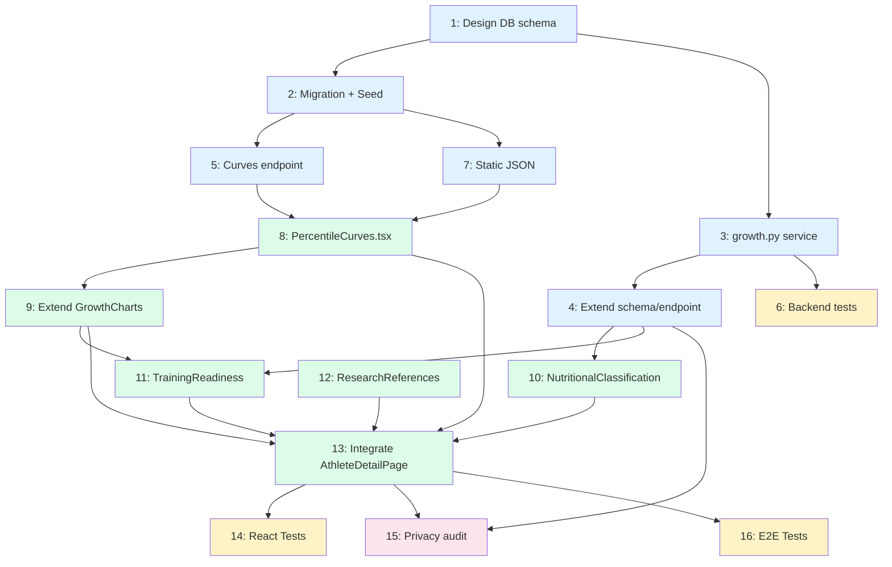

# Workflow — WHO/CDC Growth Percentiles + Curves + Decision Support

**Date:** 2026-04-14
**Context:** Integrate growth indicators (WHO/CDC percentiles) into the existing anthropometry system, to evaluate whether an athlete is within optimal ranges and make decisions about specific training based on age and maturation.
**Prerequisites:** Phase 1 complete (auth + athletes + anthropometry PHV operational)
**Scientific source:** `docs/04-percentiles/research.md`

## Implementation Status — 2026-04-14

### ✅ Phase A: Backend (Reference Data and Calculation) — COMPLETE
- **Step 1:** SQLAlchemy models — `growth_reference_lms` table + extension of `anthropometric_records` ✅
- **Step 2:** Alembic migration (id: `a1b2c3d4e5f6`) + `seed_growth_data.py` script ✅
- **Step 3:** `app/services/growth.py` service — 6 pure functions + 2 async ✅
- **Step 4:** `GrowthPercentiles` schema + updated POST/GET router ✅
- **Step 5:** `GET /api/growth-reference` endpoint + in-memory cache ✅
- **Step 6:** Test suite (81 tests, 100% pass) + 86% coverage ✅

**Files created/modified:**
```
backend/app/models/growth.py                    (new)
backend/app/models/anthropometry.py             (extended: NutritionalStatus + 8 fields)
backend/app/models/__init__.py                  (updated exports)
backend/alembic/versions/a1b2c3d4e5f6_*.py      (new)
backend/app/seed_growth_data.py                 (new)
backend/app/services/growth.py                  (new)
backend/app/schemas/anthropometry.py            (extended: GrowthPercentiles + AnthropometryOut)
backend/app/routers/anthropometry.py            (updated: POST calculates percentiles, GET returns them)
backend/app/routers/growth.py                   (new)
backend/app/main.py                             (registered growth router)
backend/tests/test_growth_service.py            (new)
```

**CDC data validation:**
- ✅ Download of 3 CSVs from CDC (height_for_age, bmi_for_age, weight_for_age)
- ✅ ~1,446 rows loaded (482 per indicator × 3 sources)
- ✅ Z-score precision: ±0.05 vs CDC reference
- ✅ Linear interpolation between months working

### ✅ Phase B: Frontend — Charts and Curves — COMPLETE
- **Step 7:** Static CDC JSON generated (`frontend/src/data/growth-reference-cdc.json`, 87.9 KB, 654 points) ✅
- **Step 8:** `PercentileCurves.tsx` — ComposedChart Recharts, Res. 2465/2016 colors, PHV marker ✅
- **Step 9:** `GrowthCharts.tsx` extended — longitudinal/percentile toggle, tabs Height|BMI|Weight ✅
- **Step 10:** `NutritionalClassification.tsx` — T/A and BMI/A traffic light, local calculation from JSON if backend null ✅

### ✅ Phase C: Decision Support + References — COMPLETE
- **Step 11:** `TrainingReadiness.tsx` — 9 LTAD rules, Circa-PHV override, critical percentile alerts ✅
- **Step 12:** `ResearchReferences.tsx` — 7 collapsible sources with CDC/WHO/Res.2465 links ✅
- **Step 13:** `AthleteDetailPage.tsx` — "Growth and Decision" tab (visible only with ≥1 measurement) ✅

### ✅ Phase D: Validation and Closure — COMPLETE
- **Step 14:** 43 new tests passing (267 total, 258 pass, 9 pre-existing failing) ✅
- **Step 15:** Privacy audit — 2 findings corrected (DOB removed from UI, autocomplete="off") ✅
- **Step 16:** E2E pending (no server running in CI yet)

**New files:**
```
frontend/src/data/growth-reference-cdc.json                    (new, generated)
frontend/src/components/athletes/PercentileCurves.tsx          (new)
frontend/src/components/athletes/NutritionalClassification.tsx (new)
frontend/src/components/athletes/TrainingReadiness.tsx         (new)
frontend/src/components/athletes/ResearchReferences.tsx        (new)
frontend/src/components/athletes/PercentileCurves.test.tsx     (new)
frontend/src/components/athletes/NutritionalClassification.test.tsx (new)
frontend/src/components/athletes/TrainingReadiness.test.tsx    (new)
frontend/src/components/athletes/ResearchReferences.test.tsx   (new)
backend/generate_frontend_json.py                              (new, utility)
```

**Modified files:**
```
frontend/src/types/anthropometry.types.ts    (8 percentile fields added)
frontend/src/components/athletes/GrowthCharts.tsx  (toggle + props sex/birthDate/phvAgeMonths)
frontend/src/routes/athletes/AthleteDetailPage.tsx (Growth tab, DOB removed from UI)
frontend/src/components/athletes/AthleteForm.tsx   (autocomplete="off" on birth date)
frontend/tsconfig.json                             (resolveJsonModule: true)
```

---

## Functional Requirements

1. **Store LMS reference data** (WHO/CDC) to calculate H/A, BMI/A and Weight/A percentiles
2. **Calculate exact Z-score and percentile** for each athlete in each anthropometric measurement
3. **Classify nutritional status** according to Resolution 2465/2016 (MinSalud Colombia)
4. **Visualize growth curves** with percentile bands (P3, P10, P25, P50, P75, P90, P97) and the athlete's position overlaid
5. **Decision support panel** that combines PHV + percentiles + age to determine readiness for specific training
6. **Display bibliographic references** from the research in the frontend

## Non-Functional Requirements

- Sensitive data of minors: never expose in logs or commits
- Calculations in backend (source of truth), reference curves in frontend (static JSON for fast charts)
- Compatibility with already captured data (weight_kg, standing_height_cm, birth_date, sex)

## Out of Scope

- Skinfolds / body composition (Phase 3+)
- Growth velocity curves (derived from height — requires 3+ spaced measurements)
- Integration with AnthroPlus software

---

## Implementation Steps

### Phase A: Reference Data and Backend

| # | Step | Agent | Domain | Depends on | Complexity | Risk | Status |
|---|------|--------|---------|------------|-------------|--------|--------|
| 1 | Design `growth_reference_lms` table and `anthropometric_records` extension | `backend-architect` | database | — | Medium | Low | ✅ |
| 2 | Create Alembic migration + seed script with LMS data | `fastapi-architect` | database | 1 | Medium | Low | ✅ |
| 3 | Implement percentile calculation service (`services/growth.py`) | `fastapi-architect` | backend | 1 | Medium | Low | ✅ |
| 4 | Extend `AnthropometryOut` schema and endpoint to include Z-scores/percentiles | `fastapi-architect` | backend | 3 | Low | Low | ✅ |
| 5 | Create reference curves endpoint (`GET /api/growth-reference`) | `fastapi-architect` | backend | 2 | Low | Low | ✅ |
| 6 | Unit tests for LMS calculation service | `quality-engineer` | backend | 3 | Medium | Low | ✅ |

### Phase B: Frontend — Charts and Curves

| # | Step | Agent | Domain | Depends on | Complexity | Risk |
|---|------|--------|---------|------------|-------------|--------|
| 7 | Generate static JSON file with LMS data for charts | `fastapi-architect` | data | 2 | Low | Low |
| 8 | Create `PercentileCurves.tsx` component (Height/Age and BMI/Age charts with bands) | `react-ui-engineer` | frontend | 7, 5 | High | Medium |
| 9 | Extend `GrowthCharts.tsx` to show athlete's percentile vs reference curves | `react-ui-engineer` | frontend | 8 | Medium | Low |
| 10 | Create `NutritionalClassification.tsx` component (status per Res. 2465/2016) | `react-ui-engineer` | frontend | 4 | Medium | Low |

### Phase C: Decision Support + References

| # | Step | Agent | Domain | Depends on | Complexity | Risk |
|---|------|--------|---------|------------|-------------|--------|
| 11 | Create `TrainingReadiness.tsx` component (decision panel: PHV + percentiles + age) | `react-ui-engineer` | frontend | 4, 9 | High | Medium |
| 12 | Create `ResearchReferences.tsx` component (bibliographic sources) | `react-ui-engineer` | frontend | — | Low | Low |
| 13 | Integrate new components in `AthleteDetailPage.tsx` (new tab or section) | `react-ui-engineer` | frontend | 8-12 | Medium | Low |

### Phase D: Validation and Closure

| # | Step | Agent | Domain | Depends on | Complexity | Risk |
|---|------|--------|---------|------------|-------------|--------|
| 14 | React component tests (curves, classification, decision panel) | `quality-engineer` | frontend | 8-13 | Medium | Low |
| 15 | Minors data privacy review | `data-privacy-guard` | security | 4, 13 | Low | Medium |
| 16 | E2E tests: full flow create measurement -> view percentile -> view curve | `quality-engineer` | e2e | 13 | Medium | Low |

---

## Step-by-Step Detail

### Step 1 — Design `growth_reference_lms` table + schema extension

**Agent:** `backend-architect`
**Deliverable:** SQL schema design and SQLAlchemy model

**`growth_reference_lms` table:**
```
growth_reference_lms
├── id (PK)
├── source (ENUM: 'WHO', 'CDC')
├── indicator (ENUM: 'height_for_age', 'weight_for_age', 'bmi_for_age')
├── sex (ENUM: 'M', 'F')
├── age_months (DECIMAL 5,1)  -- e.g.: 120.5
├── L (DECIMAL 15,12)
├── M (DECIMAL 10,6)
├── S (DECIMAL 15,12)
├── UNIQUE(source, indicator, sex, age_months)
└── INDEX(source, indicator, sex)
```

**`anthropometric_records` extension** (new calculated fields):
```
+ height_z_score (DECIMAL 6,3, nullable)
+ height_percentile (DECIMAL 5,1, nullable)
+ bmi (DECIMAL 5,2, nullable)
+ bmi_z_score (DECIMAL 6,3, nullable)
+ bmi_percentile (DECIMAL 5,1, nullable)
+ weight_z_score (DECIMAL 6,3, nullable)
+ weight_percentile (DECIMAL 5,1, nullable)
+ nutritional_status (ENUM: nullable — see Res. 2465 classification)
```

**Acceptance criteria:**
- Table supports WHO and CDC data without conflicts
- Indexes allow fast queries by (source, indicator, sex, age_months)
- Percentile fields are nullable (for compatibility with existing records)

---

### Step 2 — Alembic migration + LMS data seed

**Agent:** `fastapi-architect`
**Deliverable:** Alembic migration + `seed_growth_data.py` script

**Data to load:**
- CDC `statage.csv` → 482 rows (241 boys + 241 girls, 24-240.5 months)
- CDC `bmiagerev.csv` → 482 rows
- CDC `wtage.csv` → 482 rows
- Total: ~1,446 rows in `growth_reference_lms`

**Data source:** CSV files already downloaded and verified from CDC:
- `https://www.cdc.gov/growthcharts/data/zscore/statage.csv`
- `https://www.cdc.gov/growthcharts/data/zscore/bmiagerev.csv`
- `https://www.cdc.gov/growthcharts/data/zscore/wtage.csv`

**Seed process:**
1. Parse CSV with `csv.DictReader`
2. Map Sex: 1→'M', 2→'F'
3. Insert with `bulk_insert_mappings` or `insert().on_conflict_do_nothing()`
4. Verify final count: 1,446 rows

**Acceptance criteria:**
- `alembic upgrade head` creates the table and adds columns to `anthropometric_records`
- `python -m app.seed_growth_data` loads the 1,446 records without error
- Data verifiable: for Sex=M, Agemos=120.5, indicator=height_for_age → M=138.82

---

### Step 3 — Percentile calculation service (`services/growth.py`)

**Agent:** `fastapi-architect`
**Deliverable:** `backend/app/services/growth.py`

**Functions to implement:**

```python
# 1. Retrieve LMS parameters by interpolating the athlete's age in months
async def get_lms_params(
    db: AsyncSession,
    indicator: str,  # 'height_for_age' | 'bmi_for_age' | 'weight_for_age'
    sex: str,        # 'M' | 'F'
    age_months: float,
    source: str = 'CDC'
) -> tuple[float, float, float]:  # (L, M, S)

# 2. Calculate Z-score using LMS method
def calculate_z_score(value: float, L: float, M: float, S: float) -> float:

# 3. Convert Z-score to percentile
def z_to_percentile(z: float) -> float:

# 4. Classify nutritional status per Res. 2465/2016
def classify_nutritional_status(
    indicator: str,
    z_score: float
) -> str:  # 'adecuado', 'riesgo_sobrepeso', 'sobrepeso', 'obesidad', etc.

# 5. Calculate all percentiles for an anthropometric record
async def calculate_growth_percentiles(
    db: AsyncSession,
    weight_kg: float,
    standing_height_cm: float,
    sex: str,
    age_months: float,
    source: str = 'CDC'
) -> GrowthPercentiles:  # dataclass with all z-scores and percentiles

# 6. Generate reference curve (P3-P97 percentiles for an age range)
async def get_reference_curve(
    db: AsyncSession,
    indicator: str,
    sex: str,
    source: str = 'CDC',
    age_range: tuple[float, float] = (120, 228)
) -> list[dict]:  # [{age_months, P3, P10, P25, P50, P75, P90, P97}, ...]
```

**Age interpolation logic:**
- The athlete's age may fall between two data points (e.g.: 125.3 months)
- Find the two nearest points and linearly interpolate L, M, S
- If the age is out of range, use the nearest extreme point

**Dependency:** `scipy` for `norm.cdf()` (already in the virtual environment for PHV)

**Acceptance criteria:**
- `calculate_z_score(138.8, 0.5056, 138.82, 0.0476)` returns ~0.0 (P50)
- `classify_nutritional_status('bmi_for_age', 1.5)` returns `'sobrepeso'`
- Correctly interpolates between months: age 125.3 gives result between 125 and 125.5

---

### Step 4 — Extend schema and endpoint with Z-scores/percentiles

**Agent:** `fastapi-architect`
**Deliverable:** Extended `AnthropometryOut` schema + router logic

**Changes in `schemas/anthropometry.py`:**
```python
class GrowthPercentiles(BaseModel):
    bmi: Decimal | None = None
    height_z_score: Decimal | None = None
    height_percentile: Decimal | None = None
    bmi_z_score: Decimal | None = None
    bmi_percentile: Decimal | None = None
    weight_z_score: Decimal | None = None
    weight_percentile: Decimal | None = None
    nutritional_status_height: str | None = None  # H/A classification
    nutritional_status_bmi: str | None = None     # BMI/A classification

class AnthropometryOut(BaseModel):
    # ... existing fields ...
    growth_percentiles: GrowthPercentiles | None = None
```

**Changes in `routers/anthropometry.py`:**
- In `POST /api/athletes/{id}/anthropometry`: calculate percentiles when creating record
- In `GET /api/athletes/{id}/anthropometry`: include percentiles in response
- Historical records without percentiles show `null` (backward compatible)

**Acceptance criteria:**
- POST creates record with automatically calculated percentiles
- GET returns percentiles alongside existing PHV data
- Old records continue to work (nullable fields)

---

### Step 5 — Reference curves endpoint

**Agent:** `fastapi-architect`
**Deliverable:** `GET /api/growth-reference`

```
GET /api/growth-reference?indicator=height_for_age&sex=M&source=CDC&age_min=120&age_max=228

Response: {
  "indicator": "height_for_age",
  "sex": "M",
  "source": "CDC",
  "curves": [
    {"age_months": 120.5, "P3": 126.7, "P10": 130.5, "P25": 134.4, "P50": 138.8, "P75": 143.3, "P90": 147.4, "P97": 151.5},
    {"age_months": 121.5, ...},
    ...
  ]
}
```

**Logic:** Query the `growth_reference_lms` table, calculate percentiles from L, M, S using the inverse formula, return array sorted by age.

**Acceptance criteria:**
- Returns data for the requested range
- Supports all 3 indicators and both sexes
- In-memory cache (static data, does not change)

---

### Step 6 — Unit tests for LMS calculation service

**Agent:** `quality-engineer`
**Deliverable:** `backend/tests/test_growth_service.py`

**Test cases:**

| Test | Input | Expected |
|------|-------|----------|
| Exact median Z-score | value=M | Z ≈ 0.0 |
| P3 Z-score | value=P3 ref | Z ≈ -1.88 |
| P97 Z-score | value=P97 ref | Z ≈ +1.88 |
| Median percentile | Z=0 | 50.0 |
| P3 percentile | Z=-1.88 | ~3.0 |
| Adequate BMI classification | Z=0.5 | 'adecuado' |
| Overweight BMI classification | Z=1.5 | 'sobrepeso' |
| Obesity BMI classification | Z=2.5 | 'obesidad' |
| H/A risk classification | Z=-1.5 | 'riesgo_retraso_talla' |
| Age interpolation | age=125.3 | between 125 and 125.5 |
| Lower age limit | age=24 | uses first point |
| Upper age limit | age=240 | uses last point |
| 10y boy median height | 138.8cm, M, 120.5m | Z≈0, P≈50 |
| 12y girl P50 BMI | 18.1, F, 144.5m | Z≈0, P≈50 |

**Acceptance criteria:**
- 100% of tests pass
- Z-score precision: ±0.05 vs CDC reference values
- Coverage >= 90% in `services/growth.py`

---

### Step 7 — Static JSON file with LMS data for frontend

**Agent:** `fastapi-architect`
**Deliverable:** `frontend/src/data/growth-reference-cdc.json`

**Structure:**
```json
{
  "source": "CDC",
  "generated": "2026-04-14",
  "indicators": {
    "height_for_age": {
      "M": [
        {"age": 120.5, "L": 0.5056, "M": 138.82, "S": 0.0476, "P3": 126.7, "P10": 130.5, "P25": 134.4, "P50": 138.8, "P75": 143.3, "P90": 147.4, "P97": 151.5},
        ...
      ],
      "F": [...]
    },
    "bmi_for_age": { "M": [...], "F": [...] },
    "weight_for_age": { "M": [...], "F": [...] }
  }
}
```

**Range:** Only 120-228.5 months (10-19 years) to reduce file size.

**Acceptance criteria:**
- File generated automatically from CDC CSVs
- Size < 200 KB
- Importable in React with `import growthData from '@/data/growth-reference-cdc.json'`

---

### Step 8 — `PercentileCurves.tsx` component

**Agent:** `react-ui-engineer`
**Deliverable:** React component with percentile charts

**Chart library: Recharts v3 + shadcn/ui `<Chart>`**

> **Research (2026-04-14):** Recharts, Nivo, Victory, Visx, Chart.js and direct D3 were evaluated.
> Recharts is the choice because: (1) shadcn/ui has an official `<ChartContainer>` based on Recharts with CSS variables and automatic dark mode,
> (2) `ComposedChart` supports areas + lines + scatter + reference lines in a single chart,
> (3) it is already in the stack — incremental bundle cost = 0 (~50 KB gzip).
>
> **Alternative:** Visx (`@visx/xychart` + `@visx/shape`) if pixel-level control is needed.
> Offers `AreaClosed(y0, y1)` for direct bands, but requires manual D3 scales and loses shadcn integration.
>
> **Architectural reference:** `@rcpch/digital-growth-charts-react-component-library` v7.5.0 (Royal College of Paediatrics UK)
> — not directly usable (coupled to UK-WHO API), but excellent reference for clinical features:
> clinical/family toggle, zoom, SDS charts, clinical events, preset themes.
> Uses Victory Charts internally. GitHub: `rcpch/digital-growth-charts-react-component-library`
>
> **Another reference:** `pchart` (github.com/ermannos/pchart) — simple library that accepts LMS data directly.
> Useful as a data architecture reference, not as a final solution.

**Charts to render:**
1. **Height for Age** — X axis: age (years), Y axis: height (cm)
2. **BMI for Age** — X axis: age (years), Y axis: BMI (kg/m2)
3. **Weight for Age** — X axis: age (years), Y axis: weight (kg)

**Color code — Resolution 2465/2016 (mandatory):**

> **IMPORTANT:** Res. 2465/2016 from MinSalud Colombia defines a specific color code
> that differs from the CDC's blue gradient. Follow Colombian regulations, not CDC style.

| Element | Color | Tailwind | Line style | Meaning |
|---|---|---|---|---|
| Median (SD 0) | Green | `green-600` (#16a34a) | Solid, `strokeWidth={2}` | Central reference |
| ±1 SD | Yellow | `yellow-600` (#ca8a04) | Solid, `strokeWidth={1}` | Normal range |
| ±2 SD | Red | `red-600` (#dc2626) | Dashed, `strokeDasharray="4 4"` | Alert limit |
| ±3 SD | Red | `red-600` (#dc2626) | Solid, `strokeWidth={1.5}` | Risk zone |
| Athlete point | Blue | `blue-600` (#2563eb) | Dot `r={4-5}`, solid fill | Athlete data |
| Athlete history line | Blue | `blue-600` (#2563eb) | Solid, `strokeWidth={2.5}` | Trajectory |

**Note on bands vs lines:** Use **lines** (not filled areas) for percentile curves,
following the clinical style of Res. 2465. Filled areas are optionally reserved for the
zone between -1 SD and +1 SD with very low `fillOpacity` (0.05-0.1) as a subtle indicator of the normal range.

**Composition with Recharts (conceptual structure):**
```jsx
<ChartContainer config={chartConfig}>  {/* shadcn — injects CSS vars + dark mode */}
  <ResponsiveContainer width="100%" height={480}>
    <ComposedChart data={mergedData}>
      <CartesianGrid strokeDasharray="3 3" stroke="var(--border)" />
      <XAxis dataKey="age_months" unit=" years" />
      <YAxis unit=" cm" />

      {/* SD reference lines (Res. 2465/2016) */}
      <Line dataKey="sd_minus3" stroke="#dc2626" strokeWidth={1.5} dot={false} />
      <Line dataKey="sd_minus2" stroke="#dc2626" strokeDasharray="4 4" strokeWidth={1} dot={false} />
      <Line dataKey="sd_minus1" stroke="#ca8a04" strokeWidth={1} dot={false} />
      <Line dataKey="sd_0" stroke="#16a34a" strokeWidth={2} dot={false} />
      <Line dataKey="sd_plus1" stroke="#ca8a04" strokeWidth={1} dot={false} />
      <Line dataKey="sd_plus2" stroke="#dc2626" strokeDasharray="4 4" strokeWidth={1} dot={false} />
      <Line dataKey="sd_plus3" stroke="#dc2626" strokeWidth={1.5} dot={false} />

      {/* SD labels on right edge of chart */}
      {/* Use <Customized> or <ReferenceLine> with label position="right" */}

      {/* Vertical PHV marker (unique differentiator of this system) */}
      <ReferenceLine x={phvAgeMonths} stroke="#7c3aed" strokeDasharray="6 3"
        label={{ value: "PHV", position: "top" }} />

      {/* Athlete data — always on top of everything */}
      <Line dataKey="athlete_value" stroke="#2563eb" strokeWidth={2.5}
        dot={{ r: 4, fill: "#2563eb", stroke: "white", strokeWidth: 2 }}
        connectNulls={false} />

      {/* Custom clinical tooltip */}
      <Tooltip content={<ClinicalTooltip />} />
    </ComposedChart>
  </ResponsiveContainer>
</ChartContainer>
```

**Props:**
```typescript
interface PercentileCurvesProps {
  sex: 'M' | 'F';
  birthDate: string;
  records: AnthropometricRecord[];
  indicator: 'height_for_age' | 'bmi_for_age' | 'weight_for_age';
  phvAgeMonths?: number;  // estimated PHV age for vertical marker
}
```

**Interaction:**
- Indicator selector (tabs: Height | BMI | Weight)
- Hover on athlete point shows clinical tooltip: value, date, decimal age, Z-score, percentile, Res. 2465 classification
- SD labels on right edge of chart (clinical CDC style)
- **Vertical PHV marker** — `<ReferenceLine>` at the estimated PHV age (unique differentiator vs generic apps)
- Do not connect points with interpolation if there are gaps > 3 months between measurements

**UX design considerations (inspired by RCPCH):**
- **Clinical/family toggle** (future): coach mode (Z-scores, classification, alerts) vs parent mode (simple percentile, friendly message)
- **Time zoom:** Recharts `<Brush>` for navigation if there are multiple measurements over years
- The P50 line **should NOT** be excessively prominent — avoid families perceiving "being at the average" as the only goal (CDC clinical convention)

**Acceptance criteria:**
- Renders with at least 1 measurement (point without history line)
- Colors strictly follow Res. 2465/2016 (green/yellow/red, NOT blue gradient)
- PHV marker visible when `phvAgeMonths` is available
- SD labels legible on right edge
- Responsive on mobile (min-width 320px)
- Dark mode functional via shadcn/ui CSS variables

---

### Step 9 — Extend `GrowthCharts.tsx`

**Agent:** `react-ui-engineer`
**Deliverable:** Integration of `PercentileCurves` in the existing component

**Changes:**
- Replace the simple "Height vs Time" and "Weight vs Time" charts with the new percentile curves
- Keep the "Maturity Offset vs Time" chart as is
- Add tab/selector to toggle between "Longitudinal" view (as it is now) and "vs WHO/CDC Percentiles"

**Acceptance criteria:**
- Both views available (toggle)
- "Longitudinal" view maintains current functionality
- "Percentiles" view shows the new curves

---

### Step 10 — `NutritionalClassification.tsx` component

**Agent:** `react-ui-engineer`
**Deliverable:** Card with the athlete's nutritional classification

**Content:**
```
┌──────────────────────────────────────────────┐
│ Nutritional Classification (Res. 2465/2016)  │
├──────────────────────────────────────────────┤
│ Height/Age:  ● Adequate   Z=0.3  (P62)      │
│ BMI/Age:     ● Adequate   Z=-0.2 (P42)      │
│ Weight/Age:  ● Adequate   Z=0.1  (P54)      │
│                                              │
│ Source: WHO 2007 / Res. 2465/2016 MinSalud   │
└──────────────────────────────────────────────┘
```

**Visual indicator:** Traffic light (green/yellow/red) based on Z-score zone

**Acceptance criteria:**
- Shows classification for H/A and BMI/A (mandatory per regulations)
- Weight/A optional (informational only, WHO does not recommend it >10y)
- Colors aligned with Colombian regulations

---

### Step 11 — `TrainingReadiness.tsx` component (Decision Panel)

**Agent:** `react-ui-engineer`
**Deliverable:** Panel that integrates PHV + percentiles + age for recommendations

**Decision logic (based on `docs/01-marco-teorico.md` and CLAUDE.md):**

```
┌──────────────────────────────────────────────────────────────┐
│ Readiness Panel for Specific Training                        │
├──────────────────────────────────────────────────────────────┤
│                                                              │
│ Athlete: Juan Diego | 12.3 years | Category: Pre-juvenil A  │
│ PHV: Circa-PHV (MO = -0.3) | Height: P62 | BMI: P42         │
│                                                              │
│ ┌─────────────────────────────────────────────────────────┐  │
│ │ TRAINING RECOMMENDATIONS                                │  │
│ ├─────────────────────────────────────────────────────────┤  │
│ │ ● High-intensity intervals      ⚠ Max 2/week           │  │
│ │ ● External weight strength      ✗ Not recommended      │  │
│ │ ● Bodyweight strength           ✓ Allowed              │  │
│ │ ● Structured training           ⚠ Partial              │  │
│ │ ● Minimum cadence               75 rpm                  │  │
│ │ ● Maximum hours/week            12.3 h                  │  │
│ │ ● Power meter                   ✗ No (< 13 years)      │  │
│ │ ● HR monitoring                 ✓ RPE primary           │  │
│ └─────────────────────────────────────────────────────────┘  │
│                                                              │
│ ⚠ ALERT: Athlete in Circa-PHV phase.                        │
│   Reduce volume. Watch for Osgood-Schlatter.                │
│   Prioritize technical skills over fitness.                 │
│                                                              │
│ Note: Decisions based on biological age (PHV), not          │
│ chronological. Height percentile P62 = normal growth.       │
└──────────────────────────────────────────────────────────────┘
```

**Decision rules (from CLAUDE.md and theoretical framework):**

| Criterion | 10-12 years | 13-15 years | Circa-PHV (any age) |
|----------|-----------|-----------|---------------------------|
| High-intensity intervals | ✗ Prohibited | Max 2/week | ✗ Prohibited |
| Bodyweight strength | ✓ | ✓ | ✓ (reduced) |
| External weight strength | ✗ | Progressive (bands→dumbbells) | ✗ |
| Max hours/week | 3-5h | 5-10h | Reduce 20-30% |
| Minimum cadence | 70 rpm | 75 rpm | 75 rpm |
| Power meter | ✗ | ✓ (>13y) | RPE only |
| Max HR test | ✗ Estimated | ✓ With supervision | ✗ |
| Z1-Z2 / Z3-Z5 distribution | 90/10 | 80/20 | 90/10 |
| Training:competition ratio | 70:30 | 60:40 | 70:30 |

**Rapid growth alert:**
- If the athlete crosses ≥2 height percentile lines in ≤6 months → show growth spurt alert
- If H/A < P3 or BMI/A < P3 → red alert, refer to physician

**Acceptance criteria:**
- Panel generates correct recommendations based on age group AND PHV status
- Circa-PHV override: reduces training permissions regardless of age
- Alerts visible and clear
- All rules come from `docs/01-marco-teorico.md` (non-negotiable source)

---

### Step 12 — `ResearchReferences.tsx` component

**Agent:** `react-ui-engineer`
**Deliverable:** Section with bibliographic sources from the research

**Content:**
```typescript
const RESEARCH_REFERENCES = [
  {
    title: "WHO — Growth Reference Data 5-19 years",
    url: "https://www.who.int/tools/growth-reference-data-for-5to19-years/indicators",
    description: "Official WHO growth reference for ages 5-19"
  },
  {
    title: "CDC — Growth Charts Data Files",
    url: "https://www.cdc.gov/growthcharts/cdc-data-files.htm",
    description: "LMS data with calculated percentiles (2-20 years)"
  },
  {
    title: "Resolution 2465 of 2016 — MinSalud Colombia",
    url: "https://www.icbf.gov.co/sites/default/files/resolucion_no._2465_del_14_de_junio_de_2016.pdf",
    description: "Colombian regulations for nutritional anthropometric classification"
  },
  {
    title: "Duran et al. 2016 — Colombian growth curves",
    url: "https://onlinelibrary.wiley.com/doi/10.1111/apa.13269",
    description: "Acta Paediatrica — Study with n=27,209 Colombian children"
  },
  {
    title: "Development of WHO 2007 reference",
    url: "https://pmc.ncbi.nlm.nih.gov/articles/PMC2636412/",
    description: "Original scientific article for the WHO reference"
  },
  {
    title: "BMI vs body fat in adolescent athletes",
    url: "https://pmc.ncbi.nlm.nih.gov/articles/PMC3445161/",
    description: "Evidence of BMI false positives in athletes"
  },
  {
    title: "Height in Colombia — 60-year review",
    url: "https://pmc.ncbi.nlm.nih.gov/articles/PMC8392461/",
    description: "Historical data including Valle del Cauca"
  },
  {
    title: "Growth charts — Centro Sequoia",
    url: "https://centrosequoia.com.mx/aprende-del-crecimiento-infantil/graficas-de-crecimiento/",
    description: "Visual reference for charts with WHO percentiles"
  },
  {
    title: "WHO AnthroPlus — Official R package",
    url: "https://github.com/WorldHealthOrganization/anthroplus",
    description: "Original WHO LMS data and calculation software"
  },
  {
    title: "Professional health guide — WHO curves",
    url: "https://pmc.ncbi.nlm.nih.gov/articles/PMC2865941/",
    description: "Guide to interpreting growth curves"
  }
];
```

**Design:** Collapsible section with book icon, links opening in new tab.

**Acceptance criteria:**
- All links work and open with `target="_blank"`
- Collapsible section to avoid unnecessary space usage
- Clear attribution of the data source

---

### Step 13 — Integrate into `AthleteDetailPage.tsx`

**Agent:** `react-ui-engineer`
**Deliverable:** Restructuring of the athlete detail page

**Changes to tab structure:**

```
Current tabs:  [General info] [Anthropometry]
New tabs:      [General info] [Anthropometry] [Growth and Decision]
```

**"Growth and Decision" tab:**
1. `NutritionalClassification` — top card
2. `PercentileCurves` — charts with tabs (Height | BMI | Weight)
3. `TrainingReadiness` — decision panel
4. `ResearchReferences` — collapsible at the bottom

**Acceptance criteria:**
- New tab visible only if there is at least 1 anthropometric measurement
- Components loaded on demand (lazy load)
- Responsive layout (vertical stack on mobile)

---

### Step 14 — React component tests

**Agent:** `quality-engineer`
**Deliverable:** Tests in `frontend/src/components/athletes/*.test.tsx`

**Tests per component:**

| Component | Tests |
|------------|-------|
| `PercentileCurves` | Renders with 1+ records, shows bands, tooltip, indicators |
| `NutritionalClassification` | Correct traffic light for each classification |
| `TrainingReadiness` | Correct recommendations by age group + PHV |
| `ResearchReferences` | Links present and with target="_blank" |
| `AthleteDetailPage` | "Growth" tab visible with data, hidden without data |

---

### Step 15 — Privacy review

**Agent:** `data-privacy-guard`
**Deliverable:** Audit that sensitive data of minors is not exposed

**Verify:**
- Z-scores and percentiles do not appear in backend logs
- Birth dates are not exposed in public responses
- Nutritional classification is visible only to authenticated coach/admin
- Minors' data is not included in commits or public files

---

### Step 16 — E2E Tests

**Agent:** `quality-engineer`
**Deliverable:** Full flow test

**Flow:**
1. Login as coach
2. Go to existing athlete
3. Create new anthropometric measurement
4. Verify that Z-scores and percentiles were calculated
5. Go to "Growth and Decision" tab
6. Verify that the curves show the athlete's point
7. Verify that the decision panel shows coherent recommendations
8. Verify that references are present

---

## Dependency Graph



**Legend:** Blue=Backend | Green=Frontend | Yellow=Testing | Pink=Security

---

## Parallelism Opportunities

| Parallel group | Steps | Reason |
|---------------|-------|-------|
| Backend core | 3, 5 (after 2) | Service and endpoint are independent |
| Frontend base | 8, 10, 12 (after 7) | Components are independent of each other |
| Testing | 6, 14 (after their respective steps) | Backend and frontend tests in parallel |

---

## Risk Register

| Risk | Affected steps | Mitigation |
|--------|----------------|------------|
| `scipy` not available in prod (Hostinger) | 3 | Use pure Python implementation of `norm.cdf` (lookup table or Taylor expansion) |
| CDC LMS data differs from WHO | 1, 2, 3 | Document source; in the future add WHO data as a second source |
| BMI overestimates adiposity in athletes | 10, 11 | Visible disclaimer in UI, reference to PMC paper |
| Chart performance with many points | 8 | JSON only for 10-19y (~109 points/sex), not the full 2-20y range |
| Recharts `stackId` hack for area bands | 8 | Mitigated: use lines (not areas) following Res. 2465. If areas are needed, data must be differences between percentiles, not absolute values |
| shadcn/ui `<Chart>` does not cover advanced clinical case | 8, 9 | Fallback to Visx (`@visx/xychart`) if pixel-level control is needed |

---

## Research Decisions

> Record of technical decisions made after formal research.

### RD-001: React chart library (2026-04-14)

**Question:** Which library to use for growth curves with percentiles?

**Evaluated:** Recharts v3, Nivo, Victory, Visx, Chart.js, direct D3, Tremor

**Decision:** **Recharts v3 + shadcn/ui `<ChartContainer>`**

**Reasons:**
1. shadcn/ui has official `<Chart>` component based on Recharts — CSS variables, dark mode, ready-made tooltips
2. `ComposedChart` supports lines + areas + scatter + reference lines in a single chart
3. Already in the stack — incremental bundle = 0 (~50 KB gzip total)
4. Low learning curve vs Visx/D3

**Approved alternative:** Visx (`@visx/xychart`) if pixel-level control is needed in the future

**Discarded:**
- Nivo — heavy bundle (~130-150 KB gzip), manual shadcn integration
- Victory — less maintained, RCPCH uses it but does not justify leaving Recharts/shadcn
- Chart.js — Canvas, not SVG; less control for clinical styles
- Direct D3 — prohibitive overhead for small team
- `@rcpch/digital-growth-charts-react-component-library` — coupled to UK-WHO API, does not support mobile, but excellent architectural reference

**Sources:** shadcn/ui docs, npm-compare, bundlephobia, RCPCH GitHub, LogRocket 2025, Querio 2026

### RD-002: Color code for curves (2026-04-14)

**Question:** What colors to use for percentile bands/lines?

**Decision:** Follow **Resolution 2465/2016 from MinSalud Colombia** (not the CDC blue gradient)

**Palette:**
- Green (`#16a34a` / green-600): median (SD 0), thick line
- Yellow (`#ca8a04` / yellow-600): ±1 SD, normal line
- Dashed red (`#dc2626` / red-600): ±2 SD, `strokeDasharray="4 4"`
- Solid red (`#dc2626` / red-600): ±3 SD, thick line
- Blue (`#2563eb` / blue-600): athlete point and line (high contrast)

**Reason:** Colombian regulatory compliance. Provides immediate clinical information and is legally defensible.

### RD-003: Lines vs filled areas (2026-04-14)

**Question:** Use filled area bands or lines to represent percentiles?

**Decision:** **Lines** as the primary element, following the clinical style of Res. 2465.
Filled area optional only between -1 SD and +1 SD with very low `fillOpacity` (0.05-0.1) as a subtle indicator.

**Reason:** Filled areas become a confusing "color map" with 7 overlapping bands.
Lines are cleaner, more clinical, and reflect the official format of WHO/CDC Set 2 charts.

### RD-004: PHV marker as differentiator (2026-04-14)

**Question:** What unique visual element does this system contribute vs generic growth chart apps?

**Decision:** Add a vertical `<ReferenceLine>` at the estimated Peak Height Velocity (PHV) age calculated via Mirwald.

**Reason:** No generic growth chart app has this. It is the bridge between growth percentiles and biological maturity — the core of the Trocha y Ruta system.

---

## Phase Estimates

| Phase | Steps | Description |
|------|-------|-------------|
| **A: Backend** | 1-6 | Schema + data + service + tests |
| **B: Frontend charts** | 7-10 | JSON + curves + classification |
| **C: Decision + refs** | 11-13 | Decision panel + references + integration |
| **D: Validation** | 14-16 | Tests + privacy + E2E |

**Deliverable MVP after step 10:** The athlete can already view their percentile and growth curve.

---

## Recommended Execution

1. Steps 1-2-3 sequential (backend-architect / fastapi-architect)
2. Steps 4+5+6 in parallel (fastapi-architect + quality-engineer)
3. Step 7 (fastapi-architect — generates JSON from seed)
4. Steps 8+10+12 in parallel (react-ui-engineer x3)
5. Steps 9+11 sequential (depend on 8)
6. Step 13 (integrates everything)
7. Steps 14+15+16 in parallel (quality-engineer + data-privacy-guard)
