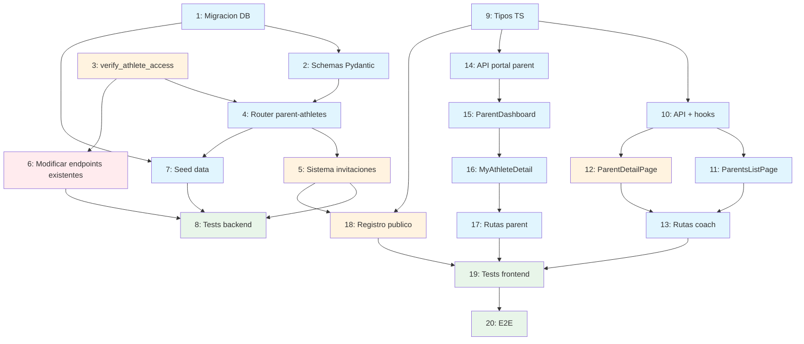

# Workflow: Modulo de Padres/Acudientes

**Fuente:** Diseno `/sc:design` + investigacion `/sc:research` (2026-04-15)
**Estrategia:** Sistematica (backend-first, luego frontend coach, luego portal parent)
**Generado:** 2026-04-15

---

## Resumen de Requerimientos

### Funcionales
- CRUD de relaciones parent-athlete (coach/admin vincula/desvincula)
- Portal de padres: ver datos de sus hijos (antropometria, PHV, percentiles)
- Sistema de invitacion por token para auto-registro de padres
- Vista reducida de datos sensibles para padres (sin notas del coach, sin comparativas)

### No funcionales
- Privacidad: Ley 1581/2012 Colombia — datos sensibles de menores
- RBAC: parent solo accede a atletas vinculados via `parent_athlete`
- Consentimiento parental registrado antes de almacenar datos

### Fuera de alcance (Fase 2+)
- Notificaciones push/email a padres
- Integracion con Spond para comunicacion familiar
- Portal del atleta (login propio)
- Modo clinico/familiar toggle en percentiles

---

## Pasos de Implementacion

### Fase 1: Fundacion Backend

#### Paso 1 — Migracion: tabla `parent_invites` + campo `parental_consent`
**Tipo:** backend (database)
**Agentes:** `backend-architect` (schema), `security-engineer` (validacion de campos sensibles)
**Archivos:**
- `backend/app/models/parent_invite.py` (nuevo)
- `backend/app/models/athlete.py` (agregar campo)
- `backend/app/models/__init__.py` (exportar nuevo modelo)
- `backend/alembic/versions/xxxx_add_parent_invites_and_consent.py` (migracion)

**Modelo `ParentInvite`:**
```python
class ParentInvite(Base):
    __tablename__ = "parent_invites"

    id: Mapped[int] = mapped_column(primary_key=True, autoincrement=True)
    athlete_id: Mapped[int] = mapped_column(ForeignKey("athletes.id"))
    email: Mapped[str] = mapped_column(String(255))
    token: Mapped[str] = mapped_column(String(64), unique=True, index=True)
    expires_at: Mapped[datetime] = mapped_column(DateTime)
    used: Mapped[bool] = mapped_column(default=False)
    used_by: Mapped[int | None] = mapped_column(ForeignKey("users.id"), nullable=True)
    created_by: Mapped[int] = mapped_column(ForeignKey("users.id"))
    created_at: Mapped[datetime] = mapped_column(DateTime, default=...)
```

**Campo nuevo en `Athlete`:**
```python
parental_consent_obtained: Mapped[bool] = mapped_column(default=False)
parental_consent_date: Mapped[datetime | None] = mapped_column(DateTime, nullable=True)
```

**Depende de:** Nada
**Complejidad:** Baja
**Riesgo:** Bajo
**Criterio de exito:** Migracion aplica sin errores; tablas creadas en MySQL

---

#### Paso 2 — Schemas Pydantic para parent-athletes
**Tipo:** backend (schemas)
**Agentes:** `backend-architect`
**Archivos:**
- `backend/app/schemas/parent_athlete.py` (nuevo)
- `backend/app/schemas/athlete.py` (agregar `AthleteParentView`)

**Schemas nuevos:**
```
ParentAthleteCreate    — parent_id, athlete_id, relationship
ParentAthleteOut       — id, parent_id, athlete_id, relationship, parent_name, parent_email, parent_phone, athlete_name
ParentAthleteListOut   — items: list[ParentAthleteOut], total: int
MyAthleteOut           — athlete: AthleteOut, relationship, latest_anthropometry, measurement_status
ParentInviteCreate     — athlete_id, email
ParentInviteOut        — id, athlete_id, email, token, expires_at, used, created_at
AthleteParentView      — Subconjunto de AthleteDetailOut SIN notes, training_implications detallado
ParentRegisterRequest  — token, first_name, last_name, password, phone (opcional)
```

**Depende de:** Paso 1 (modelo ParentInvite)
**Complejidad:** Baja
**Riesgo:** Bajo
**Criterio de exito:** Schemas importables, validaciones Zod-like funcionan

---

#### Paso 3 — Dependencia `verify_athlete_access`
**Tipo:** backend (services)
**Agentes:** `backend-architect`, `security-engineer`
**Archivos:**
- `backend/app/dependencies.py` (agregar funcion)

**Implementacion:**
```python
async def verify_athlete_access(
    athlete_id: int,
    current_user: User = Depends(get_current_user),
    db: AsyncSession = Depends(get_db),
) -> Athlete:
    athlete = await db.execute(select(Athlete).where(Athlete.id == athlete_id))
    athlete = athlete.scalar_one_or_none()
    if not athlete:
        raise HTTPException(404)

    if current_user.role == UserRole.admin:
        return athlete

    if current_user.role == UserRole.coach:
        coach_clubs = {m.club_id for m in current_user.club_memberships if m.role_in_club == ClubRole.coach}
        if athlete.club_id not in coach_clubs:
            raise HTTPException(403)
        return athlete

    if current_user.role == UserRole.parent:
        stmt = select(ParentAthlete).where(
            ParentAthlete.parent_id == current_user.id,
            ParentAthlete.athlete_id == athlete_id,
        )
        result = await db.execute(stmt)
        if not result.scalar_one_or_none():
            raise HTTPException(403)
        return athlete

    raise HTTPException(403)
```

**Depende de:** Nada (usa modelos existentes)
**Complejidad:** Media
**Riesgo:** Medio — afecta endpoints existentes, requiere testing exhaustivo
**Criterio de exito:** Tests pasan para admin, coach (su club, otro club), parent (su hijo, otro hijo), roles no autorizados

---

#### Paso 4 — Router `parent_athletes.py` (CRUD relaciones)
**Tipo:** backend (router)
**Agentes:** `backend-architect`, `security-engineer`
**Archivos:**
- `backend/app/routers/parent_athletes.py` (nuevo)
- `backend/app/main.py` (registrar router)

**Endpoints:**
| Metodo | Ruta | Descripcion | Roles |
|--------|------|-------------|-------|
| `POST` | `/api/parent-athletes` | Vincular parent con athlete | coach, admin |
| `GET` | `/api/parent-athletes` | Listar relaciones (?athlete_id, ?parent_id) | coach, admin |
| `DELETE` | `/api/parent-athletes/{id}` | Desvincular | coach, admin |
| `GET` | `/api/parent-athletes/my-athletes` | Mis hijos (self) | parent |

**Validaciones del POST:**
- `parent_id` debe tener `role=parent`
- `athlete_id` debe existir
- Coach: ambos deben estar en un club del coach
- Max 3 parents/acudientes por atleta
- Unique constraint ya existe en BD

**Registrar en main.py:**
```python
from app.routers import parent_athletes
app.include_router(parent_athletes.router, prefix="/api/parent-athletes", tags=["parent-athletes"])
```

**Depende de:** Paso 2 (schemas), Paso 3 (verify_athlete_access para my-athletes)
**Complejidad:** Media
**Riesgo:** Bajo
**Criterio de exito:** CRUD funcional, RBAC valido, max 3 parents validado

---

#### Paso 5 — Sistema de invitaciones (invite-link)
**Tipo:** backend (router + service)
**Agentes:** `backend-architect`, `security-engineer`
**Archivos:**
- `backend/app/routers/parent_athletes.py` (agregar endpoints de invitacion)
- `backend/app/routers/auth.py` (agregar endpoint publico de registro)
- `backend/app/services/invitations.py` (nuevo — logica de tokens)

**Endpoints nuevos en parent-athletes:**
| Metodo | Ruta | Descripcion | Roles |
|--------|------|-------------|-------|
| `POST` | `/api/parent-athletes/invite` | Generar invitacion | coach, admin |
| `GET` | `/api/parent-athletes/invites?athlete_id=X` | Listar invitaciones de un atleta | coach, admin |

**Endpoint publico en auth:**
| Metodo | Ruta | Descripcion | Roles |
|--------|------|-------------|-------|
| `POST` | `/api/auth/parent-register` | Auto-registro con token | publico |
| `GET` | `/api/auth/invite/{token}` | Validar token (pre-render form) | publico |

**Servicio `invitations.py`:**
- `generate_invite_token()` — `secrets.token_urlsafe(32)`, expiry 72h
- `validate_invite_token()` — verifica existencia, no usado, no expirado
- `consume_invite()` — crea usuario parent, vincula con athlete, marca token como usado

**Depende de:** Paso 1 (modelo ParentInvite), Paso 4 (router base)
**Complejidad:** Media-Alta
**Riesgo:** Medio — endpoint publico requiere proteccion contra abuso (rate limit, token single-use)
**Criterio de exito:** Flujo completo: coach invita → token valido → parent se registra → queda vinculado

---

#### Paso 6 — Modificar endpoints existentes para acceso parent
**Tipo:** backend (refactor)
**Agentes:** `backend-architect`, `security-engineer`
**Archivos:**
- `backend/app/routers/athletes.py` (GET /{id} y GET /alerts)
- `backend/app/routers/anthropometry.py` (GET /{id}/anthropometry)

**Cambios:**

1. **`GET /api/athletes/{athlete_id}`** — Ampliar `require_role` para incluir `UserRole.parent`. Usar `verify_athlete_access` en vez de logica inline. Retornar `AthleteParentView` si el rol es parent (sin notes, sin training_implications detallado).

2. **`GET /api/athletes/{athlete_id}/anthropometry`** — Ampliar a parent. Filtrar campo `notes` en respuesta si `current_user.role == parent`.

3. **Eliminar `_get_athlete_or_403`** duplicado en anthropometry.py — usar `verify_athlete_access` centralizado.

**Depende de:** Paso 3 (verify_athlete_access)
**Complejidad:** Media
**Riesgo:** Alto — modifica endpoints en produccion. Requiere tests de regresion.
**Criterio de exito:** Endpoints existentes siguen funcionando para coach/admin. Parent accede solo a sus hijos. Notes filtradas para parent.

---

#### Paso 7 — Seed data: usuario parent + vinculacion
**Tipo:** backend (seed)
**Agentes:** `backend-architect`
**Archivos:**
- `backend/app/seed.py` o script de seed existente

**Datos:**
| Rol | Email | Contrasena | Nombre |
|-----|-------|------------|--------|
| Parent | `padre@trochyruta.com` | `Parent2026!` | Carlos Garcia |

- Vincular con 1-2 atletas existentes del seed
- Relacion: "padre"
- Tambien crear una invitacion de ejemplo (usada)

**Depende de:** Paso 1, Paso 4
**Complejidad:** Baja
**Riesgo:** Bajo
**Criterio de exito:** `docker compose up` crea parent con relaciones; login funcional

---

#### Paso 8 — Tests backend
**Tipo:** backend (testing)
**Agentes:** `quality-engineer`
**Archivos:**
- `backend/tests/test_parent_athletes.py` (nuevo)
- `backend/tests/test_parent_register.py` (nuevo)
- `backend/tests/test_athletes.py` (agregar tests de acceso parent)
- `backend/tests/test_anthropometry.py` (agregar tests de acceso parent)

**Casos de prueba criticos:**
1. Coach vincula parent con athlete de su club — 201
2. Coach vincula parent con athlete de otro club — 403
3. Coach intenta vincular usuario no-parent — 422
4. Max 3 parents por athlete — 409
5. Parent lista sus hijos (my-athletes) — 200 con datos correctos
6. Parent accede a atleta no vinculado — 403
7. Parent ve anthropometry sin notes — 200 (notes=null)
8. Invite: generar token — 201
9. Invite: registrar con token valido — 201 + vinculacion automatica
10. Invite: token expirado — 410
11. Invite: token ya usado — 410
12. Invite: token inexistente — 404
13. Regresion: coach sigue accediendo normalmente — 200

**Depende de:** Pasos 4, 5, 6, 7
**Complejidad:** Media-Alta
**Riesgo:** Bajo
**Criterio de exito:** Todos los tests pasan; cobertura de RBAC completa

---

### Fase 2: Frontend — Vista Coach

#### Paso 9 — Tipos TypeScript y enum `FamilyRelationship`
**Tipo:** frontend (types)
**Agentes:** Ninguno (tarea simple)
**Archivos:**
- `frontend/src/types/parent.types.ts` (nuevo)
- `frontend/src/types/enums.ts` (agregar FamilyRelationship)

**Tipos:**
```typescript
// enums.ts
export enum FamilyRelationship {
  padre = "padre",
  madre = "madre",
  acudiente = "acudiente",
}

// parent.types.ts
export interface ParentAthleteCreate { parent_id: number; athlete_id: number; relationship: FamilyRelationship; }
export interface ParentAthleteOut { id: number; parent_id: number; athlete_id: number; relationship: FamilyRelationship; parent_name: string; parent_email: string | null; parent_phone: string | null; athlete_name: string; }
export interface ParentAthleteListOut { items: ParentAthleteOut[]; total: number; }
export interface MyAthleteOut { athlete: AthleteOut; relationship: FamilyRelationship; latest_anthropometry: AnthropometricRecord | null; measurement_status: "ok" | "due_soon" | "overdue" | "never"; }
export interface ParentInviteOut { id: number; athlete_id: number; email: string; expires_at: string; used: boolean; created_at: string; }
```

**Depende de:** Nada
**Complejidad:** Baja
**Riesgo:** Bajo

---

#### Paso 10 — API service y hooks de padres
**Tipo:** frontend (api + hooks)
**Agentes:** Ninguno (sigue patron existente)
**Archivos:**
- `frontend/src/api/parents.ts` (nuevo)
- `frontend/src/hooks/parents/useParents.ts` (nuevo)
- `frontend/src/hooks/parents/useParentAthletes.ts` (nuevo)
- `frontend/src/hooks/parents/useCreateParentAthlete.ts` (nuevo)
- `frontend/src/hooks/parents/useDeleteParentAthlete.ts` (nuevo)
- `frontend/src/hooks/parents/useParentInvites.ts` (nuevo)

**API service (patron identico a athletes.ts):**
```typescript
// api/parents.ts
export async function getParents(params?: { club_id?: number }) { ... }
export async function getParentAthletes(params?: { athlete_id?: number; parent_id?: number }) { ... }
export async function createParentAthlete(payload: ParentAthleteCreate) { ... }
export async function deleteParentAthlete(id: number) { ... }
export async function sendParentInvite(payload: { athlete_id: number; email: string }) { ... }
export async function getParentInvites(athleteId: number) { ... }
```

**Hooks (patron identico a useAthletes):**
```typescript
// Ejemplo: useParentAthletes.ts
export function useParentAthletes(filters?: { athlete_id?: number; parent_id?: number }) {
  return useQuery({ queryKey: ["parent-athletes", filters], queryFn: () => getParentAthletes(filters) });
}
```

**Depende de:** Paso 9 (tipos)
**Complejidad:** Baja
**Riesgo:** Bajo
**Criterio de exito:** Hooks importables, queryKeys correctos, invalidacion en mutations

---

#### Paso 11 — ParentsListPage + ParentsTable
**Tipo:** frontend (page + component)
**Agentes:** `react-ui-engineer`
**Archivos:**
- `frontend/src/routes/parents/ParentsListPage.tsx` (nuevo)
- `frontend/src/components/parents/ParentsTable.tsx` (nuevo)

**Funcionalidades:**
- Lista de usuarios con `role=parent` del club del coach (usa `GET /api/users?role=parent`)
- Busqueda por nombre (debounced, patron de AthletesListPage)
- Columnas: Nombre, Email, Telefono, Hijos vinculados (count), Acciones (ver)
- Boton "+ Nuevo padre" que abre dialog de creacion
- Link a `/parents/{id}` en cada fila

**Depende de:** Paso 10 (hooks)
**Complejidad:** Media
**Riesgo:** Bajo
**Criterio de exito:** Lista funcional con busqueda, navegacion a detalle

---

#### Paso 12 — ParentDetailPage + ParentAthleteAssignment
**Tipo:** frontend (page + components)
**Agentes:** `react-ui-engineer`
**Archivos:**
- `frontend/src/routes/parents/ParentDetailPage.tsx` (nuevo)
- `frontend/src/components/parents/ParentAthleteAssignment.tsx` (nuevo)
- `frontend/src/components/parents/ParentContactInfo.tsx` (nuevo)
- `frontend/src/components/parents/ParentInviteManager.tsx` (nuevo)

**Layout:**
```
┌─────────────────────┐ ┌──────────────────────┐
│ Datos de Contacto   │ │ Hijos Vinculados     │
│ (ParentContactInfo) │ │ (tabla + asignar)    │
└─────────────────────┘ │ [+ Vincular atleta]  │
                        │ [Enviar invitacion]  │
                        └──────────────────────┘
```

**ParentAthleteAssignment (dialog):**
- Select de atletas del club sin este parent asignado
- Select de relacion (padre/madre/acudiente)
- Boton vincular → POST /api/parent-athletes
- Boton desvincular (icono X) → DELETE /api/parent-athletes/{id}

**ParentInviteManager:**
- Mostrar estado de invitacion (pendiente/usada/expirada)
- Boton "Reenviar invitacion" si expirada
- Input de email si no hay invitacion

**Depende de:** Pasos 10, 11
**Complejidad:** Media-Alta
**Riesgo:** Bajo
**Criterio de exito:** Vinculacion/desvinculacion funcional; invitaciones enviadas

---

#### Paso 13 — Rutas y navegacion coach
**Tipo:** frontend (routing)
**Agentes:** Ninguno
**Archivos:**
- `frontend/src/App.tsx` (agregar rutas)
- `frontend/src/components/layout/AppShell.tsx` (agregar nav link)

**Rutas nuevas:**
```tsx
<Route path="/parents" element={<ProtectedRoute allowedRoles={[UserRole.coach]}><ParentsListPage /></ProtectedRoute>} />
<Route path="/parents/:id" element={<ProtectedRoute allowedRoles={[UserRole.coach]}><ParentDetailPage /></ProtectedRoute>} />
```

**Navegacion (AppShell):**
```tsx
{isCoach && <NavLink to="/parents">Padres</NavLink>}
```

**Depende de:** Pasos 11, 12
**Complejidad:** Baja
**Riesgo:** Bajo
**Criterio de exito:** Navegacion visible para coach, rutas protegidas

---

### Fase 3: Frontend — Portal de Padres

#### Paso 14 — API service y hooks del portal parent
**Tipo:** frontend (api + hooks)
**Archivos:**
- `frontend/src/api/parents.ts` (agregar `getMyAthletes`)
- `frontend/src/hooks/parents/useMyAthletes.ts` (nuevo)

```typescript
export async function getMyAthletes(): Promise<MyAthleteOut[]> {
  const response = await apiClient.get<MyAthleteOut[]>("/api/parent-athletes/my-athletes");
  return response.data;
}
```

**Depende de:** Paso 9 (tipos)
**Complejidad:** Baja
**Riesgo:** Bajo

---

#### Paso 15 — ParentDashboardPage + ChildCard
**Tipo:** frontend (page + component)
**Agentes:** `react-ui-engineer`
**Archivos:**
- `frontend/src/routes/parents/ParentDashboardPage.tsx` (nuevo)
- `frontend/src/components/parents/portal/ChildCard.tsx` (nuevo)

**Layout:**
```
┌─────────────────────────┐ ┌──────────────────┐
│ 🚴 Juan Garcia          │ │ 🚴 Ana Garcia    │
│ Edad: 12.3 anios        │ │ Edad: 10.8       │
│ Cat: Infantil A         │ │ Cat: Pre-Infantil│
│ PHV: "Crecimiento       │ │ PHV: "Desarrollo │
│  temprano" (🔵)         │ │  temprano" (🔵)  │
│ Talla: 148.5 cm         │ │ ⚠ Sin medicion   │
│ Ult. medicion: 12 mar   │ │                  │
│         [Ver detalle →] │ │  [Ver detalle →] │
└─────────────────────────┘ └──────────────────┘
```

**Lenguaje contextual para PHV (research finding):**
- Pre-PHV → "En etapa de desarrollo temprano"
- Circa-PHV → "En pico de crecimiento — etapa clave para desarrollo tecnico"
- Post-PHV → "Crecimiento estabilizandose — puede iniciar entrenamiento mas estructurado"

**Depende de:** Paso 14
**Complejidad:** Media
**Riesgo:** Bajo
**Criterio de exito:** Cards muestran datos de hijos con lenguaje apropiado

---

#### Paso 16 — MyAthleteDetailPage (vista parent)
**Tipo:** frontend (page)
**Agentes:** `react-ui-engineer`
**Archivos:**
- `frontend/src/routes/parents/MyAthleteDetailPage.tsx` (nuevo)

**Reutiliza componentes existentes en modo lectura:**
- `AthleteInfoCard` — datos basicos (sin boton editar)
- `AnthropometryHistory` — historial (sin notas del coach)
- `GrowthCharts` — curvas de crecimiento
- `PercentileCurves` — percentiles CDC

**NO incluye:**
- Formulario de antropometria (solo coach puede medir)
- `TrainingReadiness` (informacion de entrenamiento interna)
- `ResearchReferences` (demasiado tecnico para padres)
- Campo `notes` en historial

**Depende de:** Paso 15, componentes existentes
**Complejidad:** Media
**Riesgo:** Bajo — reutiliza componentes probados
**Criterio de exito:** Parent ve datos de su hijo en modo lectura; no ve datos de entrenamiento internos

---

#### Paso 17 — Rutas y navegacion parent
**Tipo:** frontend (routing)
**Archivos:**
- `frontend/src/App.tsx` (agregar rutas parent)
- `frontend/src/components/layout/AppShell.tsx` (agregar nav condicional)
- `frontend/src/routes/ProtectedRoute.tsx` (verificar soporte de UserRole.parent)

**Rutas:**
```tsx
<Route path="/my-athletes" element={<ProtectedRoute allowedRoles={[UserRole.parent]}><ParentDashboardPage /></ProtectedRoute>} />
<Route path="/my-athletes/:id" element={<ProtectedRoute allowedRoles={[UserRole.parent]}><MyAthleteDetailPage /></ProtectedRoute>} />
```

**Navegacion:**
```tsx
{isParent && <NavLink to="/my-athletes">Mis Atletas</NavLink>}
```

**Redirect por rol al login:**
- Coach → `/dashboard`
- Parent → `/my-athletes`
- Admin → `/dashboard`

**Depende de:** Pasos 15, 16
**Complejidad:** Baja
**Riesgo:** Bajo
**Criterio de exito:** Parent logueado ve sidebar con "Mis Atletas"; coach no ve rutas de parent

---

#### Paso 18 — Pagina publica de registro parent (invite flow)
**Tipo:** frontend (page)
**Agentes:** `react-ui-engineer`
**Archivos:**
- `frontend/src/routes/auth/ParentRegisterPage.tsx` (nuevo)
- `frontend/src/App.tsx` (agregar ruta publica)

**Flujo:**
1. URL: `/registro-padre?token=xxx`
2. GET `/api/auth/invite/{token}` — valida token, retorna email + nombre del atleta
3. Si valido: formulario con email (pre-rellenado, readonly), nombre, apellido, contrasena, telefono
4. Submit: POST `/api/auth/parent-register` → crea cuenta + vinculacion
5. Exito: redirige a `/login` con mensaje de confirmacion
6. Token invalido/expirado: mensaje de error con instruccion de contactar al entrenador

**Depende de:** Paso 5 (backend invite), Paso 9 (tipos)
**Complejidad:** Media
**Riesgo:** Medio — pagina publica, debe ser segura
**Criterio de exito:** Flujo completo funcional; token single-use; UX clara para padres no tecnicos

---

### Fase 4: Calidad

#### Paso 19 — Tests frontend
**Tipo:** frontend (testing)
**Agentes:** `quality-engineer`
**Archivos:**
- `frontend/src/components/parents/__tests__/ParentsTable.test.tsx`
- `frontend/src/components/parents/portal/__tests__/ChildCard.test.tsx`
- `frontend/src/hooks/parents/__tests__/useParentAthletes.test.ts`

**Casos:**
1. ParentsTable renderiza filas correctamente
2. ChildCard muestra lenguaje contextual de PHV
3. ParentAthleteAssignment: vincular/desvincular
4. MyAthleteDetailPage: no muestra notas del coach
5. ParentRegisterPage: token invalido muestra error
6. Navegacion condicional por rol en AppShell

**Depende de:** Todos los pasos anteriores
**Complejidad:** Media
**Riesgo:** Bajo
**Criterio de exito:** Tests pasan; cobertura de componentes criticos

---

#### Paso 20 — Test E2E del flujo completo
**Tipo:** e2e (playwright)
**Agentes:** `quality-engineer`
**Archivos:**
- `frontend/e2e/parents.spec.ts` (nuevo)

**Flujo E2E:**
1. Login como coach → navegar a Padres → crear parent → vincular con atleta
2. Coach genera invitacion → (simular) parent se registra con token
3. Login como parent → ver dashboard → ver detalle de hijo → verificar que no hay notas
4. Login como parent → intentar acceder a `/athletes` → redirect o 403

**Depende de:** Todos los pasos + servidor corriendo
**Complejidad:** Alta
**Riesgo:** Bajo
**Criterio de exito:** Flujo completo sin errores

---

## Grafo de Dependencias



**Leyenda:** 🔵 Bajo riesgo | 🟠 Riesgo medio | 🔴 Riesgo alto | 🟢 Testing

---

## Registro de Riesgos

| Riesgo | Pasos Afectados | Mitigacion |
|--------|-----------------|------------|
| Endpoint publico `/auth/parent-register` expuesto a abuso | 5, 18 | Token single-use + expiracion 72h + rate limiting (Fase 2) |
| Modificar endpoints existentes rompe flujo coach | 6 | Tests de regresion exhaustivos en Paso 8 |
| Datos sensibles de PHV mal comunicados a padres | 15, 16 | Lenguaje contextual validado con entrenador antes de deploy |
| Parents sin email no pueden usar invite-link | 5, 18 | Fallback: coach crea cuenta directamente (flujo existente ya soportado) |
| Lazy loading en SQLAlchemy async | 3, 4 | Usar `selectinload` o EXISTS explicito — nunca lazy load |

---

## Oportunidades de Paralelismo

| Paralelo | Pasos | Condicion |
|----------|-------|-----------|
| Backend Fase 1 | 1 + 3 | Independientes |
| Frontend types + backend schemas | 9 + 2 | Independientes |
| Vista coach + portal parent | 11-13 + 14-17 | Ambos dependen de Paso 10, luego divergen |
| Registro publico + portal parent | 18 + 15-17 | Independientes post Paso 9 |

---

## Recomendaciones de Ejecucion

1. **MVP entregable despues del Paso 13:** Coach puede gestionar padres y vincularlos con atletas. No requiere portal de padres.
2. **Paso 6 es el mas delicado** — modificar endpoints en produccion. Hacer en rama aparte con tests de regresion antes de merge.
3. **Pasos 1 + 3 en paralelo** con agentes `backend-architect` + `security-engineer`.
4. **Pasos 9-13 (frontend coach) y 14-17 (frontend parent)** pueden desarrollarse en paralelo una vez que Paso 10 este listo.
5. **Paso 18 (registro publico)** puede hacerse al final — el fallback de "coach crea cuenta" ya funciona.
