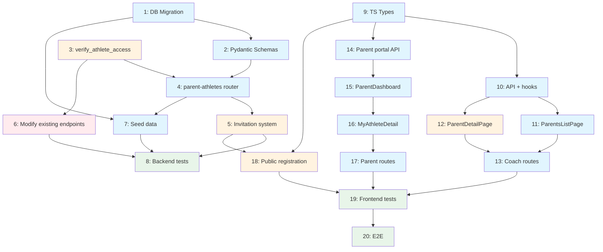

# Workflow: Parents/Guardians Module

**Source:** Design `/sc:design` + research `/sc:research` (2026-04-15)
**Strategy:** Systematic (backend-first, then coach frontend, then parent portal)
**Generated:** 2026-04-15

---

## Requirements Summary

### Functional
- CRUD of parent-athlete relationships (coach/admin links/unlinks)
- Parent portal: view data for their children (anthropometry, PHV, percentiles)
- Token-based invitation system for parent self-registration
- Reduced view of sensitive data for parents (no coach notes, no comparisons)

### Non-functional
- Privacy: Ley 1581/2012 Colombia — sensitive data of minors
- RBAC: parent only accesses athletes linked via `parent_athlete`
- Parental consent recorded before storing data

### Out of scope (Phase 2+)
- Push/email notifications to parents
- Integration with Spond for family communication
- Athlete portal (own login)
- Clinical/family toggle mode in percentiles

---

## Implementation Steps

### Phase 1: Backend Foundation

#### Step 1 — Migration: `parent_invites` table + `parental_consent` field
**Type:** backend (database)
**Agents:** `backend-architect` (schema), `security-engineer` (sensitive field validation)
**Files:**
- `backend/app/models/parent_invite.py` (new)
- `backend/app/models/athlete.py` (add field)
- `backend/app/models/__init__.py` (export new model)
- `backend/alembic/versions/xxxx_add_parent_invites_and_consent.py` (migration)

**`ParentInvite` model:**
```python
class ParentInvite(Base):
    __tablename__ = "parent_invites"

    id: Mapped[int] = mapped_column(primary_key=True, autoincrement=True)
    athlete_id: Mapped[int] = mapped_column(ForeignKey("athletes.id"))
    email: Mapped[str] = mapped_column(String(255))
    token: Mapped[str] = mapped_column(String(64), unique=True, index=True)
    expires_at: Mapped[datetime] = mapped_column(DateTime)
    used: Mapped[bool] = mapped_column(default=False)
    used_by: Mapped[int | None] = mapped_column(ForeignKey("users.id"), nullable=True)
    created_by: Mapped[int] = mapped_column(ForeignKey("users.id"))
    created_at: Mapped[datetime] = mapped_column(DateTime, default=...)
```

**New field in `Athlete`:**
```python
parental_consent_obtained: Mapped[bool] = mapped_column(default=False)
parental_consent_date: Mapped[datetime | None] = mapped_column(DateTime, nullable=True)
```

**Depends on:** Nothing
**Complexity:** Low
**Risk:** Low
**Success criterion:** Migration applies without errors; tables created in MySQL

---

#### Step 2 — Pydantic Schemas for parent-athletes
**Type:** backend (schemas)
**Agents:** `backend-architect`
**Files:**
- `backend/app/schemas/parent_athlete.py` (new)
- `backend/app/schemas/athlete.py` (add `AthleteParentView`)

**New schemas:**
```
ParentAthleteCreate    — parent_id, athlete_id, relationship
ParentAthleteOut       — id, parent_id, athlete_id, relationship, parent_name, parent_email, parent_phone, athlete_name
ParentAthleteListOut   — items: list[ParentAthleteOut], total: int
MyAthleteOut           — athlete: AthleteOut, relationship, latest_anthropometry, measurement_status
ParentInviteCreate     — athlete_id, email
ParentInviteOut        — id, athlete_id, email, token, expires_at, used, created_at
AthleteParentView      — Subset of AthleteDetailOut WITHOUT notes, detailed training_implications
ParentRegisterRequest  — token, first_name, last_name, password, phone (optional)
```

**Depends on:** Step 1 (ParentInvite model)
**Complexity:** Low
**Risk:** Low
**Success criterion:** Schemas importable, Zod-like validations work

---

#### Step 3 — `verify_athlete_access` dependency
**Type:** backend (services)
**Agents:** `backend-architect`, `security-engineer`
**Files:**
- `backend/app/dependencies.py` (add function)

**Implementation:**
```python
async def verify_athlete_access(
    athlete_id: int,
    current_user: User = Depends(get_current_user),
    db: AsyncSession = Depends(get_db),
) -> Athlete:
    athlete = await db.execute(select(Athlete).where(Athlete.id == athlete_id))
    athlete = athlete.scalar_one_or_none()
    if not athlete:
        raise HTTPException(404)

    if current_user.role == UserRole.admin:
        return athlete

    if current_user.role == UserRole.coach:
        coach_clubs = {m.club_id for m in current_user.club_memberships if m.role_in_club == ClubRole.coach}
        if athlete.club_id not in coach_clubs:
            raise HTTPException(403)
        return athlete

    if current_user.role == UserRole.parent:
        stmt = select(ParentAthlete).where(
            ParentAthlete.parent_id == current_user.id,
            ParentAthlete.athlete_id == athlete_id,
        )
        result = await db.execute(stmt)
        if not result.scalar_one_or_none():
            raise HTTPException(403)
        return athlete

    raise HTTPException(403)
```

**Depends on:** Nothing (uses existing models)
**Complexity:** Medium
**Risk:** Medium — affects existing endpoints, requires thorough testing
**Success criterion:** Tests pass for admin, coach (own club, other club), parent (own child, another child), unauthorized roles

---

#### Step 4 — `parent_athletes.py` router (relationship CRUD)
**Type:** backend (router)
**Agents:** `backend-architect`, `security-engineer`
**Files:**
- `backend/app/routers/parent_athletes.py` (new)
- `backend/app/main.py` (register router)

**Endpoints:**
| Method | Path | Description | Roles |
|--------|------|-------------|-------|
| `POST` | `/api/parent-athletes` | Link parent with athlete | coach, admin |
| `GET` | `/api/parent-athletes` | List relationships (?athlete_id, ?parent_id) | coach, admin |
| `DELETE` | `/api/parent-athletes/{id}` | Unlink | coach, admin |
| `GET` | `/api/parent-athletes/my-athletes` | My children (self) | parent |

**POST validations:**
- `parent_id` must have `role=parent`
- `athlete_id` must exist
- Coach: both must belong to one of the coach's clubs
- Max 3 parents/guardians per athlete
- Unique constraint already exists in DB

**Register in main.py:**
```python
from app.routers import parent_athletes
app.include_router(parent_athletes.router, prefix="/api/parent-athletes", tags=["parent-athletes"])
```

**Depends on:** Step 2 (schemas), Step 3 (`verify_athlete_access` for my-athletes)
**Complexity:** Medium
**Risk:** Low
**Success criterion:** CRUD functional, RBAC valid, max 3 parents validated

---

#### Step 5 — Invitation system (invite-link)
**Type:** backend (router + service)
**Agents:** `backend-architect`, `security-engineer`
**Files:**
- `backend/app/routers/parent_athletes.py` (add invitation endpoints)
- `backend/app/routers/auth.py` (add public registration endpoint)
- `backend/app/services/invitations.py` (new — token logic)

**New endpoints in parent-athletes:**
| Method | Path | Description | Roles |
|--------|------|-------------|-------|
| `POST` | `/api/parent-athletes/invite` | Generate invitation | coach, admin |
| `GET` | `/api/parent-athletes/invites?athlete_id=X` | List invitations for an athlete | coach, admin |

**Public endpoint in auth:**
| Method | Path | Description | Roles |
|--------|------|-------------|-------|
| `POST` | `/api/auth/parent-register` | Self-registration with token | public |
| `GET` | `/api/auth/invite/{token}` | Validate token (pre-render form) | public |

**`invitations.py` service:**
- `generate_invite_token()` — `secrets.token_urlsafe(32)`, expiry 72h
- `validate_invite_token()` — verifies existence, not used, not expired
- `consume_invite()` — creates parent user, links with athlete, marks token as used

**Depends on:** Step 1 (ParentInvite model), Step 4 (base router)
**Complexity:** Medium-High
**Risk:** Medium — public endpoint requires protection against abuse (rate limit, single-use token)
**Success criterion:** Complete flow: coach invites → valid token → parent registers → gets linked

---

#### Step 6 — Modify existing endpoints for parent access
**Type:** backend (refactor)
**Agents:** `backend-architect`, `security-engineer`
**Files:**
- `backend/app/routers/athletes.py` (GET /{id} and GET /alerts)
- `backend/app/routers/anthropometry.py` (GET /{id}/anthropometry)

**Changes:**

1. **`GET /api/athletes/{athlete_id}`** — Expand `require_role` to include `UserRole.parent`. Use `verify_athlete_access` instead of inline logic. Return `AthleteParentView` if role is parent (no notes, no detailed training_implications).

2. **`GET /api/athletes/{athlete_id}/anthropometry`** — Expand to parent. Filter `notes` field in response if `current_user.role == parent`.

3. **Remove duplicate `_get_athlete_or_403`** in anthropometry.py — use centralized `verify_athlete_access`.

**Depends on:** Step 3 (`verify_athlete_access`)
**Complexity:** Medium
**Risk:** High — modifies endpoints in production. Requires regression tests.
**Success criterion:** Existing endpoints continue working for coach/admin. Parent accesses only their children. Notes filtered for parent.

---

#### Step 7 — Seed data: parent user + link
**Type:** backend (seed)
**Agents:** `backend-architect`
**Files:**
- `backend/app/seed.py` or existing seed script

**Data:**
| Role | Email | Password | Name |
|------|-------|----------|------|
| Parent | `padre@trochyruta.com` | `Parent2026!` | Carlos Garcia |

- Link with 1-2 existing athletes from seed
- Relationship: "padre"
- Also create a sample invitation (used)

**Depends on:** Step 1, Step 4
**Complexity:** Low
**Risk:** Low
**Success criterion:** `docker compose up` creates parent with relationships; login functional

---

#### Step 8 — Backend tests
**Type:** backend (testing)
**Agents:** `quality-engineer`
**Files:**
- `backend/tests/test_parent_athletes.py` (new)
- `backend/tests/test_parent_register.py` (new)
- `backend/tests/test_athletes.py` (add parent access tests)
- `backend/tests/test_anthropometry.py` (add parent access tests)

**Critical test cases:**
1. Coach links parent with athlete from their club — 201
2. Coach links parent with athlete from another club — 403
3. Coach attempts to link non-parent user — 422
4. Max 3 parents per athlete — 409
5. Parent lists their children (my-athletes) — 200 with correct data
6. Parent accesses unlinked athlete — 403
7. Parent views anthropometry without notes — 200 (notes=null)
8. Invite: generate token — 201
9. Invite: register with valid token — 201 + automatic linking
10. Invite: expired token — 410
11. Invite: already used token — 410
12. Invite: non-existent token — 404
13. Regression: coach still accesses normally — 200

**Depends on:** Steps 4, 5, 6, 7
**Complexity:** Medium-High
**Risk:** Low
**Success criterion:** All tests pass; complete RBAC coverage

---

### Phase 2: Frontend — Coach View

#### Step 9 — TypeScript types and `FamilyRelationship` enum
**Type:** frontend (types)
**Agents:** None (simple task)
**Files:**
- `frontend/src/types/parent.types.ts` (new)
- `frontend/src/types/enums.ts` (add FamilyRelationship)

**Types:**
```typescript
// enums.ts
export enum FamilyRelationship {
  padre = "padre",
  madre = "madre",
  acudiente = "acudiente",
}

// parent.types.ts
export interface ParentAthleteCreate { parent_id: number; athlete_id: number; relationship: FamilyRelationship; }
export interface ParentAthleteOut { id: number; parent_id: number; athlete_id: number; relationship: FamilyRelationship; parent_name: string; parent_email: string | null; parent_phone: string | null; athlete_name: string; }
export interface ParentAthleteListOut { items: ParentAthleteOut[]; total: number; }
export interface MyAthleteOut { athlete: AthleteOut; relationship: FamilyRelationship; latest_anthropometry: AnthropometricRecord | null; measurement_status: "ok" | "due_soon" | "overdue" | "never"; }
export interface ParentInviteOut { id: number; athlete_id: number; email: string; expires_at: string; used: boolean; created_at: string; }
```

**Depends on:** Nothing
**Complexity:** Low
**Risk:** Low

---

#### Step 10 — Parent API service and hooks
**Type:** frontend (api + hooks)
**Agents:** None (follows existing pattern)
**Files:**
- `frontend/src/api/parents.ts` (new)
- `frontend/src/hooks/parents/useParents.ts` (new)
- `frontend/src/hooks/parents/useParentAthletes.ts` (new)
- `frontend/src/hooks/parents/useCreateParentAthlete.ts` (new)
- `frontend/src/hooks/parents/useDeleteParentAthlete.ts` (new)
- `frontend/src/hooks/parents/useParentInvites.ts` (new)

**API service (identical pattern to athletes.ts):**
```typescript
// api/parents.ts
export async function getParents(params?: { club_id?: number }) { ... }
export async function getParentAthletes(params?: { athlete_id?: number; parent_id?: number }) { ... }
export async function createParentAthlete(payload: ParentAthleteCreate) { ... }
export async function deleteParentAthlete(id: number) { ... }
export async function sendParentInvite(payload: { athlete_id: number; email: string }) { ... }
export async function getParentInvites(athleteId: number) { ... }
```

**Hooks (identical pattern to useAthletes):**
```typescript
// Example: useParentAthletes.ts
export function useParentAthletes(filters?: { athlete_id?: number; parent_id?: number }) {
  return useQuery({ queryKey: ["parent-athletes", filters], queryFn: () => getParentAthletes(filters) });
}
```

**Depends on:** Step 9 (types)
**Complexity:** Low
**Risk:** Low
**Success criterion:** Hooks importable, correct queryKeys, invalidation on mutations

---

#### Step 11 — ParentsListPage + ParentsTable
**Type:** frontend (page + component)
**Agents:** `react-ui-engineer`
**Files:**
- `frontend/src/routes/parents/ParentsListPage.tsx` (new)
- `frontend/src/components/parents/ParentsTable.tsx` (new)

**Features:**
- List of users with `role=parent` from the coach's club (uses `GET /api/users?role=parent`)
- Search by name (debounced, AthletesListPage pattern)
- Columns: Name, Email, Phone, Linked children (count), Actions (view)
- "+ New parent" button that opens creation dialog
- Link to `/parents/{id}` on each row

**Depends on:** Step 10 (hooks)
**Complexity:** Medium
**Risk:** Low
**Success criterion:** Functional list with search, navigation to detail

---

#### Step 12 — ParentDetailPage + ParentAthleteAssignment
**Type:** frontend (page + components)
**Agents:** `react-ui-engineer`
**Files:**
- `frontend/src/routes/parents/ParentDetailPage.tsx` (new)
- `frontend/src/components/parents/ParentAthleteAssignment.tsx` (new)
- `frontend/src/components/parents/ParentContactInfo.tsx` (new)
- `frontend/src/components/parents/ParentInviteManager.tsx` (new)

**Layout:**
```
┌─────────────────────┐ ┌──────────────────────┐
│ Contact Data        │ │ Linked Children      │
│ (ParentContactInfo) │ │ (table + assign)     │
└─────────────────────┘ │ [+ Link athlete]     │
                        │ [Send invitation]    │
                        └──────────────────────┘
```

**ParentAthleteAssignment (dialog):**
- Select of athletes from the club without this parent assigned
- Select of relationship (padre/madre/acudiente)
- Link button → POST /api/parent-athletes
- Unlink button (X icon) → DELETE /api/parent-athletes/{id}

**ParentInviteManager:**
- Show invitation status (pending/used/expired)
- "Resend invitation" button if expired
- Email input if there is no invitation

**Depends on:** Steps 10, 11
**Complexity:** Medium-High
**Risk:** Low
**Success criterion:** Linking/unlinking functional; invitations sent

---

#### Step 13 — Coach routes and navigation
**Type:** frontend (routing)
**Agents:** None
**Files:**
- `frontend/src/App.tsx` (add routes)
- `frontend/src/components/layout/AppShell.tsx` (add nav link)

**New routes:**
```tsx
<Route path="/parents" element={<ProtectedRoute allowedRoles={[UserRole.coach]}><ParentsListPage /></ProtectedRoute>} />
<Route path="/parents/:id" element={<ProtectedRoute allowedRoles={[UserRole.coach]}><ParentDetailPage /></ProtectedRoute>} />
```

**Navigation (AppShell):**
```tsx
{isCoach && <NavLink to="/parents">Parents</NavLink>}
```

**Depends on:** Steps 11, 12
**Complexity:** Low
**Risk:** Low
**Success criterion:** Navigation visible for coach, protected routes

---

### Phase 3: Frontend — Parent Portal

#### Step 14 — Parent portal API service and hooks
**Type:** frontend (api + hooks)
**Files:**
- `frontend/src/api/parents.ts` (add `getMyAthletes`)
- `frontend/src/hooks/parents/useMyAthletes.ts` (new)

```typescript
export async function getMyAthletes(): Promise<MyAthleteOut[]> {
  const response = await apiClient.get<MyAthleteOut[]>("/api/parent-athletes/my-athletes");
  return response.data;
}
```

**Depends on:** Step 9 (types)
**Complexity:** Low
**Risk:** Low

---

#### Step 15 — ParentDashboardPage + ChildCard
**Type:** frontend (page + component)
**Agents:** `react-ui-engineer`
**Files:**
- `frontend/src/routes/parents/ParentDashboardPage.tsx` (new)
- `frontend/src/components/parents/portal/ChildCard.tsx` (new)

**Layout:**
```
┌─────────────────────────┐ ┌──────────────────┐
│ 🚴 Juan Garcia          │ │ 🚴 Ana Garcia    │
│ Age: 12.3 years         │ │ Age: 10.8        │
│ Cat: Infantil A         │ │ Cat: Pre-Infantil│
│ PHV: "Early development │ │ PHV: "Early      │
│  stage" (🔵)            │ │  development" (🔵│
│ Height: 148.5 cm        │ │ ⚠ No measurement │
│ Last measurement: 12 mar│ │                  │
│         [View detail →] │ │  [View detail →] │
└─────────────────────────┘ └──────────────────┘
```

**Contextual language for PHV (research finding):**
- Pre-PHV → "In early development stage"
- Circa-PHV → "In growth spurt — key stage for technical development"
- Post-PHV → "Growth stabilizing — can begin more structured training"

**Depends on:** Step 14
**Complexity:** Medium
**Risk:** Low
**Success criterion:** Cards show children's data with appropriate language

---

#### Step 16 — MyAthleteDetailPage (parent view)
**Type:** frontend (page)
**Agents:** `react-ui-engineer`
**Files:**
- `frontend/src/routes/parents/MyAthleteDetailPage.tsx` (new)

**Reuses existing components in read-only mode:**
- `AthleteInfoCard` — basic data (no edit button)
- `AnthropometryHistory` — history (no coach notes)
- `GrowthCharts` — growth curves
- `PercentileCurves` — CDC percentiles

**Does NOT include:**
- Anthropometry form (only coach can measure)
- `TrainingReadiness` (internal training information)
- `ResearchReferences` (too technical for parents)
- `notes` field in history

**Depends on:** Step 15, existing components
**Complexity:** Medium
**Risk:** Low — reuses tested components
**Success criterion:** Parent views their child's data in read-only mode; does not see internal training data

---

#### Step 17 — Parent routes and navigation
**Type:** frontend (routing)
**Files:**
- `frontend/src/App.tsx` (add parent routes)
- `frontend/src/components/layout/AppShell.tsx` (add conditional nav)
- `frontend/src/routes/ProtectedRoute.tsx` (verify UserRole.parent support)

**Routes:**
```tsx
<Route path="/my-athletes" element={<ProtectedRoute allowedRoles={[UserRole.parent]}><ParentDashboardPage /></ProtectedRoute>} />
<Route path="/my-athletes/:id" element={<ProtectedRoute allowedRoles={[UserRole.parent]}><MyAthleteDetailPage /></ProtectedRoute>} />
```

**Navigation:**
```tsx
{isParent && <NavLink to="/my-athletes">My Athletes</NavLink>}
```

**Role-based redirect at login:**
- Coach → `/dashboard`
- Parent → `/my-athletes`
- Admin → `/dashboard`

**Depends on:** Steps 15, 16
**Complexity:** Low
**Risk:** Low
**Success criterion:** Logged-in parent sees sidebar with "My Athletes"; coach does not see parent routes

---

#### Step 18 — Public parent registration page (invite flow)
**Type:** frontend (page)
**Agents:** `react-ui-engineer`
**Files:**
- `frontend/src/routes/auth/ParentRegisterPage.tsx` (new)
- `frontend/src/App.tsx` (add public route)

**Flow:**
1. URL: `/registro-padre?token=xxx`
2. GET `/api/auth/invite/{token}` — validates token, returns email + athlete name
3. If valid: form with email (pre-filled, readonly), first name, last name, password, phone
4. Submit: POST `/api/auth/parent-register` → creates account + link
5. Success: redirects to `/login` with confirmation message
6. Invalid/expired token: error message with instruction to contact the coach

**Depends on:** Step 5 (backend invite), Step 9 (types)
**Complexity:** Medium
**Risk:** Medium — public page, must be secure
**Success criterion:** Complete flow functional; single-use token; clear UX for non-technical parents

---

### Phase 4: Quality

#### Step 19 — Frontend tests
**Type:** frontend (testing)
**Agents:** `quality-engineer`
**Files:**
- `frontend/src/components/parents/__tests__/ParentsTable.test.tsx`
- `frontend/src/components/parents/portal/__tests__/ChildCard.test.tsx`
- `frontend/src/hooks/parents/__tests__/useParentAthletes.test.ts`

**Cases:**
1. ParentsTable renders rows correctly
2. ChildCard shows contextual PHV language
3. ParentAthleteAssignment: link/unlink
4. MyAthleteDetailPage: does not show coach notes
5. ParentRegisterPage: invalid token shows error
6. Conditional navigation by role in AppShell

**Depends on:** All previous steps
**Complexity:** Medium
**Risk:** Low
**Success criterion:** Tests pass; coverage of critical components

---

#### Step 20 — Full flow E2E test
**Type:** e2e (playwright)
**Agents:** `quality-engineer`
**Files:**
- `frontend/e2e/parents.spec.ts` (new)

**E2E flow:**
1. Login as coach → navigate to Parents → create parent → link with athlete
2. Coach generates invitation → (simulate) parent registers with token
3. Login as parent → view dashboard → view child detail → verify no notes
4. Login as parent → attempt to access `/athletes` → redirect or 403

**Depends on:** All steps + running server
**Complexity:** High
**Risk:** Low
**Success criterion:** Complete flow without errors

---

## Dependency Graph



**Legend:** 🔵 Low risk | 🟠 Medium risk | 🔴 High risk | 🟢 Testing

---

## Risk Register

| Risk | Affected Steps | Mitigation |
|------|----------------|------------|
| Public endpoint `/auth/parent-register` exposed to abuse | 5, 18 | Single-use token + 72h expiry + rate limiting (Phase 2) |
| Modifying existing endpoints breaks coach flow | 6 | Thorough regression tests in Step 8 |
| Sensitive PHV data poorly communicated to parents | 15, 16 | Contextual language validated with coach before deployment |
| Parents without email cannot use invite-link | 5, 18 | Fallback: coach creates account directly (existing flow already supported) |
| Lazy loading in SQLAlchemy async | 3, 4 | Use `selectinload` or explicit EXISTS — never lazy load |

---

## Parallelism Opportunities

| Parallel | Steps | Condition |
|----------|-------|-----------|
| Backend Phase 1 | 1 + 3 | Independent |
| Frontend types + backend schemas | 9 + 2 | Independent |
| Coach view + parent portal | 11-13 + 14-17 | Both depend on Step 10, then diverge |
| Public registration + parent portal | 18 + 15-17 | Independent after Step 9 |

---

## Execution Recommendations

1. **Deliverable MVP after Step 13:** Coach can manage parents and link them with athletes. Does not require the parent portal.
2. **Step 6 is the most delicate** — modifying endpoints in production. Do in a separate branch with regression tests before merge.
3. **Steps 1 + 3 in parallel** with `backend-architect` + `security-engineer` agents.
4. **Steps 9-13 (coach frontend) and 14-17 (parent frontend)** can be developed in parallel once Step 10 is ready.
5. **Step 18 (public registration)** can be done last — the "coach creates account" fallback already works.
