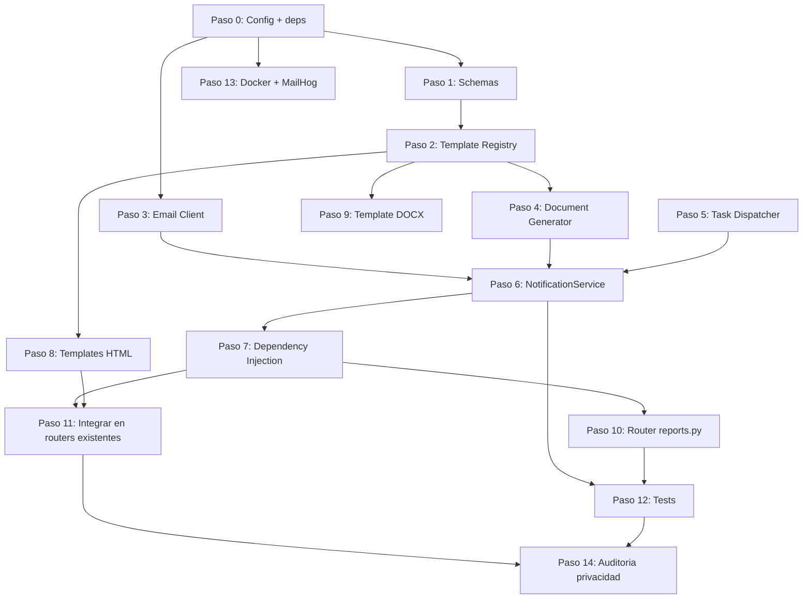

# Workflow — Modulo de Notificaciones y Generacion de Documentos

**Fecha:** 2026-04-15
**Contexto:** Modulo configurable de email, PDF y DOCX para Club Trocha y Ruta
**Estrategia:** Sistematica (incremental, cada paso entregable independiente)
**Prerequisito:** Fase 1 completa (auth, clubs, athletes, anthropometry)

---

## Resumen de requisitos

### Funcionales
- Envio de emails HTML con plantillas Jinja2 e interpolacion de variables
- Generacion de PDF desde plantillas HTML (WeasyPrint + CSS Paged Media)
- Generacion de DOCX editables desde plantillas docxtpl (Jinja2 en Word)
- Adjuntar documentos generados a emails
- Template registry centralizado con validacion de contexto
- Servicio configurable reutilizable por cualquier funcionalidad

### No funcionales
- Privacidad: datos de menores nunca en logs (solo IDs opacos)
- Async: no bloquear event loop FastAPI (WeasyPrint/docxtpl sync via executor)
- Swapeable: SMTP (dev) / Resend (prod) sin cambiar logica de negocio
- Migrable: BackgroundTasks ahora, ARQ+Redis despues sin tocar servicio

### Fuera de alcance (Fase 2+)
- Cola de mensajes persistente (ARQ+Redis)
- Notificaciones push / SMS
- Editor de templates en UI
- Almacenamiento historico de documentos generados (S3/MinIO)

---

## Stack seleccionado

| Capa | Libreria | Version min |
|---|---|---|
| Transporte email (dev) | aiosmtplib | >=3.0.1 |
| Transporte email (prod) | resend | >=0.8.0 |
| CSS inlining | premailer | >=3.10.0 |
| PDF desde HTML | weasyprint | >=62.3 |
| DOCX con Jinja2 | docxtpl | >=0.16.7 |
| Templates | Jinja2 | (ya incluido con FastAPI) |

---

## Estructura de directorios objetivo

```
backend/
├── app/
│   ├── services/
│   │   └── notification/
│   │       ├── __init__.py
│   │       ├── service.py              # NotificationService (orquestador)
│   │       ├── email_client.py         # BaseEmailClient + SMTP + Resend
│   │       ├── template_registry.py    # Specs + validacion de contexto
│   │       ├── document_generator.py   # PDF (WeasyPrint) + DOCX (docxtpl)
│   │       └── task_dispatcher.py      # BackgroundTasks abstraction
│   ├── schemas/
│   │   └── notification.py             # Pydantic models
│   ├── routers/
│   │   └── reports.py                  # Endpoints de descarga/envio
│   └── config.py                       # + EmailSettings
│
├── templates/
│   ├── email/
│   │   ├── base/
│   │   │   └── layout.html             # Master layout email
│   │   ├── welcome_athlete.html
│   │   ├── anthropometry_alert.html
│   │   └── monthly_report.html
│   └── documents/
│       ├── pdf/
│       │   ├── base/
│       │   │   └── layout.html         # CSS Paged Media layout
│       │   ├── anthropometry_report.html
│       │   └── monthly_progress.html
│       └── docx/
│           └── medical_clearance.docx  # Template binario docxtpl
│
└── static/
    └── email/
        ├── logo.png
        └── styles.css
```

---

## Pasos de implementacion

### Paso 0 — Configuracion y dependencias

| Campo | Valor |
|---|---|
| **Entregable** | Dependencias instaladas, EmailSettings en config.py, .env.example actualizado |
| **Dominio** | infra / config |
| **Depende de** | — |
| **Complejidad** | Baja |
| **Riesgo** | Medio (WeasyPrint necesita libs de sistema: libpango, libcairo, libgdk-pixbuf) |
| **Agente** | `fastapi-architect` |

**Tareas:**
1. Agregar dependencias a `requirements.txt`: aiosmtplib, resend, premailer, weasyprint, docxtpl
2. Ampliar `Settings` en `config.py` con seccion `EmailSettings` (provider, SMTP host/port/user/pass, Resend API key, flags de control)
3. Actualizar `.env.example` con variables de email
4. Actualizar `Dockerfile` con libs de sistema para WeasyPrint
5. Crear directorio `backend/templates/` y `backend/static/email/`

**Criterios de aceptacion:**
- `pip install -r requirements.txt` sin errores
- `from app.config import settings` carga EmailSettings
- `docker compose build` exitoso con WeasyPrint disponible

---

### Paso 1 — Schemas Pydantic de notificacion

| Campo | Valor |
|---|---|
| **Entregable** | `app/schemas/notification.py` con todos los modelos |
| **Dominio** | backend / schemas |
| **Depende de** | Paso 0 |
| **Complejidad** | Baja |
| **Riesgo** | Bajo |
| **Agente** | `fastapi-architect` |

**Tareas:**
1. Crear enums: `NotificationTemplate`, `DocumentTemplate`, `DocumentFormat`
2. Crear modelos: `NotificationRecipient`, `GeneratedDocument`, `NotificationRequest`, `DocumentRequest`, `NotificationResult`
3. Validar que `GeneratedDocument.data` sea `bytes` (no base64 string)

**Criterios de aceptacion:**
- Todos los modelos son importables
- `NotificationRequest` valida recipient.email como EmailStr
- `DocumentRequest` requiere template + context

---

### Paso 2 — Template Registry

| Campo | Valor |
|---|---|
| **Entregable** | `app/services/notification/template_registry.py` |
| **Dominio** | backend / services |
| **Depende de** | Paso 1 |
| **Complejidad** | Media |
| **Riesgo** | Bajo |
| **Agente** | `fastapi-architect` |

**Tareas:**
1. Definir dataclasses `EmailTemplateSpec` y `DocumentTemplateSpec`
2. Crear diccionarios `EMAIL_TEMPLATES` y `DOCUMENT_TEMPLATES` con specs para cada template
3. Implementar `TemplateRegistry` con metodos: `get_email_spec()`, `get_document_spec()`, `validate_email_context()`, `validate_document_context()`
4. Validar existencia de archivos de template en disco

**Templates a registrar:**
- Email: `welcome_athlete`, `anthropometry_alert`, `monthly_report`
- Documento PDF: `anthropometry_report`, `monthly_progress`
- Documento DOCX: `medical_clearance`

**Criterios de aceptacion:**
- `registry.validate_email_context("welcome_athlete", {"athlete_first_name": "X", ...})` no lanza error
- `registry.validate_email_context("welcome_athlete", {})` lanza ValueError con claves faltantes
- `registry.get_email_spec("nonexistent")` lanza ValueError

---

### Paso 3 — Email Client (SMTP + Resend)

| Campo | Valor |
|---|---|
| **Entregable** | `app/services/notification/email_client.py` |
| **Dominio** | backend / services |
| **Depende de** | Paso 0 |
| **Complejidad** | Media |
| **Riesgo** | Medio (Resend SDK sincrono, necesita `run_in_executor`) |
| **Agente** | `fastapi-architect` |

**Tareas:**
1. Definir `OutboundEmail` dataclass (to_email, to_name, subject, html_body, attachments)
2. Definir `BaseEmailClient` ABC con metodo `async send(OutboundEmail) -> NotificationResult`
3. Implementar `SmtpEmailClient` con `aiosmtplib.send()` — async nativo
4. Implementar `ResendEmailClient` con `resend.Emails.send()` — wrapeado en `run_in_executor`
5. Factory `create_email_client(settings)` que retorna implementacion segun `EMAIL_PROVIDER`

**Reglas de privacidad en logging:**
- NUNCA loguear `to_email`, `to_name`, ni `html_body`
- Solo loguear `template_ref` (primeros 20 chars de subject) y `message_id`

**Criterios de aceptacion:**
- `SmtpEmailClient` envia email a Mailtrap/MailHog en Docker
- `ResendEmailClient` wrapeado correctamente (no bloquea event loop)
- Factory retorna SMTP cuando `EMAIL_PROVIDER=smtp`, Resend cuando `EMAIL_PROVIDER=resend`
- Logs no contienen PII

---

### Paso 4 — Document Generator (PDF + DOCX)

| Campo | Valor |
|---|---|
| **Entregable** | `app/services/notification/document_generator.py` |
| **Dominio** | backend / services |
| **Depende de** | Paso 2 |
| **Complejidad** | Alta |
| **Riesgo** | Medio (WeasyPrint CSS rendering, fonts en Docker) |
| **Agente** | `fastapi-architect` |

**Tareas:**
1. Inicializar `Jinja2 Environment` con `FileSystemLoader` apuntando a `templates/`
2. Implementar `_generate_pdf(spec, context)`:
   - Render Jinja2 HTML template
   - Pasar a `HTML(string=html, base_url=TEMPLATES_ROOT).write_pdf(optimize_images=True)`
   - Retornar `GeneratedDocument` con bytes
3. Implementar `_generate_docx(spec, context)`:
   - `DocxTemplate(path).render(context)`
   - Guardar en `BytesIO`, retornar bytes
4. Metodo publico `generate(DocumentRequest) -> GeneratedDocument` que despacha por formato
5. Enriquecer contexto automaticamente: `generated_at`, `club_name`

**Nota:** Ambos metodos son **sincronos**. Se ejecutan via `run_in_executor` desde NotificationService.

**Criterios de aceptacion:**
- `generate(PDF request)` retorna bytes PDF validos (magic bytes `%PDF`)
- `generate(DOCX request)` retorna bytes DOCX validos (magic bytes `PK`)
- Contexto incompleto lanza ValueError
- Nombre de archivo generado incluye apellido atleta + fecha

---

### Paso 5 — Task Dispatcher

| Campo | Valor |
|---|---|
| **Entregable** | `app/services/notification/task_dispatcher.py` |
| **Dominio** | backend / services |
| **Depende de** | — |
| **Complejidad** | Baja |
| **Riesgo** | Bajo |
| **Agente** | `fastapi-architect` |

**Tareas:**
1. Implementar `TaskDispatcher` que recibe `BackgroundTasks` opcional
2. Metodo `dispatch(func, *args, **kwargs)` que agrega tarea a BackgroundTasks
3. Documentar interfaz futura `ArqDispatcher` como comentario (no implementar)

**Criterios de aceptacion:**
- Con `BackgroundTasks` inyectado: despacha en background
- Sin `BackgroundTasks`: ejecuta sincrono (para tests)

---

### Paso 6 — NotificationService (orquestador) [COMPLETADO]

| Campo | Valor |
|---|---|
| **Entregable** | `app/services/notification/service.py` + `__init__.py` |
| **Dominio** | backend / services |
| **Depende de** | Pasos 2, 3, 4, 5 |
| **Complejidad** | Alta |
| **Riesgo** | Bajo (composicion de componentes ya testeados) |
| **Agente** | `fastapi-architect` |

**Tareas:**
1. Constructor recibe: `email_client`, `registry`, `document_generator`, `settings`
2. Metodo `send(NotificationRequest, dispatcher?)`:
   - Validar contexto via registry
   - Renderizar subject (Jinja2 string)
   - Renderizar body HTML (Jinja2 template)
   - Aplicar premailer CSS inlining
   - Generar adjuntos si se solicitan (via executor para no bloquear)
   - Enviar via email_client
3. Metodo `generate_document_only(DocumentRequest)` para descargas directas sin email
4. `__init__.py` re-exporta NotificationService y create_email_client

**Criterios de aceptacion:**
- `send()` con `send_async=True` retorna inmediatamente con `message_id="queued"`
- `send()` con `send_async=False` espera y retorna resultado real
- `generate_document_only()` retorna `GeneratedDocument` sin enviar email
- Flag `NOTIFICATION_SEND_EMAILS=false` cortocircuita sin enviar

---

### Paso 7 — Dependency Injection [COMPLETADO]

| Campo | Valor |
|---|---|
| **Entregable** | Funciones DI agregadas a `dependencies.py` existente |
| **Dominio** | backend / config |
| **Depende de** | Paso 6 |
| **Complejidad** | Baja |
| **Riesgo** | Bajo |
| **Agente** | `fastapi-architect` |

**Tareas:**
1. `get_email_settings()` — `@lru_cache`
2. `get_template_registry()` — `@lru_cache`
3. `get_document_generator(registry)` — `Depends`
4. `get_notification_service(settings, registry, generator)` — `Depends`
5. `get_task_dispatcher(background_tasks)` — `Depends`

**Criterios de aceptacion:**
- Inyeccion funciona en endpoint de prueba
- Registry y settings son singleton (lru_cache)

---

### Paso 8 — Templates HTML (email + PDF) [COMPLETADO]

| Campo | Valor |
|---|---|
| **Entregable** | Archivos HTML en `templates/email/` y `templates/documents/pdf/` |
| **Dominio** | frontend / templates |
| **Depende de** | Paso 2 (specs definen required_context_keys) |
| **Complejidad** | Media |
| **Riesgo** | Medio (CSS email compatibility, responsive) |
| **Agente** | `react-ui-engineer` (HTML/CSS) + `data-privacy-guard` (revision) |

**Tareas:**
1. `templates/email/base/layout.html` — Master layout con header logo, content block, footer confidencialidad
2. `templates/email/welcome_athlete.html` — Bienvenida, lista de items para primera sesion
3. `templates/email/anthropometry_alert.html` — Alerta de medicion al coach (SIN nombre de atleta)
4. `templates/email/monthly_report.html` — Resumen mensual para padres
5. `templates/documents/pdf/base/layout.html` — CSS @page con header, footer, numeracion
6. `templates/documents/pdf/anthropometry_report.html` — Tabla de mediciones + badge PHV
7. `templates/documents/pdf/monthly_progress.html` — Progreso mensual con tendencias

**Colores del club:** header `#2d5016` (verde bosque), badges PHV con colores semanticos

**Reglas de privacidad:**
- Email alert al coach: NO incluir nombre atleta en body (solo en dashboard)
- PDF reporte: SI incluir nombre completo (documento formal descargado)
- Footer en todos: "Documento confidencial — datos de menor de edad protegidos"

**Criterios de aceptacion:**
- Layouts renderizan correctamente en Jinja2 sin errores
- CSS inlineado por premailer produce HTML funcional
- PDF genera con header/footer/numeracion de paginas
- Ningun template expone datos sensibles innecesariamente

---

### Paso 9 — Template DOCX (autorizacion medica) [COMPLETADO]

| Campo | Valor |
|---|---|
| **Entregable** | `templates/documents/docx/medical_clearance.docx` |
| **Dominio** | documentos |
| **Depende de** | Paso 2 |
| **Complejidad** | Baja |
| **Riesgo** | Bajo |
| **Agente** | `fastapi-architect` (genera programaticamente con python-docx) |

**Tareas:**
1. Crear template .docx con variables docxtpl: `{{ athlete_first_name }}`, `{{ athlete_last_name }}`, `{{ birth_date }}`, `{{ club_name }}`, `{{ season_year }}`
2. Incluir seccion de condiciones medicas con loop ``
3. Espacio para firma del padre/tutor y firma del medico

**Criterios de aceptacion:**
- docxtpl renderiza sin errores con contexto completo
- Documento resultante abre correctamente en Word/LibreOffice
- Variables reemplazadas con valores reales

---

### Paso 10 — Router reports.py + registro en main.py [COMPLETADO]

| Campo | Valor |
|---|---|
| **Entregable** | `app/routers/reports.py` con 3 endpoints, registrado en `main.py` |
| **Dominio** | backend / routers |
| **Depende de** | Pasos 6, 7 |
| **Complejidad** | Media |
| **Riesgo** | Bajo |
| **Agente** | `fastapi-architect` |

**Endpoints:**

| Metodo | Ruta | Descripcion | Auth |
|---|---|---|---|
| GET | `/athletes/{id}/report/pdf` | Descarga reporte antropometrico PDF | coach, parent (verify_athlete_access) |
| GET | `/athletes/{id}/clearance/docx` | Descarga autorizacion medica DOCX | coach, parent (verify_athlete_access) |
| POST | `/athletes/{id}/report/email` | Envia informe mensual por email al padre | coach, admin |

**Tareas:**
1. Implementar 3 endpoints con dependency injection
2. Usar `verify_athlete_access` existente para permisos
3. Retornar `Response` con `Content-Disposition: attachment` para descargas
4. Registrar router en `main.py`

**Criterios de aceptacion:**
- GET PDF retorna `application/pdf` con header de descarga
- GET DOCX retorna content-type correcto
- POST email retorna `{"queued": true}` en modo async
- 403 si usuario no tiene acceso al atleta
- 404 si atleta no existe

---

### Paso 11 — Integrar envio en routers existentes [COMPLETADO]

| Campo | Valor |
|---|---|
| **Entregable** | Emails disparados desde `athletes.py` y `anthropometry.py` existentes |
| **Dominio** | backend / integracion |
| **Depende de** | Pasos 6, 7, 8 |
| **Complejidad** | Media |
| **Riesgo** | Medio (no romper endpoints existentes) |
| **Agente** | `fastapi-architect` |

**Tareas:**
1. En `POST /athletes/` — enviar email de bienvenida al padre (si tiene email)
2. En `POST /athletes/{id}/anthropometry/` — disparar alerta al coach si `measurement_alerts` detecta condicion critica
3. Ambos usan `send_async=True` via dispatcher para no bloquear response

**Criterios de aceptacion:**
- Crear atleta sin padre con email: no intenta enviar (sin error)
- Crear atleta con padre con email: email queda en queue
- Nueva medicion con alerta critica: email al coach en background
- Endpoints existentes mantienen mismo response schema

---

### Paso 12 — Tests unitarios [COMPLETADO]

| Campo | Valor |
|---|---|
| **Entregable** | Tests para cada componente del modulo |
| **Dominio** | testing |
| **Depende de** | Pasos 1-6, 10 |
| **Complejidad** | Alta |
| **Riesgo** | Bajo |
| **Agente** | `quality-engineer` |

**Archivos de test:**
```
tests/
├── test_template_registry.py     # Validacion contexto, specs, errores
├── test_email_client.py          # Mock SMTP, mock Resend, factory
├── test_document_generator.py    # PDF bytes validos, DOCX bytes validos
├── test_notification_service.py  # Orquestacion send + generate
└── test_reports_router.py        # Endpoints HTTP, permisos, responses
```

**Tareas:**
1. Mock de aiosmtplib para SMTP tests
2. Mock de resend SDK para Resend tests
3. Test PDF generation con template real (verificar magic bytes `%PDF`)
4. Test DOCX generation (verificar magic bytes `PK`)
5. Test NotificationService con todos los mocks
6. Test router endpoints con TestClient + auth fixtures existentes
7. Test de privacidad: verificar que logs no contienen PII

**Criterios de aceptacion:**
- `pytest tests/test_notification*.py tests/test_reports*.py` pasa
- Cobertura >80% en modulo notification
- Zero PII en captured logs durante tests

---

### Paso 13 — Docker + dev environment

| Campo | Valor |
|---|---|
| **Entregable** | MailHog en docker-compose, Dockerfile actualizado |
| **Dominio** | devops / infra |
| **Depende de** | Paso 0 |
| **Complejidad** | Baja |
| **Riesgo** | Bajo |
| **Agente** | `devops-architect` |

**Tareas:**
1. Agregar servicio `mailhog` a `docker-compose.yml` (puerto 1025 SMTP, 8025 UI)
2. Configurar `.env` de dev con `EMAIL_PROVIDER=smtp`, `SMTP_HOST=mailhog`, `SMTP_PORT=1025`
3. Agregar libs de sistema WeasyPrint al Dockerfile (`libpango`, `libcairo`, `libgdk-pixbuf`)
4. Verificar que `docker compose up` levanta todo correctamente

**Criterios de aceptacion:**
- `docker compose up` levanta MySQL + API + MailHog sin errores
- MailHog UI accesible en `localhost:8025`
- Email enviado desde API aparece en MailHog

---

### Paso 14 — Auditoria de privacidad

| Campo | Valor |
|---|---|
| **Entregable** | Reporte de auditoria, correcciones si necesarias |
| **Dominio** | seguridad / privacidad |
| **Depende de** | Pasos 1-11 (todo implementado) |
| **Complejidad** | Media |
| **Riesgo** | Alto (datos de menores) |
| **Agente** | `data-privacy-guard` + `security-engineer` |

**Checklist:**
- [ ] Ningun log contiene email, nombre o datos medicos de atletas
- [ ] Templates de email alert no exponen nombre de atleta
- [ ] PDFs generados en memoria (BytesIO), no persistidos en disco
- [ ] RESEND_API_KEY no esta en ningun archivo commiteado
- [ ] `NOTIFICATION_LOG_BODIES=false` por defecto
- [ ] `.env` en `.gitignore`
- [ ] Endpoints protegidos con `verify_athlete_access`

**Criterios de aceptacion:**
- Auditoria pasa todos los checks
- Zero PII encontrado en git log de archivos del modulo

---

## Grafo de dependencias



## Oportunidades de paralelismo

| Grupo paralelo | Pasos | Condicion |
|---|---|---|
| A | 1, 3, 5, 13 | Todos dependen solo de Paso 0 (o nada) |
| B | 2, 8, 9 | Dependen de Paso 1 o 2, independientes entre si |
| C | 10, 11 | Ambos dependen de Paso 7, independientes entre si |

## Registro de riesgos

| Riesgo | Pasos afectados | Mitigacion |
|---|---|---|
| WeasyPrint libs de sistema en Docker | 0, 4, 13 | Agregar al Dockerfile; testar build temprano |
| Resend SDK sincrono bloquea event loop | 3, 6 | Envolver en `run_in_executor` siempre |
| CSS email incompatible entre clientes | 8 | Usar premailer + testear en MailHog; considerar MJML futuro |
| Fonts diferentes en Docker vs local | 4 | Incluir fonts en static/ o usar fonts web |
| Docxtpl tags cruzando parrafos | 9 | Testar template con datos reales antes de integrar |
| PII en logs de desarrollo | 3, 6, 11 | Regla de logging estricta; auditoria paso 14 |

## MVP despues de paso

**Paso 10 completo = MVP funcional.** Coach puede descargar PDF y DOCX desde API. Paso 11 agrega automatizacion (emails en eventos). Paso 12-14 son calidad y seguridad.

## Ruta de migracion futura: BackgroundTasks a ARQ

Cuando se necesite persistencia de tareas:
1. Instalar `arq>=0.25.0`, `redis>=5.0.0`
2. Agregar Redis a docker-compose
3. Implementar `ArqDispatcher` (misma interfaz que `TaskDispatcher`)
4. Registrar funciones en `WorkerSettings`
5. Agregar `REDIS_URL` a config
6. **Zero cambios** en NotificationService ni routers
