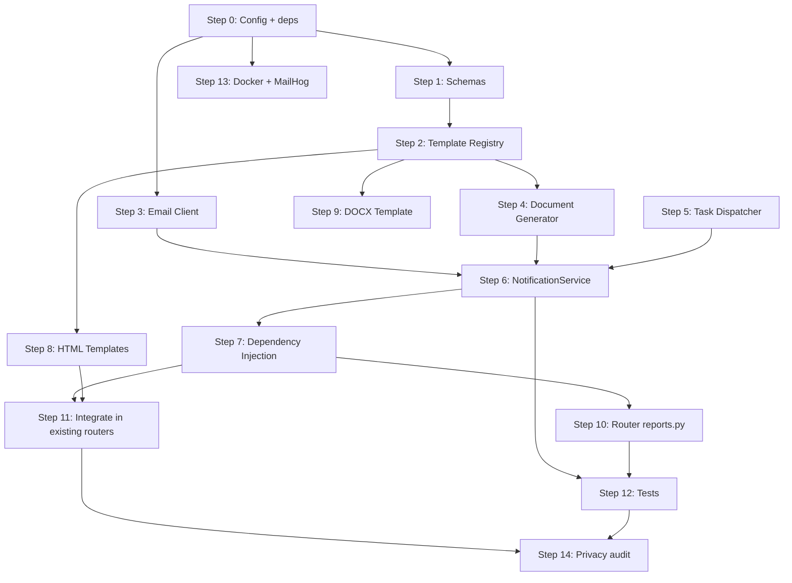

# Workflow — Notifications and Document Generation Module

**Date:** 2026-04-15
**Context:** Configurable email, PDF, and DOCX module for Club Trocha y Ruta
**Strategy:** Systematic (incremental, each step independently deliverable)
**Prerequisite:** Phase 1 complete (auth, clubs, athletes, anthropometry)

---

## Requirements Summary

### Functional
- HTML email sending with Jinja2 templates and variable interpolation
- PDF generation from HTML templates (WeasyPrint + CSS Paged Media)
- Editable DOCX generation from docxtpl templates (Jinja2 in Word)
- Attach generated documents to emails
- Centralized template registry with context validation
- Configurable service reusable by any feature

### Non-functional
- Privacy: minors' data never in logs (opaque IDs only)
- Async: do not block FastAPI event loop (WeasyPrint/docxtpl sync via executor)
- Swappable: SMTP (dev) / Resend (prod) without changing business logic
- Migratable: BackgroundTasks now, ARQ+Redis later without touching the service

### Out of scope (Phase 2+)
- Persistent message queue (ARQ+Redis)
- Push / SMS notifications
- Template editor in UI
- Historical storage of generated documents (S3/MinIO)

---

## Selected Stack

| Layer | Library | Min version |
|---|---|---|
| Email transport (dev) | aiosmtplib | >=3.0.1 |
| Email transport (prod) | resend | >=0.8.0 |
| CSS inlining | premailer | >=3.10.0 |
| PDF from HTML | weasyprint | >=62.3 |
| DOCX with Jinja2 | docxtpl | >=0.16.7 |
| Templates | Jinja2 | (already included with FastAPI) |

---

## Target Directory Structure

```
backend/
├── app/
│   ├── services/
│   │   └── notification/
│   │       ├── __init__.py
│   │       ├── service.py              # NotificationService (orchestrator)
│   │       ├── email_client.py         # BaseEmailClient + SMTP + Resend
│   │       ├── template_registry.py    # Specs + context validation
│   │       ├── document_generator.py   # PDF (WeasyPrint) + DOCX (docxtpl)
│   │       └── task_dispatcher.py      # BackgroundTasks abstraction
│   ├── schemas/
│   │   └── notification.py             # Pydantic models
│   ├── routers/
│   │   └── reports.py                  # Download/send endpoints
│   └── config.py                       # + EmailSettings
│
├── templates/
│   ├── email/
│   │   ├── base/
│   │   │   └── layout.html             # Master email layout
│   │   ├── welcome_athlete.html
│   │   ├── anthropometry_alert.html
│   │   └── monthly_report.html
│   └── documents/
│       ├── pdf/
│       │   ├── base/
│       │   │   └── layout.html         # CSS Paged Media layout
│       │   ├── anthropometry_report.html
│       │   └── monthly_progress.html
│       └── docx/
│           └── medical_clearance.docx  # Binary docxtpl template
│
└── static/
    └── email/
        ├── logo.png
        └── styles.css
```

---

## Implementation Steps

### Step 0 — Configuration and Dependencies

| Field | Value |
|---|---|
| **Deliverable** | Dependencies installed, EmailSettings in config.py, .env.example updated |
| **Domain** | infra / config |
| **Depends on** | — |
| **Complexity** | Low |
| **Risk** | Medium (WeasyPrint requires system libs: libpango, libcairo, libgdk-pixbuf) |
| **Agent** | `fastapi-architect` |

**Tasks:**
1. Add dependencies to `requirements.txt`: aiosmtplib, resend, premailer, weasyprint, docxtpl
2. Extend `Settings` in `config.py` with an `EmailSettings` section (provider, SMTP host/port/user/pass, Resend API key, control flags)
3. Update `.env.example` with email variables
4. Update `Dockerfile` with system libs for WeasyPrint
5. Create directories `backend/templates/` and `backend/static/email/`

**Acceptance criteria:**
- `pip install -r requirements.txt` with no errors
- `from app.config import settings` loads EmailSettings
- `docker compose build` succeeds with WeasyPrint available

---

### Step 1 — Notification Pydantic Schemas

| Field | Value |
|---|---|
| **Deliverable** | `app/schemas/notification.py` with all models |
| **Domain** | backend / schemas |
| **Depends on** | Step 0 |
| **Complexity** | Low |
| **Risk** | Low |
| **Agent** | `fastapi-architect` |

**Tasks:**
1. Create enums: `NotificationTemplate`, `DocumentTemplate`, `DocumentFormat`
2. Create models: `NotificationRecipient`, `GeneratedDocument`, `NotificationRequest`, `DocumentRequest`, `NotificationResult`
3. Validate that `GeneratedDocument.data` is `bytes` (not base64 string)

**Acceptance criteria:**
- All models are importable
- `NotificationRequest` validates recipient.email as EmailStr
- `DocumentRequest` requires template + context

---

### Step 2 — Template Registry

| Field | Value |
|---|---|
| **Deliverable** | `app/services/notification/template_registry.py` |
| **Domain** | backend / services |
| **Depends on** | Step 1 |
| **Complexity** | Medium |
| **Risk** | Low |
| **Agent** | `fastapi-architect` |

**Tasks:**
1. Define dataclasses `EmailTemplateSpec` and `DocumentTemplateSpec`
2. Create dictionaries `EMAIL_TEMPLATES` and `DOCUMENT_TEMPLATES` with specs for each template
3. Implement `TemplateRegistry` with methods: `get_email_spec()`, `get_document_spec()`, `validate_email_context()`, `validate_document_context()`
4. Validate existence of template files on disk

**Templates to register:**
- Email: `welcome_athlete`, `anthropometry_alert`, `monthly_report`
- PDF Document: `anthropometry_report`, `monthly_progress`
- DOCX Document: `medical_clearance`

**Acceptance criteria:**
- `registry.validate_email_context("welcome_athlete", {"athlete_first_name": "X", ...})` does not raise
- `registry.validate_email_context("welcome_athlete", {})` raises ValueError with missing keys
- `registry.get_email_spec("nonexistent")` raises ValueError

---

### Step 3 — Email Client (SMTP + Resend)

| Field | Value |
|---|---|
| **Deliverable** | `app/services/notification/email_client.py` |
| **Domain** | backend / services |
| **Depends on** | Step 0 |
| **Complexity** | Medium |
| **Risk** | Medium (Resend SDK is synchronous, requires `run_in_executor`) |
| **Agent** | `fastapi-architect` |

**Tasks:**
1. Define `OutboundEmail` dataclass (to_email, to_name, subject, html_body, attachments)
2. Define `BaseEmailClient` ABC with method `async send(OutboundEmail) -> NotificationResult`
3. Implement `SmtpEmailClient` with `aiosmtplib.send()` — natively async
4. Implement `ResendEmailClient` with `resend.Emails.send()` — wrapped in `run_in_executor`
5. Factory `create_email_client(settings)` returning the implementation based on `EMAIL_PROVIDER`

**Privacy logging rules:**
- NEVER log `to_email`, `to_name`, or `html_body`
- Only log `template_ref` (first 20 chars of subject) and `message_id`

**Acceptance criteria:**
- `SmtpEmailClient` sends email to Mailtrap/MailHog in Docker
- `ResendEmailClient` correctly wrapped (does not block event loop)
- Factory returns SMTP when `EMAIL_PROVIDER=smtp`, Resend when `EMAIL_PROVIDER=resend`
- Logs contain no PII

---

### Step 4 — Document Generator (PDF + DOCX)

| Field | Value |
|---|---|
| **Deliverable** | `app/services/notification/document_generator.py` |
| **Domain** | backend / services |
| **Depends on** | Step 2 |
| **Complexity** | High |
| **Risk** | Medium (WeasyPrint CSS rendering, fonts in Docker) |
| **Agent** | `fastapi-architect` |

**Tasks:**
1. Initialize `Jinja2 Environment` with `FileSystemLoader` pointing to `templates/`
2. Implement `_generate_pdf(spec, context)`:
   - Render Jinja2 HTML template
   - Pass to `HTML(string=html, base_url=TEMPLATES_ROOT).write_pdf(optimize_images=True)`
   - Return `GeneratedDocument` with bytes
3. Implement `_generate_docx(spec, context)`:
   - `DocxTemplate(path).render(context)`
   - Save to `BytesIO`, return bytes
4. Public method `generate(DocumentRequest) -> GeneratedDocument` that dispatches by format
5. Automatically enrich context: `generated_at`, `club_name`

**Note:** Both methods are **synchronous**. They are executed via `run_in_executor` from NotificationService.

**Acceptance criteria:**
- `generate(PDF request)` returns valid PDF bytes (magic bytes `%PDF`)
- `generate(DOCX request)` returns valid DOCX bytes (magic bytes `PK`)
- Incomplete context raises ValueError
- Generated filename includes athlete's last name + date

---

### Step 5 — Task Dispatcher

| Field | Value |
|---|---|
| **Deliverable** | `app/services/notification/task_dispatcher.py` |
| **Domain** | backend / services |
| **Depends on** | — |
| **Complexity** | Low |
| **Risk** | Low |
| **Agent** | `fastapi-architect` |

**Tasks:**
1. Implement `TaskDispatcher` that receives optional `BackgroundTasks`
2. Method `dispatch(func, *args, **kwargs)` that adds a task to BackgroundTasks
3. Document future `ArqDispatcher` interface as a comment (do not implement)

**Acceptance criteria:**
- With `BackgroundTasks` injected: dispatches in background
- Without `BackgroundTasks`: executes synchronously (for tests)

---

### Step 6 — NotificationService (orchestrator) [COMPLETE]

| Field | Value |
|---|---|
| **Deliverable** | `app/services/notification/service.py` + `__init__.py` |
| **Domain** | backend / services |
| **Depends on** | Steps 2, 3, 4, 5 |
| **Complexity** | High |
| **Risk** | Low (composition of already-tested components) |
| **Agent** | `fastapi-architect` |

**Tasks:**
1. Constructor receives: `email_client`, `registry`, `document_generator`, `settings`
2. Method `send(NotificationRequest, dispatcher?)`:
   - Validate context via registry
   - Render subject (Jinja2 string)
   - Render HTML body (Jinja2 template)
   - Apply premailer CSS inlining
   - Generate attachments if requested (via executor to avoid blocking)
   - Send via email_client
3. Method `generate_document_only(DocumentRequest)` for direct downloads without email
4. `__init__.py` re-exports NotificationService and create_email_client

**Acceptance criteria:**
- `send()` with `send_async=True` returns immediately with `message_id="queued"`
- `send()` with `send_async=False` waits and returns the real result
- `generate_document_only()` returns `GeneratedDocument` without sending email
- Flag `NOTIFICATION_SEND_EMAILS=false` short-circuits without sending

---

### Step 7 — Dependency Injection [COMPLETE]

| Field | Value |
|---|---|
| **Deliverable** | DI functions added to existing `dependencies.py` |
| **Domain** | backend / config |
| **Depends on** | Step 6 |
| **Complexity** | Low |
| **Risk** | Low |
| **Agent** | `fastapi-architect` |

**Tasks:**
1. `get_email_settings()` — `@lru_cache`
2. `get_template_registry()` — `@lru_cache`
3. `get_document_generator(registry)` — `Depends`
4. `get_notification_service(settings, registry, generator)` — `Depends`
5. `get_task_dispatcher(background_tasks)` — `Depends`

**Acceptance criteria:**
- Injection works in a test endpoint
- Registry and settings are singletons (lru_cache)

---

### Step 8 — HTML Templates (email + PDF) [COMPLETE]

| Field | Value |
|---|---|
| **Deliverable** | HTML files in `templates/email/` and `templates/documents/pdf/` |
| **Domain** | frontend / templates |
| **Depends on** | Step 2 (specs define required_context_keys) |
| **Complexity** | Medium |
| **Risk** | Medium (CSS email compatibility, responsive) |
| **Agent** | `react-ui-engineer` (HTML/CSS) + `data-privacy-guard` (review) |

**Tasks:**
1. `templates/email/base/layout.html` — Master layout with logo header, content block, confidentiality footer
2. `templates/email/welcome_athlete.html` — Welcome, list of items for the first training session
3. `templates/email/anthropometry_alert.html` — Measurement alert to coach (WITHOUT athlete name)
4. `templates/email/monthly_report.html` — Monthly summary for parents/guardians
5. `templates/documents/pdf/base/layout.html` — CSS @page with header, footer, numbering
6. `templates/documents/pdf/anthropometry_report.html` — Measurements table + PHV badge
7. `templates/documents/pdf/monthly_progress.html` — Monthly progress with trends

**Club colors:** header `#2d5016` (forest green), PHV badges with semantic colors

**Privacy rules:**
- Email alert to coach: DO NOT include athlete name in body (only in dashboard)
- PDF report: DO include full name (formal downloaded document)
- Footer on all: "Confidential document — minors' data protected"

**Acceptance criteria:**
- Layouts render correctly in Jinja2 without errors
- CSS inlined by premailer produces functional HTML
- PDF generates with header/footer/page numbering
- No template exposes sensitive data unnecessarily

---

### Step 9 — DOCX Template (medical clearance) [COMPLETE]

| Field | Value |
|---|---|
| **Deliverable** | `templates/documents/docx/medical_clearance.docx` |
| **Domain** | documents |
| **Depends on** | Step 2 |
| **Complexity** | Low |
| **Risk** | Low |
| **Agent** | `fastapi-architect` (generates programmatically with python-docx) |

**Tasks:**
1. Create .docx template with docxtpl variables: `{{ athlete_first_name }}`, `{{ athlete_last_name }}`, `{{ birth_date }}`, `{{ club_name }}`, `{{ season_year }}`
2. Include medical conditions section with loop ``
3. Space for parent/guardian signature and doctor signature

**Acceptance criteria:**
- docxtpl renders without errors with complete context
- Resulting document opens correctly in Word/LibreOffice
- Variables replaced with real values

---

### Step 10 — Router reports.py + registration in main.py [COMPLETE]

| Field | Value |
|---|---|
| **Deliverable** | `app/routers/reports.py` with 3 endpoints, registered in `main.py` |
| **Domain** | backend / routers |
| **Depends on** | Steps 6, 7 |
| **Complexity** | Medium |
| **Risk** | Low |
| **Agent** | `fastapi-architect` |

**Endpoints:**

| Method | Route | Description | Auth |
|---|---|---|---|
| GET | `/athletes/{id}/report/pdf` | Download anthropometry PDF report | coach, parent (verify_athlete_access) |
| GET | `/athletes/{id}/clearance/docx` | Download medical clearance DOCX | coach, parent (verify_athlete_access) |
| POST | `/athletes/{id}/report/email` | Send monthly report by email to parent/guardian | coach, admin |

**Tasks:**
1. Implement 3 endpoints with dependency injection
2. Use existing `verify_athlete_access` for permissions
3. Return `Response` with `Content-Disposition: attachment` for downloads
4. Register router in `main.py`

**Acceptance criteria:**
- GET PDF returns `application/pdf` with download header
- GET DOCX returns correct content-type
- POST email returns `{"queued": true}` in async mode
- 403 if user does not have access to the athlete
- 404 if athlete does not exist

---

### Step 11 — Integrate sending in existing routers [COMPLETE]

| Field | Value |
|---|---|
| **Deliverable** | Emails triggered from existing `athletes.py` and `anthropometry.py` |
| **Domain** | backend / integration |
| **Depends on** | Steps 6, 7, 8 |
| **Complexity** | Medium |
| **Risk** | Medium (must not break existing endpoints) |
| **Agent** | `fastapi-architect` |

**Tasks:**
1. In `POST /athletes/` — send welcome email to parent/guardian (if they have an email)
2. In `POST /athletes/{id}/anthropometry/` — trigger alert to coach if `measurement_alerts` detects a critical condition
3. Both use `send_async=True` via dispatcher to avoid blocking the response

**Acceptance criteria:**
- Create athlete without parent/guardian with email: does not attempt to send (no error)
- Create athlete with parent/guardian with email: email is queued
- New measurement with critical alert: email to coach in background
- Existing endpoints maintain the same response schema

---

### Step 12 — Unit Tests [COMPLETE]

| Field | Value |
|---|---|
| **Deliverable** | Tests for each module component |
| **Domain** | testing |
| **Depends on** | Steps 1–6, 10 |
| **Complexity** | High |
| **Risk** | Low |
| **Agent** | `quality-engineer` |

**Test files:**
```
tests/
├── test_template_registry.py     # Context validation, specs, errors
├── test_email_client.py          # Mock SMTP, mock Resend, factory
├── test_document_generator.py    # Valid PDF bytes, valid DOCX bytes
├── test_notification_service.py  # Orchestration send + generate
└── test_reports_router.py        # HTTP endpoints, permissions, responses
```

**Tasks:**
1. Mock aiosmtplib for SMTP tests
2. Mock resend SDK for Resend tests
3. Test PDF generation with real template (verify magic bytes `%PDF`)
4. Test DOCX generation (verify magic bytes `PK`)
5. Test NotificationService with all mocks
6. Test router endpoints with TestClient + existing auth fixtures
7. Privacy test: verify that logs do not contain PII

**Acceptance criteria:**
- `pytest tests/test_notification*.py tests/test_reports*.py` passes
- Coverage >80% in notification module
- Zero PII in captured logs during tests

---

### Step 13 — Docker + dev environment

| Field | Value |
|---|---|
| **Deliverable** | MailHog in docker-compose, updated Dockerfile |
| **Domain** | devops / infra |
| **Depends on** | Step 0 |
| **Complexity** | Low |
| **Risk** | Low |
| **Agent** | `devops-architect` |

**Tasks:**
1. Add `mailhog` service to `docker-compose.yml` (port 1025 SMTP, 8025 UI)
2. Configure dev `.env` with `EMAIL_PROVIDER=smtp`, `SMTP_HOST=mailhog`, `SMTP_PORT=1025`
3. Add WeasyPrint system libs to Dockerfile (`libpango`, `libcairo`, `libgdk-pixbuf`)
4. Verify that `docker compose up` starts everything correctly

**Acceptance criteria:**
- `docker compose up` starts MySQL + API + MailHog without errors
- MailHog UI accessible at `localhost:8025`
- Email sent from API appears in MailHog

---

### Step 14 — Privacy Audit

| Field | Value |
|---|---|
| **Deliverable** | Audit report, corrections if necessary |
| **Domain** | security / privacy |
| **Depends on** | Steps 1–11 (everything implemented) |
| **Complexity** | Medium |
| **Risk** | High (minors' data) |
| **Agent** | `data-privacy-guard` + `security-engineer` |

**Checklist:**
- [ ] No log contains email, name, or medical data of athletes
- [ ] Email alert templates do not expose athlete name
- [ ] PDFs generated in memory (BytesIO), not persisted to disk
- [ ] RESEND_API_KEY is not in any committed file
- [ ] `NOTIFICATION_LOG_BODIES=false` by default
- [ ] `.env` in `.gitignore`
- [ ] Endpoints protected with `verify_athlete_access`

**Acceptance criteria:**
- Audit passes all checks
- Zero PII found in git log for module files

---

## Dependency Graph



## Parallelism Opportunities

| Parallel group | Steps | Condition |
|---|---|---|
| A | 1, 3, 5, 13 | All depend only on Step 0 (or nothing) |
| B | 2, 8, 9 | Depend on Step 1 or 2, independent of each other |
| C | 10, 11 | Both depend on Step 7, independent of each other |

## Risk Register

| Risk | Affected steps | Mitigation |
|---|---|---|
| WeasyPrint system libs in Docker | 0, 4, 13 | Add to Dockerfile; test build early |
| Resend SDK synchronous blocks event loop | 3, 6 | Always wrap in `run_in_executor` |
| CSS email incompatible across clients | 8 | Use premailer + test in MailHog; consider MJML in future |
| Different fonts in Docker vs local | 4 | Include fonts in static/ or use web fonts |
| Docxtpl tags crossing paragraphs | 9 | Test template with real data before integrating |
| PII in development logs | 3, 6, 11 | Strict logging rule; audit in step 14 |

## MVP after step

**Step 10 complete = functional MVP.** Coach can download PDF and DOCX from the API. Step 11 adds automation (emails on events). Steps 12–14 are quality and security.

## Future migration path: BackgroundTasks to ARQ

When task persistence is needed:
1. Install `arq>=0.25.0`, `redis>=5.0.0`
2. Add Redis to docker-compose
3. Implement `ArqDispatcher` (same interface as `TaskDispatcher`)
4. Register functions in `WorkerSettings`
5. Add `REDIS_URL` to config
6. **Zero changes** in NotificationService or routers
