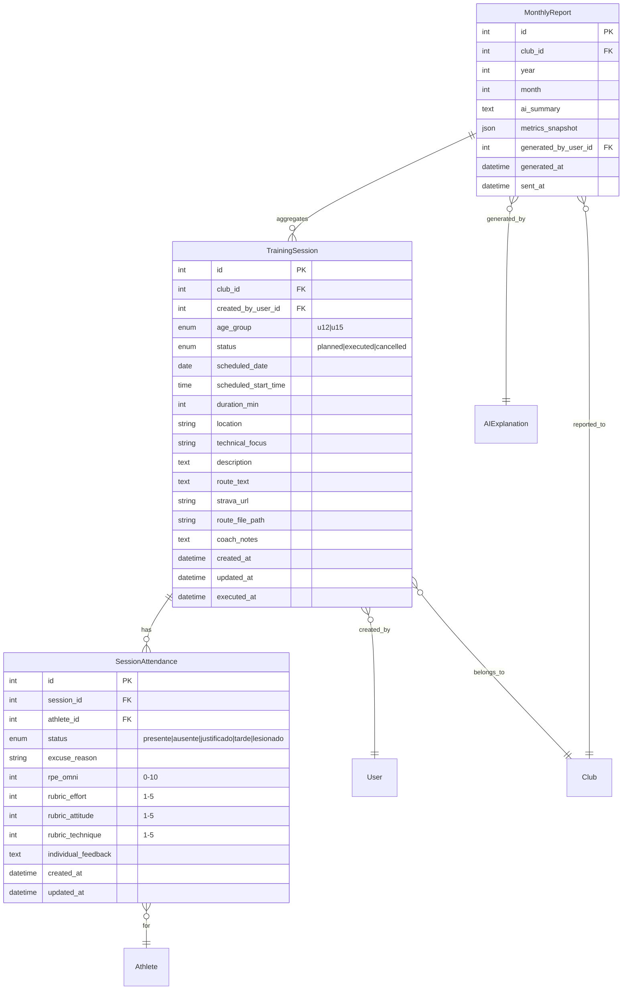
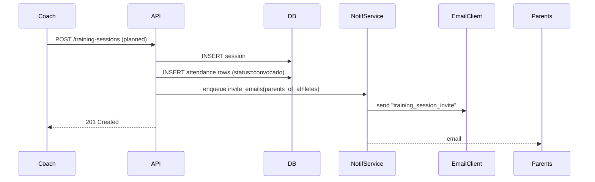
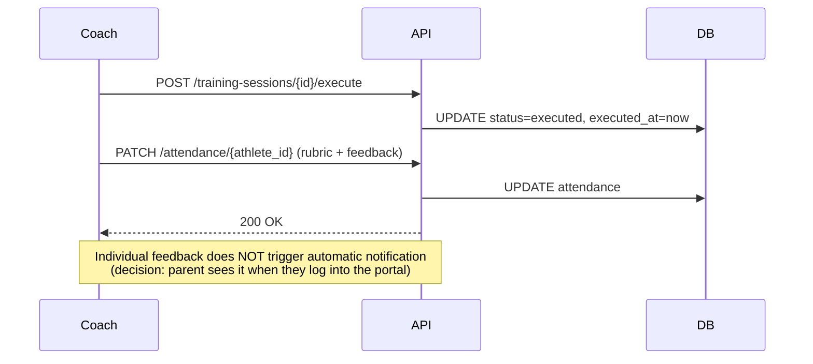
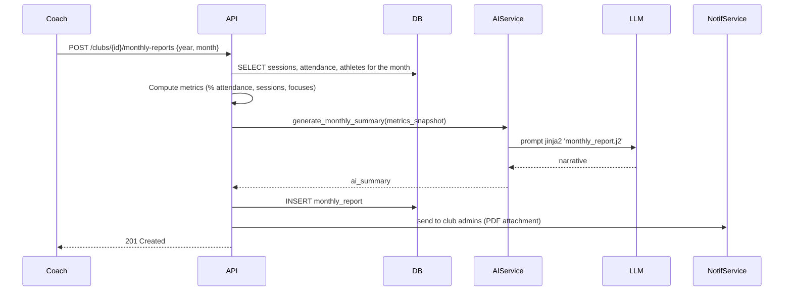

# Design — Training Sessions Module

**Date:** 2026-05-06
**Status:** Design approved — implementation pending
**Origin:** Brainstorm answered by the coach (Q1-Q7)

---

## 1. Context

The club has no digital module to record training sessions. Gap vs. theoretical framework §2-§5 (capacities, technique, periodization). The coach works with a notebook and loose spreadsheets. Required:

- Planning + execution of sessions by age group (10-12 / 13-15).
- Attendance with states and reasons.
- Structured feedback per athlete (rubric + RPE + comment).
- Route: text, coach's Strava link, `.gpx`/`.fit` upload.
- Monthly report to the club with an AI-generated summary.
- Read access for parents to their athlete's sessions.
- Notification to parents when a future session is scheduled (Q7).

### Confirmed coach answers

| Q | Answer | Implication |
|---|---|---|
| Q1 | (b) one session per age group | `age_group` enum on session |
| Q2 | (b)+(c) states + text reason | `AttendanceStatus` enum + `excuse_reason` |
| Q3 | (c) rubric 3 sliders 1-5 + comment + RPE | Structured + free-text fields |
| Q4 | (a)+(b)+(c) text + Strava link + upload | `route_text`, `strava_url`, `route_file` |
| Q5 | Monthly report with AI module | New `MonthlyReportGenerator` use case |
| Q6 | (a)+(b) parent views sessions + description | RBAC parent: read session + filter by athlete |
| Q7 | (b) plan + execution + notification | State `planned/executed/cancelled` + parent email |

### Strava restriction (prior research)

- ToS Nov 2024: third-party apps cannot show athlete data to another person. **Coach does NOT read athletes' Strava.**
- Minimum Strava age 13 (16 in EU). Athletes 10-12 excluded.
- Only permitted use: manual link to a public activity of the coach as a route reference.
- Coach's own `.gpx`/`.fit` upload: 100% legal, no OAuth, age-agnostic.

---

## 2. Design decisions

### 2.1 Model: planning + execution unified
A single `TrainingSession` entity that passes through states `planned → executed → cancelled`. Avoids duplication between a "plan" table and a "log". When executing, the coach fills in the execution fields on the same record.

### 2.2 Attendance as a bridge table (`SessionAttendance`)
N:N relationship between `TrainingSession` and `Athlete` with metadata: state, reason, RPE, rubric, comment. Allows the list of called-up athletes to be materialized at planning time and the execution fields to be filled in afterwards.

### 2.3 Feedback: 3-axis rubric
Agreed with the coach, aligned to theoretical framework §6:
1. **Effort** (RPE → derived, not manual; OMNI 0-10) — also converted to 1-5 for the report.
2. **Attitude** (1-5) — disposition, respect, teamwork.
3. **Technique** (1-5) — execution of the session's technical focus.

Free-text comment ≤500 chars.

> **Privacy:** the individual rubric NEVER goes into the club's aggregated report. Only the coach + the athlete's parent can see it.

### 2.4 Monthly report with AI — anti-impersonation of judgment
- AI generates an **aggregated narrative summary** (no individual judgment).
- Inputs: # sessions in the month, % attendance per athlete, technical focuses covered, general coach observations.
- Output: 2-3 paragraphs for the club + attendance table.
- **Never** generate individual feedback with AI — the coach writes that.
- Reuses `services/ai/use_cases/` (same pattern as `phv_explainer.py`).

### 2.5 Parent notification (Q7)
When the coach creates a `planned` session → email to the parents of called-up athletes with: date/time, location, technical focus, what to bring. Reuses `services/notification/`. New template `training_session_invite`.

### 2.6 Route: optional trio, validation on save
- `route_text` (free text, max 500 chars) — always available.
- `strava_url` (validate regex `https://www.strava.com/activities/\d+`) — optional.
- `route_file` (`.gpx`, `.fit`, max 5 MB) — optional, local storage first, S3/R2 later.

Rendering `.gpx` on the frontend with `leaflet` + `leaflet-gpx`. `.fit` will be converted to `.gpx` server-side in a second phase (out of MVP).

---

## 3. Data model

### 3.1 ER diagram



### 3.2 New enums (Python)

```python
class AgeGroup(str, Enum):
    U12 = "u12"   # 10-12 years old
    U15 = "u15"   # 13-15 years old

class SessionStatus(str, Enum):
    PLANNED = "planned"
    EXECUTED = "executed"
    CANCELLED = "cancelled"

class AttendanceStatus(str, Enum):
    PRESENTE = "presente"
    AUSENTE = "ausente"
    JUSTIFICADO = "justificado"
    TARDE = "tarde"
    LESIONADO = "lesionado"
```

### 3.3 Rules and invariants

- `scheduled_date` cannot be in the past when creating with `status=planned`.
- `executed_at` is only set when `status=executed`.
- `rpe_omni`, rubric_*, `individual_feedback` are only valid when attendance.status ∈ {presente, tarde}.
- `excuse_reason` required when attendance.status ∈ {ausente, justificado, lesionado}.
- `MonthlyReport (club_id, year, month)` unique.
- Session deletion: soft delete (`status=cancelled`), never hard delete with recorded attendance.

### 3.4 Key indexes

- `training_session(club_id, scheduled_date)` — list by month
- `training_session(club_id, age_group, scheduled_date)` — filter by group
- `session_attendance(session_id, athlete_id)` UNIQUE — one record per athlete per session
- `session_attendance(athlete_id, created_at)` — athlete history
- `monthly_report(club_id, year, month)` UNIQUE

---

## 4. API contract (REST)

Existing project convention: `/api/v1/...`, JWT Bearer, RBAC via `services/permissions.py`.

### 4.1 Sessions

| Method | Endpoint | Roles | Description |
|---|---|---|---|
| `POST` | `/training-sessions` | coach, admin | Create session (planned). Triggers parent notification. |
| `GET` | `/training-sessions` | coach, admin, parent | List. Query: `from`, `to`, `age_group`, `status`, `athlete_id` (parent → forced to their athletes) |
| `GET` | `/training-sessions/{id}` | coach, admin, parent (if their athlete was called up) | Detail |
| `PATCH` | `/training-sessions/{id}` | coach, admin | Update (including status change) |
| `POST` | `/training-sessions/{id}/execute` | coach, admin | Marks `executed`, freezes `executed_at` |
| `DELETE` | `/training-sessions/{id}` | coach, admin | Soft delete → `cancelled` |
| `POST` | `/training-sessions/{id}/route-file` | coach, admin | Upload `.gpx`/`.fit` (multipart) |

### 4.2 Attendance

| Method | Endpoint | Roles | Description |
|---|---|---|---|
| `PUT` | `/training-sessions/{id}/attendance` | coach, admin | Bulk upsert call-up (list of athlete_ids) |
| `PATCH` | `/training-sessions/{id}/attendance/{athlete_id}` | coach, admin | Update state/reason/rubric/feedback for ONE athlete |
| `GET` | `/athletes/{id}/attendance` | coach, admin, parent (their athlete) | Athlete attendance history |

### 4.3 Monthly report

| Method | Endpoint | Roles | Description |
|---|---|---|---|
| `POST` | `/clubs/{id}/monthly-reports` | coach, admin | Generate month report (body: `year`, `month`). Triggers AI + notification. |
| `GET` | `/clubs/{id}/monthly-reports` | coach, admin | List |
| `GET` | `/clubs/{id}/monthly-reports/{year}/{month}` | coach, admin, parent (aggregated, no individual) | Detail |
| `POST` | `/clubs/{id}/monthly-reports/{id}/send` | coach, admin | Re-send email |

### 4.4 Pydantic schemas (summary)

```python
class TrainingSessionCreate(BaseModel):
    age_group: AgeGroup
    scheduled_date: date
    scheduled_start_time: time
    duration_min: int = Field(ge=15, le=240)
    location: str = Field(max_length=200)
    technical_focus: str = Field(max_length=200)
    description: str = Field(max_length=2000)
    route_text: str | None = Field(default=None, max_length=500)
    strava_url: HttpUrl | None = None
    convocados_athlete_ids: list[int]

class AttendanceUpdate(BaseModel):
    status: AttendanceStatus
    excuse_reason: str | None = Field(default=None, max_length=300)
    rpe_omni: int | None = Field(default=None, ge=0, le=10)
    rubric_effort: int | None = Field(default=None, ge=1, le=5)
    rubric_attitude: int | None = Field(default=None, ge=1, le=5)
    rubric_technique: int | None = Field(default=None, ge=1, le=5)
    individual_feedback: str | None = Field(default=None, max_length=500)

    @model_validator(mode="after")
    def _validate_consistency(self) -> "AttendanceUpdate":
        present = self.status in (AttendanceStatus.PRESENTE, AttendanceStatus.TARDE)
        if not present and (self.rpe_omni is not None or any(...)):
            raise ValueError("rubric/RPE only if present or late")
        if not present and not self.excuse_reason:
            raise ValueError("reason required if not attending")
        return self
```

---

## 5. Key flows

### 5.1 Coach plans session → parent notification



### 5.2 Coach executes session + individual feedback



### 5.3 Monthly report with AI



---

## 6. Permissions (RBAC)

Extend `services/permissions.py` with:

| Action | Admin | Coach (same club) | Parent (athlete called up) | Athlete |
|---|---|---|---|---|
| Create session | ✅ | ✅ | ❌ | ❌ |
| Edit session | ✅ | ✅ | ❌ | ❌ |
| View session (general detail) | ✅ | ✅ | ✅ (if their athlete called up) | ❌ |
| View individual feedback for athlete X | ✅ | ✅ | ✅ (their athlete only) | ❌ |
| Record attendance / rubric | ✅ | ✅ | ❌ | ❌ |
| Generate monthly report | ✅ | ✅ | ❌ | ❌ |
| View monthly report (aggregated) | ✅ | ✅ | ✅ | ❌ |

> Athletes (10-15) do NOT log in to the system directly (CLAUDE.md: `can_login=false` by default).

---

## 7. AI module integration (Q5)

### 7.1 New use case

```
backend/app/services/ai/use_cases/monthly_report.py
backend/app/services/ai/prompts/monthly_report.j2
```

Identical pattern to `phv_explainer.py`:
1. `ContextBuilder` builds `MonthlyReportContext` from DB (privacy-safe: no athlete names in prompt if feature flag).
2. Jinja2 `Prompt` with `system_principles.md` + aggregated data.
3. `Provider` (OpenAI/Anthropic, already configured in `factory.py`).
4. `Guardrails` validates output (no individual judgment, max 500 words, no medical recommendations).
5. Persists in `ai_explanations` (existing model) with `kind='monthly_report'`.

### 7.2 Privacy (CLAUDE.md)

- Prompt uses **ages** (not DOB), **initials or anonymized IDs** (not full names), **aggregates** (not clinical histories).
- Output reviewed by guardrails before persisting.
- Prompt logs NEVER contain PII data.

---

## 8. Frontend (summary, detail in workflow)

New routes:
```
/training/sessions                 (coach: list + filters)
/training/sessions/new             (coach: planning form)
/training/sessions/:id             (coach: detail + attendance)
/training/sessions/:id/edit        (coach: edit)
/training/reports                  (coach: monthly report list)
/training/reports/:year/:month     (coach: report detail)

/parents/training/sessions         (parent: list of their athletes' sessions)
/parents/training/sessions/:id     (parent: filtered detail)
```

Key components:
- `SessionForm` (RHF + Zod) — plan/edit
- `AttendanceTable` — bulk edit attendance with keyboard shortcuts
- `RubricSliders` — 3 sliders + RPE + textarea
- `RouteViewer` — leaflet with `.gpx`
- `MonthlyReportView` — metrics table + AI narrative
- `ParentSessionList` — read-only view

---

## 9. Non-functional attributes

| Attribute | Decision |
|---|---|
| Performance | Monthly listing < 200ms with index `(club_id, scheduled_date)` |
| `.gpx`/`.fit` storage | Local `static/uploads/routes/` MVP. R2/S3 phase 2. |
| Max file size | 5 MB |
| Privacy | Individual feedback NEVER in aggregated report. AI never receives full names. |
| Idempotence | `MonthlyReport` UNIQUE (club, year, month) — repeated POST = 409 |
| Audit | `created_at`/`updated_at` on all tables. Consider audit log table in phase 2. |
| Tests | pytest (backend) + vitest + RTL (frontend). Minimum coverage 80% on services. |

---

## 10. Risks and mitigations

| Risk | Severity | Mitigation |
|---|---|---|
| Coach forgets to record attendance → incomplete monthly report | HIGH | Daily cron that alerts on executed sessions with incomplete attendance |
| AI generates individual judgment in report | HIGH | Guardrails + explicit prompt + coach review before sending |
| Parent sees another athlete's data | CRITICAL | RBAC with exhaustive tests (`test_session_privacy.py`) |
| Strava changes ToS or rate limits | MEDIUM | Strava is only an optional link, not a data source |
| Malicious `.gpx` (XXE) | MEDIUM | Secure parser `gpxpy` with `defusedxml` |
| Mass notification spam to parents | MEDIUM | Throttle 1 email/athlete/day. Opt-out preferences. |
| AI report consumes tokens each month | LOW | Cache result in `monthly_report.ai_summary`. Only regenerates if re-requested. |

---

## 11. Out of scope (MVP — Phase 1 of this module)

- `.fit` → `.gpx` server-side conversion (postponed sprint 2)
- Intervals.icu integration (sprint 3)
- Calendar-style agenda view (list + filters sufficient for MVP)
- Bulk session editing (recurring)
- Session photo/video attachments
- Mobile push notifications (email only)
- Reusable session templates ("favorites")

---

## 12. Open questions

- Which LLM provider is currently used in `factory.py`? (validate estimated monthly cost).
- Do parents receive a PDF report or only web reading? (assumed: web-only for MVP).
- Does venue/location have a closed catalog or free text? (assumed: free text).
- Recurring sessions (every Tuesday) in MVP or sprint 2? (assumed: sprint 2).

---

## 13. Next step

See `workflow.md` in this same folder for the step-by-step implementation plan.
