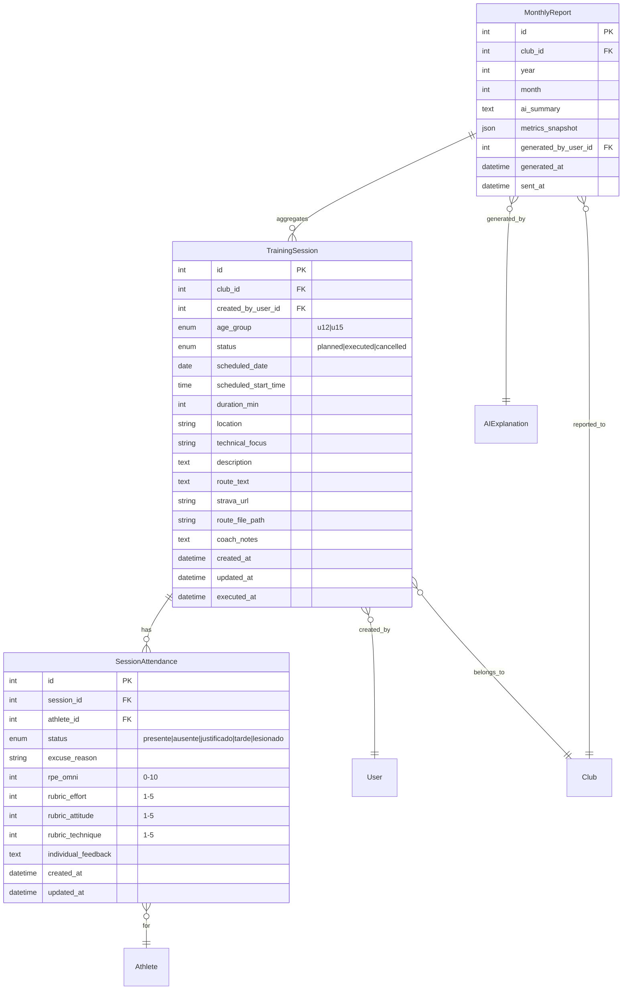
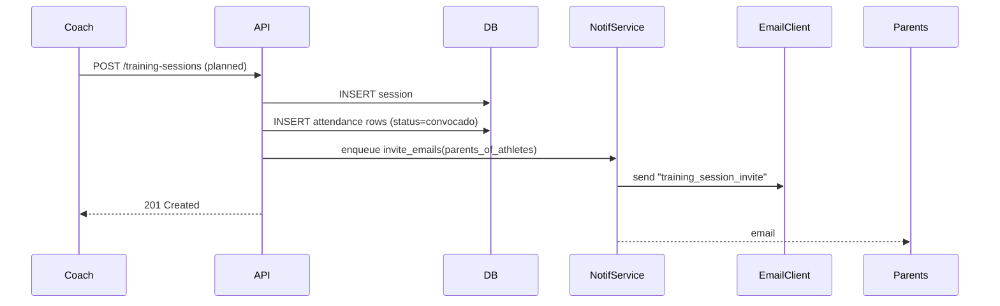
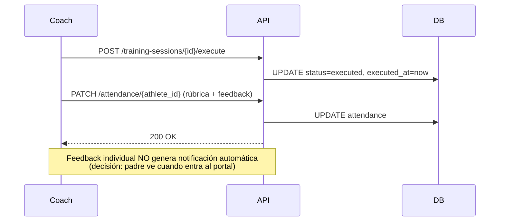
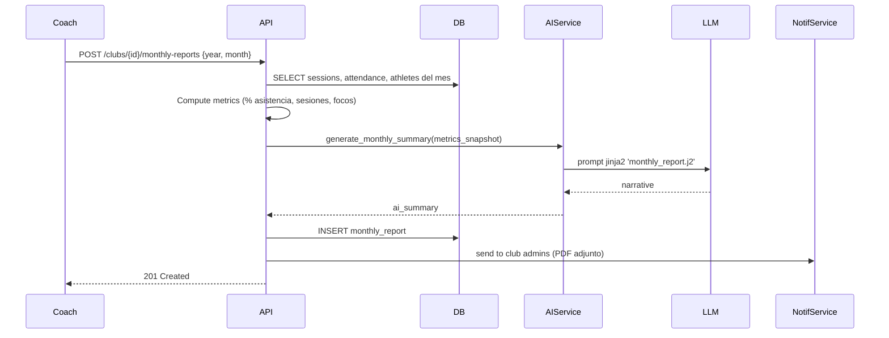

# Design — Módulo de Sesiones de Entrenamiento

**Fecha:** 2026-05-06
**Estado:** Diseño aprobado — pendiente implementación
**Origen:** Brainstorm respondido por el entrenador (Q1-Q7)

---

## 1. Contexto

El club no tiene módulo digital para registrar entrenamientos. Vacío vs marco teórico §2-§5 (capacidades, técnica, periodización). El entrenador trabaja con cuaderno + planilla suelta. Se requiere:

- Plan + ejecución de sesiones por grupo de edad (10-12 / 13-15).
- Asistencia con estados y razones.
- Retroalimentación estructurada por atleta (rúbrica + RPE + comentario).
- Recorrido: texto, link Strava del entrenador, upload `.gpx`/`.fit`.
- Reporte mensual al club con resumen generado por IA.
- Acceso lectura para padres a las sesiones de su atleta.
- Notificación a padres cuando se programa sesión futura (Q7).

### Respuestas confirmadas del entrenador

| Q | Respuesta | Implicación |
|---|---|---|
| Q1 | (b) una sesión por grupo de edad | `age_group` enum en sesión |
| Q2 | (b)+(c) estados + razón texto | `AttendanceStatus` enum + `excuse_reason` |
| Q3 | (c) rúbrica 3 sliders 1-5 + comentario + RPE | Campos estructurados + libre |
| Q4 | (a)+(b)+(c) texto + Strava link + upload | `route_text`, `strava_url`, `route_file` |
| Q5 | Reporte mensual con módulo IA | Nuevo `MonthlyReportGenerator` use case |
| Q6 | (a)+(b) padre ve sesiones + descripción | RBAC parent: read sesión + filter por atleta |
| Q7 | (b) plan + ejecución + notificación | Estado `planned/executed/cancelled` + email padres |

### Restricción Strava (research previo)

- ToS Nov 2024: app de terceros no puede mostrar datos de atleta a otra persona. **Coach NO lee Strava de atletas.**
- Edad mínima Strava 13 (16 EU). Atletas 10-12 fuera.
- Único uso permitido: link manual a actividad pública del entrenador como referencia de recorrido.
- Upload `.gpx`/`.fit` propio del coach: 100% legal, sin OAuth, age-agnóstico.

---

## 2. Decisiones de diseño

### 2.1 Modelo: planificación + ejecución unificadas
Una entidad `TrainingSession` que pasa por estados `planned → executed → cancelled`. Evita duplicación entre tabla "plan" y "log". Al ejecutar, el coach completa los campos de ejecución sobre el mismo registro.

### 2.2 Asistencia como tabla puente (`SessionAttendance`)
Relación N:N entre `TrainingSession` y `Athlete` con metadata: estado, razón, RPE, rúbrica, comentario. Permite que la lista de atletas convocados se materialice al planificar y se completen los campos de ejecución después.

### 2.3 Retroalimentación: rúbrica de 3 ejes
Acordada con el entrenador alineada a marco teórico §6:
1. **Esfuerzo** (RPE → derivado, no manual; OMNI 0-10) — convertido también a 1-5 para reporte.
2. **Actitud** (1-5) — disposición, respeto, trabajo en equipo.
3. **Técnica** (1-5) — ejecución del foco técnico de la sesión.

Comentario texto libre ≤500 chars.

> **Privacidad:** la rúbrica individual NUNCA va al reporte agregado del club. Solo la ve coach + padre del atleta.

### 2.4 Reporte mensual con IA — anti-suplantación de juicio
- IA genera **resumen narrativo agregado** (no juicio individual).
- Inputs: # sesiones del mes, % asistencia por atleta, focos técnicos cubiertos, observaciones generales del coach.
- Output: 2-3 párrafos para el club + tabla de asistencia.
- **Nunca** generar feedback individual con IA — eso lo escribe el coach.
- Reusa `services/ai/use_cases/` (mismo patrón de `phv_explainer.py`).

### 2.5 Notificación a padres (Q7)
Cuando coach crea sesión `planned` → email a padres de atletas convocados con: fecha/hora, lugar, foco técnico, qué llevar. Reusa `services/notification/`. Plantilla nueva `training_session_invite`.

### 2.6 Recorrido: trío opcional, validación al guardar
- `route_text` (free text, máx 500 chars) — siempre.
- `strava_url` (validar regex `https://www.strava.com/activities/\d+`) — opcional.
- `route_file` (`.gpx`, `.fit`, máx 5 MB) — opcional, almacenamiento local primero, S3/R2 luego.

Renderizado de `.gpx` en frontend con `leaflet` + `leaflet-gpx`. `.fit` se convierte a `.gpx` server-side en una segunda fase (out of MVP).

---

## 3. Modelo de datos

### 3.1 Diagrama ER



### 3.2 Enums nuevos (Python)

```python
class AgeGroup(str, Enum):
    U12 = "u12"   # 10-12 años
    U15 = "u15"   # 13-15 años

class SessionStatus(str, Enum):
    PLANNED = "planned"
    EXECUTED = "executed"
    CANCELLED = "cancelled"

class AttendanceStatus(str, Enum):
    PRESENTE = "presente"
    AUSENTE = "ausente"
    JUSTIFICADO = "justificado"
    TARDE = "tarde"
    LESIONADO = "lesionado"
```

### 3.3 Reglas e invariantes

- `scheduled_date` no puede ser pasada al crear con `status=planned`.
- `executed_at` solo se setea cuando `status=executed`.
- `rpe_omni`, rubric_*, `individual_feedback` solo válidos cuando attendance.status ∈ {presente, tarde}.
- `excuse_reason` requerido cuando attendance.status ∈ {ausente, justificado, lesionado}.
- `MonthlyReport (club_id, year, month)` único.
- Borrado de sesión: soft delete (`status=cancelled`), nunca hard delete con asistencia registrada.

### 3.4 Índices clave

- `training_session(club_id, scheduled_date)` — listar mes
- `training_session(club_id, age_group, scheduled_date)` — filtrar grupo
- `session_attendance(session_id, athlete_id)` UNIQUE — un registro por atleta por sesión
- `session_attendance(athlete_id, created_at)` — historial atleta
- `monthly_report(club_id, year, month)` UNIQUE

---

## 4. Contrato de API (REST)

Convención existente del proyecto: `/api/v1/...`, JWT Bearer, RBAC vía `services/permissions.py`.

### 4.1 Sesiones

| Método | Endpoint | Roles | Descripción |
|---|---|---|---|
| `POST` | `/training-sessions` | coach, admin | Crear sesión (planned). Dispara notif padres. |
| `GET` | `/training-sessions` | coach, admin, parent | Listar. Query: `from`, `to`, `age_group`, `status`, `athlete_id` (parent → forzado a sus atletas) |
| `GET` | `/training-sessions/{id}` | coach, admin, parent (si su atleta convocado) | Detalle |
| `PATCH` | `/training-sessions/{id}` | coach, admin | Actualizar (incl. cambio status) |
| `POST` | `/training-sessions/{id}/execute` | coach, admin | Marca `executed`, congela `executed_at` |
| `DELETE` | `/training-sessions/{id}` | coach, admin | Soft delete → `cancelled` |
| `POST` | `/training-sessions/{id}/route-file` | coach, admin | Upload `.gpx`/`.fit` (multipart) |

### 4.2 Asistencia

| Método | Endpoint | Roles | Descripción |
|---|---|---|---|
| `PUT` | `/training-sessions/{id}/attendance` | coach, admin | Bulk upsert convocatoria (lista de athlete_ids) |
| `PATCH` | `/training-sessions/{id}/attendance/{athlete_id}` | coach, admin | Actualiza estado/razón/rúbrica/feedback de UN atleta |
| `GET` | `/athletes/{id}/attendance` | coach, admin, parent (su atleta) | Historial asistencia atleta |

### 4.3 Reporte mensual

| Método | Endpoint | Roles | Descripción |
|---|---|---|---|
| `POST` | `/clubs/{id}/monthly-reports` | coach, admin | Genera reporte mes (body: `year`, `month`). Dispara IA + notif. |
| `GET` | `/clubs/{id}/monthly-reports` | coach, admin | Lista |
| `GET` | `/clubs/{id}/monthly-reports/{year}/{month}` | coach, admin, parent (agregado, sin individual) | Detalle |
| `POST` | `/clubs/{id}/monthly-reports/{id}/send` | coach, admin | Re-envía email |

### 4.4 Schemas Pydantic (resumen)

```python
class TrainingSessionCreate(BaseModel):
    age_group: AgeGroup
    scheduled_date: date
    scheduled_start_time: time
    duration_min: int = Field(ge=15, le=240)
    location: str = Field(max_length=200)
    technical_focus: str = Field(max_length=200)
    description: str = Field(max_length=2000)
    route_text: str | None = Field(default=None, max_length=500)
    strava_url: HttpUrl | None = None
    convocados_athlete_ids: list[int]

class AttendanceUpdate(BaseModel):
    status: AttendanceStatus
    excuse_reason: str | None = Field(default=None, max_length=300)
    rpe_omni: int | None = Field(default=None, ge=0, le=10)
    rubric_effort: int | None = Field(default=None, ge=1, le=5)
    rubric_attitude: int | None = Field(default=None, ge=1, le=5)
    rubric_technique: int | None = Field(default=None, ge=1, le=5)
    individual_feedback: str | None = Field(default=None, max_length=500)

    @model_validator(mode="after")
    def _validate_consistency(self) -> "AttendanceUpdate":
        present = self.status in (AttendanceStatus.PRESENTE, AttendanceStatus.TARDE)
        if not present and (self.rpe_omni is not None or any(...)):
            raise ValueError("rúbrica/RPE solo si presente o tarde")
        if not present and not self.excuse_reason:
            raise ValueError("razón requerida si no asiste")
        return self
```

---

## 5. Flujos clave

### 5.1 Coach planifica sesión → notificación a padres



### 5.2 Coach ejecuta sesión + feedback individual



### 5.3 Reporte mensual con IA



---

## 6. Permisos (RBAC)

Extender `services/permissions.py` con:

| Acción | Admin | Coach (mismo club) | Parent (atleta convocado) | Athlete |
|---|---|---|---|---|
| Crear sesión | ✅ | ✅ | ❌ | ❌ |
| Editar sesión | ✅ | ✅ | ❌ | ❌ |
| Ver sesión (detalle general) | ✅ | ✅ | ✅ (si su atleta convocado) | ❌ |
| Ver feedback individual atleta X | ✅ | ✅ | ✅ (solo su atleta) | ❌ |
| Marcar asistencia / rúbrica | ✅ | ✅ | ❌ | ❌ |
| Generar reporte mensual | ✅ | ✅ | ❌ | ❌ |
| Ver reporte mensual (agregado) | ✅ | ✅ | ✅ | ❌ |

> Atletas (10-15) NO entran al sistema directo (CLAUDE.md: `can_login=false` por defecto).

---

## 7. Integración módulo IA (Q5)

### 7.1 Nuevo use case

```
backend/app/services/ai/use_cases/monthly_report.py
backend/app/services/ai/prompts/monthly_report.j2
```

Patrón idéntico a `phv_explainer.py`:
1. `ContextBuilder` construye `MonthlyReportContext` desde DB (privacy-safe: sin nombres en prompt si feature flag).
2. `Prompt` jinja2 con `system_principles.md` + datos agregados.
3. `Provider` (OpenAI/Anthropic, ya configurado en `factory.py`).
4. `Guardrails` valida output (no juicio individual, máx 500 palabras, sin recomendaciones médicas).
5. Persiste en `ai_explanations` (modelo existente) con `kind='monthly_report'`.

### 7.2 Privacidad (CLAUDE.md)

- Prompt usa **edades** (no DOB), **iniciales o IDs anonimizados** (no nombres completos), **agregados** (no historiales clínicos).
- Output revisado por guardrails antes de persistir.
- Logs de prompts NUNCA con datos PII.

---

## 8. Frontend (resumen, detalle en workflow)

Rutas nuevas:
```
/training/sessions                 (coach: lista + filtros)
/training/sessions/new             (coach: form planificación)
/training/sessions/:id             (coach: detalle + asistencia)
/training/sessions/:id/edit        (coach: editar)
/training/reports                  (coach: lista reportes mes)
/training/reports/:year/:month     (coach: detalle reporte)

/parents/training/sessions         (parent: lista sesiones de sus atletas)
/parents/training/sessions/:id     (parent: detalle filtrado)
```

Componentes clave:
- `SessionForm` (RHF + Zod) — planificar/editar
- `AttendanceTable` — bulk edit asistencia con keyboard shortcuts
- `RubricSliders` — 3 sliders + RPE + textarea
- `RouteViewer` — leaflet con `.gpx`
- `MonthlyReportView` — tabla métricas + narrativa IA
- `ParentSessionList` — vista solo lectura

---

## 9. Atributos no funcionales

| Atributo | Decisión |
|---|---|
| Performance | Listado mes < 200ms con índice `(club_id, scheduled_date)` |
| Almacenamiento `.gpx`/`.fit` | Local `static/uploads/routes/` MVP. R2/S3 fase 2. |
| Tamaño máx archivo | 5 MB |
| Privacidad | Feedback individual NUNCA en reporte agregado. IA nunca recibe nombres completos. |
| Idempotencia | `MonthlyReport` UNIQUE (club, year, month) — POST repetido = 409 |
| Auditoría | `created_at`/`updated_at` en todas las tablas. Considerar tabla audit log fase 2. |
| Tests | pytest (backend) + vitest + RTL (frontend). Cobertura mínima 80% en services. |

---

## 10. Riesgos y mitigaciones

| Riesgo | Severidad | Mitigación |
|---|---|---|
| Coach olvida marcar asistencia → reporte mensual incompleto | ALTA | Cron diario que avise sesiones executed sin asistencia completa |
| IA genera juicio individual en reporte | ALTA | Guardrails + prompt explícito + revisión coach antes de enviar |
| Padre ve datos de otro atleta | CRÍTICA | RBAC con tests exhaustivos (`test_session_privacy.py`) |
| Strava cambia ToS o rate limits | MEDIA | Strava solo es link opcional, no fuente de datos |
| `.gpx` malicioso (XXE) | MEDIA | Parser seguro `gpxpy` con `defusedxml` |
| Notificación masiva spam padres | MEDIA | Throttle 1 email/atleta/día. Preferencias opt-out. |
| Reporte IA cuesta tokens cada mes | BAJA | Cache resultado en `monthly_report.ai_summary`. Solo regenera si re-solicita. |

---

## 11. Out of scope (MVP — Fase 1 de este módulo)

- Conversión `.fit` → `.gpx` server-side (postponed sprint 2)
- Integración Intervals.icu (sprint 3)
- Vista calendario tipo agenda (lista + filtros suficiente MVP)
- Edición masiva sesiones (recurrentes)
- Adjuntos foto/video sesión
- Push notifications móvil (solo email)
- Plantillas de sesión reutilizables ("favoritos")

---

## 12. Open questions

- ¿Qué proveedor LLM se usa actualmente en `factory.py`? (validar costo mensual estimado).
- ¿Padres reciben PDF del reporte o solo lectura web? (asumido: solo web para MVP).
- ¿Lugar/sede tiene catálogo cerrado o texto libre? (asumido: texto libre).
- ¿Sesiones recurrentes (todos los martes) en MVP o sprint 2? (asumido: sprint 2).

---

## 13. Próximo paso

Ver `workflow.md` en esta misma carpeta para plan de implementación paso a paso.
