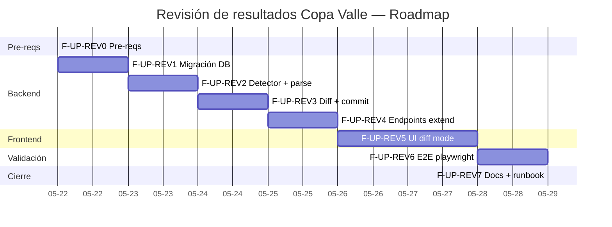
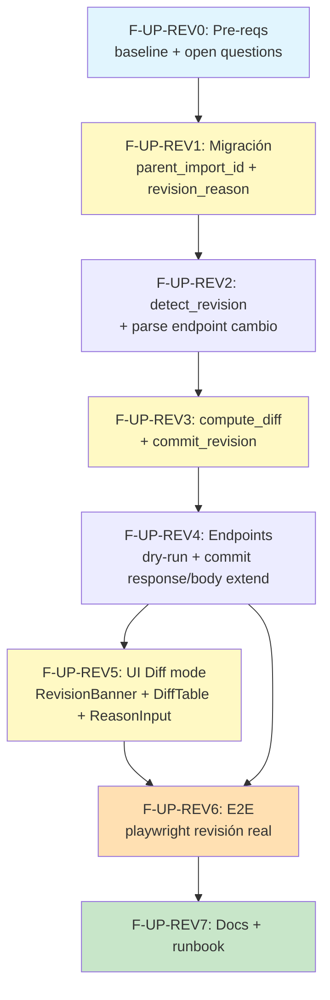

# Implementation Workflow — Manejo integral de revisiones de resultados

**Source:** `docs/10-race-results/revision-design.md` (23 decisiones cerradas) + reuso de patrones F-UP (`upload-design.md` + `upload-workflow.md`)
**Strategy:** Systematic
**Depth:** Deep
**Generated:** 2026-05-21
**Estimated total:** ~5.5 días-dev paralelizado | secuencial: ~7 días
**Status:** Listo para ejecutar tras aprobar 7 open questions del coach (defaults documentados)
**Branch sugerido:** `race-results-v2-foundation` (continuar) o feature branch dedicado `feat/race-import-revisions`
**Depende de:** F-UP (upload UI) mergeado a `main`

---

## Requirements summary

### Funcionales

- Detectar automáticamente que un PDF subido es **revisión** de una válida ya commiteada.
- Computar **diff completo** (create / update / delete / unchanged) entre PDF nuevo y resultados persistidos.
- UI step 2 cambia a modo `diff` con tabla revisable y banner.
- Aplicar revisión transaccionalmente con audit trail completo en `RaceResultRevision`.
- Soft-delete (`deleted_at`) de resultados removidos. NUNCA hard-delete.
- `revision_reason` obligatorio si hay deletes (validation app-level).
- Compatibilidad CLI: `scripts/ingest_race.py` sigue funcionando (aborta limpio si detecta revisión, no la procesa).

### No-funcionales

| Atributo | Target |
|---|---|
| p50 cálculo diff | <500ms para N<300 competitors |
| p95 commit revisión | <30s (similar a F-UP) |
| Coverage backend `diff.py` + `commit_revision` | ≥90% |
| Coverage frontend componentes nuevos (`DiffTable`, `RevisionBanner`, etc.) | ≥85% |
| Tests F-UP existentes | 100% verdes durante toda la fase |
| Tests F1.7 race (305) | 100% verdes |
| 0 violaciones axe-core en DiffTable y banner | sentinela accesibilidad |
| Audit trail completo | 100% revisions tienen `RaceResultRevision` entry |
| 0 logs con PII (revision_reason solo en BD, nunca log) | sentinela inviolable |

### Out of scope MVP

- ❌ Override fila por fila del diff en DiffTable (toda o nada).
- ❌ Endpoint `GET /imports/{id}/revisions` para listar revisiones de un import.
- ❌ UI para visualizar historial de revisiones de un competitor / evento.
- ❌ Notificación a padres ante revisión.
- ❌ Reversión semántica de revisión (botón "Deshacer revisión"). Reversión via SQL manual documentada en runbook.
- ❌ Diff de GENERAL (solo RESULTADOS).
- ❌ Soporte multi-coach colaborativo concurrente más allá del lock pesimista básico.

---

## Roadmap visual



---

## DAG de dependencias



**Camino crítico:** REV0 → REV1 → REV2 → REV3 → REV4 → REV5 → REV6 → REV7 (~5.5 días).

**Paralelización 1 backend + 1 frontend:**
- Tras REV4, frontend (REV5) y backend tests integración corren en paralelo.
- Backend tests de REV3 pueden ejecutarse mientras frontend prepara mocks JSON para REV5.

**Reducción real con paralelización:** ~5.5 días (vs 7 secuencial).

---

## Fase F-UP-REV0 — Pre-requisitos

**Tiempo:** 0.25 día | **Riesgo:** Bajo | **Bloquea:** todo lo demás

### Prerequisitos

- [x] F-UP (upload UI) mergeado a `main` y desplegado.
- [x] Migración `e8f9a0b1c2d3_race_imports_upload_ui_delta` aplicada en prod.
- [x] Tests F-UP y F1.7 verdes (baseline ≥358 backend + ≥37 frontend).
- [ ] Validar 7 open questions del coach (`revision-design.md` §9). Defaults documentados como aceptables.
- [ ] Revisar modelo `RaceImport` actual para confirmar nombre exacto de `committed_at` (puede ser `imported_at`, `updated_at`, o requerir migración adicional).

### Tareas atómicas

| # | Tarea | Agente | Comando | Deliverable |
|---|---|---|---|---|
| 0.1 | Sesión 10 min con coach validando Q1-Q7 design §9. Documentar decisiones | system-architect | manual | `revision-design.md` §9 actualizado con "validada YYYY-MM-DD" |
| 0.2 | Inspect `backend/app/models/race_import.py` para confirmar timestamp `committed_at` — si no existe, planificar agregarlo en REV1 | backend-architect | `grep -n "committed_at\|imported_at\|updated_at" backend/app/models/race_import.py` | Confirmación: campo existe / no existe + decisión |
| 0.3 | Verificar baseline tests verdes pre-arranque | quality-engineer | `cd backend && pytest tests/services/race/ tests/routers/test_race_imports.py` | ≥358 verdes |
| 0.4 | Verificar tests frontend F-UP verdes | quality-engineer | `cd frontend && npm run test -- race-upload` | ≥37 verdes |
| 0.5 | Verificar no hay PR abiertos tocando `RaceImport`, `RaceResult`, `RaceResultRevision`, `ingestor.py` | devops-architect | `gh pr list --search "RaceImport in:title,body"` | 0 PRs en conflicto, o sincronizar antes de arrancar |
| 0.6 | Crear branch `feat/race-import-revisions` desde `main` (si no se usa `race-results-v2-foundation`) | devops-architect | `git checkout -b feat/race-import-revisions main` | Branch activo |

### Criterio de éxito

```bash
git branch --show-current                                            # feat/race-import-revisions o branch activo
cd backend && pytest tests/services/race/ tests/routers/test_race_imports.py -x   # ≥358 verdes
cd ../frontend && npm run test -- race-upload                          # ≥37 verdes
# Coach validó las 7 open questions o aceptó defaults
```

### Rollback

- Sin cambios destructivos. `git checkout main` para abandonar la fase si pre-reqs no se cumplen.

### Decisiones tácticas

- **DTR-1:** Si Q1-Q7 cambian alguna decisión fundamental → re-redactar design §1-7 antes de arrancar REV1. Estimado +0.25 día.
- **DTR-2:** Si `committed_at` no existe en `RaceImport` → agregar columna `committed_at TIMESTAMP NULL` en la misma migración REV1 (sin coste extra).

### Agente principal: **system-architect** (validación) + **devops-architect** (branch)

---

## Fase F-UP-REV1 — Migración DB + modelo

**Tiempo:** 0.5 día | **Riesgo:** Bajo (columnas nullable, FK self-ref reversible) | **Depende de:** REV0

### Prerequisitos

- REV0 completo
- Snapshot dev DB pre-migración (`mysqldump`)

### Tareas atómicas

| # | Tarea | Agente | Comando | Deliverable |
|---|---|---|---|---|
| 1.1 | Crear migración Alembic `f9a0b1c2d3e4_race_imports_revision_delta` (down_revision = `e8f9a0b1c2d3`) según design §2.5 | backend-architect | `cd backend && alembic revision -m "race_imports revision delta"` | `backend/alembic/versions/f9a0b1c2d3e4_race_imports_revision_delta.py` con: ADD `parent_import_id` (FK self-ref ON DELETE SET NULL), ADD `revision_reason VARCHAR(300) NULL`, CREATE INDEX `ix_race_imports_parent_id`. Reversible. |
| 1.2 | (Conditional DTR-2) Agregar `committed_at TIMESTAMP NULL` si no existe + backfill `UPDATE race_imports SET committed_at = updated_at WHERE status='committed' AND committed_at IS NULL` | backend-architect | misma migración | Columna agregada + backfill |
| 1.3 | Actualizar modelo `backend/app/models/race_import.py`: agregar `parent_import_id: Mapped[Optional[int]]` con `relationship` self-ref + property `is_revision -> bool` derivada | backend-architect | `/sc:implement` | Modelo actualizado, tipos correctos, relación bidireccional opcional `parent: Mapped[Optional["RaceImport"]]` y `revisions: Mapped[list["RaceImport"]]` |
| 1.4 | Aplicar migración local | backend-architect | `cd backend && alembic upgrade head` | Sin errores |
| 1.5 | Verificar downgrade reversible | quality-engineer | `cd backend && alembic downgrade -1 && alembic upgrade head` | Idempotente |
| 1.6 | Tests modelo: instanciar `RaceImport` con `parent_import_id`, verificar relación `parent` cargada, verificar `is_revision` property | quality-engineer | `/sc:test` | `tests/models/test_race_import_revision.py` ≥4 tests verdes |
| 1.7 | Suite F-UP + F1.7 sigue verde post-migración | quality-engineer | `cd backend && pytest tests/services/race/ tests/routers/test_race_imports.py tests/models/` | 100% verde |
| 1.8 | Verificar imports F-UP existentes quedan con `parent_import_id=NULL` y `revision_reason=NULL` (defaults safe) | quality-engineer | `mysql -e "SELECT id, parent_import_id, revision_reason FROM race_imports"` | Todos NULL para imports previos |

### Criterio de éxito

```bash
cd backend
alembic upgrade head                                          # OK
alembic downgrade -1 && alembic upgrade head                  # reversible
pytest tests/models/test_race_import_revision.py -x           # ≥4 verdes
pytest tests/services/race/ tests/routers/test_race_imports.py -x  # 100% verde
mysql -e "DESCRIBE race_imports" | grep -E "parent_import_id|revision_reason"
# → ambos columnas listadas
```

### Rollback

```bash
cd backend
alembic downgrade e8f9a0b1c2d3
git revert <commit-fase-rev1>
```

### Agente principal: **backend-architect** + **quality-engineer**

---

## Fase F-UP-REV2 — `detect_revision` + cambio en `POST /parse`

**Tiempo:** 1 día | **Riesgo:** Medio (cambio de comportamiento en endpoint existente) | **Depende de:** REV1

### Prerequisitos

- Migración aplicada (REV1)
- Entendimiento de `parse` endpoint actual (`backend/app/routers/race_imports.py:280-330`)

### Tareas atómicas

| # | Tarea | Agente | Comando | Deliverable |
|---|---|---|---|---|
| 2.1 | Crear módulo `backend/app/services/race/revision.py` con función `detect_revision(db, series_id, valida_num) -> RevisionDetection | None` según design §1.2 | backend-architect | `/sc:implement` | Función pura testeable. NO depende de FastAPI. |
| 2.2 | Crear schema Pydantic `RevisionDetection` en `backend/app/schemas/race_imports.py` con campos: `is_revision`, `parent_event_id`, `parent_import_id`, `prior_committed_at`, `prior_imported_by_user_id`, `prior_imported_by_name` | backend-architect | `/sc:implement` | Schema agregado |
| 2.3 | Modificar `ImportParseResponse` (mismo archivo): agregar `will_be_revision: bool = False`, `parent_event_id`, `parent_import_id`, `prior_committed_at`, `prior_imported_by_name` (todos optional) | backend-architect | `/sc:implement` | Schema extendido. Sin breaking change. |
| 2.4 | Modificar endpoint `POST /imports/parse` (`backend/app/routers/race_imports.py`): tras validar SHA y antes del 409, llamar `detect_revision`. Si retorna detection: NO retornar 409 si SHA distinto, retornar 200 con `will_be_revision=true`. Si SHA byte-exacto idéntico committed: seguir retornando 409. | backend-architect | `/sc:implement` | Endpoint actualizado, lógica de branching clara |
| 2.5 | Join a `User.full_name` para poblar `prior_imported_by_name` (1 query adicional) | backend-architect | `/sc:implement` | Query select_in con User |
| 2.6 | Tests unitarios `detect_revision`: caso primer import (None), caso revisión (detection), caso F1.7 legacy `event_id=NULL` (None), caso solo pending sin committed (None), caso multiple committeds → retorna el más reciente | quality-engineer | `/sc:test` | `tests/services/race/test_revision_detect.py` ≥8 tests verdes |
| 2.7 | Tests router `POST /parse`: caso SHA byte-exacto duplicado → 409 (regresión); caso `(series, valida)` con SHA distinto → 200 con `will_be_revision=true`; caso primer import → 200 con `will_be_revision=false` | quality-engineer | `/sc:test` | `tests/routers/test_race_imports.py` ≥6 nuevos tests, todos los antiguos verdes |
| 2.8 | Suite F-UP completa verde post-cambio | quality-engineer | `cd backend && pytest tests/routers/ tests/services/race/` | 100% verde |

### Criterio de éxito

```bash
cd backend
pytest tests/services/race/test_revision_detect.py -x         # ≥8 verdes
pytest tests/routers/test_race_imports.py -x                  # 100% verde (incluye ≥6 nuevos)
pytest --cov=app.services.race.revision --cov-report=term-missing tests/services/race/test_revision_detect.py
# Coverage ≥95%
```

### Rollback

`git revert <commits-fase-rev2>` — endpoint vuelve a 409. Sin cambios DB.

### Decisiones tácticas

- **DTR-3:** `detect_revision` retorna `RevisionDetection | None`, no tira excepción. Razón: integración limpia con branching en endpoint.
- **DTR-4:** Si la verificación de `(series_id, valida_num)` falla porque el cliente no envió esos campos en form, `detect_revision` retorna None (treat como primer import). Backward compat con clients antiguos.

### Agente principal: **backend-architect** + **quality-engineer**

---

## Fase F-UP-REV3 — `compute_diff` + `commit_revision`

**Tiempo:** 1 día | **Riesgo:** Medio (lógica diff es source de bugs típicos) | **Depende de:** REV2

### Prerequisitos

- `detect_revision` funcional (REV2)
- Entender modelos `RaceResult`, `RaceCompetitor`, `RaceResultRevision`

### Tareas atómicas

| # | Tarea | Agente | Comando | Deliverable |
|---|---|---|---|---|
| 3.1 | Schemas Pydantic en `backend/app/schemas/race_imports.py`: `DiffRow`, `DiffSummary`, `ParsedRowPreview`, `ResultPreview` según design §3.4-3.5 | backend-architect | `/sc:implement` | Schemas listos |
| 3.2 | Función `compute_diff(db, event_id, results_by_category) -> tuple[DiffSummary, list[DiffRow]]` en `backend/app/services/race/revision.py` según design §3.2 | backend-architect | `/sc:implement` | Función pura: 1 query persistidos + iteración + fuzzy fallback `rapidfuzz.partial_ratio >= 92` |
| 3.3 | Helper `_load_persisted_results(db, event_id) -> dict[(cat_code, normalized_name), RaceResult]` (filtra `deleted_at IS NULL`, join a RaceCategory + RaceCompetitor) | backend-architect | `/sc:implement` | Helper testeable |
| 3.4 | Helper `_fuzzy_match(target_normalized, candidates_in_same_cat) -> Optional[str]` con rapidfuzz | backend-architect | `/sc:implement` | Función pura |
| 3.5 | Helper `_compute_field_diffs(persisted: RaceResult, parsed: ResultsRow) -> dict[str, dict]` — compara `position, status, race_time_ms, laps_behind, points_awarded`. Maneja parse_time → ms para comparación correcta | backend-architect | `/sc:implement` | Función pura |
| 3.6 | Función `commit_revision(db, parse_import, event_meta, revision_reason, current_user) -> CommitRevisionResult` en `backend/app/services/race/revision.py` según design §4.2 | backend-architect | `/sc:implement` | Transaccional con `SELECT ... FOR UPDATE` sobre RaceEvent. Soft-delete via `deleted_at`. Una `RaceResultRevision` por change. Promueve `RaceImport` a committed con `parent_import_id` y `revision_reason`. |
| 3.7 | Helper `_serialize_result_snapshot(result: RaceResult) -> dict` para `diff_json` (JSON-friendly: enums.value, datetimes ISO) | backend-architect | `/sc:implement` | Función pura |
| 3.8 | Validation app-level: si `any(r.action=='delete')` y `not revision_reason` → raise `ValueError("revision_reason requerido")` (caller traduce a 400) | backend-architect | `/sc:implement` | Validación en `commit_revision` |
| 3.9 | Tests unitarios `compute_diff`: happy path (3 creates + 2 updates + 1 delete + 5 unchanged), match exacto, fuzzy fallback, cambio de categoría (delete+create), 0 cambios (todo unchanged), competitor reaparece post-soft-delete | quality-engineer | `/sc:test` | `tests/services/race/test_compute_diff.py` ≥12 tests verdes |
| 3.10 | Tests unitarios `commit_revision`: happy path, rollback ante delete sin reason, lock (mockear `FOR UPDATE`), audit trail verificado en `race_result_revisions`, soft-delete preserva `status` original | quality-engineer | `/sc:test` | `tests/services/race/test_commit_revision.py` ≥10 tests verdes con `FakeAsyncSession` |
| 3.11 | Test integración con PDF real: re-parse `valida_iv_2026_resultados.pdf` artificalmente modificado (1 posición cambiada) → diff retorna exactamente 1 update | quality-engineer | `/sc:test` | Test usa fixture base + monkeypatch para alterar 1 fila |
| 3.12 | Suite race completa verde | quality-engineer | `cd backend && pytest tests/services/race/` | 100% verde + ≥22 nuevos |

### Criterio de éxito

```bash
cd backend
pytest tests/services/race/test_compute_diff.py tests/services/race/test_commit_revision.py -x   # ≥22 verdes
pytest --cov=app.services.race.revision --cov-report=term-missing tests/services/race/   # ≥90%
pytest tests/services/race/ -x                              # 100% verde
```

### Rollback

`git revert <commits-fase-rev3>` — sin cambios DB. Endpoints aún funcionan en modo no-revisión.

### Decisiones tácticas

- **DTR-5:** `compute_diff` retorna `DiffRow` ordenados: `deletes` primero (atención visual), luego `updates`, luego `creates`, luego `unchanged` al final. UI puede re-ordenar si quiere.
- **DTR-6:** `parse_time` (de `normalizer.py`) retorna `(status, race_time_ms, laps_behind)`. Reusar en `_compute_field_diffs` para parsear `time_raw` del PDF nuevo y comparar contra `race_time_ms` ya persistido. Evita inconsistencias de comparar string vs int.
- **DTR-7:** `SELECT ... FOR UPDATE` con `nowait=True` (timeout 5s) en MySQL para evitar wait indefinido. Si lock falla → 423 Locked.

### Agente principal: **backend-architect** + **quality-engineer**

---

## Fase F-UP-REV4 — Endpoints `dry-run` + `commit` extendidos

**Tiempo:** 0.5 día | **Riesgo:** Bajo (mayoría es wiring) | **Depende de:** REV3

### Prerequisitos

- `compute_diff` + `commit_revision` funcionales (REV3)
- Schemas extendidos listos

### Tareas atómicas

| # | Tarea | Agente | Comando | Deliverable |
|---|---|---|---|---|
| 4.1 | Extender `ImportDryRunResponse` con `is_revision`, `parent_event_id`, `parent_import_id`, `prior_committed_at`, `prior_imported_by_name`, `diff_summary`, `diff_rows` (todos optional) | backend-architect | `/sc:implement` | Schema actualizado |
| 4.2 | Modificar endpoint `POST /imports/{parse_id}/dry-run`: invocar `detect_revision`. Si revisión → invocar `compute_diff` y popular `diff_*` en response. Si no → comportamiento F-UP intacto. | backend-architect | `/sc:implement` | Endpoint con branching. Tests existentes deben seguir pasando. |
| 4.3 | Extender `ImportCommitRequest` con `revision_reason: str | None` (max 300 chars) | backend-architect | `/sc:implement` | Schema actualizado |
| 4.4 | Modificar endpoint `POST /imports/{parse_id}/commit`: invocar `detect_revision`. Si revisión → invocar `commit_revision` (no `ingest_event`). Si no → flujo F-UP intacto. | backend-architect | `/sc:implement` | Endpoint con branching |
| 4.5 | Extender `ImportCommitResponse` con `is_revision`, `parent_import_id`, `revisions_created`, `creates`, `updates`, `deletes`, `unchanged` | backend-architect | `/sc:implement` | Schema actualizado |
| 4.6 | Mapear excepciones `commit_revision` a HTTP: `ValueError("revision_reason requerido")` → 400; lock timeout → 423; OperationalError → 500 con rollback | security-engineer | `/sc:implement` | Try/except amplio + logging estructurado |
| 4.7 | Tests router `POST /dry-run` revisión: caso happy con diff, caso PDF idéntico (diff vacío), caso fuzzy_matches > 0 (banner amarillo data) | quality-engineer | `/sc:test` | `tests/routers/test_race_imports.py` ≥4 nuevos tests |
| 4.8 | Tests router `POST /commit` revisión: caso happy, caso deletes sin reason → 400, caso lock timeout (mock) → 423, caso current_user es admin distinto al original → 200 (admin puede commitear revisiones de otros coaches) | quality-engineer | `/sc:test` | ≥6 nuevos tests |
| 4.9 | Sanitización log `revision_reason`: confirmar que solo loggea `len(reason)`, nunca el texto | security-engineer | `grep -rn "logger.info.*reason" backend/app/services/race/revision.py` | 0 logs con texto del reason |
| 4.10 | Suite endpoint completa verde | quality-engineer | `cd backend && pytest tests/routers/test_race_imports.py` | 100% verde |

### Criterio de éxito

```bash
cd backend
pytest tests/routers/test_race_imports.py -x                  # 100% verde + ≥10 nuevos
pytest --cov=app.routers.race_imports --cov-report=term-missing tests/routers/  # ≥90% en branches nuevas

# Smoke manual:
curl -X POST http://localhost:8000/api/race-analysis/imports/parse ...   # → 200 con will_be_revision=true
curl -X POST http://localhost:8000/api/race-analysis/imports/{id}/dry-run ...   # → 200 con diff_rows
curl -X POST http://localhost:8000/api/race-analysis/imports/{id}/commit -d '{"revision_reason":"test", ...}'   # → 200 con revisions_created>0
mysql -e "SELECT action, COUNT(*) FROM race_result_revisions GROUP BY action"
# → distribución create/update/delete coincide con stats response
```

### Rollback

`git revert <commits-fase-rev4>` — endpoints vuelven a comportamiento F-UP puro. DB intacta.

### Agente principal: **backend-architect** + **security-engineer** (sanitización logs) + **quality-engineer**

---

## Fase F-UP-REV5 — UI step 2 modo `diff`

**Tiempo:** 1.5 días | **Riesgo:** Medio (tabla virtualizada + branching de modo en wizard existente) | **Depende de:** REV4

### Prerequisitos

- Endpoints backend funcionando (REV4) o mocks JSON listos
- Wizard F-UP operativo

### Tareas atómicas

| # | Tarea | Agente | Comando | Deliverable |
|---|---|---|---|---|
| 5.1 | Extender tipos TS en `frontend/src/api/raceImports.ts`: agregar `WillBeRevisionInfo`, `DiffRow`, `DiffSummary`, `RevisionFields` (generar desde Pydantic via openapi-typescript o manual) | react-ui-engineer | `/sc:implement` | Tipos sincronizados |
| 5.2 | Extender `useImportParse`, `useImportDryRun`, `useImportCommit` hooks para soportar campos nuevos. Sin breaking change (campos opcionales) | react-ui-engineer | `/sc:implement` | Hooks tipados |
| 5.3 | Componente `RevisionBanner` (`frontend/src/components/race/RevisionBanner.tsx`) — banner amarillo con metadata import previo: fecha, coach, link a import_id | react-ui-engineer | `/sc:implement` | Componente con shadcn `Alert` variant warning |
| 5.4 | Componente `DiffSummaryCounts` (`frontend/src/components/race/DiffSummaryCounts.tsx`) — 4 badges coloreados (verde creates, amarillo updates, rojo deletes, gris unchanged) + tooltip explicativo | react-ui-engineer | `/sc:implement` | Componente con shadcn `Badge` |
| 5.5 | Componente `DiffTable` (`frontend/src/components/race/DiffTable.tsx`) — TanStack Table con columnas Acción/Categoría/Competidor/Cambios. Filtro "Solo cambios" (default ON per Q1). Virtualization (react-virtual) si rows>50. Render `fields_changed` como lista `key: before → after` | react-ui-engineer | `/sc:implement` | Componente con virtualization condicional |
| 5.6 | Componente `RevisionReasonInput` (`frontend/src/components/race/RevisionReasonInput.tsx`) — textarea controlled con counter (X/300) + validación required dinámica (si `summary.deletes > 0`) | react-ui-engineer | `/sc:implement` | Componente con React Hook Form integration o controlled state |
| 5.7 | Modificar `RaceUploadWizard` para branching de modo: `mode = parseResponse.will_be_revision ? 'diff' : 'matches'`. Step 2 renderiza componentes condicional | react-ui-engineer | `/sc:implement` | Wizard con branching limpio |
| 5.8 | EventMetaForm en modo `diff`: pre-llenar con datos del `RaceEvent` persistido (1 query GET o usar `parent_event_id` para fetch). Permitir edición. | react-ui-engineer | `/sc:implement` | Form con `defaultValues` desde API |
| 5.9 | Step 3 success en modo revisión: render `RevisionSuccessCard` con counts + reason + link a audit (futuro F2) | react-ui-engineer | `/sc:implement` | Card con stats |
| 5.10 | Manejo errores nuevos: 400 "revision_reason requerido" → toast inline en RevisionReasonInput; 423 Locked → modal "Otro entrenador está aplicando una revisión, espera 30s" | react-ui-engineer | `/sc:implement` | Error handling en wizard |
| 5.11 | Banner amarillo si `diff_summary.fuzzy_matches > 0` o `cross_category_moves > 0` → "Algunos matches son aproximados — revisa antes de confirmar." | react-ui-engineer | `/sc:implement` | Conditional banner en DiffTable header |
| 5.12 | Tests vitest: cada componente + branching wizard + virtualization (mock con 600 rows) + accessibility axe | quality-engineer | `/sc:test` | `frontend/tests/race-upload/*.test.tsx` ≥25 nuevos tests verdes, coverage ≥85%, 0 axe violations |

### Criterio de éxito

```bash
cd frontend
npm run test -- race-upload                                   # ≥62 verdes (37 F-UP + 25 nuevos)
npm run test:coverage -- src/components/race                  # ≥85%

# Smoke manual:
npm run dev   # localhost:5173 → /coach/race-analysis?tab=upload
# Sube valida_iv_2026_resultados.pdf modificado → wizard detecta revisión → banner amarillo
# Step 2 muestra diff table → filtro "Solo cambios" activo por default → 3 visibles
# Sin escribir reason + deletes → submit deshabilitado
# Escribir reason → submit habilitado → confirm → success card
```

### Rollback

`git revert <commits-fase-rev5>` — wizard vuelve a modo F-UP único. Tab funciona como antes.

### Decisiones tácticas

- **DTR-8:** Virtualization opcional según rowCount. Componente `DiffTable` decide internamente. No flag externo.
- **DTR-9:** Filtro "Solo cambios" es client-side. Backend retorna siempre todas las rows (incluyendo unchanged) para que el filtro sea reversible sin refetch.
- **DTR-10:** Si `parent_event_id` está set en parse response, fetch detalles del event vía endpoint existente `GET /api/race-analysis/events/{id}` (asumido existente; si no, agregar como subtarea de 5.8 con +0.25 día).

### Agente principal: **react-ui-engineer** + **quality-engineer**

---

## Fase F-UP-REV6 — E2E playwright + integración

**Tiempo:** 0.5 día | **Riesgo:** Medio (orquestación full-stack) | **Depende de:** REV5

### Prerequisitos

- Backend desplegado local con `docker compose up`
- Frontend en dev mode
- Fixture: PDF Válida IV original ya en repo + crear copia modificada

### Tareas atómicas

| # | Tarea | Agente | Comando | Deliverable |
|---|---|---|---|---|
| 6.1 | Crear fixture `tests/fixtures/race/valida_iv_2026_resultados_revisado.pdf` — copia del original con 1-2 posiciones cambiadas + 1 atleta removido (post-procesado con pdfplumber+reportlab o manual desde el original) | quality-engineer | manual | Fixture PDF |
| 6.2 | E2E happy revisión: ingestar Válida IV original → re-upload PDF revisado → assert banner detección → diff muestra deltas correctos → escribir reason → commit → assert `race_result_revisions` populado | quality-engineer | `playwright test race-revision-happy --headed` | Test verde |
| 6.3 | E2E deletes sin reason: re-upload con deletes → no escribir reason → submit deshabilitado → assert toast/inline error si forzar submit via JS | quality-engineer | `playwright test race-revision-no-reason` | Verde |
| 6.4 | E2E diff vacío: re-upload PDF idéntico lógicamente (mismo contenido, distinto SHA por metadata) → assert diff todo unchanged → submit habilitado con banner "Esta revisión no cambia ningún resultado" → commit registra import sin changes | quality-engineer | `playwright test race-revision-noop` | Verde |
| 6.5 | Test integración full-stack TestClient: invocar `/parse` → `/dry-run` (assert is_revision=true, diff_rows populado) → `/commit` (assert race_result_revisions count == sum(creates+updates+deletes)) | quality-engineer | `pytest tests/integration/test_race_revision_full_stack.py` | ≥3 tests verdes |
| 6.6 | Test concurrency: 2 commits revisión paralelos sobre mismo event → 1 succeeds, 1 obtiene 423 o waits-then-recomputes-diff (mock lock timeout) | quality-engineer | `pytest tests/integration/test_race_revision_concurrency.py` | Verde |
| 6.7 | Smoke test: query `SELECT * FROM race_result_revisions WHERE result_id IN (...) ORDER BY changed_at` muestra historial completo de una revisión | quality-engineer | manual mysql | Visualización audit trail OK |
| 6.8 | Verificar política: hard-delete de `RaceImport` parent (simulado en sandbox) → descendientes quedan con `parent_import_id=NULL`, no rompe queries de listado | quality-engineer | `/sc:test` | Test sandbox confirma FK ON DELETE SET NULL funciona |

### Criterio de éxito

```bash
cd frontend
npx playwright test race-revision --reporter=line             # 3 E2E verdes
cd ../backend
pytest tests/integration/test_race_revision_full_stack.py tests/integration/test_race_revision_concurrency.py -x  # ≥4 verdes
```

### Rollback

E2E tests no afectan prod. `git revert` si necesario.

### Agente principal: **quality-engineer**

---

## Fase F-UP-REV7 — Docs + runbook + producción

**Tiempo:** 0.25 día | **Riesgo:** Bajo | **Depende de:** REV6

### Prerequisitos

- F-UP-REV6 verde
- PR aprobado y mergeado a `main`

### Tareas atómicas

| # | Tarea | Agente | Comando | Deliverable |
|---|---|---|---|---|
| 7.1 | Actualizar `CLAUDE.md` sección "Estado de implementación" agregando tabla "Módulo Revisión de Resultados (F-UP-REV)" con pasos 1-7 marcados ✅ | devops-architect | `/sc:document` | CLAUDE.md actualizado |
| 7.2 | Crear `docs/10-race-results/revision-runbook.md` con: cómo aplicar una revisión paso a paso (coach), cómo revertir una revisión vía SQL (admin), cómo investigar audit trail, troubleshooting comunes (423 Locked, diff vacío, deletes sin reason) | system-architect | `/sc:document` | Nuevo archivo runbook |
| 7.3 | Actualizar `docs/10-race-results/upload-design.md` agregando referencia a `revision-design.md` en sección §9 (idempotencia) | system-architect | manual | Cross-reference |
| 7.4 | Verificar deploy auto a Render tras merge a `main` | devops-architect | manual (Render dashboard) | Build OK, `/health` 200 |
| 7.5 | Smoke prod con coach: re-upload PDF Válida IV real con cambio menor (1 posición) → wizard detecta revisión → commit → verificar audit en BD | quality-engineer | manual desde browser prod | Screenshots + query mysql Hostinger |
| 7.6 | Actualizar `docs/10-race-results/revision-design.md` §9 marcando open questions como "validada YYYY-MM-DD" | system-architect | manual | Doc final |
| 7.7 | Completion report `docs/10-race-results/revision-completion-report.md` con métricas reales vs estimado, decisiones tácticas activas, lessons learned | system-architect | manual | Nuevo archivo |
| 7.8 | Verificar que `scripts/ingest_race.py` CLI sigue funcionando + agregar warning si detecta revisión en CLI (no aborta, solo logs) | backend-architect | `/sc:implement` | CLI con warning + test |

### Criterio de éxito

```bash
curl https://mi-2yzi.onrender.com/health                       # 200 OK
# Smoke prod browser: upload revisión → audit en BD
mysql -h <hostinger> -e "SELECT COUNT(*) FROM race_result_revisions WHERE changed_at > NOW() - INTERVAL 1 HOUR"
# → counts coinciden con stats response del commit

# CLI compat
cd backend && python -m scripts.ingest_race ingest results valida_iv_2026_resultados.pdf --series-id 1 --valida 4
# → si detecta revisión (committed previo): log warning + abort limpio "Use wizard UI for revisions"
```

### Rollback

- Code: `git revert <merge-commit>` + redeploy.
- DB: `alembic downgrade e8f9a0b1c2d3`.
- Storage: PDFs subidos antes del rollback quedan como huérfanos (sin filas referenciándolos); cleanup nocturno F-UP los detecta.
- **Reversión de revisión aplicada en prod:** vía SQL documentada en runbook.

### Agente principal: **devops-architect** + **system-architect** + **backend-architect** (CLI compat)

---

## Risk register

| # | Riesgo | Fase | Prob | Impacto | Mitigación |
|---|---|---|---|---|---|
| R1 | Lock pesimista `FOR UPDATE` se cuelga (timeout MySQL default 50s) afectando otros endpoints | REV3, REV4 | Baja | Medio | Usar `nowait=True` o `lock_timeout=5s`. Si lock falla → 423 + log estructurado. Monitorear en Render logs post-deploy. |
| R2 | Fuzzy matching `partial_ratio` rompe false-positives (matchea dos nombres distintos como mismo) | REV3 | Media | Alto | Threshold conservador 92. `DiffSummary.fuzzy_matches` count visible en UI. Banner amarillo si > 0. Test específico con casos edge. |
| R3 | `compute_diff` O(N*M) costoso con N=300, M=top3 fuzzy candidates | REV3 | Baja | Bajo | <500ms estimado. Si excede 5s → log warning. Optimización futura: pre-indexar fuzzy candidates por categoría. |
| R4 | Frontend timing: dry-run retorna tarde y el coach navega a step 3 antes — race condition de state | REV5 | Baja | Bajo | TanStack Query `isPending` bloquea navegación. Botón "Vista previa final" disabled hasta `isSuccess`. |
| R5 | Coach confunde "revisión" con "nuevo intento" — sube otro PDF pensando que reemplaza el primero pero es de otra válida | REV5, REV6 | Baja | Alto | Banner explícito con metadata import previo (fecha + coach + filename original). Confirmación step 3 muestra summary completo. `revision_reason` obligatorio si hay deletes. |
| R6 | Audit trail `RaceResultRevision` crece sin control (cada revisión × N resultados) | REV1+ | Muy baja | Bajo | Estimado: 7 válidas × 250 results × 3 revisiones promedio = 5250 rows/año. Inocuo para MySQL. Sin cleanup. |
| R7 | Migración Alembic falla en prod (Hostinger MySQL 8 quirks con FK self-ref) | REV1, REV7 | Baja | Alto | Test reversibilidad local antes de deploy. Backup `mysqldump` pre-deploy. Rollback plan documentado §REV7. |
| R8 | Tests F-UP existentes rompen tras cambio comportamiento en `POST /parse` (409 → 200 con will_be_revision) | REV2 | Media | Medio | Tests existentes asumen 409. Actualizar tests F-UP para reflejar nuevo comportamiento (no es regresión, es feature change). |
| R9 | CLI `scripts/ingest_race.py` rompe si llama a `ingest_event` con flow de revisión sin manejar | REV7 | Baja | Medio | CLI mantiene comportamiento legacy: aborta limpio con warning. Documentado en runbook como diseño. |
| R10 | Coach espera ver historial de revisiones de un competitor en UI pero MVP no incluye | REV7 | Media | Bajo | Documentar como "Próximas mejoras" en runbook. Coach puede consultar via SQL directo en sandbox. |
| R11 | Revisión aplica cambios pero RaceImport.status queda en `pending` por bug → wizard cree que no se commiteó | REV3, REV4 | Baja | Medio | Test específico verifica `status==committed` post-commit_revision. Smoke prod manual confirma. |
| R12 | `revision_reason` aceptado con caracteres especiales que rompen SQL (SQL injection) | REV4 | Muy baja | Alto | SQLAlchemy parameterized queries (default). Pydantic max_length=300. Sanitización output en UI con escape automático React. |

---

## Quality gates entre fases

| Gate | Antes de | Criterio | Responsable |
|---|---|---|---|
| QGR1 | REV0 → REV1 | Open questions Q1-Q7 validadas o defaults aceptados + baseline tests verdes | system-architect |
| QGR2 | REV1 → REV2 | Migración aplicada y reversible + ≥4 tests modelo verdes + F-UP/F1.7 tests intactos | quality-engineer |
| QGR3 | REV2 → REV3 | `detect_revision` ≥8 tests verdes + endpoint `parse` ≥6 nuevos tests + cov ≥95% en `revision.py` | quality-engineer |
| QGR4 | REV3 → REV4 | `compute_diff` ≥12 tests + `commit_revision` ≥10 tests + integración 1 test PDF real + cov ≥90% | quality-engineer |
| QGR5 | REV4 → REV5 | Endpoints extendidos ≥10 nuevos tests + sanitización logs verificada + smoke curl OK | quality-engineer + security-engineer |
| QGR6 | REV5 → REV6 | ≥25 tests vitest + 0 axe violations + smoke manual wizard modo diff | quality-engineer |
| QGR7 | REV6 → REV7 | 3 E2E playwright verdes + integration full-stack + concurrency test verde | quality-engineer |
| QGR8 | REV7 → CLOSED | Smoke prod OK + audit en BD verificable + runbook publicado + CLI compat verificado | devops-architect + system-architect |

---

## Tests strategy completa

### Backend — pytest

| Categoría | Archivo | # tests | Threshold |
|---|---|---|---|
| Modelo `RaceImport` revision | `tests/models/test_race_import_revision.py` | ≥4 | — |
| `detect_revision` | `tests/services/race/test_revision_detect.py` | ≥8 | cov ≥95% |
| `compute_diff` | `tests/services/race/test_compute_diff.py` | ≥12 | cov ≥90% |
| `commit_revision` | `tests/services/race/test_commit_revision.py` | ≥10 | cov ≥90% |
| Endpoints (TestClient) | `tests/routers/test_race_imports.py` (extender) | +≥10 nuevos | cov endpoints ≥90% |
| Integración full-stack | `tests/integration/test_race_revision_full_stack.py` | ≥3 | — |
| Concurrency | `tests/integration/test_race_revision_concurrency.py` | ≥1 | — |
| Regresión F-UP | `tests/routers/test_race_imports.py` + `tests/services/race/` | sin cambios | — |
| Regresión F1.7 | `tests/services/race/` | 305 | sin cambios |
| **Total backend nuevo** | | **≥48** | cov nuevo módulo ≥90% |

```bash
cd backend
pytest tests/models/test_race_import_revision.py \
       tests/services/race/test_revision_detect.py \
       tests/services/race/test_compute_diff.py \
       tests/services/race/test_commit_revision.py \
       tests/routers/test_race_imports.py \
       tests/integration/test_race_revision_full_stack.py \
       tests/integration/test_race_revision_concurrency.py \
       --cov=app.services.race.revision \
       --cov=app.routers.race_imports \
       --cov-report=term-missing -x
```

### Frontend — vitest + RTL

| Categoría | Archivo | # tests | Threshold |
|---|---|---|---|
| `RevisionBanner` | `frontend/tests/race-upload/RevisionBanner.test.tsx` | ≥3 | — |
| `DiffSummaryCounts` | `frontend/tests/race-upload/DiffSummaryCounts.test.tsx` | ≥3 | — |
| `DiffTable` | `frontend/tests/race-upload/DiffTable.test.tsx` | ≥8 (filtro, virtualization, render diffs) | — |
| `RevisionReasonInput` | `frontend/tests/race-upload/RevisionReasonInput.test.tsx` | ≥4 | — |
| `RaceUploadWizard` modo diff | `frontend/tests/race-upload/RaceUploadWizard.test.tsx` (extender) | +≥5 | — |
| `api/raceImports.ts` types | `frontend/tests/race-upload/api.test.ts` (extender) | +≥2 | — |
| Accessibility | en cada componente | — | 0 axe violations |
| **Total frontend nuevo** | | **≥25** | cov nuevo ≥85% |

```bash
cd frontend
npm run test -- race-upload
npm run test:coverage -- src/components/race
```

### E2E — playwright-cli

| Test | Archivo | Cobertura |
|---|---|---|
| Happy revisión | `frontend/tests/e2e/race-revision-happy.spec.ts` | upload → diff → reason → commit → assert audit |
| Sin reason | `frontend/tests/e2e/race-revision-no-reason.spec.ts` | submit deshabilitado si deletes y reason vacío |
| Noop revisión | `frontend/tests/e2e/race-revision-noop.spec.ts` | PDF idéntico → diff vacío → commit registra trazabilidad |
| **Total E2E** | | **3 nuevos tests** | Runtime ≤60s |

```bash
cd frontend
npx playwright test race-revision --reporter=line
```

---

## Checklist exit

### Funcionalidad

- [ ] Backend detecta revisión por `(series_id, sequence_number) + committed`
- [ ] Endpoint `/parse` retorna `will_be_revision=true` en lugar de 409 si SHA distinto
- [ ] Endpoint `/parse` SIGUE retornando 409 si SHA byte-exacto idéntico
- [ ] Endpoint `/dry-run` retorna `diff_summary` + `diff_rows` ordenados (deletes→updates→creates→unchanged) si revisión
- [ ] Endpoint `/commit` aplica revisión transaccional con audit trail completo
- [ ] `revision_reason` obligatorio si hay deletes (400 si vacío)
- [ ] Soft-delete via `deleted_at`, `status` preservado
- [ ] Linaje `parent_import_id` persistido correctamente
- [ ] UI step 2 cambia automáticamente a modo `diff` si `will_be_revision=true`
- [ ] DiffTable virtualizada para >50 filas
- [ ] Filtro "Solo cambios" activo por default
- [ ] Banner amarillo si `fuzzy_matches > 0` o `cross_category_moves > 0`
- [ ] Step 3 success muestra counts + reason
- [ ] CLI sigue funcionando, aborta limpio si detecta revisión

### Calidad

- [ ] Coverage backend `revision.py` ≥90%
- [ ] Coverage frontend componentes nuevos ≥85%
- [ ] Tests F-UP existentes 100% verdes post-cambios
- [ ] Tests F1.7 (305) intactos
- [ ] 0 violaciones axe-core en DiffTable, RevisionBanner, RevisionReasonInput
- [ ] E2E happy + 2 error paths verdes

### Performance

- [ ] p50 `compute_diff` <500ms para 300 competitors
- [ ] p95 commit revisión <30s
- [ ] Lock `FOR UPDATE` con timeout 5s (no 50s default)

### Seguridad

- [ ] Sanitización log: `revision_reason` nunca aparece en logs (solo `len(reason)`)
- [ ] Pydantic max_length=300 en `revision_reason`
- [ ] Lock pesimista evita race condition
- [ ] FK ON DELETE SET NULL preserva audit ante hard-delete (documentado)

### Observability

- [ ] Log estructurado por commit revisión: `import_id`, `parent_import_id`, `event_id`, counts (sin `revision_reason` texto)
- [ ] Audit trail consultable via `SELECT * FROM race_result_revisions WHERE ...`

### Documentación

- [ ] `revision-design.md` §9 marcado validado
- [ ] `revision-runbook.md` con flujo coach + flujo revert admin SQL
- [ ] CLAUDE.md actualizado con tabla F-UP-REV
- [ ] `revision-completion-report.md` con métricas reales vs estimado

---

## Execution recommendations

### Orden ejecutivo recomendado (paralelización 1 backend + 1 frontend)

```
Día 1 mañana:  REV0 (pre-reqs + open questions)
Día 1 tarde:   REV1 (migración) + REV2 inicio (detect_revision diseño)
Día 2:         REV2 cierre (parse endpoint + tests)
Día 3:         REV3 (compute_diff + commit_revision + tests)
Día 4 mañana:  REV4 (endpoints extend) — backend cierra
Día 4 tarde:   Frontend arranca REV5 con mocks (paralelo a REV4 cierre)
Día 5:         REV5 cierre (componentes + wizard branching + tests)
Día 6 mañana:  REV6 (E2E + integration)
Día 6 tarde:   REV7 (docs + smoke prod + runbook)
```

**Total:** ~5.5 días paralelizado.

### Comandos `/sc:` por fase

| Fase | Comandos recomendados |
|---|---|
| REV0 | manual + `/sc:document` |
| REV1 | `/sc:implement` + `/sc:test` |
| REV2 | `/sc:implement` + `/sc:test` |
| REV3 | `/sc:implement` + `/sc:test` + `/sc:analyze` (review compute_diff lógica) |
| REV4 | `/sc:implement` + `/sc:test` + `/sc:analyze` (security review revision_reason logging) |
| REV5 | `/sc:implement` + `/sc:test` |
| REV6 | `/sc:test` con `playwright-cli` skill |
| REV7 | `/sc:document` + manual deploy |

### Agentes por fase

- **REV0:** `system-architect` (validación open questions) + `devops-architect` (branch + baseline)
- **REV1:** `backend-architect` + `quality-engineer`
- **REV2:** `backend-architect` + `quality-engineer`
- **REV3:** `backend-architect` + `quality-engineer`
- **REV4:** `backend-architect` + `security-engineer` + `quality-engineer`
- **REV5:** `react-ui-engineer` + `quality-engineer`
- **REV6:** `quality-engineer`
- **REV7:** `devops-architect` + `system-architect` + `backend-architect` (CLI compat)

### Próximo paso inmediato — spawn F-UP-REV1

```
/sc:implement F-UP-REV1 race-revision: crear migración Alembic
f9a0b1c2d3e4_race_imports_revision_delta con down_revision=e8f9a0b1c2d3.
Agregar parent_import_id INT NULL FK→race_imports(id) ON DELETE SET NULL,
revision_reason VARCHAR(300) NULL, índice ix_race_imports_parent_id.
Actualizar modelo backend/app/models/race_import.py con campo + relación
self-ref + property is_revision derivada. Validar reversible con
alembic downgrade -1 && alembic upgrade head. Tests modelo ≥4 verdes
en tests/models/test_race_import_revision.py. Suite F-UP completa
debe seguir 100% verde tras migración.
```

En paralelo: sesión 10 min con coach para validar Q1-Q7 (`revision-design.md` §9).

---

## Métricas tracking durante implementación

| Métrica | Cómo medir | Cadencia |
|---|---|---|
| Tests verdes backend | `pytest tests/` exit 0 | Cada commit |
| Tests verdes frontend | `npm run test` exit 0 | Cada commit |
| Coverage backend nuevo | `pytest --cov=app.services.race.revision --cov=app.routers.race_imports` | Cierre cada fase |
| Coverage frontend nuevo | `npm run test:coverage -- src/components/race` (filtrar diff/revision) | Cierre cada fase |
| Tiempo real vs estimado | Track manual por fase | End of cada fase |
| Axe violations | jest-axe inline | Cierre REV5 |
| E2E runtime | `playwright test race-revision --reporter=line` | Cierre REV6 |
| p50 compute_diff | log structured `logger.info("compute_diff_ms=...")` | Smoke REV3 + prod REV7 |
| Audit trail count | `SELECT COUNT(*) FROM race_result_revisions WHERE changed_at > X` | Smoke REV7 |

---

## Decisiones tácticas del workflow

| # | Decisión | Fase | Justificación |
|---|---|---|---|
| DTR-1 | Si Q1-Q7 cambian decisión fundamental → re-redactar design antes REV1 | REV0 | Evita rework en fases posteriores |
| DTR-2 | Si `committed_at` no existe en RaceImport → agregar en REV1 (sin coste extra) | REV0/REV1 | Consolidación migraciones |
| DTR-3 | `detect_revision` retorna `Optional`, no excepción | REV2 | Branching limpio en endpoint |
| DTR-4 | Si cliente no envía series/valida en form, `detect_revision` retorna None | REV2 | Backward compat |
| DTR-5 | `compute_diff` retorna rows ordenadas: deletes → updates → creates → unchanged | REV3 | UX: atención visual primero a removidos |
| DTR-6 | Reusar `parse_time` para comparar `time_raw` vs `race_time_ms` | REV3 | Evita inconsistencias string vs int |
| DTR-7 | `SELECT FOR UPDATE` con `nowait=True` (timeout 5s) | REV3 | Evita wait largo en otros endpoints |
| DTR-8 | Virtualization decidida internamente por DiffTable según rowCount | REV5 | Sin flag externo, simplifica API |
| DTR-9 | Filtro "Solo cambios" client-side | REV5 | Toggle reversible sin refetch |
| DTR-10 | Endpoint `GET /events/{id}` asumido existente para pre-fill EventMetaForm | REV5 | Si no existe → +0.25d agregar |

---

## Open questions / asunciones a re-validar mid-workflow

| # | Asunción (origen design §9) | Validar en fase | Riesgo si falla |
|---|---|---|---|
| Q1 | Filtro "Solo cambios" activo por default | REV5 UX | Cambiar default + tests (+0.1 día) |
| Q2 | `revision_reason` obligatorio solo si deletes | REV4 | Cambiar a siempre obligatorio (+0.25 día) |
| Q3 | Sin notificación a padres tras revisión MVP | REV7 | Agregar trigger email en F2 (+1 día) |
| Q4 | Sin override fila por fila en DiffTable MVP | REV5/REV7 | Diseñar UI override en F2 (+2 días) |
| Q5 | Sin endpoint `GET /imports/{id}/revisions` MVP | REV7 | Agregar endpoint + UI en F2 (+0.5 día) |
| Q6 | Permitir commit "fake" si diff vacío | REV4/REV5 | UI rechaza si diff vacío (+0.1 día) |
| Q7 | Actualizar `RaceEvent` metadata (clima) vía revisión es feature | REV5 | Bloquear edición en modo diff (+0.25 día) |

---

**Documento generado por system-architect agent — `systematic` strategy, `deep` depth, alineado con formato `upload-workflow.md`.**

**Próximo paso ejecutivo:** confirmar arranque F-UP-REV0 + sesión coach 10 min para Q1-Q7.
