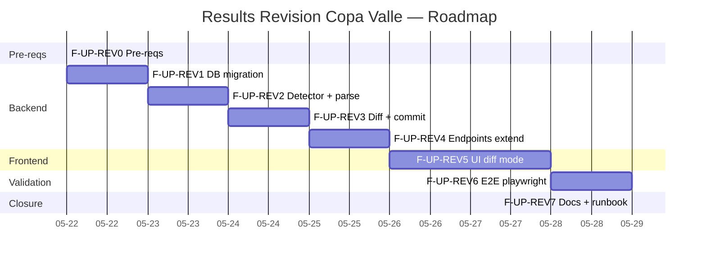

# Implementation Workflow — Comprehensive Results Revision Handling

**Source:** `docs/10-race-results/revision-design.md` (23 closed decisions) + reuse of F-UP patterns (`upload-design.md` + `upload-workflow.md`)
**Strategy:** Systematic
**Depth:** Deep
**Generated:** 2026-05-21
**Estimated total:** ~5.5 dev-days parallelized | sequential: ~7 days
**Status:** Ready to execute after approving 7 open coach questions (defaults documented)
**Suggested branch:** `race-results-v2-foundation` (continue) or dedicated feature branch `feat/race-import-revisions`
**Depends on:** F-UP (upload UI) merged to `main`

---

## Requirements summary

### Functional

- Automatically detect that an uploaded PDF is a **revision** of an already-committed round.
- Compute **complete diff** (create / update / delete / unchanged) between new PDF and persisted results.
- UI step 2 switches to `diff` mode with a reviewable table and banner.
- Apply revision transactionally with complete audit trail in `RaceResultRevision`.
- Soft-delete (`deleted_at`) of removed results. NEVER hard-delete.
- `revision_reason` required if there are deletes (app-level validation).

### Non-functional

| Attribute | Target |
|---|---|
| p50 diff calculation | <500ms for N<300 competitors |
| p95 revision commit | <30s (similar to F-UP) |
| Backend coverage `diff.py` + `commit_revision` | ≥90% |
| Frontend coverage new components (`DiffTable`, `RevisionBanner`, etc.) | ≥85% |
| Existing F-UP tests | 100% green throughout the phase |
| F1.7 race tests (305) | 100% green |
| 0 axe-core violations in DiffTable and banner | accessibility sentinel |
| Complete audit trail | 100% revisions have `RaceResultRevision` entry |
| 0 logs with PII (revision_reason only in DB, never log) | inviolable sentinel |

### Out of scope MVP

- ❌ Per-row override of diff in DiffTable (all or nothing).
- ❌ `GET /imports/{id}/revisions` endpoint to list revisions of an import.
- ❌ UI to visualize revision history of a competitor / event.
- ❌ Notify parents on revision.
- ❌ Semantic revision revert (undo revision button). Reversion via documented manual SQL.
- ❌ GENERAL diff (RESULTS only).
- ❌ Collaborative multi-coach concurrent support beyond basic pessimistic lock.

---

## Visual roadmap



---

## Dependency DAG


**Critical path:** REV0 → REV1 → REV2 → REV3 → REV4 → REV5 → REV6 → REV7 (~5.5 days).

**Parallelization 1 backend + 1 frontend:**
- After REV4, frontend (REV5) and backend integration tests run in parallel.
- Backend tests for REV3 can run while frontend prepares JSON mocks for REV5.

**Real reduction with parallelization:** ~5.5 days (vs 7 sequential).

---

## Phase F-UP-REV0 — Prerequisites

**Time:** 0.25 day | **Risk:** Low | **Blocks:** everything else

### Prerequisites

- [x] F-UP (upload UI) merged to `main` and deployed.
- [x] Migration `e8f9a0b1c2d3_race_imports_upload_ui_delta` applied in prod.
- [x] F-UP and F1.7 tests green (baseline ≥358 backend + ≥37 frontend).
- [ ] Validate 7 open coach questions (`revision-design.md` §9). Defaults documented as acceptable.
- [ ] Review current `RaceImport` model to confirm exact name of `committed_at` (may be `imported_at`, `updated_at`, or require additional migration).

### Atomic tasks

| # | Task | Agent | Command | Deliverable |
|---|---|---|---|---|
| 0.1 | 10 min session with coach validating Q1-Q7 design §9. Document decisions | system-architect | manual | `revision-design.md` §9 updated with "validated YYYY-MM-DD" |
| 0.2 | Inspect `backend/app/models/race_import.py` to confirm `committed_at` timestamp — if it doesn't exist, plan to add it in REV1 | backend-architect | `grep -n "committed_at\|imported_at\|updated_at" backend/app/models/race_import.py` | Confirmation: field exists / does not exist + decision |
| 0.3 | Verify baseline tests green before start | quality-engineer | `cd backend && pytest tests/services/race/ tests/routers/test_race_imports.py` | ≥358 green |
| 0.4 | Verify F-UP frontend tests green | quality-engineer | `cd frontend && npm run test -- race-upload` | ≥37 green |
| 0.5 | Verify no open PRs touching `RaceImport`, `RaceResult`, `RaceResultRevision`, `ingestor.py` | devops-architect | `gh pr list --search "RaceImport in:title,body"` | 0 conflicting PRs, or synchronize before starting |
| 0.6 | Create branch `feat/race-import-revisions` from `main` (if not using `race-results-v2-foundation`) | devops-architect | `git checkout -b feat/race-import-revisions main` | Active branch |

### Success criterion

```bash
git branch --show-current                                            # feat/race-import-revisions or active branch
cd backend && pytest tests/services/race/ tests/routers/test_race_imports.py -x   # ≥358 green
cd ../frontend && npm run test -- race-upload                          # ≥37 green
# Coach validated the 7 open questions or accepted defaults
```

### Rollback

- No destructive changes. `git checkout main` to abandon the phase if pre-reqs are not met.

### Tactical decisions

- **DTR-1:** If Q1-Q7 change a fundamental decision → re-draft design §1-7 before starting REV1. Estimated +0.25 day.
- **DTR-2:** If `committed_at` does not exist in `RaceImport` → add column `committed_at TIMESTAMP NULL` in the same REV1 migration (no extra cost).

### Primary agent: **system-architect** (validation) + **devops-architect** (branch)

---

## Phase F-UP-REV1 — DB migration + model

**Time:** 0.5 day | **Risk:** Low (nullable columns, reversible self-ref FK) | **Depends on:** REV0

### Prerequisites

- REV0 complete
- Pre-migration dev DB snapshot (`mysqldump`)

### Atomic tasks

| # | Task | Agent | Command | Deliverable |
|---|---|---|---|---|
| 1.1 | Create Alembic migration `f9a0b1c2d3e4_race_imports_revision_delta` (down_revision = `e8f9a0b1c2d3`) per design §2.5 | backend-architect | `cd backend && alembic revision -m "race_imports revision delta"` | `backend/alembic/versions/f9a0b1c2d3e4_race_imports_revision_delta.py` with: ADD `parent_import_id` (self-ref FK ON DELETE SET NULL), ADD `revision_reason VARCHAR(300) NULL`, CREATE INDEX `ix_race_imports_parent_id`. Reversible. |
| 1.2 | (Conditional DTR-2) Add `committed_at TIMESTAMP NULL` if it doesn't exist + backfill `UPDATE race_imports SET committed_at = updated_at WHERE status='committed' AND committed_at IS NULL` | backend-architect | same migration | Column added + backfill |
| 1.3 | Update model `backend/app/models/race_import.py`: add `parent_import_id: Mapped[Optional[int]]` with self-ref `relationship` + derived property `is_revision -> bool` | backend-architect | `/sc:implement` | Updated model, correct types, optional bidirectional relationship `parent: Mapped[Optional["RaceImport"]]` and `revisions: Mapped[list["RaceImport"]]` |
| 1.4 | Apply migration locally | backend-architect | `cd backend && alembic upgrade head` | No errors |
| 1.5 | Verify reversible downgrade | quality-engineer | `cd backend && alembic downgrade -1 && alembic upgrade head` | Idempotent |
| 1.6 | Model tests: instantiate `RaceImport` with `parent_import_id`, verify `parent` relationship loaded, verify `is_revision` property | quality-engineer | `/sc:test` | `tests/models/test_race_import_revision.py` ≥4 green tests |
| 1.7 | F-UP + F1.7 suite still green post-migration | quality-engineer | `cd backend && pytest tests/services/race/ tests/routers/test_race_imports.py tests/models/` | 100% green |
| 1.8 | Verify existing F-UP imports remain with `parent_import_id=NULL` and `revision_reason=NULL` (safe defaults) | quality-engineer | `mysql -e "SELECT id, parent_import_id, revision_reason FROM race_imports"` | All NULL for prior imports |

### Success criterion

```bash
cd backend
alembic upgrade head                                          # OK
alembic downgrade -1 && alembic upgrade head                  # reversible
pytest tests/models/test_race_import_revision.py -x           # ≥4 green
pytest tests/services/race/ tests/routers/test_race_imports.py -x  # 100% green
mysql -e "DESCRIBE race_imports" | grep -E "parent_import_id|revision_reason"
# → both columns listed
```

### Rollback

```bash
cd backend
alembic downgrade e8f9a0b1c2d3
git revert <commit-phase-rev1>
```

### Primary agent: **backend-architect** + **quality-engineer**

---

## Phase F-UP-REV2 — `detect_revision` + change to `POST /parse`

**Time:** 1 day | **Risk:** Medium (behavioral change in existing endpoint) | **Depends on:** REV1

### Prerequisites

- Migration applied (REV1)
- Understanding of current `parse` endpoint (`backend/app/routers/race_imports.py:280-330`)

### Atomic tasks

| # | Task | Agent | Command | Deliverable |
|---|---|---|---|---|
| 2.1 | Create module `backend/app/services/race/revision.py` with function `detect_revision(db, series_id, valida_num) -> RevisionDetection | None` per design §1.2 | backend-architect | `/sc:implement` | Pure testable function. NOT dependent on FastAPI. |
| 2.2 | Create Pydantic schema `RevisionDetection` in `backend/app/schemas/race_imports.py` with fields: `is_revision`, `parent_event_id`, `parent_import_id`, `prior_committed_at`, `prior_imported_by_user_id`, `prior_imported_by_name` | backend-architect | `/sc:implement` | Schema added |
| 2.3 | Modify `ImportParseResponse` (same file): add `will_be_revision: bool = False`, `parent_event_id`, `parent_import_id`, `prior_committed_at`, `prior_imported_by_name` (all optional) | backend-architect | `/sc:implement` | Schema extended. No breaking change. |
| 2.4 | Modify endpoint `POST /imports/parse` (`backend/app/routers/race_imports.py`): after validating SHA and before 409, call `detect_revision`. If it returns detection: do NOT return 409 if SHA different, return 200 with `will_be_revision=true`. If byte-exact identical SHA committed: continue returning 409. | backend-architect | `/sc:implement` | Updated endpoint, clear branching logic |
| 2.5 | Join to `User.full_name` to populate `prior_imported_by_name` (1 additional query) | backend-architect | `/sc:implement` | select_in query with User |
| 2.6 | Unit tests `detect_revision`: first import case (None), revision case (detection), F1.7 legacy `event_id=NULL` case (None), only pending without committed (None), multiple committed → returns most recent | quality-engineer | `/sc:test` | `tests/services/race/test_revision_detect.py` ≥8 green tests |
| 2.7 | Router tests `POST /parse`: byte-exact duplicate SHA → 409 (regression); `(series, round)` with different SHA → 200 with `will_be_revision=true`; first import → 200 with `will_be_revision=false` | quality-engineer | `/sc:test` | `tests/routers/test_race_imports.py` ≥6 new tests, all previous tests green |
| 2.8 | Complete F-UP suite green post-change | quality-engineer | `cd backend && pytest tests/routers/ tests/services/race/` | 100% green |

### Success criterion

```bash
cd backend
pytest tests/services/race/test_revision_detect.py -x         # ≥8 green
pytest tests/routers/test_race_imports.py -x                  # 100% green (includes ≥6 new)
pytest --cov=app.services.race.revision --cov-report=term-missing tests/services/race/test_revision_detect.py
# Coverage ≥95%
```

### Rollback

`git revert <commits-phase-rev2>` — endpoint returns to 409. No DB changes.

### Tactical decisions

- **DTR-3:** `detect_revision` returns `RevisionDetection | None`, does not raise exception. Reason: clean integration with branching in endpoint.
- **DTR-4:** If `(series_id, valida_num)` verification fails because the client didn't send those fields in the form, `detect_revision` returns None (treat as first upload). Backward compatible with old clients.

### Primary agent: **backend-architect** + **quality-engineer**

---

## Phase F-UP-REV3 — `compute_diff` + `commit_revision`

**Time:** 1 day | **Risk:** Medium (diff logic is typical source of bugs) | **Depends on:** REV2

### Prerequisites

- `detect_revision` functional (REV2)
- Understand models `RaceResult`, `RaceCompetitor`, `RaceResultRevision`

### Atomic tasks

| # | Task | Agent | Command | Deliverable |
|---|---|---|---|---|
| 3.1 | Pydantic schemas in `backend/app/schemas/race_imports.py`: `DiffRow`, `DiffSummary`, `ParsedRowPreview`, `ResultPreview` per design §3.4-3.5 | backend-architect | `/sc:implement` | Schemas ready |
| 3.2 | Function `compute_diff(db, event_id, results_by_category) -> tuple[DiffSummary, list[DiffRow]]` in `backend/app/services/race/revision.py` per design §3.2 | backend-architect | `/sc:implement` | Pure function: 1 persisted query + iteration + fuzzy fallback `rapidfuzz.partial_ratio >= 92` |
| 3.3 | Helper `_load_persisted_results(db, event_id) -> dict[(cat_code, normalized_name), RaceResult]` (filters `deleted_at IS NULL`, joins RaceCategory + RaceCompetitor) | backend-architect | `/sc:implement` | Testable helper |
| 3.4 | Helper `_fuzzy_match(target_normalized, candidates_in_same_cat) -> Optional[str]` with rapidfuzz | backend-architect | `/sc:implement` | Pure function |
| 3.5 | Helper `_compute_field_diffs(persisted: RaceResult, parsed: ResultsRow) -> dict[str, dict]` — compares `position, status, race_time_ms, laps_behind, points_awarded`. Handles parse_time → ms for correct comparison | backend-architect | `/sc:implement` | Pure function |
| 3.6 | Function `commit_revision(db, parse_import, event_meta, revision_reason, current_user) -> CommitRevisionResult` in `backend/app/services/race/revision.py` per design §4.2 | backend-architect | `/sc:implement` | Transactional with `SELECT ... FOR UPDATE` on RaceEvent. Soft-delete via `deleted_at`. One `RaceResultRevision` per change. Promotes `RaceImport` to committed with `parent_import_id` and `revision_reason`. |
| 3.7 | Helper `_serialize_result_snapshot(result: RaceResult) -> dict` for `diff_json` (JSON-friendly: enums.value, datetimes ISO) | backend-architect | `/sc:implement` | Pure function |
| 3.8 | App-level validation: if `any(r.action=='delete')` and `not revision_reason` → raise `ValueError("revision_reason required")` (caller translates to 400) | backend-architect | `/sc:implement` | Validation in `commit_revision` |
| 3.9 | Unit tests `compute_diff`: happy path (3 creates + 2 updates + 1 delete + 5 unchanged), exact match, fuzzy fallback, category change (delete+create), 0 changes (all unchanged), competitor reappears post-soft-delete | quality-engineer | `/sc:test` | `tests/services/race/test_compute_diff.py` ≥12 green tests |
| 3.10 | Unit tests `commit_revision`: happy path, rollback on delete without reason, lock (mock `FOR UPDATE`), audit trail verified in `race_result_revisions`, soft-delete preserves original `status` | quality-engineer | `/sc:test` | `tests/services/race/test_commit_revision.py` ≥10 green tests with `FakeAsyncSession` |
| 3.11 | Integration test with real PDF: re-parse `valida_iv_2026_resultados.pdf` artificially modified (1 position changed) → diff returns exactly 1 update | quality-engineer | `/sc:test` | Test uses base fixture + monkeypatch to alter 1 row |
| 3.12 | Complete race suite green | quality-engineer | `cd backend && pytest tests/services/race/` | 100% green + ≥22 new |

### Success criterion

```bash
cd backend
pytest tests/services/race/test_compute_diff.py tests/services/race/test_commit_revision.py -x   # ≥22 green
pytest --cov=app.services.race.revision --cov-report=term-missing tests/services/race/   # ≥90%
pytest tests/services/race/ -x                              # 100% green
```

### Rollback

`git revert <commits-phase-rev3>` — no DB changes. Endpoints still work in non-revision mode.

### Tactical decisions

- **DTR-5:** `compute_diff` returns `DiffRow` ordered: `deletes` first (visual attention), then `updates`, then `creates`, then `unchanged` at the end. UI can re-order if desired.
- **DTR-6:** `parse_time` (from `normalizer.py`) returns `(status, race_time_ms, laps_behind)`. Reuse in `_compute_field_diffs` to parse `time_raw` from the new PDF and compare against already-persisted `race_time_ms`. Avoids string vs int comparison inconsistencies.
- **DTR-7:** `SELECT ... FOR UPDATE` with `nowait=True` (timeout 5s) in MySQL to avoid indefinite wait. If lock fails → 423 Locked.

### Primary agent: **backend-architect** + **quality-engineer**

---

## Phase F-UP-REV4 — Extended `dry-run` + `commit` endpoints

**Time:** 0.5 day | **Risk:** Low (mostly wiring) | **Depends on:** REV3

### Prerequisites

- `compute_diff` + `commit_revision` functional (REV3)
- Extended schemas ready

### Atomic tasks

| # | Task | Agent | Command | Deliverable |
|---|---|---|---|---|
| 4.1 | Extend `ImportDryRunResponse` with `is_revision`, `parent_event_id`, `parent_import_id`, `prior_committed_at`, `prior_imported_by_name`, `diff_summary`, `diff_rows` (all optional) | backend-architect | `/sc:implement` | Updated schema |
| 4.2 | Modify endpoint `POST /imports/{parse_id}/dry-run`: invoke `detect_revision`. If revision → invoke `compute_diff` and populate `diff_*` in response. If not → F-UP behavior intact. | backend-architect | `/sc:implement` | Endpoint with branching. Existing tests must continue passing. |
| 4.3 | Extend `ImportCommitRequest` with `revision_reason: str | None` (max 300 chars) | backend-architect | `/sc:implement` | Updated schema |
| 4.4 | Modify endpoint `POST /imports/{parse_id}/commit`: invoke `detect_revision`. If revision → invoke `commit_revision` (not `ingest_event`). If not → F-UP intact flow. | backend-architect | `/sc:implement` | Endpoint with branching |
| 4.5 | Extend `ImportCommitResponse` with `is_revision`, `parent_import_id`, `revisions_created`, `creates`, `updates`, `deletes`, `unchanged` | backend-architect | `/sc:implement` | Updated schema |
| 4.6 | Map `commit_revision` exceptions to HTTP: `ValueError("revision_reason required")` → 400; lock timeout → 423; OperationalError → 500 with rollback | security-engineer | `/sc:implement` | Broad try/except + structured logging |
| 4.7 | Router tests `POST /dry-run` revision: happy case with diff, identical PDF case (empty diff), fuzzy_matches > 0 case (yellow banner data) | quality-engineer | `/sc:test` | `tests/routers/test_race_imports.py` ≥4 new tests |
| 4.8 | Router tests `POST /commit` revision: happy case, deletes without reason → 400, lock timeout (mock) → 423, current_user is different admin than original → 200 (admin can commit other coaches' revisions) | quality-engineer | `/sc:test` | ≥6 new tests |
| 4.9 | Log sanitization `revision_reason`: confirm only `len(reason)` is logged, never the text | security-engineer | `grep -rn "logger.info.*reason" backend/app/services/race/revision.py` | 0 logs with reason text |
| 4.10 | Complete endpoint suite green | quality-engineer | `cd backend && pytest tests/routers/test_race_imports.py` | 100% green |

### Success criterion

```bash
cd backend
pytest tests/routers/test_race_imports.py -x                  # 100% green + ≥10 new
pytest --cov=app.routers.race_imports --cov-report=term-missing tests/routers/  # ≥90% on new branches

# Manual smoke:
curl -X POST http://localhost:8000/api/race-analysis/imports/parse ...   # → 200 with will_be_revision=true
curl -X POST http://localhost:8000/api/race-analysis/imports/{id}/dry-run ...   # → 200 with diff_rows
curl -X POST http://localhost:8000/api/race-analysis/imports/{id}/commit -d '{"revision_reason":"test", ...}'   # → 200 with revisions_created>0
mysql -e "SELECT action, COUNT(*) FROM race_result_revisions GROUP BY action"
# → create/update/delete distribution matches response stats
```

### Rollback

`git revert <commits-phase-rev4>` — endpoints return to pure F-UP behavior. DB intact.

### Primary agent: **backend-architect** + **security-engineer** (log sanitization) + **quality-engineer**

---

## Phase F-UP-REV5 — UI step 2 `diff` mode

**Time:** 1.5 days | **Risk:** Medium (virtualized table + mode branching in existing wizard) | **Depends on:** REV4

### Prerequisites

- Backend endpoints working (REV4) or JSON mocks ready
- F-UP wizard operational

### Atomic tasks

| # | Task | Agent | Command | Deliverable |
|---|---|---|---|---|
| 5.1 | Extend TS types in `frontend/src/api/raceImports.ts`: add `WillBeRevisionInfo`, `DiffRow`, `DiffSummary`, `RevisionFields` (generate from Pydantic via openapi-typescript or manual) | react-ui-engineer | `/sc:implement` | Synchronized types |
| 5.2 | Extend `useImportParse`, `useImportDryRun`, `useImportCommit` hooks to support new fields. No breaking change (optional fields) | react-ui-engineer | `/sc:implement` | Typed hooks |
| 5.3 | `RevisionBanner` component (`frontend/src/components/race/RevisionBanner.tsx`) — yellow banner with prior import metadata: date, coach, link to import_id | react-ui-engineer | `/sc:implement` | Component with shadcn `Alert` warning variant |
| 5.4 | `DiffSummaryCounts` component (`frontend/src/components/race/DiffSummaryCounts.tsx`) — 4 colored badges (green creates, yellow updates, red deletes, gray unchanged) + explanatory tooltip | react-ui-engineer | `/sc:implement` | Component with shadcn `Badge` |
| 5.5 | `DiffTable` component (`frontend/src/components/race/DiffTable.tsx`) — TanStack Table with columns Action/Category/Competitor/Changes. "Show only changes" filter (default ON per Q1). Virtualization (react-virtual) if rows>50. Render `fields_changed` as `key: before → after` list | react-ui-engineer | `/sc:implement` | Component with conditional virtualization |
| 5.6 | `RevisionReasonInput` component (`frontend/src/components/race/RevisionReasonInput.tsx`) — controlled textarea with counter (X/300) + dynamic required validation (if `summary.deletes > 0`) | react-ui-engineer | `/sc:implement` | Component with React Hook Form integration or controlled state |
| 5.7 | Modify `RaceUploadWizard` for mode branching: `mode = parseResponse.will_be_revision ? 'diff' : 'matches'`. Step 2 renders components conditionally | react-ui-engineer | `/sc:implement` | Wizard with clean branching |
| 5.8 | EventMetaForm in `diff` mode: pre-fill with data from persisted `RaceEvent` (1 GET query or use `parent_event_id` for fetch). Allow editing. | react-ui-engineer | `/sc:implement` | Form with `defaultValues` from API |
| 5.9 | Step 3 success in revision mode: render `RevisionSuccessCard` with counts + reason + link to audit (future F2) | react-ui-engineer | `/sc:implement` | Card with stats |
| 5.10 | New error handling: 400 "revision_reason required" → inline toast in RevisionReasonInput; 423 Locked → modal "Another coach is applying a revision, wait 30s" | react-ui-engineer | `/sc:implement` | Error handling in wizard |
| 5.11 | Yellow banner if `diff_summary.fuzzy_matches > 0` or `cross_category_moves > 0` → "Some matches are approximate — review before confirming." | react-ui-engineer | `/sc:implement` | Conditional banner in DiffTable header |
| 5.12 | Vitest tests: each component + wizard branching + virtualization (mock with 600 rows) + accessibility axe | quality-engineer | `/sc:test` | `frontend/tests/race-upload/*.test.tsx` ≥25 new green tests, coverage ≥85%, 0 axe violations |

### Success criterion

```bash
cd frontend
npm run test -- race-upload                                   # ≥62 green (37 F-UP + 25 new)
npm run test:coverage -- src/components/race                  # ≥85%

# Manual smoke:
npm run dev   # localhost:5173 → /coach/race-analysis?tab=upload
# Upload modified valida_iv_2026_resultados.pdf → wizard detects revision → yellow banner
# Step 2 shows diff table → "Show only changes" filter active by default → 3 visible
# Without writing reason + deletes → submit disabled
# Write reason → submit enabled → confirm → success card
```

### Rollback

`git revert <commits-phase-rev5>` — wizard returns to single F-UP mode. Tab works as before.

### Tactical decisions

- **DTR-8:** Virtualization optional based on rowCount. `DiffTable` component decides internally. No external flag.
- **DTR-9:** "Show only changes" filter is client-side. Backend always returns all rows (including unchanged) so the filter can be reversed without refetch.
- **DTR-10:** If `parent_event_id` is set in parse response, fetch event details via existing `GET /api/race-analysis/events/{id}` endpoint (assumed existing; if not, add as subtask of 5.8 with +0.25 day).

### Primary agent: **react-ui-engineer** + **quality-engineer**

---

## Phase F-UP-REV6 — E2E playwright + integration

**Time:** 0.5 day | **Risk:** Medium (full-stack orchestration) | **Depends on:** REV5

### Prerequisites

- Backend deployed locally with `docker compose up`
- Frontend in dev mode
- Fixture: Original Round IV PDF already in repo + create modified copy

### Atomic tasks

| # | Task | Agent | Command | Deliverable |
|---|---|---|---|---|
| 6.1 | Create fixture `tests/fixtures/race/valida_iv_2026_resultados_revisado.pdf` — copy of original with 1-2 positions changed + 1 athlete removed (post-processed with pdfplumber+reportlab or manually from original) | quality-engineer | manual | PDF fixture |
| 6.2 | E2E happy revision: ingest original Round IV → re-upload revised PDF → assert detection banner → diff shows correct deltas → write reason → commit → assert `race_result_revisions` populated | quality-engineer | `playwright test race-revision-happy --headed` | Green test |
| 6.3 | E2E deletes without reason: re-upload with deletes → don't write reason → submit disabled → assert toast/inline error if force submit via JS | quality-engineer | `playwright test race-revision-no-reason` | Green |
| 6.4 | E2E empty diff: re-upload logically identical PDF (same content, different SHA by metadata) → assert diff all unchanged → submit enabled with banner "This revision changes no results" → commit records import without changes | quality-engineer | `playwright test race-revision-noop` | Green |
| 6.5 | Full-stack integration test TestClient: invoke `/parse` → `/dry-run` (assert is_revision=true, diff_rows populated) → `/commit` (assert race_result_revisions count == sum(creates+updates+deletes)) | quality-engineer | `pytest tests/integration/test_race_revision_full_stack.py` | ≥3 green tests |
| 6.6 | Concurrency test: 2 parallel revision commits on same event → 1 succeeds, 1 gets 423 or waits-then-recomputes-diff (mock lock timeout) | quality-engineer | `pytest tests/integration/test_race_revision_concurrency.py` | Green |
| 6.7 | Smoke test: query `SELECT * FROM race_result_revisions WHERE result_id IN (...) ORDER BY changed_at` shows complete history of a revision | quality-engineer | manual mysql | Audit trail visualization OK |
| 6.8 | Verify policy: hard-delete of parent `RaceImport` (simulated in sandbox) → descendants remain with `parent_import_id=NULL`, doesn't break listing queries | quality-engineer | `/sc:test` | Sandbox test confirms FK ON DELETE SET NULL works |

### Success criterion

```bash
cd frontend
npx playwright test race-revision --reporter=line             # 3 E2E green
cd ../backend
pytest tests/integration/test_race_revision_full_stack.py tests/integration/test_race_revision_concurrency.py -x  # ≥4 green
```

### Rollback

E2E tests don't affect prod. `git revert` if necessary.

### Primary agent: **quality-engineer**

---

## Phase F-UP-REV7 — Docs + runbook + production

**Time:** 0.25 day | **Risk:** Low | **Depends on:** REV6

### Prerequisites

- F-UP-REV6 green
- PR approved and merged to `main`

### Atomic tasks

| # | Task | Agent | Command | Deliverable |
|---|---|---|---|---|
| 7.1 | Update `CLAUDE.md` implementation status section adding "Results Revision Module (F-UP-REV)" table with steps 1-7 marked ✅ | devops-architect | `/sc:document` | Updated CLAUDE.md |
| 7.2 | Create `docs/10-race-results/revision-runbook.md` with: how to apply a revision step by step (coach), how to revert a revision via SQL (admin), how to investigate audit trail, common troubleshooting (423 Locked, empty diff, deletes without reason) | system-architect | `/sc:document` | New runbook file |
| 7.3 | Update `docs/10-race-results/upload-design.md` adding reference to `revision-design.md` in §9 (idempotency) | system-architect | manual | Cross-reference |
| 7.4 | Verify auto-deploy to Render after merge to `main` | devops-architect | manual (Render dashboard) | Build OK, `/health` 200 |
| 7.5 | Production smoke test with coach: re-upload real Round IV PDF with minor change (1 position) → wizard detects revision → commit → verify audit in DB | quality-engineer | manual from prod browser | Screenshots + mysql Hostinger query |
| 7.6 | Update `docs/10-race-results/revision-design.md` §9 marking open questions as "validated YYYY-MM-DD" | system-architect | manual | Final doc |
| 7.7 | Completion report `docs/10-race-results/revision-completion-report.md` with real metrics vs estimate, active tactical decisions, lessons learned | system-architect | manual | New file |

### Success criterion

```bash
curl https://mi-2yzi.onrender.com/health                       # 200 OK
# Production browser smoke: upload revision → audit in DB
mysql -h <hostinger> -e "SELECT COUNT(*) FROM race_result_revisions WHERE changed_at > NOW() - INTERVAL 1 HOUR"
# → counts match commit response stats
```

### Rollback

- Code: `git revert <merge-commit>` + redeploy.
- DB: `alembic downgrade e8f9a0b1c2d3`.
- Storage: PDFs uploaded before rollback remain as orphans (no referencing rows); nightly F-UP cleanup detects them.
- **Revert of revision applied in prod:** via SQL documented in runbook.

### Primary agent: **devops-architect** + **system-architect**

---

## Risk register

| # | Risk | Phase | Prob | Impact | Mitigation |
|---|---|---|---|---|---|
| R1 | Pessimistic lock `FOR UPDATE` hangs (MySQL default timeout 50s) affecting other endpoints | REV3, REV4 | Low | Medium | Use `nowait=True` or `lock_timeout=5s`. If lock fails → 423 + structured log. Monitor in Render logs post-deploy. |
| R2 | Fuzzy matching `partial_ratio` breaks false-positives (matches two different names as same) | REV3 | Medium | High | Conservative threshold 92. `DiffSummary.fuzzy_matches` count visible in UI. Yellow banner if > 0. Specific test with edge cases. |
| R3 | `compute_diff` O(N*M) costly with N=300, M=top3 fuzzy candidates | REV3 | Low | Low | <500ms estimated. If exceeds 5s → log warning. Future optimization: pre-index fuzzy candidates by category. |
| R4 | Frontend timing: dry-run returns late and coach navigates to step 3 before — state race condition | REV5 | Low | Low | TanStack Query `isPending` blocks navigation. "Final preview" button disabled until `isSuccess`. |
| R5 | Coach confuses "revision" with "new attempt" — uploads another PDF thinking it replaces the first but it's from another round | REV5, REV6 | Low | High | Explicit banner with prior import metadata (date + coach + original filename). Step 3 confirmation shows complete summary. `revision_reason` required if there are deletes. |
| R6 | Audit trail `RaceResultRevision` grows without control (each revision × N results) | REV1+ | Very low | Low | Estimated: 7 rounds × 250 results × 3 average revisions = 5250 rows/year. Harmless for MySQL. No cleanup. |
| R7 | Alembic migration fails in prod (Hostinger MySQL 8 quirks with self-ref FK) | REV1, REV7 | Low | High | Test reversibility locally before deploying. `mysqldump` backup pre-deploy. Rollback plan documented in §REV7. |
| R8 | Existing F-UP tests break after behavior change in `POST /parse` (409 → 200 with will_be_revision) | REV2 | Medium | Medium | Existing tests assume 409. Update F-UP tests to reflect new behavior (not a regression, it's a feature change). |
| R10 | Coach expects to see revision history of a competitor in UI but MVP doesn't include it | REV7 | Medium | Low | Document as "Upcoming improvements" in runbook. Coach can query via direct SQL in sandbox. |
| R11 | Revision applies changes but RaceImport.status remains `pending` due to bug → wizard believes it wasn't committed | REV3, REV4 | Low | Medium | Specific test verifies `status==committed` post-commit_revision. Manual prod smoke confirms. |
| R12 | `revision_reason` accepted with special characters that break SQL (SQL injection) | REV4 | Very low | High | SQLAlchemy parameterized queries (default). Pydantic max_length=300. React auto-escape output sanitization in UI. |

---

## Quality gates between phases

| Gate | Before | Criterion | Responsible |
|---|---|---|---|
| QGR1 | REV0 → REV1 | Q1-Q7 open questions validated or defaults accepted + baseline tests green | system-architect |
| QGR2 | REV1 → REV2 | Migration applied and reversible + ≥4 model tests green + F-UP/F1.7 tests intact | quality-engineer |
| QGR3 | REV2 → REV3 | `detect_revision` ≥8 green tests + endpoint `parse` ≥6 new tests + cov ≥95% in `revision.py` | quality-engineer |
| QGR4 | REV3 → REV4 | `compute_diff` ≥12 tests + `commit_revision` ≥10 tests + 1 real PDF integration test + cov ≥90% | quality-engineer |
| QGR5 | REV4 → REV5 | Extended endpoints ≥10 new tests + log sanitization verified + smoke curl OK | quality-engineer + security-engineer |
| QGR6 | REV5 → REV6 | ≥25 vitest tests + 0 axe violations + manual wizard diff mode smoke | quality-engineer |
| QGR7 | REV6 → REV7 | 3 green E2E playwright + full-stack integration + concurrency test green | quality-engineer |
| QGR8 | REV7 → CLOSED | Smoke prod OK + audit in DB verifiable + runbook published | devops-architect + system-architect |

---

## Complete tests strategy

### Backend — pytest

| Category | File | # tests | Threshold |
|---|---|---|---|
| `RaceImport` revision model | `tests/models/test_race_import_revision.py` | ≥4 | — |
| `detect_revision` | `tests/services/race/test_revision_detect.py` | ≥8 | cov ≥95% |
| `compute_diff` | `tests/services/race/test_compute_diff.py` | ≥12 | cov ≥90% |
| `commit_revision` | `tests/services/race/test_commit_revision.py` | ≥10 | cov ≥90% |
| Endpoints (TestClient) | `tests/routers/test_race_imports.py` (extend) | +≥10 new | cov endpoints ≥90% |
| Full-stack integration | `tests/integration/test_race_revision_full_stack.py` | ≥3 | — |
| Concurrency | `tests/integration/test_race_revision_concurrency.py` | ≥1 | — |
| F-UP regression | `tests/routers/test_race_imports.py` + `tests/services/race/` | no changes | — |
| F1.7 regression | `tests/services/race/` | 305 | no changes |
| **Total new backend** | | **≥48** | cov new module ≥90% |

```bash
cd backend
pytest tests/models/test_race_import_revision.py \
       tests/services/race/test_revision_detect.py \
       tests/services/race/test_compute_diff.py \
       tests/services/race/test_commit_revision.py \
       tests/routers/test_race_imports.py \
       tests/integration/test_race_revision_full_stack.py \
       tests/integration/test_race_revision_concurrency.py \
       --cov=app.services.race.revision \
       --cov=app.routers.race_imports \
       --cov-report=term-missing -x
```

### Frontend — vitest + RTL

| Category | File | # tests | Threshold |
|---|---|---|---|
| `RevisionBanner` | `frontend/tests/race-upload/RevisionBanner.test.tsx` | ≥3 | — |
| `DiffSummaryCounts` | `frontend/tests/race-upload/DiffSummaryCounts.test.tsx` | ≥3 | — |
| `DiffTable` | `frontend/tests/race-upload/DiffTable.test.tsx` | ≥8 (filter, virtualization, render diffs) | — |
| `RevisionReasonInput` | `frontend/tests/race-upload/RevisionReasonInput.test.tsx` | ≥4 | — |
| `RaceUploadWizard` diff mode | `frontend/tests/race-upload/RaceUploadWizard.test.tsx` (extend) | +≥5 | — |
| `api/raceImports.ts` types | `frontend/tests/race-upload/api.test.ts` (extend) | +≥2 | — |
| Accessibility | in each component | — | 0 axe violations |
| **Total new frontend** | | **≥25** | cov new ≥85% |

```bash
cd frontend
npm run test -- race-upload
npm run test:coverage -- src/components/race
```

### E2E — playwright-cli

| Test | File | Coverage |
|---|---|---|
| Happy revision | `frontend/tests/e2e/race-revision-happy.spec.ts` | upload → diff → reason → commit → assert audit |
| Without reason | `frontend/tests/e2e/race-revision-no-reason.spec.ts` | submit disabled if deletes and reason empty |
| Noop revision | `frontend/tests/e2e/race-revision-noop.spec.ts` | identical PDF → empty diff → commit records traceability |
| **Total E2E** | | **3 new tests** | Runtime ≤60s |

```bash
cd frontend
npx playwright test race-revision --reporter=line
```

---

## Exit checklist

### Functionality

- [ ] Backend detects revision by `(series_id, sequence_number) + committed`
- [ ] `/parse` endpoint returns `will_be_revision=true` instead of 409 if SHA different
- [ ] `/parse` endpoint STILL returns 409 if byte-exact identical SHA
- [ ] `/dry-run` endpoint returns `diff_summary` + `diff_rows` ordered (deletes→updates→creates→unchanged) if revision
- [ ] `/commit` endpoint applies revision transactionally with complete audit trail
- [ ] `revision_reason` required if there are deletes (400 if empty)
- [ ] Soft-delete via `deleted_at`, `status` preserved
- [ ] `parent_import_id` lineage persisted correctly
- [ ] UI step 2 automatically switches to `diff` mode if `will_be_revision=true`
- [ ] DiffTable virtualized for >50 rows
- [ ] "Show only changes" filter active by default
- [ ] Yellow banner if `fuzzy_matches > 0` or `cross_category_moves > 0`
- [ ] Step 3 success shows counts + reason

### Quality

- [ ] Backend coverage `revision.py` ≥90%
- [ ] Frontend coverage new components ≥85%
- [ ] Existing F-UP tests 100% green post-changes
- [ ] F1.7 tests (305) intact
- [ ] 0 axe-core violations in DiffTable, RevisionBanner, RevisionReasonInput
- [ ] E2E happy + 2 error paths green

### Performance

- [ ] p50 `compute_diff` <500ms for 300 competitors
- [ ] p95 revision commit <30s
- [ ] `FOR UPDATE` lock with timeout 5s (not 50s default)

### Security

- [ ] Log sanitization: `revision_reason` never appears in logs (only `len(reason)`)
- [ ] Pydantic max_length=300 on `revision_reason`
- [ ] Pessimistic lock prevents race condition
- [ ] FK ON DELETE SET NULL preserves audit on hard-delete (documented)

### Observability

- [ ] Structured log per revision commit: `import_id`, `parent_import_id`, `event_id`, counts (without `revision_reason` text)
- [ ] Audit trail queryable via `SELECT * FROM race_result_revisions WHERE ...`

### Documentation

- [ ] `revision-design.md` §9 marked validated
- [ ] `revision-runbook.md` with coach flow + admin SQL revert flow
- [ ] CLAUDE.md updated with F-UP-REV table
- [ ] `revision-completion-report.md` with real vs estimated metrics

---

## Execution recommendations

### Recommended executive order (parallelization 1 backend + 1 frontend)

```
Day 1 morning:  REV0 (pre-reqs + open questions)
Day 1 afternoon: REV1 (migration) + REV2 start (detect_revision design)
Day 2:          REV2 closure (parse endpoint + tests)
Day 3:          REV3 (compute_diff + commit_revision + tests)
Day 4 morning:  REV4 (endpoints extend) — backend closes
Day 4 afternoon: Frontend starts REV5 with mocks (parallel to REV4 closure)
Day 5:          REV5 closure (components + wizard branching + tests)
Day 6 morning:  REV6 (E2E + integration)
Day 6 afternoon: REV7 (docs + prod smoke + runbook)
```

**Total:** ~5.5 days parallelized.

### `/sc:` commands by phase

| Phase | Recommended commands |
|---|---|
| REV0 | manual + `/sc:document` |
| REV1 | `/sc:implement` + `/sc:test` |
| REV2 | `/sc:implement` + `/sc:test` |
| REV3 | `/sc:implement` + `/sc:test` + `/sc:analyze` (review compute_diff logic) |
| REV4 | `/sc:implement` + `/sc:test` + `/sc:analyze` (security review revision_reason logging) |
| REV5 | `/sc:implement` + `/sc:test` |
| REV6 | `/sc:test` with `playwright-cli` skill |
| REV7 | `/sc:document` + manual deploy |

### Agents by phase

- **REV0:** `system-architect` (open questions validation) + `devops-architect` (branch + baseline)
- **REV1:** `backend-architect` + `quality-engineer`
- **REV2:** `backend-architect` + `quality-engineer`
- **REV3:** `backend-architect` + `quality-engineer`
- **REV4:** `backend-architect` + `security-engineer` + `quality-engineer`
- **REV5:** `react-ui-engineer` + `quality-engineer`
- **REV6:** `quality-engineer`
- **REV7:** `devops-architect` + `system-architect`

### Immediate next step — spawn F-UP-REV1

```
/sc:implement F-UP-REV1 race-revision: create Alembic migration
f9a0b1c2d3e4_race_imports_revision_delta with down_revision=e8f9a0b1c2d3.
Add parent_import_id INT NULL FK→race_imports(id) ON DELETE SET NULL,
revision_reason VARCHAR(300) NULL, index ix_race_imports_parent_id.
Update model backend/app/models/race_import.py with field + self-ref
relationship + derived is_revision property. Validate reversible with
alembic downgrade -1 && alembic upgrade head. Model tests ≥4 green
in tests/models/test_race_import_revision.py. Complete F-UP suite
must remain 100% green after migration.
```

In parallel: 10 min session with coach to validate Q1-Q7 (`revision-design.md` §9).

---

## Metrics tracking during implementation

| Metric | How to measure | Cadence |
|---|---|---|
| Backend green tests | `pytest tests/` exit 0 | Every commit |
| Frontend green tests | `npm run test` exit 0 | Every commit |
| Backend new coverage | `pytest --cov=app.services.race.revision --cov=app.routers.race_imports` | At close of each phase |
| Frontend new coverage | `npm run test:coverage -- src/components/race` (filter diff/revision) | At close of each phase |
| Real vs estimated time | Manual tracking per phase | End of each phase |
| Axe violations | jest-axe inline | REV5 closure |
| E2E runtime | `playwright test race-revision --reporter=line` | REV6 closure |
| p50 compute_diff | structured log `logger.info("compute_diff_ms=...")` | Smoke REV3 + prod REV7 |
| Audit trail count | `SELECT COUNT(*) FROM race_result_revisions WHERE changed_at > X` | Smoke REV7 |

---

## Workflow tactical decisions

| # | Decision | Phase | Justification |
|---|---|---|---|
| DTR-1 | If Q1-Q7 change a fundamental decision → re-draft design before REV1 | REV0 | Avoids rework in later phases |
| DTR-2 | If `committed_at` doesn't exist in RaceImport → add in REV1 (no extra cost) | REV0/REV1 | Migration consolidation |
| DTR-3 | `detect_revision` returns `Optional`, not exception | REV2 | Clean branching in endpoint |
| DTR-4 | If client doesn't send series/round in form, `detect_revision` returns None | REV2 | Backward compat |
| DTR-5 | `compute_diff` returns rows ordered: deletes → updates → creates → unchanged | REV3 | UX: visual attention first to removed |
| DTR-6 | Reuse `parse_time` to compare `time_raw` vs `race_time_ms` | REV3 | Avoids string vs int inconsistencies |
| DTR-7 | `SELECT FOR UPDATE` with `nowait=True` (timeout 5s) | REV3 | Avoids long wait on other endpoints |
| DTR-8 | Virtualization decided internally by DiffTable based on rowCount | REV5 | No external flag, simplifies API |
| DTR-9 | "Show only changes" filter is client-side | REV5 | Reversible toggle without refetch |
| DTR-10 | `GET /events/{id}` endpoint assumed existing for EventMetaForm pre-fill | REV5 | If doesn't exist → +0.25d to add |

---

## Open questions / assumptions to re-validate mid-workflow

| # | Assumption (from design §9) | Validate in phase | Risk if fails |
|---|---|---|---|
| Q1 | "Show only changes" filter active by default | REV5 UX | Change default + tests (+0.1 day) |
| Q2 | `revision_reason` required only if deletes | REV4 | Change to always required (+0.25 day) |
| Q3 | No parent notification after revision MVP | REV7 | Add email trigger in F2 (+1 day) |
| Q4 | No per-row override in DiffTable MVP | REV5/REV7 | Design override UI in F2 (+2 days) |
| Q5 | No `GET /imports/{id}/revisions` endpoint MVP | REV7 | Add endpoint + UI in F2 (+0.5 day) |
| Q6 | Allow "fake" commit if diff empty | REV4/REV5 | UI rejects if diff empty (+0.1 day) |
| Q7 | Updating `RaceEvent` metadata (weather) via revision is a feature | REV5 | Block editing in diff mode (+0.25 day) |

---

**Document generated by system-architect agent — `systematic` strategy, `deep` depth, aligned with `upload-workflow.md` format.**

**Next executive step:** confirm start of F-UP-REV0 + 10 min coach session for Q1-Q7.
