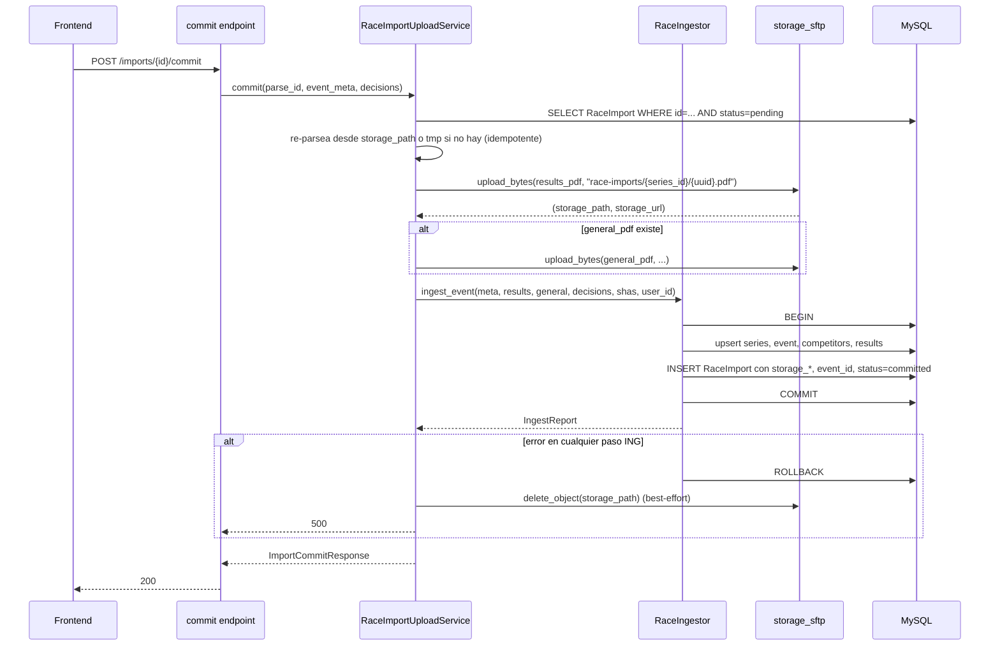
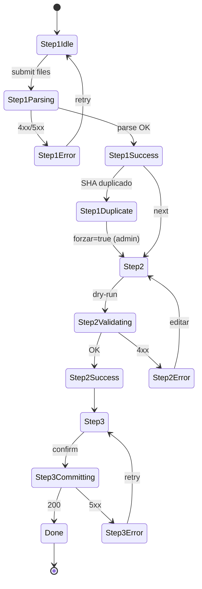

# Upload UI de PDFs Copa Valle — Diseño técnico

**Proyecto:** Club Deportivo Trocha y Ruta — XCO juvenil
**Módulo:** `services/race/` + `routers/race_analysis.py` + `frontend/src/routes/results/`
**Fecha:** 2026-05-20
**Autor:** System Architect agent
**Estado:** Diseño técnico — listo para `/sc:workflow` + `/sc:implement`
**Audiencia:** entrenador (validación UX), arquitecto/dev (implementación)
**Entrada autoritativa:** `docs/10-race-results/upload-research.md` (research previo)

---

## 0. Resumen ejecutivo

Hoy la ingesta de resultados Copa Valle solo existe vía CLI (`scripts/ingest_race.py`). Esta fase expone el mismo pipeline determinista F1.7 al coach a través de un **wizard de 3 pasos** dentro de `RaceAnalysisPage`, sin tocar la lógica de negocio probada (305 tests verdes, 98% cobertura en `services/race/`).

**Apuesta arquitectónica:** envoltura HTTP delgada sobre `RaceIngestor` + UI guiada que materializa el flujo interactivo del CLI en pasos discretos con preview seguro (dry-run real). Cambios bajo control:

- **Backend:** 3 endpoints REST + 1 columna nueva en `RaceImport` + dry-run en `RaceIngestor` (~30 LOC).
- **Frontend:** 1 tab nueva ("Cargar resultados") + componente `RaceUploadWizard` con 3 sub-pasos + reuso de patrones existentes.
- **Storage:** PDFs guardados en SFTP/FTPS Hostinger con UUID en path (fallback local en dev). Retención permanente.
- **Migración:** Alembic delta sobre `RaceImport` (4 columnas nuevas, todas nullable + default seguro).

**No hace en MVP:** crear atletas inline, editar metadata post-commit sin re-subir, soportar fuente que no sea PDF/CSV oficial Federación, polling/SSE (la ingesta es síncrona <60s).

---

## 1. Resolución de open questions del research

### 1.1 ¿Guardar PDF en storage tras procesar?

**Decisión:** **SÍ, guardar ambos PDFs en SFTP/FTPS con UUID en path.**

**Razón:**
- Costo marginal (PDF típico = 250 KB; 7 válidas × 2 PDFs × 5 temporadas = ~17 MB total).
- Desbloquea capacidades de re-procesamiento sin pedir el archivo al coach de nuevo (futuro: re-parser con bug fix, evidence en chat agéntico v2, auditoría retroactiva).
- Información ya pública (Federación los publica). URL pública sin auth es aceptable + UUID en path mitiga path-guessing.
- Patrón ya validado y testeado por F1.6 media (`storage_sftp.py` + fallback local).

**Implicaciones:**
- 2 columnas nuevas en `RaceImport`: `storage_path` y `storage_url`.
- En entornos dev sin envs SFTP → fallback local en `static/uploads/race-imports/<series_id>/<event_id>/<uuid>.pdf`.

### 1.2 ¿Wizard 3 endpoints vs 1 mega-POST?

**Decisión:** **3 endpoints REST (parse → dry-run → commit).**

**Razón:**
- Latencia `pdfplumber` con PDF Válida IV completo: 2–5 s en local, hasta 8–10 s en Render free tier tras cold start. Re-parsear en cada paso del wizard es UX inaceptable (el coach esperaría 15 s sólo para corregir un radio button del paso 2).
- Separación clara de responsabilidades: `parse` extrae datos crudos, `dry-run` simula la ingesta y devuelve `IngestReport` previo, `commit` persiste y guarda PDFs.
- `parse_id` (UUID server-side asociado a `RaceImport.status=pending`) sobrevive entre pasos sin requerir state en cliente más allá del id.
- Habilita patrones futuros (retomar wizard si el coach cierra el navegador antes del commit).

**Trade-off aceptado:** complejidad +1 tabla state efímero (`RaceImport.status=pending`) con TTL implícito (cleanup nocturno descrito en §8). El research confirma que la columna `status` ya soporta el enum `pending` desde F1.7.

### 1.3 ¿Soportar `.csv` MVP o solo `.pdf`?

**Decisión:** **Soportar `.pdf` + `.csv` para RESULTADOS; solo `.pdf` para GENERAL.**

**Razón:**
- El service ya soporta CSV autodispatch por extensión (`scripts/ingest_race.py:247-251`). Costo de incluirlo en el endpoint = trivial (3-4 líneas extra de magic bytes + branch en parser).
- Cubre el caso real **Sevilla V-I 2026** que solo tiene CSV (fixture `valida_i_2026_sevilla.csv` ya en repo).
- GENERAL solo se publica en PDF por Federación — sin uso real para CSV.

**Validación:**
- Magic bytes PDF: `%PDF-` en primeros 5 bytes.
- Magic bytes CSV: no aplicable (texto plano) → validar que primer chunk decodifique UTF-8 y contenga delimitador esperado (`,` o `;` o `\t`).
- Extensión whitelist: `.pdf`, `.csv`, `.tsv`, `.txt`.

---

## 2. Arquitectura propuesta

### 2.1 Diagrama end-to-end


### 2.2 Componentes nuevos vs reusados

| Componente | Estado | Ubicación | Responsabilidad |
|---|---|---|---|
| `RaceImportUploadService` | **NUEVO** | `backend/app/services/race/importer/upload_service.py` | Orquesta parse→dry-run→commit. Persiste estado intermedio en `RaceImport`. |
| `pdf_parser.parse_*_pdf` | **REUSADO** | `backend/app/services/race/pdf_parser.py` | Sin cambios. Acepta `Path`; service escribe a tmp y pasa el path. |
| `csv_parser.parse_results_csv` | **REUSADO** | `backend/app/services/race/csv_parser.py` | Sin cambios. |
| `RaceIngestor.dry_run_event` | **NUEVO** (~30 LOC) | `backend/app/services/race/ingestor.py` | Mismo flujo que `ingest_event` pero `db.rollback()` al final. Retorna `IngestReport` ficticio. |
| `RaceIngestor.ingest_event` | **REUSADO** | `backend/app/services/race/ingestor.py` | Sin cambios. |
| `matcher.match_athletes` | **REUSADO** | `backend/app/services/race/matcher.py` | Llamado desde service para devolver top-3 al wizard. |
| `storage_sftp.upload_bytes` | **REUSADO** | `backend/app/services/training/storage_sftp.py` | Acepta cualquier `bytes`; PDF funciona igual que JPG. |
| `routers/race_analysis.py` | **EXTENDIDO** | `backend/app/routers/race_analysis.py` | +4 endpoints bajo `/api/race-analysis/imports/*`. |
| `RaceUploadWizard` | **NUEVO** | `frontend/src/components/race/RaceUploadWizard.tsx` | Stepper visual + state machine cliente. |
| `RaceUploadZone` | **NUEVO** | `frontend/src/components/race/RaceUploadZone.tsx` | Clon simplificado de `MediaUploadZone` (sin thumbnails ni consent). |
| `EventMetaForm` | **NUEVO** | `frontend/src/components/race/EventMetaForm.tsx` | React Hook Form + Zod sobre `EventMeta`. |
| `MatchDecisionTable` | **NUEVO** | `frontend/src/components/race/MatchDecisionTable.tsx` | Clon visual de `AttendanceTable` con radios para top-3. |
| `IngestReportCard` | **NUEVO** | `frontend/src/components/race/IngestReportCard.tsx` | Resumen visual de conteos + warnings. |
| `RaceAnalysisPage` | **EXTENDIDO** | `frontend/src/routes/results/RaceAnalysisPage.tsx` | +1 tab "Cargar resultados". |
| `api/raceImports.ts` | **NUEVO** | `frontend/src/api/raceImports.ts` | Wrappers axios para los 4 endpoints. |

### 2.3 Storage strategy

| Aspecto | Decisión |
|---|---|
| Backend storage | `storage_sftp.upload_bytes` (FTPS Hostinger en prod, local en dev) |
| Path convention | `race-imports/{series_id}/{event_id_or_pending}/{uuid}.{ext}` |
| Filename original | Preservado en `RaceImport.filename` (200 chars). Nunca usado para construir path (anti path traversal). |
| Retención | **Permanente** (sin TTL). Volumen estimado <50 MB para 5 temporadas. |
| URL pública | Sí (igual que media de sesiones). Mitigación: UUID en path → path-guessing inviable. |
| Cleanup PDFs huérfanos | Sólo aplica a `RaceImport.status=pending` con `created_at < NOW() - 24h` (ver §8). |
| Cleanup en `dry-run` o `commit` fallido | NO eliminar PDF — útil para troubleshoot post-mortem. |

### 2.4 Idempotencia: re-upload del mismo PDF

| Escenario | Status final | Comportamiento UI |
|---|---|---|
| SHA nuevo, parse OK | `pending` → `committed` | Wizard completa normal |
| SHA ya existente en estado `committed` (mismo PDF, mismo coach o distinto) | **`parse` detecta en paso 1 y bloquea** | Banner amarillo: "Este PDF fue ingestado el YYYY-MM-DD por <coach>. ¿Forzar re-procesar?" (checkbox explícito; default off; requiere admin role para activar) |
| SHA ya existente en estado `pending` (wizard abandonado) | Reutiliza el `RaceImport` existente | Wizard reanuda en paso 2 con datos persistidos |
| SHA ya existente en estado `failed` | Permite re-intentar | Nuevo flujo desde paso 1 (no bloquea) |
| PDF corregido (mismo válida, distinto sha) | Crea `RaceImport` nuevo; `RaceResult` skipea filas duplicadas vía UNIQUE | Wizard completa; banner informativo "Se encontraron N resultados ya existentes que no se actualizaron" |

**Nota clave:** la lógica de idempotencia ya está en `RaceIngestor.ingest_event` (ingestor.py:220-238). El nuevo `upload_service` solo añade el chequeo SHA en `parse` para UX temprana (evitar que el coach complete los 3 pasos si su PDF es duplicado).

---

## 3. Schema DB delta

### 3.1 Migración Alembic necesaria

**Sí.** Una migración delta sobre `race_imports`, todas las columnas **nullable o con default seguro** para no romper los 3 imports existentes de F1.7.

### 3.2 Columnas nuevas en `race_imports`

| Columna | Tipo | Nullable | Default | Propósito |
|---|---|---|---|---|
| `event_id` | INT FK→`race_events.id ON DELETE SET NULL` | YES | NULL | Enlace directo al evento ingestado (evita JOIN indirecto vía `RaceResult.imported_from_id`). NULL para imports F1.7 legacy. |
| `kind` | ENUM(`results`, `general`) | NO | `'results'` | Discrimina qué tipo de PDF (hoy un import puede tener ambos archivos asociados — ver §3.3 sobre estrategia 1-fila vs 2-filas). Default `results` para imports legacy. |
| `storage_path` | VARCHAR(500) | YES | NULL | Path interno relativo en el backend storage. NULL para imports legacy. |
| `storage_url` | VARCHAR(500) | YES | NULL | URL pública del PDF guardado. NULL para imports legacy. |
| `general_filename` | VARCHAR(255) | YES | NULL | Filename original del GENERAL (si existe). NULL si solo se subió RESULTADOS. |
| `general_sha256` | CHAR(64) | YES | NULL | SHA256 del GENERAL para deduplicación. NULL si no aplica. |
| `general_storage_path` | VARCHAR(500) | YES | NULL | Path interno del GENERAL. |
| `general_storage_url` | VARCHAR(500) | YES | NULL | URL pública del GENERAL. |
| `parse_meta_json` | JSON | YES | NULL | Snapshot del `EventMeta` detectado/editado + matches preview, para reanudar wizard interrumpido. NULL post-commit. |

**Decisión 1-fila vs 2-filas:** **1 fila por ingesta**, con columnas duplicadas `general_*` para el segundo archivo opcional. Razón: el dominio es "una ingesta = un evento + dos PDFs relacionados", no "una ingesta = un archivo". Esto evita JOINs adicionales para mostrar el histórico en UI y mantiene la transaccionalidad simple (1 commit = 1 fila).

### 3.3 Índices nuevos

| Índice | Columnas | Propósito |
|---|---|---|
| `ix_race_imports_event` | `event_id` | Listar imports de un evento puntual (útil para auditoría) |
| `ix_race_imports_general_sha` | `general_sha256` | Deduplicación del PDF GENERAL |
| `ix_race_imports_status_created` | `(status, created_at DESC)` | Cleanup de `pending` viejos (ver §8) |

### 3.4 Migración Alembic — outline

```
revision: 8b9c0d1e2f3a
down_revision: 64c263edd07f   # head F1.7
description: Upload UI race PDFs — extender race_imports con event_id, kind, storage, general_*, parse_meta
```

**Operaciones up:**
1. `ADD COLUMN event_id INT NULL, ADD CONSTRAINT fk_race_imports_event FOREIGN KEY (event_id) REFERENCES race_events(id) ON DELETE SET NULL`
2. `ADD COLUMN kind ENUM('results','general') NOT NULL DEFAULT 'results'`
3. `ADD COLUMN storage_path VARCHAR(500) NULL, storage_url VARCHAR(500) NULL`
4. `ADD COLUMN general_filename VARCHAR(255) NULL, general_sha256 CHAR(64) NULL, general_storage_path VARCHAR(500) NULL, general_storage_url VARCHAR(500) NULL`
5. `ADD COLUMN parse_meta_json JSON NULL`
6. Crear índices listados.

**Operaciones down:** drop columnas en orden inverso + drop FK + drop índices.

**Compatibilidad legacy:** imports F1.7 quedan con `event_id=NULL`, `kind='results'`, todos los `storage_*` y `general_*` NULL. La UI de histórico (§4 endpoint 4) los muestra como "Import legacy" (sin link a descarga PDF).

---

## 4. Contratos API

Todos bajo prefix `/api/race-analysis/imports/` (coherente con `raceAnalysis.ts:24-32`).

### 4.1 `POST /api/race-analysis/imports/parse`

Sube los archivos, valida formato/tamaño/magic bytes, parsea, retorna preview + ID intermedio.

**Request:** `multipart/form-data`
- `results_file: File` (requerido) — PDF o CSV
- `general_file: File` (opcional) — PDF únicamente

**Response 200:** `ImportParseResponse`
```python
class ImportParseResponse(BaseModel):
    parse_id: int  # = RaceImport.id (status='pending')
    results_sha256: str  # 64 hex chars
    general_sha256: str | None
    results_filename: str
    general_filename: str | None
    detected_header: EventHeaderPreview | None  # valida_num + location + date
    categories_found: list[str]  # ej. ["INF-A-M", "PJUV-B-F", ...]
    total_rows_results: int
    total_rows_general: int | None
    warnings: list[ParseWarning]
    duplicate_warning: DuplicateImportInfo | None  # si SHA ya commited
```

**RBAC:** `Depends(require_role([UserRole.admin, UserRole.coach]))`

**Errores:**
| Código | Razón |
|---|---|
| 400 | Archivo vacío, extensión no soportada, mismo SHA en results y general |
| 403 | Rol parent o no autenticado |
| 413 | Archivo > 8 MB (settings `race_max_pdf_mb`) |
| 415 | Content-type no aceptado o magic bytes inválidos (`%PDF-` no encontrado / CSV no UTF-8) |
| 422 | PDF malformado: parser no extrae categorías reconocibles |
| 500 | Fallo storage o BD |

### 4.2 `POST /api/race-analysis/imports/{parse_id}/dry-run`

Ejecuta `RaceIngestor.dry_run_event` con la metadata + decisiones del coach. Rollbacks al final, retorna `IngestReport` previo.

**Request:** `application/json`
```python
class ImportDryRunRequest(BaseModel):
    event_meta: EventMeta  # schema existente de F1.7
    match_decisions: dict[str, int | None]  # {"BIB-42": 17, "BIB-99": None, ...}
    force_reingest: bool = False  # solo admin puede setear true
```

**Response 200:** `ImportDryRunResponse`
```python
class ImportDryRunResponse(BaseModel):
    parse_id: int
    report: IngestReport  # esquema existente: competitors_*, results_*, tyr_count, warnings
    matches_preview: list[MatchPreview]  # snapshot final de decisiones para confirmar
    will_create_event: bool
    will_update_event_id: int | None
```

**RBAC:** `Depends(require_role([UserRole.admin, UserRole.coach]))` + verificar `parse_id` pertenece al user (o role admin).

**Errores:**
| Código | Razón |
|---|---|
| 400 | `EventMeta` inválido (valida_num fuera de rango, temperature fuera de rango) |
| 403 | `parse_id` pertenece a otro coach |
| 404 | `parse_id` no existe o ya está `committed`/`failed` |
| 409 | SHA duplicado y `force_reingest=False` |
| 422 | Categoría desconocida en seed (bloqueante) |
| 500 | Fallo BD |

### 4.3 `POST /api/race-analysis/imports/{parse_id}/commit`

Ejecuta `RaceIngestor.ingest_event` definitivo + sube ambos PDFs a storage + actualiza `RaceImport` con `event_id`, `storage_*`, `status=committed`.

**Request:** `application/json`
```python
class ImportCommitRequest(BaseModel):
    event_meta: EventMeta
    match_decisions: dict[str, int | None]
    force_reingest: bool = False
    confirm: bool  # debe ser True; guarda contra commits accidentales
```

**Response 200:** `ImportCommitResponse`
```python
class ImportCommitResponse(BaseModel):
    parse_id: int
    event_id: int
    series_id: int
    report: IngestReport
    storage_url_results: str | None  # NULL si fallback local en dev
    storage_url_general: str | None
```

**RBAC:** mismo que dry-run + verificar `confirm=True`.

**Errores:**
| Código | Razón |
|---|---|
| 400 | `confirm=False` o request schema inválido |
| 403 | `parse_id` no pertenece al user |
| 404 | `parse_id` no existe |
| 409 | SHA duplicado y `force_reingest=False` |
| 422 | Validación BD (categoría desconocida) |
| 500 | Fallo storage (con rollback de la transacción de ingesta) |

**Comportamiento crítico:** si el upload a storage falla **después** del `db.commit()`, el endpoint retorna 500 pero los datos quedan en BD. Mitigación: subir PDFs **antes** del commit final del ingestor; si storage falla, abortar antes de commit BD (ver flujo §4.5).

### 4.4 `GET /api/race-analysis/imports/recent`

Lista de imports recientes para el tab histórico.

**Query params:**
- `series_id: int | None` (default = series activa 2026)
- `limit: int = 20` (max 100)
- `status: RaceImportStatus | None` (default = `committed`)

**Response 200:**
```python
class ImportListItem(BaseModel):
    id: int
    event_id: int | None
    event_name: str | None  # ej. "Válida IV — Cali"
    valida_num: int | None
    event_date: date | None
    status: RaceImportStatus
    filename: str
    general_filename: str | None
    storage_url: str | None
    general_storage_url: str | None
    imported_by_user_id: int
    imported_by_name: str
    imported_at: datetime
    stats: dict | None  # snapshot de IngestReport
```

**RBAC:** `Depends(require_role([UserRole.admin, UserRole.coach]))`.

**Errores:** estándar (400 query inválida, 403 sin rol, 500 BD).

### 4.5 Flujo interno orquestador (commit endpoint)



**Nota clave:** los PDFs se suben **antes** del `db.commit()` final. Si BD falla, el service intenta `delete_object` (best-effort, log si falla). Si storage falla, abortamos antes de tocar BD. Esto evita inconsistencias storage⇆BD del 99% de los casos; el 1% restante (storage delete falla post-rollback) queda como huérfano detectable en cleanup nocturno.

---

## 5. UI / UX flow detallado

### 5.1 Ubicación: tab nueva en `RaceAnalysisPage`

Insertar como **segunda tab** entre "Nuevo análisis" y "Runs activos":

| Pos | Tab actual | Cambio |
|---|---|---|
| 1 | Nuevo análisis (`new`) | Sin cambios |
| 2 | **Cargar resultados (`upload`)** | **NUEVA** |
| 3 | Runs activos (`active`) | Sin cambios |
| 4 | Histórico (`history`) | Sin cambios MVP. Futuro: integrar tabla `RaceImport` aquí. |

**Razón:** la carga es el paso lógicamente previo al análisis. Mantener tabs separados (no submenu) preserva navegación con teclado y deep-link (`?tab=upload`).

### 5.2 Wizard 3 pasos — mockups ASCII

**Paso 1 — Upload**
```
╔══════════════════════════════════════════════════════════════╗
║ Cargar resultados Copa Valle                                 ║
║ Paso 1 de 3: Selecciona los archivos                         ║
╠══════════════════════════════════════════════════════════════╣
║                                                              ║
║  RESULTADOS (PDF o CSV)                          [requerido] ║
║  ┌────────────────────────────────────────────────────────┐  ║
║  │                                                        │  ║
║  │     [+] Arrastra el archivo o haz clic                 │  ║
║  │         Máximo 8 MB · .pdf .csv .tsv                   │  ║
║  │                                                        │  ║
║  └────────────────────────────────────────────────────────┘  ║
║                                                              ║
║  GENERAL (solo PDF)                              [opcional]  ║
║  ┌────────────────────────────────────────────────────────┐  ║
║  │                                                        │  ║
║  │     [+] Arrastra el archivo o haz clic                 │  ║
║  │         Máximo 8 MB · .pdf                             │  ║
║  │                                                        │  ║
║  └────────────────────────────────────────────────────────┘  ║
║                                                              ║
║                                  [Analizar archivos →]       ║
╚══════════════════════════════════════════════════════════════╝
```

**Estado post-parse (success):**
```
╔══════════════════════════════════════════════════════════════╗
║ Paso 1 de 3: Archivos analizados ✓                           ║
╠══════════════════════════════════════════════════════════════╣
║  ✓ RESULTADOS: valida_iv_2026_resultados.pdf (246 KB)        ║
║    SHA: 7f3a...b2c1                                          ║
║    26 categorías · 227 corredores                            ║
║                                                              ║
║  ✓ GENERAL: valida_iv_2026_general.pdf (160 KB)              ║
║    SHA: 9b8c...4f0e · 339 filas                              ║
║                                                              ║
║  ℹ Header detectado: Válida IV · Cali · 17 may 2026          ║
║                                                              ║
║  [Cambiar archivos]                  [Continuar al paso 2 →] ║
╚══════════════════════════════════════════════════════════════╝
```

**Estado SHA duplicado:**
```
║  ⚠ Este PDF ya fue ingestado el 2026-05-12 por entrenador.   ║
║    Resultado: 224 inserciones, 3 skipped.                    ║
║    Re-procesar generará 0 inserciones nuevas (idempotente).  ║
║                                                              ║
║    [ ] Forzar re-ingesta (solo admin, requiere confirmación) ║
║                                                              ║
║  [Cambiar archivos]                  [Continuar al paso 2 →] ║
```

**Paso 2 — Confirmar metadata + matches**
```
╔══════════════════════════════════════════════════════════════╗
║ Paso 2 de 3: Confirma datos del evento                       ║
╠══════════════════════════════════════════════════════════════╣
║  DATOS DEL EVENTO                                            ║
║  ┌────────────────────────────────────────────────────────┐  ║
║  │ Válida #   [IV  ▼]   Fecha [2026-05-17]                │  ║
║  │ Ciudad     [Cali_______________________]               │  ║
║  │ Clima      [Soleado ▼]   Temp °C  [24]                 │  ║
║  │ Superficie [Seca    ▼]   Altitud [1000] msnm           │  ║
║  │ Notas      [_____________________________________]     │  ║
║  └────────────────────────────────────────────────────────┘  ║
║                                                              ║
║  ATLETAS TYR — Confirma matches (3 detectados)               ║
║  ┌──────┬──────────────────────┬──────────────────────────┐  ║
║  │ Bib  │ Nombre PDF           │ Match propuesto          │  ║
║  ├──────┼──────────────────────┼──────────────────────────┤  ║
║  │ 042  │ JUAN PEREZ MORA      │ ● Juan Pérez (PJUV-B)    │  ║
║  │      │ PJUV-B-M             │   score: 95 · edad 13.2  │  ║
║  │      │                      │ ○ Juan Pérez R (INF-A)   │  ║
║  │      │                      │ ○ No es atleta TyR       │  ║
║  ├──────┼──────────────────────┼──────────────────────────┤  ║
║  │ 089  │ MARIA GONZALEZ TAPIA │ ○ Sin coincidencia       │  ║
║  │      │ INF-A-F              │ ● Pendiente — crear      │  ║
║  │      │                      │   atleta después         │  ║
║  └──────┴──────────────────────┴──────────────────────────┘  ║
║                                                              ║
║  WARNINGS DEL PARSER (no bloqueantes)                        ║
║  ⚠ 2 tiempos anómalos (<25 min en INF-A) — revisar manual    ║
║                                                              ║
║                          [← Atrás]   [Vista previa final →]  ║
╚══════════════════════════════════════════════════════════════╝
```

**Paso 3 — Preview & commit**
```
╔══════════════════════════════════════════════════════════════╗
║ Paso 3 de 3: Vista previa del registro                       ║
╠══════════════════════════════════════════════════════════════╣
║  📊 RESUMEN PREVIO (no se ha guardado nada todavía)          ║
║  ┌────────────────────────────────────────────────────────┐  ║
║  │ Evento:           Válida IV — Cali (NUEVO)             │  ║
║  │ Categorías:       26 (todas reconocidas)               │  ║
║  │ Competidores:                                          │  ║
║  │   • Nuevos a crear:        198                         │  ║
║  │   • Existentes actualizar:  29                         │  ║
║  │ Resultados:                                            │  ║
║  │   • A insertar:            225                         │  ║
║  │   • Skipped (duplicados):    2                         │  ║
║  │ Atletas TyR vinculados:      3 / 5                     │  ║
║  │   (2 quedan sin atleta — el coach las creará después)  │  ║
║  └────────────────────────────────────────────────────────┘  ║
║                                                              ║
║  ⚠ Esta acción es irreversible vía UI. Para corregir         ║
║    necesitarás ejecutar SQL manual o re-subir PDF corregido. ║
║                                                              ║
║  [✓] Confirmo que los datos son correctos                    ║
║                                                              ║
║                  [← Editar paso 2]   [Confirmar e ingestar]  ║
╚══════════════════════════════════════════════════════════════╝
```

**Estado post-commit (success):**
```
║  ✓ Ingesta completada                                        ║
║                                                              ║
║  Evento creado: Válida IV — Cali (ID 4)                      ║
║  198 competidores · 225 resultados · 3 atletas TyR           ║
║                                                              ║
║  📄 Descargar PDF guardado:                                  ║
║     • [Resultados.pdf]    • [General.pdf]                    ║
║                                                              ║
║  [Cargar otro archivo]    [Ir a Nuevo análisis →]            ║
```

### 5.3 Decisión: dónde resolver matches ambiguos

**Decisión:** **inline en paso 2 del wizard**, no en modal separado.

**Razón:**
- Los matches ambiguos son raros (typical: 0-2 por válida). Modal sería overkill.
- Mantener contexto visual (bib + nombre PDF + score) sin saltar de pantalla.
- Patrón visual `AttendanceTable` ya validado con coach (F1.5).

**Excepción:** si hay >10 matches ambiguos (escenario edge si una válida tiene muchos atletas TyR nuevos), la tabla scrollea internamente y se agrega un filtro "Solo pendientes" — sin abrir modal.

### 5.4 Componente `RaceUploadZone` vs reusar `MediaUploadZone`

**Decisión:** **crear `RaceUploadZone` específico**.

**Razón:** `MediaUploadZone` tiene branching para photo/video/route con campos extras (caption, athlete_ids, consent_ack) que no aplican a PDFs. Forzar su reuso introduce flags booleanos y código muerto. Mejor crear un componente simplificado (estimado 60 LOC vs 280 de MediaUploadZone) y compartir solo el patrón de drag&drop + `data-testid` conventions.

### 5.5 State machine cliente del wizard



---

## 6. Security checklist

Estado de cada hallazgo del research en el diseño propuesto:

| Control | Estado | Cómo se cumple |
|---|---|---|
| **Magic bytes PDF** | ✅ Cubierto | Service valida `bytes[0:5] == b"%PDF-"` antes de escribir a tmp. Reject 415 si no coincide. |
| **Magic bytes CSV** | ✅ Cubierto | Validar `bytes.decode('utf-8')` exitoso + primera línea contiene delimitador esperado (`,`, `;`, o `\t`). Reject 415. |
| **Tamaño máx PDF** | ✅ Cubierto | `settings.race_max_pdf_mb = 8` (default). Enforced en endpoint via `raw = await file.read(max_bytes + 1)` (patrón validado `training_sessions.py:740-755`). Reject 413. |
| **Anti-XXE** | ⚠️ Aceptado | `pdfplumber`/`pdfminer` procesan PDF binario, no XML externo. Riesgo XXE indirecto bajo. Documentar como riesgo aceptado en `risk-register`. |
| **Path traversal en filename** | ✅ Cubierto | Filename original guardado en `RaceImport.filename`. Path construido server-side: `race-imports/{series_id}/{uuid}.{ext}`. Nunca se usa `file.filename` para construir paths. |
| **RBAC** | ✅ Cubierto | Todos los endpoints: `Depends(require_role([UserRole.admin, UserRole.coach]))`. `force_reingest=True` adicional `Depends(require_role([UserRole.admin]))`. |
| **Ownership cross-coach** | ✅ Cubierto | Dry-run y commit verifican `RaceImport.imported_by_user_id == current_user.id` salvo admin. Reject 403. |
| **Rate limiting** | ⚠️ Opcional MVP | No hay middleware global. Upload es operación poco frecuente (1-2/mes). Sugerencia post-MVP: in-memory cap de 5 parses/min por user_id (patrón notificaciones). Riesgo aceptable sin esto. |
| **Sandbox parsing** | ⚠️ Aceptado | `pdfplumber` corre in-process. Mitigación: try/except amplio en service + timeout `asyncio.wait_for(..., timeout=30)` en parse (fallar como 422 "PDF demasiado complejo"). |
| **Auditoría del subidor** | ✅ Cubierto | `RaceImport.imported_by_user_id` ya existe + log estructurado: `logger.info("race_pdf_uploaded user_id=%d sha=%s kind=%s", ...)` sin PII. |
| **Logs sin PII** | ✅ Cubierto | Service usa `bib + cat_code` para warnings, nunca nombres. Sigue convención inviolable CLAUDE.md. |
| **HTTPS** | ✅ Cubierto | Render free tier expone TLS por default. Storage SFTP usa FTPS (TLS sin verificación, aceptado por proyecto). |
| **Forzar re-ingesta solo admin** | ✅ Cubierto | `force_reingest=True` requiere `require_role([UserRole.admin])` adicional en endpoint dry-run y commit. |

---

## 7. Tests strategy

### 7.1 Backend — pytest

**Cobertura target:** ≥90% en `services/race/importer/upload_service.py`, ≥85% en endpoints nuevos de `routers/race_analysis.py`.

**Test plan:**

| Categoría | Tests | Fixtures |
|---|---|---|
| `upload_service` happy path | parse → dry-run → commit con PDFs reales | `valida_iv_2026_resultados.pdf`, `valida_iv_2026_general.pdf` (ya existen) |
| `upload_service` magic bytes | rejection de archivo `.pdf` con contenido HTML; rejection CSV con caracteres no-UTF-8 | `fixtures/race/fake_pdf.txt`, `fixtures/race/fake_csv.bin` (a crear) |
| `upload_service` size cap | rejection cuando body > `race_max_pdf_mb + 1` | PDF inflado a 9 MB (generar in-memory) |
| `upload_service` idempotencia | re-parse mismo SHA → retorna `duplicate_warning` no-bloqueante; commit con `force=false` rejects 409 | fixture reusada |
| `upload_service` dry-run rollback | mock `db.commit` para detectar que NO se llama; validar `db.rollback` sí se llama | `FakeAsyncSession` existente |
| `upload_service` storage failure | mock `storage_sftp.upload_bytes` lanza `RuntimeError` → 500 + rollback BD | mock pytest |
| `upload_service` reanudar pending | iniciar parse, abandonar; re-parse mismo SHA → reusa `RaceImport.id=pending` | fixture |
| Endpoints — RBAC | parent rol → 403 en los 4 endpoints; coach distinto → 403 en dry-run/commit con `parse_id` ajeno | TestClient con tokens dummy |
| Endpoints — happy path | TestClient flujo completo con dependency override sobre `RaceIngestor` | `valida_iv_2026_*.pdf` |
| Endpoints — error mapping | cada código HTTP del contrato corresponde a su trigger | mocks |
| Endpoints — cleanup pending | scheduled task elimina `RaceImport.status='pending' AND created_at < NOW()-24h` | freezegun |

**Fixtures nuevos a crear:**
- `tests/fixtures/race/fake_pdf.txt` (200 bytes, primera línea NO `%PDF-`)
- `tests/fixtures/race/fake_csv.bin` (200 bytes binarios, no decodificable UTF-8)
- `tests/fixtures/race/oversized.pdf.gz` (8.5 MB descomprimido — generado on-the-fly en fixture)

### 7.2 Frontend — vitest + RTL

**Cobertura target:** ≥85% statements en componentes nuevos.

**Test plan:**

| Categoría | Tests | Mocks |
|---|---|---|
| `RaceUploadZone` | render dropzone idle; drag-over visual; click → file picker; validación extensión + tamaño cliente | `File` constructor + mock event |
| `EventMetaForm` | render con datos pre-fill desde paso 1; validación Zod (valida_num 1-7 ∪ 99, temp -10/50); submit ejecuta callback con payload válido | RHF + Zod en tiempo real |
| `MatchDecisionTable` | render N filas; cambiar radio actualiza state; "Solo pendientes" filtra correctamente | datos sintéticos `MatchPreview[]` |
| `IngestReportCard` | render conteos; warnings expanded/collapsed | datos sintéticos `IngestReport` |
| `RaceUploadWizard` | state machine: idle→parsing→step2→step3→done; reset al "Cargar otro"; back/forward preserva state | mock axios responses |
| `api/raceImports.ts` | helpers serializan multipart correctamente; mapean 4xx a error messages traducidos | vitest mock fetch |
| `RaceAnalysisPage` integración | switch a tab "upload" muestra wizard; deep-link `?tab=upload` funciona | router test utils |
| Accessibility | 0 violations axe-core en cada paso del wizard | `vitest-axe` |

### 7.3 E2E — playwright-cli

**Happy path:**
1. Login coach → navigate `/coach/race-analysis?tab=upload`.
2. Upload `valida_iv_2026_resultados.pdf` + `valida_iv_2026_general.pdf`.
3. Esperar parse success.
4. Editar metadata (cambiar clima a "Lluvia").
5. Confirmar matches (3 radios).
6. Avanzar a paso 3 → checkbox confirm → commit.
7. Assert response success + datos en BD vía query directa.

**Error paths:**
- Upload archivo > 8 MB → assert toast 413.
- Upload PDF no oficial → assert toast 422 con mensaje accionable.
- Coach intenta forzar re-ingesta → assert checkbox no visible (sin rol admin).

**Cobertura E2E:** 2 tests (1 happy + 1 error). Runtime estimado <90s con `--reporter=line`.

### 7.4 Test data y privacidad

- Los PDFs fixture `valida_iv_2026_*` ya están auditados (Paso 8 F1.7) — políticas documentadas en `docs/10-race-results/snapshots/privacy-audit.md`.
- Nuevos fixtures sintéticos no contienen PII.

---

## 8. Plan de migración

### 8.1 Migración Alembic reversible

**Sí.** Todas las columnas nuevas son nullable o tienen default seguro. Downgrade testeado en sandbox local antes de aplicar a prod:

```bash
cd backend
alembic upgrade 8b9c0d1e2f3a   # apply
alembic downgrade -1           # rollback
alembic upgrade head           # re-apply
```

### 8.2 Datos existentes F1.7

Hay 3 imports existentes (los 3 commits de Válida IV durante desarrollo F1.7). Defaults:

| Columna | Valor para legacy |
|---|---|
| `event_id` | NULL (sin link directo; sigue infiriéndose vía `RaceResult.imported_from_id`) |
| `kind` | `'results'` (default ENUM) |
| `storage_path`, `storage_url` | NULL (el PDF original no se guardó en F1.7) |
| `general_*` | NULL (idem) |
| `parse_meta_json` | NULL |

**UI:** la tabla de histórico (`GET /imports/recent`) muestra estos imports como "Import legacy (sin PDF descargable)" — sin link de descarga, sin acción de re-procesar.

### 8.3 Cleanup de `pending` huérfanos

**Scheduled task** (a configurar en `app/services/scheduled/cleanup.py` — si no existe, crear):

```
Frecuencia: diaria (cron 03:00 UTC)
Lógica: DELETE FROM race_imports WHERE status='pending' AND created_at < NOW() - INTERVAL 24 HOUR
Side effect: storage_sftp.delete_object(storage_path) best-effort
```

**Justificación:** un wizard abandonado deja un `RaceImport.status=pending`. Sin cleanup acumularían. 24h es ventana suficiente para que el coach retome el wizard (escenario típico: dejar a medias, terminar al día siguiente).

### 8.4 Compatibilidad CLI

`scripts/ingest_race.py` **sigue funcionando sin cambios**. La nueva columna `kind` tiene default `'results'`, y los nuevos campos opcionales `event_id`/`storage_*` quedan NULL al ingerir vía CLI. Esto preserva el flow operacional del coach que prefiera CLI para casos batch o troubleshooting.

### 8.5 Variables de entorno nuevas

| Variable | Default | Notas |
|---|---|---|
| `RACE_MAX_PDF_MB` | `8` | Cap por archivo (results y general independientes). |
| `RACE_PARSE_TIMEOUT_SECONDS` | `30` | Timeout `asyncio.wait_for` alrededor de `parse_results_pdf`. |
| `RACE_PENDING_TTL_HOURS` | `24` | Para cleanup nocturno. |

`HOSTINGER_SFTP_*` y `HOSTINGER_PUBLIC_BASE_URL` ya existen (de F1.6) — **bloqueador operativo silencioso**: si no están configuradas en Render, los PDFs caerán a `static/uploads/` que es efímero en free tier. ⚠️ Coordinar con `CLAUDE.md` F1.6 paso 9 pendiente.

---

## 9. Risk register

| # | Riesgo | Prob | Impacto | Mitigación |
|---|---|---|---|---|
| R1 | Envs `HOSTINGER_SFTP_*` no configuradas en Render → PDFs efímeros, se pierden tras redeploy | Alta | Alto | Coordinar deploy F1.6 paso 9 antes de mergear esta fase. Health check al iniciar app que verifica si storage_sftp está en modo fallback y logguea WARNING. |
| R2 | `pdfplumber` cuelga con PDF malicioso/corrupto | Baja | Medio | `asyncio.wait_for(parse, timeout=30)` → 422 si excede. Try/except amplio en service. |
| R3 | Storage upload exitoso pero BD commit falla → PDF huérfano en SFTP | Baja | Bajo | `delete_object` best-effort en except del service. Cleanup nocturno detecta huérfanos por `storage_path NOT IN (SELECT storage_path FROM race_imports)`. |
| R4 | Coach abandona wizard tras paso 1 → `RaceImport.status=pending` acumula | Media | Bajo | Cleanup nocturno con TTL 24h (§8.3). |
| R5 | Coach sube PDF de una serie/temporada distinta a 2026 (futuro: 2027) sin que sistema lo detecte | Baja | Medio | `EventMeta.season` validado en `EventMetaForm` (Zod). Service NO infiere season automáticamente; siempre lee de form input. |
| R6 | `force_reingest` mal usado por admin → duplicación de competitor counts | Baja | Alto | Confirmation modal extra antes de submit. Banner explicativo del comportamiento idempotente (UNIQUE en `RaceResult` skipea, pero `competitors_created` puede inflarse). Log estructurado. |
| R7 | Cold start Render >60s → wizard timeout en commit | Media | Medio | Documentar en banner del paso 3 "El primer commit del día puede tardar hasta 60s. Por favor no cierres esta ventana." Loader explícito. Aceptado como limitación free tier. |
| R8 | Coach sube PDF gigante (>8 MB) | Baja | Bajo | 413 al cliente con mensaje "Archivo demasiado grande. Máximo 8 MB. PDFs Federación típicos = 250 KB." |
| R9 | XSS via `EventMeta.weather_notes` campo libre | Baja | Medio | Sanitización Zod (max 500 chars). Frontend nunca renderiza `dangerouslySetInnerHTML` con este campo. Backend escapa al persistir. |
| R10 | Race condition: 2 coaches suben mismo PDF simultáneamente | Muy baja | Bajo | UNIQUE implícito en `(sha256, status='committed')` — la segunda ingesta detecta duplicado y aborta limpiamente. Comportamiento ya validado en F1.7. |
| R11 | `defusedxml` desalineado: pdfplumber/pdfminer puede invocar XML interno con CVE | Baja | Alto | Documentado como aceptado. Mitigación posible F2: aislar parser en subprocess con seccomp. No MVP. |
| R12 | Coach ingresa decisión de match para bib que no existe en PDF | Baja | Bajo | `RaceIngestor` ya valida (warning si bib no en RESULTADOS). UI rechaza submit si `match_decisions` tiene keys inválidas. |

---

## 10. Decisiones cerradas para el workflow

`/sc:workflow` y `/sc:implement` deben respetar las siguientes decisiones SIN re-consultar:

1. **3 endpoints REST** (parse, dry-run, commit) + 1 listado (recent). No mega-POST.
2. **Wizard 3 pasos** en tab nueva "Cargar resultados" dentro de `RaceAnalysisPage`. No modal global.
3. **Guardar PDFs en storage** con UUID en path. Retención permanente.
4. **Soportar `.pdf` + `.csv`/`.tsv`/`.txt`** para RESULTADOS. Solo `.pdf` para GENERAL.
5. **Migración Alembic delta sobre `race_imports`** con 9 columnas nuevas (4 indexadas). Reversible.
6. **`RaceIngestor.dry_run_event` nuevo** (~30 LOC), espejo de `ingest_event` con `db.rollback()` final.
7. **`RaceImportUploadService` nuevo** como orquestador HTTP. NO modificar `RaceIngestor.ingest_event` ni `pdf_parser` ni `matcher` ni `normalizer`.
8. **`pdf_parser` sigue aceptando `Path`**: el service escribe a `tempfile.NamedTemporaryFile` antes de pasarlo. NO refactorizar a `BinaryIO`.
9. **Magic bytes obligatorios**: `%PDF-` para PDF, decodificación UTF-8 + delimitador para CSV.
10. **Size cap 8 MB** vía nueva env `RACE_MAX_PDF_MB`.
11. **Timeout 30s** en parse vía `asyncio.wait_for` + nueva env `RACE_PARSE_TIMEOUT_SECONDS`.
12. **RBAC**: admin + coach en todos los endpoints. `force_reingest=True` requiere admin.
13. **Ownership cross-coach** validado en dry-run/commit (parse_id pertenece a current_user salvo admin).
14. **Sin SSE ni polling**: la ingesta es síncrona <60s. UI muestra loader simple.
15. **Sin email a padres** post-commit (consistente con decisión MVP race-results v1).
16. **Sin creación inline de athletes**: matches sin candidato quedan como "Pendiente — crear después", link a CRUD existente.
17. **`RaceUploadZone` componente nuevo** (no reusar `MediaUploadZone`). Estimado 60 LOC.
18. **Cleanup nocturno** de `pending` huérfanos con TTL 24h (env `RACE_PENDING_TTL_HOURS`).
19. **Storage upload ANTES de db.commit** + `delete_object` best-effort en rollback. Inconsistencia residual aceptada.
20. **Imports F1.7 legacy** quedan visibles en histórico marcados "sin PDF descargable" (event_id NULL, storage_* NULL).
21. **No polling de status**: el commit retorna síncrono. Si Render free tier impide esto en algún caso edge, escalar a F2.
22. **Tests obligatorios antes de mergear**: backend ≥90% en upload_service + ≥85% en endpoints; frontend ≥85% en componentes nuevos; E2E happy path + 1 error path.
23. **Migración compatible con CLI**: `scripts/ingest_race.py` sigue funcionando sin cambios (columnas nuevas opcionales).

---

## 11. Asunciones a validar (⚠️ requieren input del coach o admin)

| # | Asunción | Acción si falsa |
|---|---|---|
| A1 | El coach está OK con re-subir el mismo PDF si necesita corregir clima/temperatura tras commit (re-upload con SHA distinto o forzar) | Diseñar endpoint "editar metadata sin re-subir" en F2 |
| A2 | Cap 8 MB cubre todos los casos reales (fixtures actuales 246 KB y 160 KB; 32x margen) | Subir a 16 MB |
| A3 | Retención permanente de PDFs en storage es aceptable (volumen estimado <50 MB / 5 temporadas) | Implementar TTL ej. 2 temporadas |
| A4 | "Forzar re-ingesta" solo para admin es restricción aceptable (coach común no puede) | Permitir coach con confirmación doble |
| A5 | Wizard 3 pasos vs modal único con secciones colapsables — coach prefiere wizard | Convertir a modal único |
| A6 | Cleanup nocturno con TTL 24h en `pending` no genera fricción si el coach abandona y retoma >24h después | Subir TTL a 7 días o no auto-cleanup |
| A7 | El campo libre `weather_notes` no necesita rich text editor (solo texto plano) | Integrar editor markdown F2 |
| A8 | `force_reingest=True` se documenta como "operación de emergencia, contactar dev" — no UX guiada | Crear flow dedicado "Re-procesar import" como tab separado |

---

## 12. Apéndice — Pseudocódigo del orquestador

Pseudocódigo de `RaceImportUploadService.parse()` para guiar `/sc:implement` (no es código final):

```
async def parse(results_file, general_file, current_user) -> ImportParseResponse:
    # 1. Validar size + extension + magic bytes (ambos archivos)
    results_bytes = await read_with_cap(results_file, max_mb=8)
    validate_magic(results_bytes, ext=ext_of(results_file.filename))
    general_bytes = await read_with_cap(general_file, max_mb=8) if general_file else None
    if general_bytes:
        validate_magic(general_bytes, ext="pdf")

    # 2. SHA256 + check duplicado
    results_sha = sha256(results_bytes)
    duplicate = await find_committed_import(results_sha)

    # 3. Escribir a tmp para pasar Path al parser existente
    with tempfile.NamedTemporaryFile(suffix=ext_of(results_file.filename)) as tmp_r:
        tmp_r.write(results_bytes)
        tmp_r.flush()
        try:
            parsed_results = await asyncio.wait_for(
                asyncio.to_thread(parse_results_pdf if ext == 'pdf' else parse_results_csv, Path(tmp_r.name)),
                timeout=settings.race_parse_timeout_seconds,
            )
            header = parse_event_header(Path(tmp_r.name)) if ext == 'pdf' else None
        except asyncio.TimeoutError:
            raise HTTPException(422, "PDF demasiado complejo (>30s parse)")
        except ParseError as e:
            raise HTTPException(422, f"Formato no oficial: {e}")

    # idem general
    if general_bytes:
        with tempfile.NamedTemporaryFile(suffix=".pdf") as tmp_g:
            tmp_g.write(general_bytes)
            tmp_g.flush()
            parsed_general = await asyncio.wait_for(
                asyncio.to_thread(parse_general_pdf, Path(tmp_g.name)),
                timeout=settings.race_parse_timeout_seconds,
            )

    # 4. Persistir RaceImport status=pending con parse_meta_json
    race_import = RaceImport(
        sha256=results_sha,
        filename=results_file.filename,
        general_filename=general_file.filename if general_file else None,
        general_sha256=sha256(general_bytes) if general_bytes else None,
        status=RaceImportStatus.pending,
        imported_by_user_id=current_user.id,
        kind="results",  # default; aún no diferenciamos por kind en MVP
        parse_meta_json={
            "header": header.dict() if header else None,
            "categories_found": list(parsed_results.keys()),
            "total_rows_results": sum(len(v) for v in parsed_results.values()),
            "total_rows_general": sum(len(v) for v in parsed_general.values()) if general_bytes else None,
        },
    )
    db.add(race_import)
    await db.commit()

    return ImportParseResponse(
        parse_id=race_import.id,
        results_sha256=results_sha,
        general_sha256=race_import.general_sha256,
        results_filename=results_file.filename,
        general_filename=general_file.filename if general_file else None,
        detected_header=header,
        categories_found=list(parsed_results.keys()),
        total_rows_results=race_import.parse_meta_json["total_rows_results"],
        total_rows_general=race_import.parse_meta_json["total_rows_general"],
        warnings=collected_warnings,
        duplicate_warning=duplicate,
    )
```

`dry_run` y `commit` siguen patrón similar: cargar `RaceImport` por id, validar ownership, re-cargar bytes (de tmp si todavía existe, o re-cargar de storage si ya subió, o re-procesar desde memoria si lo conservamos en `parse_meta_json` — decisión de implementación), llamar `RaceIngestor.dry_run_event` o `ingest_event`, devolver report.

⚠️ **Open implementation question** (no bloqueante para diseño): ¿conservar bytes de PDFs entre parse y commit en memoria/tmp, o re-subir al storage en parse y volver a descargar en commit? Recomendación: **subir al storage en parse** (path con prefix `pending/`), mover a path definitivo `race-imports/{series_id}/{event_id}/` en commit. Esto evita pérdida de bytes si el proceso uvicorn se reinicia entre parse y commit.

---

## 14. Extensión — Condiciones de carrera en UI (2026-05-26)

> Entregado y verde en tests; pendiente de commit + deploy. Documentado aquí como extensión cerrada del diseño original §4-§5.

### 14.1 Motivación

Las analíticas longitudinales del módulo Race Results (`services/race/analytics.py`: `athlete_progression`, `podium_gap`, `projection`) necesitan contexto ambiental para interpretar diferencias de rendimiento entre válidas. Una misma posición en Roldanillo (950 msnm, seco) vs La Cumbre (1581 msnm, lluvia) no se compara igual.

Los PDFs oficiales de la Federación **no incluyen** clima, temperatura, condición del trazado ni altitud. La única fuente confiable es el coach al momento de subir el PDF (memoria fresca) o post-ingest (corrección/complemento).

Las columnas ambientales ya existen en `race_events` desde la migración delta Paso 2 Fase 1.7 (`64c263edd07f`): `climate`, `temperature_c`, `surface_condition`, `altitude_msnm`, `weather_notes`. Esta extensión expone la captura en la UI sin tocar el modelo de datos.

### 14.2 Flujo de captura

**Wizard Step 1 — durante la ingesta (opcional).**

`backend/app/routers/race_imports.py::parse_import` acepta 5 form fields opcionales adicionales en el multipart del `POST /api/race-analysis/imports/parse`:

| Campo | Tipo | Rango / Validación |
|---|---|---|
| `climate` | `str` | máx 60 chars |
| `temperature_c` | `Decimal` | 0 ≤ x ≤ 50, un decimal |
| `surface_condition` | enum | `seca` \| `humeda` \| `barro` \| `lluvia` \| `mixta` |
| `altitude_msnm` | `int` | 0 ≤ x ≤ 5000 |
| `weather_notes` | `str` | máx 2000 chars |

Validados por `ImportParseRequestFields` (Pydantic, `str_strip_whitespace=True`). FastAPI no aplica Pydantic automáticamente a `Form()` individuales, así que el handler construye el modelo explícitamente para mantener invariantes idénticos al PATCH B3. Las condiciones se persisten en `RaceImport.parse_meta_json["conditions"]` y se aplican al `RaceEvent` durante el commit.

**Edición post-ingest (PATCH).**

`backend/app/routers/race_events.py::update_race_event_conditions` expone:

```
PATCH /api/race-analysis/race-events/{race_event_id}/conditions
```

- **RBAC:** `require_role([UserRole.admin, UserRole.coach])` — padres reciben 403.
- **Body:** `RaceEventConditionsUpdate` con `extra="forbid"` (rechaza atributos no esperados).
- **Semántica:** actualización parcial vía `model_dump(exclude_unset=True)`. Body vacío retorna estado actual sin tocar DB.
- **Respuesta:** `RaceEventConditionsRead` (5 campos + `updated_at`).
- **Códigos:** 200 ok / 404 evento no existe / 422 fuera de rango / 403 sin rol.
- **Log:** solo claves modificadas (`sorted(campos_actualizados.keys())`), nunca valores — `weather_notes` es texto libre.

Frontend equivalente:
- `frontend/src/api/raceEvents.ts::updateRaceEventConditions`
- `frontend/src/hooks/race/useRaceEventConditions.ts::useUpdateRaceEventConditions` (mutation con invalidación de query).

### 14.3 Catálogo `VENUE_ALTITUDES`

`frontend/src/types/raceEvents.types.ts` exporta el catálogo de altitudes aproximadas (msnm) para las 7 sedes habituales de la Copa Valle XCO:

| Sede | msnm |
|---|---|
| Sevilla | 1340 |
| Ginebra | 1080 |
| Cali | 1000 |
| Palmira | 1001 |
| Roldanillo | 950 |
| Yumbo | 1021 |
| La Cumbre | 1581 |

**Razón:** evitar typos en datos que luego alimentan analíticas (un `2000` accidental sesga el cálculo de proyección por altitud). El wizard precarga el campo `altitude_msnm` al detectar coincidencia exacta en `location`, reduciendo fricción cuando el coach está subiendo el PDF post-evento y solo recuerda la sede. El coach puede sobreescribir el valor.

### 14.4 Decisión UX — ToggleGroup chips ≥48 px

Para `surface_condition` se descartó el select nativo (`<select>`) en favor de `ToggleGroup` chips:

- **Contexto de uso real:** el coach sube PDFs desde tablet en zonas de carrera/eventos con sol directo. Los selects nativos en iOS/Android pierden contraste y obligan a un tap extra que confunde.
- **Tamaño táctil:** `min-h-[48px]` en cada `ToggleGroupItem` cumple guía WCAG / Apple HIG (44 px mín, 48 px recomendado) — un toque preciso evita selecciones erradas con dedos húmedos.
- **Visibilidad de opciones:** las 5 condiciones (Seca / Húmeda / Barro / Lluvia / Mixta) caben en una fila wrap; el coach las ve todas sin abrir menú.
- **Implementación:** `ImportWizard.tsx:771-794` con `aria-label` por chip y `data-testid` para Playwright.

Bug colateral resuelto: se agregó `noValidate` al `<form>` (`ImportWizard.tsx:572`) para que la validación HTML5 nativa no se dispare antes que Zod — antes bloqueaba el botón "Siguiente" con mensajes en inglés del navegador en lugar de los errores Zod en español.

### 14.5 Tarjeta tri-estado sin lenguaje warning

`frontend/src/components/race/RaceConditionsCard.tsx` muestra el estado de las condiciones en la página de detalle del evento con tres modos basados en `countFilledFields(c)`:

| Campos llenos | Estado | UI | Botón coach/admin |
|---|---|---|---|
| 0 | Vacío | Card colapsada con placeholder | "Agregar" |
| 1-3 | Parcial | Faltantes en `text-[rgba(34,42,53,0.35)]` con leyenda `— sin registro —` | "Completar" |
| ≥4 | Completo | Grilla normal con valores formateados | "Editar" |

**Decisión inviolable:** sin iconos warning, sin colores amarillo/rojo, sin badges "Incompleto". Los datos ambientales son enriquecimiento opcional — el coach no debe sentir que la app lo regaña por no haberlos llenado. El placeholder gris neutro comunica ausencia sin moralizar.

El `EmptyPlaceholder` lleva `aria-label="Sin registro de {label}"` para que lectores de pantalla anuncien la ausencia explícitamente.

Edición vía `EditConditionsDialog.tsx` (Sheet lateral, lazy-loaded para no inflar el chunk del wizard): precarga con `RaceEventConditions` actuales, valida con RHF + Zod, llama `useUpdateRaceEventConditions` al guardar. Solo visible si `currentUser.role ∈ {coach, admin}` (verificado por `useAuthStore`); padres ven la card readonly sin botones.

### 14.6 Toast neutral en wizard

Si el coach intenta avanzar del Step 1 sin llenar ninguna condición, se muestra un toast (`data-testid="wizard-conditions-toast"`, auto-oculta a 5 s) con el texto:

> "Condiciones sin registrar — podrás agregarlas después desde el evento."

No es un error ni un warning: es un recordatorio informativo de que la edición post-ingest existe. No bloquea el avance.

### 14.7 Privacidad

- El placeholder de `weather_notes` (textarea) incluye guía explícita: *"Condiciones generales del trazado y clima — evite incluir nombres de atletas o información médica"*.
- Los logs del PATCH registran únicamente las **claves** modificadas, nunca los valores (un `weather_notes` mal usado podría incluir un nombre que no debe persistir en logs estructurados).
- La auditoría privacidad X1 detectó y corrigió 3 placeholders preexistentes:
  - 1 ALTO: nombre real "Andrés Mejía" hardcoded en `revision_reason` de fixtures (reemplazado por placeholder ficticio marcado).
  - 2 MEDIO: placeholders de `weather_notes` sin la guía de privacidad anterior.

### 14.8 Cobertura de tests

- **Backend:** 27 tests nuevos (16 PATCH `/race-events/{id}/conditions` + 11 `POST /imports/parse` extendido). Incluye regresión del bug Decimal serialization (HTTP 500 → 422) que ocurría cuando `temperature_c` inválido propagaba un `Decimal` no-JSON-serializable a través de `ValidationError.errors()[i]["input"]`. Solución: pasar `errors()` por `jsonable_encoder` antes de devolver el 422.
- **Frontend:** 55 tests nuevos (vitest + 5 a11y con jest-axe). Cubren wizard (ToggleGroup, auto-altitud, toast, `noValidate`), `RaceConditionsCard` (tri-estado + visibilidad por rol), `EditConditionsDialog` (precarga + validación + mutation), API client y hook.

### 14.9 Compatibilidad

- `scripts/ingest_race.py` (CLI) no requiere cambios: los nuevos campos son opcionales en `parse_meta_json` y el commit antiguo sigue funcionando sin condiciones.
- Imports F1.7 ya commiteados quedan sin condiciones (NULL) — la tarjeta los muestra en estado "Vacío" con botón "Agregar" para coach/admin.
- Sin migración Alembic: las columnas ya existen desde `64c263edd07f`.

---

## 13. Próximos pasos

1. **Validar asunciones A1-A8 con coach** (estimado 15 min de conversación).
2. **`/sc:workflow upload-design.md`** para generar plan de implementación detallado.
3. **`/sc:implement`** por fase: backend (migración + service + endpoints + tests) → frontend (componentes + wizard + tests) → E2E.
4. **Coordinar con F1.6 paso 9** (envs `HOSTINGER_SFTP_*` en Render) — bloqueador operativo.
5. **Code review** antes de mergear a `main`.

---

## Apéndice — Variables de entorno nuevas

```env
# Upload UI race PDFs (esta fase)
RACE_MAX_PDF_MB=8
RACE_PARSE_TIMEOUT_SECONDS=30
RACE_PENDING_TTL_HOURS=24

# Heredadas de F1.6 (deben estar configuradas en Render)
HOSTINGER_SFTP_HOST=<...>
HOSTINGER_SFTP_PORT=21
HOSTINGER_SFTP_USER=<...>
HOSTINGER_SFTP_PASS=<...>
HOSTINGER_SFTP_REMOTE_DIR=<...>
HOSTINGER_PUBLIC_BASE_URL=<...>
```

---

**Fin del documento.**
