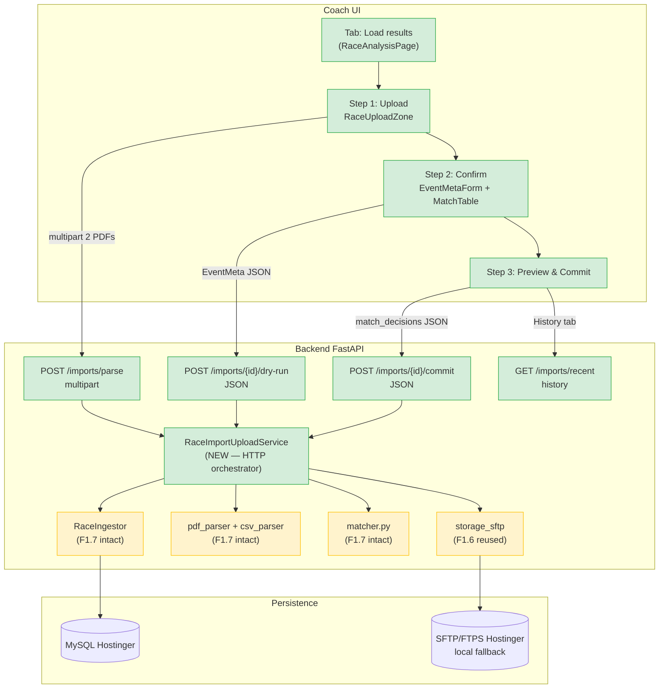
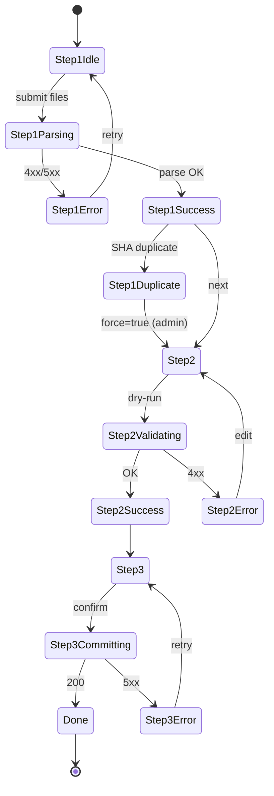

# Copa Valle PDF Upload UI — Technical Design

**Project:** Club Deportivo Trocha y Ruta — Youth XCO
**Module:** `services/race/` + `routers/race_analysis.py` + `frontend/src/routes/results/`
**Date:** 2026-05-20
**Author:** System Architect agent
**Status:** Technical design — ready for `/sc:workflow` + `/sc:implement`
**Audience:** coach (UX validation), architect/dev (implementation)
**Authoritative input:** `docs/10-race-results/upload-research.md` (prior research)

---

## 0. Executive Summary

This phase exposes the deterministic F1.7 ingestion pipeline to the coach through a **3-step wizard** inside `RaceAnalysisPage`, without touching the proven business logic (305 green tests, 98% coverage in `services/race/`).

**Architectural bet:** thin HTTP wrapper over `RaceIngestor` + guided UI that materializes the ingestion flow in discrete steps with a safe preview (real dry-run). Changes under control:

- **Backend:** 3 REST endpoints + 1 new column in `RaceImport` + dry-run in `RaceIngestor` (~30 LOC).
- **Frontend:** 1 new tab ("Load results") + `RaceUploadWizard` component with 3 sub-steps + reuse of existing patterns.
- **Storage:** PDFs stored in Hostinger SFTP/FTPS with UUID in path (local fallback in dev). Permanent retention.
- **Migration:** Alembic delta on `RaceImport` (4 new columns, all nullable + safe default).

**Does not do in MVP:** create athletes inline, edit metadata post-commit without re-uploading, support sources other than official Federation PDF/CSV, polling/SSE (ingestion is synchronous <60s).

---

## 1. Resolution of open questions from research

### 1.1 Store PDF in storage after processing?

**Decision:** **YES, store both PDFs in SFTP/FTPS with UUID in path.**

**Reason:**
- Marginal cost (typical PDF = 250 KB; 7 rounds × 2 PDFs × 5 seasons = ~17 MB total).
- Unlocks re-processing capabilities without asking the coach for the file again (future: re-parser with bug fix, evidence in v2 agentic chat, retroactive audit).
- Already public information (the Federation publishes them). Public URL without auth is acceptable + UUID in path mitigates path-guessing.
- Pattern already validated and tested by F1.6 media (`storage_sftp.py` + local fallback).

**Implications:**
- 2 new columns in `RaceImport`: `storage_path` and `storage_url`.
- In dev environments without SFTP envs → local fallback in `static/uploads/race-imports/<series_id>/<event_id>/<uuid>.pdf`.

### 1.2 Wizard 3 endpoints vs 1 mega-POST?

**Decision:** **3 REST endpoints (parse → dry-run → commit).**

**Reason:**
- `pdfplumber` latency with full Round IV PDF: 2-5s locally, up to 8-10s in Render free tier after cold start. Re-parsing on each wizard step is unacceptable UX (the coach would wait 15s just to correct a radio button in step 2).
- Clear separation of responsibilities: `parse` extracts raw data, `dry-run` simulates the ingestion and returns prior `IngestReport`, `commit` persists and saves PDFs.
- `parse_id` (server-side UUID associated with `RaceImport.status=pending`) survives between steps without requiring client state beyond the id.
- Enables future patterns (resume wizard if the coach closes the browser before commit).

**Accepted trade-off:** complexity +1 ephemeral state table (`RaceImport.status=pending`) with implicit TTL (nightly cleanup described in §8). Research confirms that the `status` column already supports the `pending` enum from F1.7.

### 1.3 Support `.csv` MVP or only `.pdf`?

**Decision:** **Support `.pdf` + `.csv` for RESULTS; only `.pdf` for GENERAL.**

**Reason:**
- The service already supports CSV autodispatch by extension (`services/race/csv_parser.py`). Including it in the endpoint = trivial (3-4 extra lines of magic bytes + parser branch).
- Covers the real case **Sevilla V-I 2026** that only has CSV (fixture `valida_i_2026_sevilla.csv` already in repo).
- GENERAL is only published in PDF by the Federation — no real CSV use.

**Validation:**
- PDF magic bytes: `%PDF-` in first 5 bytes.
- CSV magic bytes: not applicable (plain text) → validate that first chunk decodes UTF-8 and contains expected delimiter (`,` or `;` or `\t`).
- Extension whitelist: `.pdf`, `.csv`, `.tsv`, `.txt`.

---

## 2. Proposed architecture

### 2.1 End-to-end diagram



### 2.2 New vs reused components

| Component | Status | Location | Responsibility |
|---|---|---|---|
| `RaceImportUploadService` | **NEW** | `backend/app/services/race/importer/upload_service.py` | Orchestrates parse→dry-run→commit. Persists intermediate state in `RaceImport`. |
| `pdf_parser.parse_*_pdf` | **REUSED** | `backend/app/services/race/pdf_parser.py` | No changes. Accepts `Path`; service writes to tmp and passes the path. |
| `csv_parser.parse_results_csv` | **REUSED** | `backend/app/services/race/csv_parser.py` | No changes. |
| `RaceIngestor.dry_run_event` | **NEW** (~30 LOC) | `backend/app/services/race/ingestor.py` | Same flow as `ingest_event` but `db.rollback()` at the end. Returns fictitious `IngestReport`. |
| `RaceIngestor.ingest_event` | **REUSED** | `backend/app/services/race/ingestor.py` | No changes. |
| `matcher.match_athletes` | **REUSED** | `backend/app/services/race/matcher.py` | Called from service to return top-3 to wizard. |
| `storage_sftp.upload_bytes` | **REUSED** | `backend/app/services/training/storage_sftp.py` | Accepts any `bytes`; PDF works the same as JPG. |
| `routers/race_analysis.py` | **EXTENDED** | `backend/app/routers/race_analysis.py` | +4 endpoints under `/api/race-analysis/imports/*`. |
| `RaceUploadWizard` | **NEW** | `frontend/src/components/race/RaceUploadWizard.tsx` | Visual stepper + client state machine. |
| `RaceUploadZone` | **NEW** | `frontend/src/components/race/RaceUploadZone.tsx` | Simplified clone of `MediaUploadZone` (without thumbnails or consent). |
| `EventMetaForm` | **NEW** | `frontend/src/components/race/EventMetaForm.tsx` | React Hook Form + Zod on `EventMeta`. |
| `MatchDecisionTable` | **NEW** | `frontend/src/components/race/MatchDecisionTable.tsx` | Visual clone of `AttendanceTable` with radios for top-3. |
| `IngestReportCard` | **NEW** | `frontend/src/components/race/IngestReportCard.tsx` | Visual summary of counts + warnings. |
| `RaceAnalysisPage` | **EXTENDED** | `frontend/src/routes/results/RaceAnalysisPage.tsx` | +1 tab "Load results". |
| `api/raceImports.ts` | **NEW** | `frontend/src/api/raceImports.ts` | Axios wrappers for the 4 endpoints. |

### 2.3 Storage strategy

| Aspect | Decision |
|---|---|
| Backend storage | `storage_sftp.upload_bytes` (FTPS Hostinger in prod, local in dev) |
| Path convention | `race-imports/{series_id}/{event_id_or_pending}/{uuid}.{ext}` |
| Original filename | Preserved in `RaceImport.filename` (200 chars). Never used to build path (anti path traversal). |
| Retention | **Permanent** (no TTL). Estimated volume <50 MB for 5 seasons. |
| Public URL | Yes (same as training session media). Mitigation: UUID in path → path-guessing unfeasible. |
| Orphan PDF cleanup | Only applies to `RaceImport.status=pending` with `created_at < NOW() - 24h` (see §8). |
| Cleanup on failed `dry-run` or `commit` | Do NOT delete PDF — useful for post-mortem troubleshooting. |

### 2.4 Idempotency: re-uploading same PDF

| Scenario | Final status | UI behavior |
|---|---|---|
| New SHA, parse OK | `pending` → `committed` | Wizard completes normally |
| SHA already existing with `committed` status (same PDF, same or different coach) | **`parse` detects in step 1 and blocks** | Yellow banner: "This PDF was ingested on YYYY-MM-DD by <coach>. Force re-process?" (explicit checkbox; default off; requires admin role to activate) |
| SHA already existing with `pending` status (abandoned wizard) | Reuses existing `RaceImport` | Wizard resumes in step 2 with persisted data |
| SHA already existing with `failed` status | Allows retry | New flow from step 1 (does not block) |
| Corrected PDF (same round, different sha) | Creates new `RaceImport`; `RaceResult` skips duplicate rows via UNIQUE | Wizard completes; informational banner "N already-existing results were found and not updated" |

**Key note:** the idempotency logic is already in `RaceIngestor.ingest_event` (`ingestor.py:220-238`). The new `upload_service` only adds the SHA check in `parse` for early UX (avoid the coach completing all 3 steps if their PDF is a duplicate).

---

## 3. DB schema delta

### 3.1 Alembic migration needed

**Yes.** A delta migration on `race_imports`, all columns **nullable or with safe default** to not break the 3 existing F1.7 imports.

### 3.2 New columns in `race_imports`

| Column | Type | Nullable | Default | Purpose |
|---|---|---|---|---|
| `event_id` | INT FK→`race_events.id ON DELETE SET NULL` | YES | NULL | Direct link to the ingested event (avoids indirect JOIN via `RaceResult.imported_from_id`). NULL for F1.7 legacy imports. |
| `kind` | ENUM(`results`, `general`) | NO | `'results'` | Discriminates PDF type (today one import can have both files associated — see §3.3 on 1-row vs 2-rows strategy). Default `results` for legacy imports. |
| `storage_path` | VARCHAR(500) | YES | NULL | Internal relative path in the backend storage. NULL for legacy imports. |
| `storage_url` | VARCHAR(500) | YES | NULL | Public URL of the stored PDF. NULL for legacy imports. |
| `general_filename` | VARCHAR(255) | YES | NULL | Original filename of GENERAL (if it exists). NULL if only RESULTS was uploaded. |
| `general_sha256` | CHAR(64) | YES | NULL | SHA256 of GENERAL for deduplication. NULL if not applicable. |
| `general_storage_path` | VARCHAR(500) | YES | NULL | Internal path of GENERAL. |
| `general_storage_url` | VARCHAR(500) | YES | NULL | Public URL of GENERAL. |
| `parse_meta_json` | JSON | YES | NULL | Snapshot of the detected/edited `EventMeta` + matches preview, to resume interrupted wizard. NULL post-commit. |

**1-row vs 2-rows decision:** **1 row per ingestion**, with duplicated `general_*` columns for the optional second file. Reason: the domain is "one ingestion = one event + two related PDFs", not "one ingestion = one file". This avoids additional JOINs to display history in UI and keeps transactionality simple (1 commit = 1 row).

### 3.3 New indexes

| Index | Columns | Purpose |
|---|---|---|
| `ix_race_imports_event` | `event_id` | List imports of a specific event (useful for audit) |
| `ix_race_imports_general_sha` | `general_sha256` | Deduplication of GENERAL PDF |
| `ix_race_imports_status_created` | `(status, created_at DESC)` | Cleanup of old `pending` (see §8) |

### 3.4 Alembic migration — outline

```
revision: 8b9c0d1e2f3a
down_revision: 64c263edd07f   # F1.7 head
description: Upload UI race PDFs — extend race_imports with event_id, kind, storage, general_*, parse_meta
```

**Up operations:**
1. `ADD COLUMN event_id INT NULL, ADD CONSTRAINT fk_race_imports_event FOREIGN KEY (event_id) REFERENCES race_events(id) ON DELETE SET NULL`
2. `ADD COLUMN kind ENUM('results','general') NOT NULL DEFAULT 'results'`
3. `ADD COLUMN storage_path VARCHAR(500) NULL, storage_url VARCHAR(500) NULL`
4. `ADD COLUMN general_filename VARCHAR(255) NULL, general_sha256 CHAR(64) NULL, general_storage_path VARCHAR(500) NULL, general_storage_url VARCHAR(500) NULL`
5. `ADD COLUMN parse_meta_json JSON NULL`
6. Create listed indexes.

**Down operations:** drop columns in reverse order + drop FK + drop indexes.

**Legacy compatibility:** F1.7 imports remain with `event_id=NULL`, `kind='results'`, all `storage_*` and `general_*` NULL. The history UI (§4 endpoint 4) shows them as "Legacy import" (without PDF download link).

---

## 4. API contracts

All under prefix `/api/race-analysis/imports/` (consistent with `raceAnalysis.ts:24-32`).

### 4.1 `POST /api/race-analysis/imports/parse`

Uploads files, validates format/size/magic bytes, parses, returns preview + intermediate ID.

**Request:** `multipart/form-data`
- `results_file: File` (required) — PDF or CSV
- `general_file: File` (optional) — PDF only

**Response 200:** `ImportParseResponse`
```python
class ImportParseResponse(BaseModel):
    parse_id: int  # = RaceImport.id (status='pending')
    results_sha256: str  # 64 hex chars
    general_sha256: str | None
    results_filename: str
    general_filename: str | None
    detected_header: EventHeaderPreview | None  # valida_num + location + date
    categories_found: list[str]  # e.g. ["INF-A-M", "PJUV-B-F", ...]
    total_rows_results: int
    total_rows_general: int | None
    warnings: list[ParseWarning]
    duplicate_warning: DuplicateImportInfo | None  # if SHA already committed
```

**RBAC:** `Depends(require_role([UserRole.admin, UserRole.coach]))`

**Errors:**
| Code | Reason |
|---|---|
| 400 | Empty file, unsupported extension, same SHA in results and general |
| 403 | Parent role or not authenticated |
| 413 | File > 8 MB (settings `race_max_pdf_mb`) |
| 415 | Unaccepted content-type or invalid magic bytes (`%PDF-` not found / CSV not UTF-8) |
| 422 | Malformed PDF: parser extracts no recognizable categories |
| 500 | Storage or DB failure |

### 4.2 `POST /api/race-analysis/imports/{parse_id}/dry-run`

Executes `RaceIngestor.dry_run_event` with metadata + coach decisions. Rolls back at end, returns prior `IngestReport`.

**Request:** `application/json`
```python
class ImportDryRunRequest(BaseModel):
    event_meta: EventMeta  # existing schema from F1.7
    match_decisions: dict[str, int | None]  # {"BIB-42": 17, "BIB-99": None, ...}
    force_reingest: bool = False  # only admin can set true
```

**Response 200:** `ImportDryRunResponse`
```python
class ImportDryRunResponse(BaseModel):
    parse_id: int
    report: IngestReport  # existing schema: competitors_*, results_*, tyr_count, warnings
    matches_preview: list[MatchPreview]  # final decisions snapshot to confirm
    will_create_event: bool
    will_update_event_id: int | None
```

**RBAC:** `Depends(require_role([UserRole.admin, UserRole.coach]))` + verify `parse_id` belongs to user (or admin role).

**Errors:**
| Code | Reason |
|---|---|
| 400 | Invalid `EventMeta` (valida_num out of range, temperature out of range) |
| 403 | `parse_id` belongs to another coach |
| 404 | `parse_id` doesn't exist or already `committed`/`failed` |
| 409 | SHA duplicate and `force_reingest=False` |
| 422 | Unknown category in seed (blocking) |
| 500 | DB failure |

### 4.3 `POST /api/race-analysis/imports/{parse_id}/commit`

Executes `RaceIngestor.ingest_event` definitively + uploads both PDFs to storage + updates `RaceImport` with `event_id`, `storage_*`, `status=committed`.

**Request:** `application/json`
```python
class ImportCommitRequest(BaseModel):
    event_meta: EventMeta
    match_decisions: dict[str, int | None]
    force_reingest: bool = False
    confirm: bool  # must be True; guard against accidental commits
```

**Response 200:** `ImportCommitResponse`
```python
class ImportCommitResponse(BaseModel):
    parse_id: int
    event_id: int
    series_id: int
    report: IngestReport
    storage_url_results: str | None  # NULL if local fallback in dev
    storage_url_general: str | None
```

**RBAC:** same as dry-run + verify `confirm=True`.

**Errors:**
| Code | Reason |
|---|---|
| 400 | `confirm=False` or invalid request schema |
| 403 | `parse_id` doesn't belong to user |
| 404 | `parse_id` doesn't exist |
| 409 | SHA duplicate and `force_reingest=False` |
| 422 | DB validation (unknown category) |
| 500 | Storage failure (with ingestion transaction rollback) |

**Critical behavior:** if storage upload fails **after** `db.commit()`, the endpoint returns 500 but data remains in DB. Mitigation: upload PDFs **before** the ingestor's final commit; if storage fails, abort before DB commit (see flow §4.5).

### 4.4 `GET /api/race-analysis/imports/recent`

List of recent imports for the history tab.

**Query params:**
- `series_id: int | None` (default = active series 2026)
- `limit: int = 20` (max 100)
- `status: RaceImportStatus | None` (default = `committed`)

**Response 200:**
```python
class ImportListItem(BaseModel):
    id: int
    event_id: int | None
    event_name: str | None  # e.g. "Round IV — Cali"
    valida_num: int | None
    event_date: date | None
    status: RaceImportStatus
    filename: str
    general_filename: str | None
    storage_url: str | None
    general_storage_url: str | None
    imported_by_user_id: int
    imported_by_name: str
    imported_at: datetime
    stats: dict | None  # snapshot of IngestReport
```

**RBAC:** `Depends(require_role([UserRole.admin, UserRole.coach]))`.

**Errors:** standard (400 invalid query, 403 no role, 500 DB).

### 4.5 Internal orchestrator flow (commit endpoint)


**Key note:** PDFs are uploaded **before** the final `db.commit()`. If DB fails, the service attempts `delete_object` (best-effort, log if fails). If storage fails, abort before touching DB. This avoids storage⇆DB inconsistencies 99% of the time; the remaining 1% (storage delete fails post-rollback) remains as an orphan detectable in the nightly cleanup.

---

## 5. Detailed UI/UX flow

### 5.1 Location: new tab in `RaceAnalysisPage`

Insert as **second tab** between "New analysis" and "Active runs":

| Pos | Current tab | Change |
|---|---|---|
| 1 | New analysis (`new`) | No changes |
| 2 | **Load results (`upload`)** | **NEW** |
| 3 | Active runs (`active`) | No changes |
| 4 | History (`history`) | No changes MVP. Future: integrate `RaceImport` table here. |

**Reason:** loading is the logically prior step to analysis. Maintaining separate tabs (not submenu) preserves keyboard navigation and deep-link (`?tab=upload`).

### 5.2 Wizard 3 steps — ASCII mockups

**Step 1 — Upload**
```
╔══════════════════════════════════════════════════════════════╗
║ Load Copa Valle results                                      ║
║ Step 1 of 3: Select files                                    ║
╠══════════════════════════════════════════════════════════════╣
║                                                              ║
║  RESULTS (PDF or CSV)                           [required]   ║
║  ┌────────────────────────────────────────────────────────┐  ║
║  │                                                        │  ║
║  │     [+] Drag file or click                             │  ║
║  │         Maximum 8 MB · .pdf .csv .tsv                  │  ║
║  │                                                        │  ║
║  └────────────────────────────────────────────────────────┘  ║
║                                                              ║
║  GENERAL (PDF only)                             [optional]   ║
║  ┌────────────────────────────────────────────────────────┐  ║
║  │                                                        │  ║
║  │     [+] Drag file or click                             │  ║
║  │         Maximum 8 MB · .pdf                            │  ║
║  │                                                        │  ║
║  └────────────────────────────────────────────────────────┘  ║
║                                                              ║
║                                  [Analyze files →]           ║
╚══════════════════════════════════════════════════════════════╝
```

**Post-parse state (success):**
```
╔══════════════════════════════════════════════════════════════╗
║ Step 1 of 3: Files analyzed ✓                                ║
╠══════════════════════════════════════════════════════════════╣
║  ✓ RESULTS: valida_iv_2026_resultados.pdf (246 KB)           ║
║    SHA: 7f3a...b2c1                                          ║
║    26 categories · 227 riders                                ║
║                                                              ║
║  ✓ GENERAL: valida_iv_2026_general.pdf (160 KB)              ║
║    SHA: 9b8c...4f0e · 339 rows                               ║
║                                                              ║
║  ℹ Header detected: Round IV · Cali · 17 May 2026            ║
║                                                              ║
║  [Change files]                  [Continue to step 2 →]      ║
╚══════════════════════════════════════════════════════════════╝
```

**SHA duplicate state:**
```
║  ⚠ This PDF was already ingested on 2026-05-12 by coach.    ║
║    Result: 224 insertions, 3 skipped.                        ║
║    Re-processing will generate 0 new insertions (idempotent).║
║                                                              ║
║    [ ] Force re-ingestion (admin only, requires confirmation)║
║                                                              ║
║  [Change files]                  [Continue to step 2 →]      ║
```

**Step 2 — Confirm metadata + matches**
```
╔══════════════════════════════════════════════════════════════╗
║ Step 2 of 3: Confirm event data                              ║
╠══════════════════════════════════════════════════════════════╣
║  EVENT DATA                                                  ║
║  ┌────────────────────────────────────────────────────────┐  ║
║  │ Round #   [IV  ▼]   Date [2026-05-17]                  │  ║
║  │ City       [Cali_______________________]               │  ║
║  │ Weather    [Sunny ▼]   Temp °C  [24]                   │  ║
║  │ Surface    [Dry    ▼]   Altitude [1000] masl            │  ║
║  │ Notes      [_____________________________________]     │  ║
║  └────────────────────────────────────────────────────────┘  ║
║                                                              ║
║  TYR ATHLETES — Confirm matches (3 detected)                 ║
║  ┌──────┬──────────────────────┬──────────────────────────┐  ║
║  │ Bib  │ Name in PDF          │ Proposed match           │  ║
║  ├──────┼──────────────────────┼──────────────────────────┤  ║
║  │ 042  │ JUAN PEREZ MORA      │ ● Juan Pérez (PJUV-B)    │  ║
║  │      │ PJUV-B-M             │   score: 95 · age 13.2   │  ║
║  │      │                      │ ○ Juan Pérez R (INF-A)   │  ║
║  │      │                      │ ○ Not a TyR athlete      │  ║
║  ├──────┼──────────────────────┼──────────────────────────┤  ║
║  │ 089  │ MARIA GONZALEZ TAPIA │ ○ No match               │  ║
║  │      │ INF-A-F              │ ● Pending — create       │  ║
║  │      │                      │   athlete later          │  ║
║  └──────┴──────────────────────┴──────────────────────────┘  ║
║                                                              ║
║  PARSER WARNINGS (non-blocking)                              ║
║  ⚠ 2 anomalous times (<25 min in INF-A) — check manually     ║
║                                                              ║
║                          [← Back]   [Final preview →]        ║
╚══════════════════════════════════════════════════════════════╝
```

**Step 3 — Preview & commit**
```
╔══════════════════════════════════════════════════════════════╗
║ Step 3 of 3: Record preview                                  ║
╠══════════════════════════════════════════════════════════════╣
║  📊 PRIOR SUMMARY (nothing has been saved yet)               ║
║  ┌────────────────────────────────────────────────────────┐  ║
║  │ Event:             Round IV — Cali (NEW)               │  ║
║  │ Categories:        26 (all recognized)                 │  ║
║  │ Competitors:                                           │  ║
║  │   • New to create:         198                         │  ║
║  │   • Existing to update:     29                         │  ║
║  │ Results:                                               │  ║
║  │   • To insert:             225                         │  ║
║  │   • Skipped (duplicates):    2                         │  ║
║  │ Linked TyR athletes:         3 / 5                     │  ║
║  │   (2 remain without athlete — coach will create later) │  ║
║  └────────────────────────────────────────────────────────┘  ║
║                                                              ║
║  ⚠ This action is irreversible via UI. To correct            ║
║    you will need to run manual SQL or re-upload fixed PDF.   ║
║                                                              ║
║  [✓] I confirm the data is correct                           ║
║                                                              ║
║                  [← Edit step 2]   [Confirm and ingest]      ║
╚══════════════════════════════════════════════════════════════╝
```

**Post-commit state (success):**
```
║  ✓ Ingestion complete                                        ║
║                                                              ║
║  Event created: Round IV — Cali (ID 4)                       ║
║  198 competitors · 225 results · 3 TyR athletes              ║
║                                                              ║
║  📄 Download stored PDF:                                     ║
║     • [Results.pdf]    • [General.pdf]                       ║
║                                                              ║
║  [Load another file]    [Go to New analysis →]               ║
```

### 5.3 Decision: where to resolve ambiguous matches

**Decision:** **inline in wizard step 2**, not in a separate modal.

**Reason:**
- Ambiguous matches are rare (typical: 0-2 per round). Modal would be overkill.
- Maintain visual context (bib + PDF name + score) without switching screens.
- Visual pattern `AttendanceTable` already validated with coach (F1.5).

**Exception:** if there are >10 ambiguous matches (edge scenario if a round has many new TyR athletes), the table scrolls internally and a "Only pending" filter is added — without opening a modal.

### 5.4 Component `RaceUploadZone` vs reusing `MediaUploadZone`

**Decision:** **create specific `RaceUploadZone`**.

**Reason:** `MediaUploadZone` has branching for photo/video/route with extra fields (caption, athlete_ids, consent_ack) that don't apply to PDFs. Forcing its reuse introduces boolean flags and dead code. Better to create a simplified component (estimated 60 LOC vs 280 of MediaUploadZone) and share only the drag&drop pattern + `data-testid` conventions.

### 5.5 Client state machine for wizard



---

## 6. Security checklist

State of each research finding in the proposed design:

| Control | Status | How it's covered |
|---|---|---|
| **Magic bytes PDF** | ✅ Covered | Service validates `bytes[0:5] == b"%PDF-"` before writing to tmp. Reject 415 if doesn't match. |
| **Magic bytes CSV** | ✅ Covered | Validate `bytes.decode('utf-8')` successful + first line contains expected delimiter (`,`, `;`, or `\t`). Reject 415. |
| **Max PDF size** | ✅ Covered | `settings.race_max_pdf_mb = 8` (default). Enforced in endpoint via `raw = await file.read(max_bytes + 1)` (validated pattern `training_sessions.py:740-755`). Reject 413. |
| **Anti-XXE** | ⚠️ Accepted | `pdfplumber`/`pdfminer` process PDF binary, not external XML. Low indirect XXE risk. Document as accepted risk in `risk-register`. |
| **Path traversal in filename** | ✅ Covered | Original filename stored in `RaceImport.filename`. Path built server-side: `race-imports/{series_id}/{uuid}.{ext}`. `file.filename` is never used to build paths. |
| **RBAC** | ✅ Covered | All endpoints: `Depends(require_role([UserRole.admin, UserRole.coach]))`. Additional `Depends(require_role([UserRole.admin]))` for `force_reingest=True`. |
| **Cross-coach ownership** | ✅ Covered | Dry-run and commit verify `RaceImport.imported_by_user_id == current_user.id` unless admin. Reject 403. |
| **Rate limiting** | ⚠️ Optional MVP | No global middleware. Upload is an infrequent operation (1-2/month). Suggestion post-MVP: in-memory cap of 5 parses/min per user_id (notifications pattern). Acceptable risk without it. |
| **Parsing sandbox** | ⚠️ Accepted | `pdfplumber` runs in-process. Mitigation: broad try/except in service + timeout `asyncio.wait_for(..., timeout=30)` on parse (fail as 422 "PDF too complex"). |
| **Upload auditor** | ✅ Covered | `RaceImport.imported_by_user_id` already exists + structured log: `logger.info("race_pdf_uploaded user_id=%d sha=%s kind=%s", ...)` without PII. |
| **Logs without PII** | ✅ Covered | Service uses `bib + cat_code` for warnings, never names. Follows inviolable CLAUDE.md convention. |
| **HTTPS** | ✅ Covered | Render free tier exposes TLS by default. Storage SFTP uses FTPS (TLS without verification, accepted by project). |
| **Force re-ingestion admin only** | ✅ Covered | `force_reingest=True` requires additional `require_role([UserRole.admin])` in dry-run and commit endpoints. |

---

## 7. Tests strategy

### 7.1 Backend — pytest

**Coverage target:** ≥90% in `services/race/importer/upload_service.py`, ≥85% in new endpoints of `routers/race_analysis.py`.

**Test plan:**

| Category | Tests | Fixtures |
|---|---|---|
| `upload_service` happy path | parse → dry-run → commit with real PDFs | `valida_iv_2026_resultados.pdf`, `valida_iv_2026_general.pdf` (already exist) |
| `upload_service` magic bytes | rejection of `.pdf` file with HTML content; rejection of CSV with non-UTF-8 characters | `fixtures/race/fake_pdf.txt`, `fixtures/race/fake_csv.bin` (to create) |
| `upload_service` size cap | rejection when body > `race_max_pdf_mb + 1` | PDF inflated to 9 MB (generate in-memory) |
| `upload_service` idempotency | re-parse same SHA → returns non-blocking `duplicate_warning`; commit with `force=false` rejects 409 | reused fixture |
| `upload_service` dry-run rollback | mock `db.commit` to detect it is NOT called; validate `db.rollback` IS called | Existing `FakeAsyncSession` |
| `upload_service` storage failure | mock `storage_sftp.upload_bytes` raises `RuntimeError` → 500 + DB rollback | pytest mock |
| `upload_service` resume pending | start parse, abandon; re-parse same SHA → reuses `RaceImport.id=pending` | fixture |
| Endpoints — RBAC | parent role → 403 on all 4 endpoints; different coach → 403 on dry-run/commit with foreign `parse_id` | TestClient with dummy tokens |
| Endpoints — happy path | TestClient full flow with dependency override on `RaceIngestor` | `valida_iv_2026_*.pdf` |
| Endpoints — error mapping | each HTTP code from contract corresponds to its trigger | mocks |
| Endpoints — cleanup pending | scheduled task deletes `RaceImport.status='pending' AND created_at < NOW()-24h` | freezegun |

**New fixtures to create:**
- `tests/fixtures/race/fake_pdf.txt` (200 bytes, first line NOT `%PDF-`)
- `tests/fixtures/race/fake_csv.bin` (200 binary bytes, not UTF-8 decodable)
- `tests/fixtures/race/oversized.pdf.gz` (8.5 MB decompressed — generated on-the-fly in fixture)

### 7.2 Frontend — vitest + RTL

**Coverage target:** ≥85% statements in new components.

**Test plan:**

| Category | Tests | Mocks |
|---|---|---|
| `RaceUploadZone` | render idle dropzone; drag-over visual; click → file picker; extension + client size validation | `File` constructor + mock event |
| `EventMetaForm` | render with pre-fill data from step 1; Zod validation (valida_num 1-7 ∪ 99, temp -10/50); submit executes callback with valid payload | RHF + Zod in real time |
| `MatchDecisionTable` | render N rows; changing radio updates state; "Only pending" filters correctly | synthetic `MatchPreview[]` data |
| `IngestReportCard` | render counts; warnings expanded/collapsed | synthetic `IngestReport` data |
| `RaceUploadWizard` | state machine: idle→parsing→step2→step3→done; reset on "Load another"; back/forward preserves state | mock axios responses |
| `api/raceImports.ts` | helpers serialize multipart correctly; map 4xx to translated error messages | vitest mock fetch |
| `RaceAnalysisPage` integration | switch to "upload" tab shows wizard; deep-link `?tab=upload` works | router test utils |
| Accessibility | 0 axe-core violations in each wizard step | `vitest-axe` |

### 7.3 E2E — playwright-cli

**Happy path:**
1. Coach login → navigate `/coach/race-analysis?tab=upload`.
2. Upload `valida_iv_2026_resultados.pdf` + `valida_iv_2026_general.pdf`.
3. Wait for parse success.
4. Edit metadata (change weather to "Rain").
5. Confirm matches (3 radios).
6. Advance to step 3 → confirm checkbox → commit.
7. Assert success response + data in DB via direct query.

**Error paths:**
- Upload file > 8 MB → assert 413 toast.
- Upload unofficial PDF → assert 422 toast with actionable message.
- Coach tries to force re-ingestion → assert checkbox not visible (without admin role).

**E2E coverage:** 2 tests (1 happy + 1 error). Estimated runtime <90s with `--reporter=line`.

### 7.4 Test data and privacy

- PDF fixtures `valida_iv_2026_*` are already audited (Step 8 F1.7) — policies documented in `docs/10-race-results/snapshots/privacy-audit.md`.
- New synthetic fixtures contain no PII.

---

## 8. Migration plan

### 8.1 Reversible Alembic migration

**Yes.** All new columns are nullable or have safe defaults. Downgrade tested in local sandbox before applying to prod:

```bash
cd backend
alembic upgrade 8b9c0d1e2f3a   # apply
alembic downgrade -1           # rollback
alembic upgrade head           # re-apply
```

### 8.2 Existing F1.7 data

There are 3 existing imports (the 3 Round IV commits during F1.7 development). Defaults:

| Column | Value for legacy |
|---|---|
| `event_id` | NULL (no direct link; still inferred via `RaceResult.imported_from_id`) |
| `kind` | `'results'` (ENUM default) |
| `storage_path`, `storage_url` | NULL (original PDF not saved in F1.7) |
| `general_*` | NULL (same) |
| `parse_meta_json` | NULL |

**UI:** the history table (`GET /imports/recent`) shows these imports as "Legacy import (no PDF download)" — no download link, no re-process action.

### 8.3 Orphan `pending` cleanup

**Scheduled task** (to configure in `app/services/scheduled/cleanup.py` — if the module doesn't exist, create with APScheduler or similar registered in `main.py` lifespan):

```
Frequency: daily (cron 03:00 UTC)
Logic: DELETE FROM race_imports WHERE status='pending' AND created_at < NOW() - INTERVAL 24 HOUR
Side effect: storage_sftp.delete_object(storage_path) best-effort
```

**Justification:** an abandoned wizard leaves a `RaceImport.status=pending`. Without cleanup they accumulate. 24h is a sufficient window for the coach to resume the wizard (typical scenario: leave halfway, finish the next day).

### 8.4 New environment variables

| Variable | Default | Notes |
|---|---|---|
| `RACE_MAX_PDF_MB` | `8` | Cap per file (results and general independent). |
| `RACE_PARSE_TIMEOUT_SECONDS` | `30` | `asyncio.wait_for` timeout around `parse_results_pdf`. |
| `RACE_PENDING_TTL_HOURS` | `24` | For nightly cleanup. |

`HOSTINGER_SFTP_*` and `HOSTINGER_PUBLIC_BASE_URL` already exist (from F1.6) — **silent operational blocker**: if not configured in Render, PDFs will fall to `static/uploads/` which is ephemeral in free tier. ⚠️ Coordinate with `CLAUDE.md` F1.6 step 9 pending.

---

## 9. Risk register

| # | Risk | Prob | Impact | Mitigation |
|---|---|---|---|---|
| R1 | `HOSTINGER_SFTP_*` envs not configured in Render → ephemeral PDFs, lost after redeploy | High | High | Coordinate F1.6 step 9 deploy before merging this phase. App startup health check logs WARNING if storage_sftp is in fallback mode. |
| R2 | `pdfplumber` hangs with malicious/corrupt PDF | Low | Medium | `asyncio.wait_for(parse, timeout=30)` → 422 if exceeded. Broad try/except in service. |
| R3 | Storage upload successful but DB commit fails → orphan PDF in SFTP | Low | Low | Best-effort `delete_object` in service except. Nightly cleanup detects orphans by `storage_path NOT IN (SELECT storage_path FROM race_imports)`. |
| R4 | Coach abandons wizard after step 1 → `RaceImport.status=pending` accumulates | Medium | Low | Nightly cleanup with TTL 24h (§8.3). |
| R5 | Coach uploads PDF from a different series/season (future: 2027) without system detecting it | Low | Medium | `EventMeta.season` validated in `EventMetaForm` (Zod). Service does NOT infer season automatically; always reads from form input. |
| R6 | `force_reingest` misused by admin → inflated competitor counts | Low | High | Extra confirmation modal before submit. Explanatory banner of idempotent behavior (UNIQUE in `RaceResult` skips, but `competitors_created` can inflate). Structured log. |
| R7 | Render cold start >60s → wizard timeout in commit | Medium | Medium | Document in step 3 banner "The first commit of the day may take up to 60s. Please do not close this window." Explicit loader. Accepted as free tier limitation. |
| R8 | Coach uploads giant PDF (>8 MB) | Low | Low | 413 to client with message "File too large. Maximum 8 MB. Typical Federation PDFs = 250 KB." |
| R9 | XSS via `EventMeta.weather_notes` free field | Low | Medium | Zod sanitization (max 500 chars). Frontend never renders `dangerouslySetInnerHTML` with this field. Backend escapes on persist. |
| R10 | Race condition: 2 coaches upload same PDF simultaneously | Very low | Low | UNIQUE implicit in `(sha256, status='committed')` — second ingestion detects duplicate and aborts cleanly. Behavior already validated in F1.7. |
| R11 | `defusedxml` misaligned: pdfplumber/pdfminer may invoke internal XML with CVE | Low | High | Documented as accepted. Possible F2 mitigation: isolate parser in subprocess with seccomp. Not MVP. |
| R12 | Coach enters match decision for bib that doesn't exist in PDF | Low | Low | `RaceIngestor` already validates (warning if bib not in RESULTS). UI rejects submit if `match_decisions` has invalid keys. |

---

## 10. Decisions closed for the workflow

`/sc:workflow` and `/sc:implement` must respect the following decisions WITHOUT re-consulting:

1. **3 REST endpoints** (parse, dry-run, commit) + 1 listing (recent). No mega-POST.
2. **Wizard 3 steps** in new tab "Load results" inside `RaceAnalysisPage`. No global modal.
3. **Store PDFs in storage** with UUID in path. Permanent retention.
4. **Support `.pdf` + `.csv`/`.tsv`/`.txt`** for RESULTS. Only `.pdf` for GENERAL.
5. **Alembic delta migration on `race_imports`** with 9 new columns (4 indexed). Reversible.
6. **New `RaceIngestor.dry_run_event`** (~30 LOC), mirror of `ingest_event` with final `db.rollback()`.
7. **New `RaceImportUploadService`** as HTTP orchestrator. Do NOT modify `RaceIngestor.ingest_event` or `pdf_parser` or `matcher` or `normalizer`.
8. **`pdf_parser` continues accepting `Path`**: the service writes to `tempfile.NamedTemporaryFile` before passing it. Do NOT refactor to `BinaryIO`.
9. **Magic bytes mandatory**: `%PDF-` for PDF, UTF-8 decoding + delimiter for CSV.
10. **Size cap 8 MB** via new env `RACE_MAX_PDF_MB`.
11. **Timeout 30s** on parse via `asyncio.wait_for` + new env `RACE_PARSE_TIMEOUT_SECONDS`.
12. **RBAC**: admin + coach on all endpoints. `force_reingest=True` requires admin.
13. **Cross-coach ownership** validated in dry-run/commit (parse_id belongs to current_user unless admin).
14. **No SSE or polling**: ingestion is synchronous <60s. UI shows simple loader.
15. **No email to parents** post-commit (consistent with MVP race-results v1 decision).
16. **No inline athlete creation**: matches without candidate remain as "Pending — create later", link to existing CRUD.
17. **New `RaceUploadZone` component** (not reusing `MediaUploadZone`). Estimated 60 LOC.
18. **Nightly cleanup** of orphan `pending` with TTL 24h (env `RACE_PENDING_TTL_HOURS`).
19. **Storage upload BEFORE db.commit** + best-effort `delete_object` on rollback. Residual inconsistency accepted.
20. **F1.7 legacy imports** remain visible in history marked "no PDF download" (event_id NULL, storage_* NULL).
21. **No status polling**: commit returns synchronously. If Render free tier prevents this in some edge case, escalate to F2.
22. **Tests required before merging**: backend ≥90% in upload_service + ≥85% in endpoints; frontend ≥85% in new components; E2E happy path + 1 error path.

---

## 11. Assumptions to validate (⚠️ require input from coach or admin)

| # | Assumption | Action if false |
|---|---|---|
| A1 | Coach is OK with re-uploading the same PDF if they need to correct weather/temperature after commit (re-upload with different SHA or force) | Design "edit metadata without re-uploading" endpoint in F2 |
| A2 | 8 MB cap covers all real cases (current fixtures 246 KB and 160 KB; 32x margin) | Raise to 16 MB |
| A3 | Permanent PDF storage retention is acceptable (estimated volume <50 MB / 5 seasons) | Implement TTL e.g. 2 seasons |
| A4 | "Force re-ingestion" admin-only restriction is acceptable (common coach cannot) | Allow coach with double confirmation |
| A5 | Wizard 3 steps vs single modal with collapsible sections — coach prefers wizard | Convert to single modal |
| A6 | Nightly cleanup TTL 24h on `pending` doesn't cause friction if coach abandons and resumes >24h later | Raise TTL to 7 days or no auto-cleanup |
| A7 | Free text `weather_notes` field doesn't need rich text editor (plain text only) | Integrate markdown editor F2 |
| A8 | `force_reingest=True` is documented as "emergency operation, contact dev" — no guided UX | Create dedicated "Re-process import" flow as separate tab |

---

## 12. Appendix — Orchestrator pseudocode

Pseudocode of `RaceImportUploadService.parse()` to guide `/sc:implement` (not final code):

```
async def parse(results_file, general_file, current_user) -> ImportParseResponse:
    # 1. Validate size + extension + magic bytes (both files)
    results_bytes = await read_with_cap(results_file, max_mb=8)
    validate_magic(results_bytes, ext=ext_of(results_file.filename))
    general_bytes = await read_with_cap(general_file, max_mb=8) if general_file else None
    if general_bytes:
        validate_magic(general_bytes, ext="pdf")

    # 2. SHA256 + check duplicate
    results_sha = sha256(results_bytes)
    duplicate = await find_committed_import(results_sha)

    # 3. Write to tmp to pass Path to existing parser
    with tempfile.NamedTemporaryFile(suffix=ext_of(results_file.filename)) as tmp_r:
        tmp_r.write(results_bytes)
        tmp_r.flush()
        try:
            parsed_results = await asyncio.wait_for(
                asyncio.to_thread(parse_results_pdf if ext == 'pdf' else parse_results_csv, Path(tmp_r.name)),
                timeout=settings.race_parse_timeout_seconds,
            )
            header = parse_event_header(Path(tmp_r.name)) if ext == 'pdf' else None
        except asyncio.TimeoutError:
            raise HTTPException(422, "PDF too complex (>30s parse)")
        except ParseError as e:
            raise HTTPException(422, f"Non-official format: {e}")

    # same for general
    if general_bytes:
        with tempfile.NamedTemporaryFile(suffix=".pdf") as tmp_g:
            tmp_g.write(general_bytes)
            tmp_g.flush()
            parsed_general = await asyncio.wait_for(
                asyncio.to_thread(parse_general_pdf, Path(tmp_g.name)),
                timeout=settings.race_parse_timeout_seconds,
            )

    # 4. Persist RaceImport status=pending with parse_meta_json
    race_import = RaceImport(
        sha256=results_sha,
        filename=results_file.filename,
        general_filename=general_file.filename if general_file else None,
        general_sha256=sha256(general_bytes) if general_bytes else None,
        status=RaceImportStatus.pending,
        imported_by_user_id=current_user.id,
        kind="results",  # default; not differentiating by kind in MVP yet
        parse_meta_json={
            "header": header.dict() if header else None,
            "categories_found": list(parsed_results.keys()),
            "total_rows_results": sum(len(v) for v in parsed_results.values()),
            "total_rows_general": sum(len(v) for v in parsed_general.values()) if general_bytes else None,
        },
    )
    db.add(race_import)
    await db.commit()

    return ImportParseResponse(
        parse_id=race_import.id,
        results_sha256=results_sha,
        general_sha256=race_import.general_sha256,
        results_filename=results_file.filename,
        general_filename=general_file.filename if general_file else None,
        detected_header=header,
        categories_found=list(parsed_results.keys()),
        total_rows_results=race_import.parse_meta_json["total_rows_results"],
        total_rows_general=race_import.parse_meta_json["total_rows_general"],
        warnings=collected_warnings,
        duplicate_warning=duplicate,
    )
```

`dry_run` and `commit` follow a similar pattern: load `RaceImport` by id, validate ownership, reload bytes (from tmp if still exists, or reload from storage if already uploaded, or re-process from memory if we conserved it in `parse_meta_json` — implementation decision), call `RaceIngestor.dry_run_event` or `ingest_event`, return report.

⚠️ **Open implementation question** (not blocking for design): conserve PDF bytes between parse and commit in memory/tmp, or re-upload to storage on parse and download again on commit? Recommendation: **upload to storage on parse** (path with `pending/` prefix), move to final path `race-imports/{series_id}/{event_id}/` on commit. This avoids byte loss if the uvicorn process restarts between parse and commit.

---

## 14. Extension — Race conditions in UI (2026-05-26)

> Delivered and green in tests; pending commit + deploy. Documented here as a closed extension of the original design §4-§5.

### 14.1 Motivation

The longitudinal analytics of the Race Results module (`services/race/analytics.py`: `athlete_progression`, `podium_gap`, `projection`) need environmental context to interpret performance differences between rounds. The same position in Roldanillo (950 masl, dry) vs La Cumbre (1581 masl, rain) is not comparable.

Official Federation PDFs **do not include** weather, temperature, track condition or altitude. The only reliable source is the coach at the time of uploading the PDF (fresh memory) or post-ingest (correction/supplement).

The environmental columns already exist in `race_events` since the Phase 1.7 delta migration (`64c263edd07f`): `climate`, `temperature_c`, `surface_condition`, `altitude_msnm`, `weather_notes`. This extension exposes the capture in the UI without touching the data model.

### 14.2 Capture flow

**Wizard Step 1 — during ingestion (optional).**

`backend/app/routers/race_imports.py::parse_import` accepts 5 additional optional form fields in the `POST /api/race-analysis/imports/parse` multipart:

| Field | Type | Range / Validation |
|---|---|---|
| `climate` | `str` | max 60 chars |
| `temperature_c` | `Decimal` | 0 ≤ x ≤ 50, one decimal |
| `surface_condition` | enum | `seca` \| `humeda` \| `barro` \| `lluvia` \| `mixta` |
| `altitude_msnm` | `int` | 0 ≤ x ≤ 5000 |
| `weather_notes` | `str` | max 2000 chars |

Validated by `ImportParseRequestFields` (Pydantic, `str_strip_whitespace=True`). FastAPI does not apply Pydantic automatically to individual `Form()` fields, so the handler explicitly builds the model to maintain identical invariants to the PATCH B3. Conditions are persisted in `RaceImport.parse_meta_json["conditions"]` and applied to the `RaceEvent` during commit.

**Post-ingest editing (PATCH).**

`backend/app/routers/race_events.py::update_race_event_conditions` exposes:

```
PATCH /api/race-analysis/race-events/{race_event_id}/conditions
```

- **RBAC:** `require_role([UserRole.admin, UserRole.coach])` — parents receive 403.
- **Body:** `RaceEventConditionsUpdate` with `extra="forbid"` (rejects unexpected attributes).
- **Semantics:** partial update via `model_dump(exclude_unset=True)`. Empty body returns current state without touching DB.
- **Response:** `RaceEventConditionsRead` (5 fields + `updated_at`).
- **Codes:** 200 ok / 404 event doesn't exist / 422 out of range / 403 no role.
- **Log:** only modified keys (`sorted(updated_fields.keys())`), never values — `weather_notes` is free text.

Frontend equivalent:
- `frontend/src/api/raceEvents.ts::updateRaceEventConditions`
- `frontend/src/hooks/race/useRaceEventConditions.ts::useUpdateRaceEventConditions` (mutation with query invalidation).

### 14.3 `VENUE_ALTITUDES` catalog

`frontend/src/types/raceEvents.types.ts` exports the approximate altitude catalog (masl) for the 7 usual Copa Valle XCO venues:

| Venue | masl |
|---|---|
| Sevilla | 1340 |
| Ginebra | 1080 |
| Cali | 1000 |
| Palmira | 1001 |
| Roldanillo | 950 |
| Yumbo | 1021 |
| La Cumbre | 1581 |

**Reason:** avoid typos in data that later feed analytics (an accidental `2000` biases the altitude projection calculation). The wizard pre-loads the `altitude_msnm` field when it detects an exact match in `location`, reducing friction when the coach is uploading the PDF post-event and only remembers the venue. The coach can overwrite the value.

### 14.4 UX decision — ToggleGroup chips ≥48 px

For `surface_condition` the native select (`<select>`) was discarded in favor of `ToggleGroup` chips:

- **Real usage context:** the coach uploads PDFs from tablet in race areas with direct sunlight. Native selects on iOS/Android lose contrast and require an extra tap that causes confusion.
- **Touch size:** `min-h-[48px]` on each `ToggleGroupItem` meets WCAG / Apple HIG guidance (44 px min, 48 px recommended) — a precise tap avoids wrong selections with wet fingers.
- **Option visibility:** the 5 conditions (Dry / Wet / Mud / Rain / Mixed) fit in one wrap row; the coach sees them all without opening a menu.
- **Implementation:** `ImportWizard.tsx:771-794` with `aria-label` per chip and `data-testid` for Playwright.

Collateral bug fixed: `noValidate` was added to the `<form>` (`ImportWizard.tsx:572`) so that native HTML5 validation doesn't fire before Zod — previously it blocked the "Next" button with browser messages in English instead of Zod errors in Spanish.

### 14.5 Tri-state card without warning language

`frontend/src/components/race/RaceConditionsCard.tsx` shows the state of conditions on the event detail page with three modes based on `countFilledFields(c)`:

| Fields filled | Status | UI | Coach/admin button |
|---|---|---|---|
| 0 | Empty | Collapsed card with placeholder | "Add" |
| 1-3 | Partial | Missing in `text-[rgba(34,42,53,0.35)]` with legend `— no record —` | "Complete" |
| ≥4 | Complete | Normal grid with formatted values | "Edit" |

**Inviolable decision:** no warning icons, no yellow/red colors, no "Incomplete" badges. Environmental data is optional enrichment — the coach must not feel that the app is scolding them for not filling it out. The neutral gray placeholder communicates absence without moralizing.

The `EmptyPlaceholder` has `aria-label="No record of {label}"` so screen readers explicitly announce the absence.

Editing via `EditConditionsDialog.tsx` (side Sheet, lazy-loaded to not inflate the wizard chunk): pre-loads with current `RaceEventConditions`, validates with RHF + Zod, calls `useUpdateRaceEventConditions` on save. Only visible if `currentUser.role ∈ {coach, admin}` (verified by `useAuthStore`); parents see the read-only card without buttons.

### 14.6 Neutral toast in wizard

If the coach tries to advance from Step 1 without filling any condition, a toast is shown (`data-testid="wizard-conditions-toast"`, auto-hides at 5s) with text:

> "Conditions not recorded — you can add them later from the event."

This is not an error or a warning: it is an informational reminder that post-ingest editing exists. Does not block the advance.

### 14.7 Privacy

- The `weather_notes` placeholder (textarea) includes explicit guidance: *"General track and weather conditions — avoid including athlete names or medical information"*.
- PATCH logs record only the **keys** modified, never the values (a misused `weather_notes` could include a name that should not persist in structured logs).
- The X1 privacy audit detected and corrected 3 pre-existing placeholders:
  - 1 HIGH: real name "Andrés Mejía" hardcoded in `revision_reason` fixtures (replaced by fictional marked placeholder).
  - 2 MEDIUM: `weather_notes` placeholders without the previous privacy guidance.

### 14.8 Test coverage

- **Backend:** 27 new tests (16 PATCH `/race-events/{id}/conditions` + 11 `POST /imports/parse` extended). Includes regression of the Decimal serialization bug (HTTP 500 → 422) that occurred when invalid `temperature_c` propagated a non-JSON-serializable `Decimal` through `ValidationError.errors()[i]["input"]`. Solution: pass `errors()` through `jsonable_encoder` before returning the 422.
- **Frontend:** 55 new tests (vitest + 5 a11y with jest-axe). Cover wizard (ToggleGroup, auto-altitude, toast, `noValidate`), `RaceConditionsCard` (tri-state + role visibility), `EditConditionsDialog` (pre-load + validation + mutation), API client and hook.

### 14.9 Compatibility

- F1.7 already-committed imports remain without conditions (NULL) — the card shows them in "Empty" state with "Add" button for coach/admin.
- No Alembic migration: the columns already exist from `64c263edd07f`.

---

## 13. Next steps

1. **Validate assumptions A1-A8 with coach** (estimated 15 min conversation).
2. **`/sc:workflow upload-design.md`** to generate a detailed implementation plan.
3. **`/sc:implement`** by phase: backend (migration + service + endpoints + tests) → frontend (components + wizard + tests) → E2E.
4. **Coordinate with F1.6 step 9** (`HOSTINGER_SFTP_*` envs in Render) — operational blocker.
5. **Code review** before merging to `main`.

---

## Appendix — New environment variables

```env
# Upload UI race PDFs (this phase)
RACE_MAX_PDF_MB=8
RACE_PARSE_TIMEOUT_SECONDS=30
RACE_PENDING_TTL_HOURS=24

# Inherited from F1.6 (must be configured in Render)
HOSTINGER_SFTP_HOST=<...>
HOSTINGER_SFTP_PORT=21
HOSTINGER_SFTP_USER=<...>
HOSTINGER_SFTP_PASS=<...>
HOSTINGER_SFTP_REMOTE_DIR=<...>
HOSTINGER_PUBLIC_BASE_URL=<...>
```

---

**End of document.**
