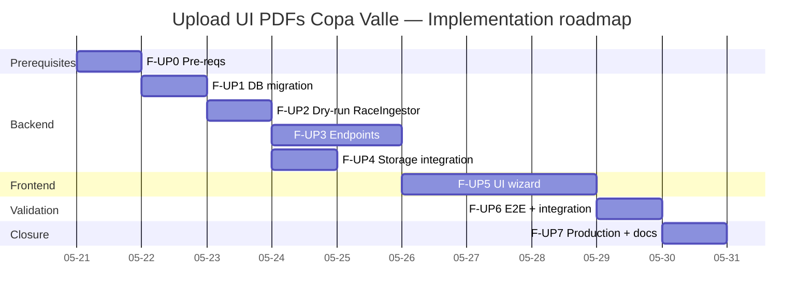
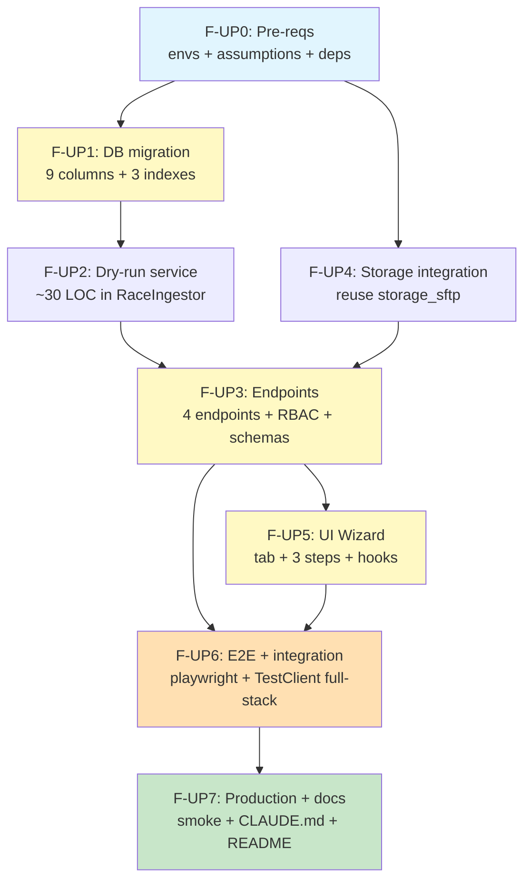

# Implementation Workflow — Copa Valle PDF Upload UI

**Source:** `docs/10-race-results/upload-design.md` (920 lines, 23 closed decisions) + `docs/10-race-results/upload-research.md`
**Strategy:** Systematic
**Depth:** Deep
**Generated:** 2026-05-20
**Estimated total:** 6.5–8 dev-days (1 backend + 1 frontend in parallel) | **sequential:** ~10 days
**Status:** Ready to execute (23 closed decisions, 8 assumptions to validate pre-start)
**Suggested branch:** `race-results-v2-foundation` (continue) or dedicated feature branch `feat/race-upload-ui`

---

## Requirements summary

### Functional (extracted from design §1, §4, §5)

- Coach uploads RESULTS PDFs (+ optional GENERAL) from the web UI without terminal.
- Wizard 3 steps: **Upload → Confirm metadata + matches → Preview & Commit**.
- Multi-format support: `.pdf` / `.csv` / `.tsv` / `.txt` for RESULTS, only `.pdf` for GENERAL.
- Real server-side dry-run: the wizard shows `IngestReport` prior to commit with transparent rollback.
- Inline resolution of top-3 ambiguous matches (radio buttons in the same view, not a separate modal).
- Idempotency visible to user: SHA duplicate detected in step 1 with actionable banner + admin `force_reingest` option.
- Ingestion history: `GET /imports/recent` listable from UI with download of original PDFs.
- RBAC: coach + admin only. `force_reingest=True` requires admin.
- Deterministic F1.7 pipeline **intact** — all proven logic (305 tests) is wrapped, not modified.
- PDF storage in Hostinger SFTP/FTPS with UUID in path (local fallback in dev). Permanent retention.

### Non-functional

| Attribute | Target |
|---|---|
| p50 parse typical PDF (250 KB) | <3s local, <8s Render free tier (cold) |
| p95 complete commit (parse + storage + DB) | <60s incl. cold start |
| Backend coverage `upload_service.py` | ≥90% |
| Backend coverage `race_analysis` upload endpoints | ≥85% |
| Frontend coverage new components | ≥85% |
| PDF size cap | 8 MB (env `RACE_MAX_PDF_MB`) |
| Parse timeout | 30s (env `RACE_PARSE_TIMEOUT_SECONDS`) |
| `RaceImport` pending TTL | 24h (env `RACE_PENDING_TTL_HOURS`) |
| Existing F1.7 tests | 305/305 green throughout migration |
| UI accessibility | 0 axe-core violations per wizard step |
| Supported browsers | Chrome, Safari, Firefox |
| 0 PII leaks in logs | inviolable sentinel (CLAUDE.md) |

### Out of scope MVP

- ❌ Create athletes inline from wizard (link to existing CRUD).
- ❌ Edit metadata post-commit without re-uploading PDF (deferred F2).
- ❌ Rich text editor in `weather_notes` (plain text).
- ❌ Polling / SSE for commit (synchronous <60s).
- ❌ Automatic email on uploading results (consistent with MVP race-results v1).
- ❌ Rate limiting on upload endpoints (infrequent operation, accepted risk).
- ❌ Parser subprocess sandbox (timeout mitigation sufficient for MVP).
- ❌ Concurrent multi-coach editing of same `parse_id` (cross-coach ownership blocks).

---

## Visual roadmap



---

## Dependency DAG



**Critical path:** F-UP0 → F-UP1 → F-UP2 → F-UP3 → F-UP5 → F-UP6 → F-UP7 (~7 sequential days).

**Parallelization opportunities:**
- **F-UP4 (storage)** and **F-UP2 (dry-run)** run in parallel after F-UP1 (different files, different agents).
- **F-UP5 (frontend)** can start with **endpoint mocks** while F-UP3 finishes its tests (estimated: 1 day saving if backend and frontend are different devs).
- **F-UP6 backend integration tests** are prepared while F-UP5 advances UI components (quality-engineer runs in background with fixtures already available).

**Real reduction with parallelization 1 backend + 1 frontend:** ~6.5 days (vs 10 sequential).

---

## Phase F-UP0 — Prerequisites

**Time:** 0.5 day | **Risk:** Medium (silent blocker if envs not confirmed) | **Blocks:** everything else

### Prerequisites

- [x] Branch `race-results-v2-foundation` active
- [x] F1.7 race results complete and green (305 tests, 98% coverage)
- [x] Design `upload-design.md` approved (23 decisions)
- [ ] Validate 8 design §11 assumptions with coach (or document them as accepted)
- [ ] Confirm status of `HOSTINGER_SFTP_*` envs in Render (R1 blocker from design)

### Atomic tasks

| # | Task | Agent | Command | Deliverable |
|---|---|---|---|---|
| 0.1 | Verify `HOSTINGER_SFTP_HOST/PORT/USER/PASS/REMOTE_DIR` + `HOSTINGER_PUBLIC_BASE_URL` in Render dashboard. If missing → add them before continuing | devops-architect | manual (query Render dashboard) | Screenshot/checklist of configured envs; or open ticket if coach action needed |
| 0.2 | Validate 8 design §11 assumptions with coach (15 min session). Document results in `docs/10-race-results/upload-design.md` §11 updating status to "accepted" or recording refinement | system-architect | manual (coach session) | Table §11 updated with field "Status: accepted YYYY-MM-DD" or "refined → see decision D-X" |
| 0.3 | Verify Python deps already present: `pdfplumber`, `defusedxml>=0.7`, `gpxpy`, `Pillow`, `paramiko` (from F1.6), `python-multipart` (FastAPI uploads) | backend-architect | `grep -E "pdfplumber\|defusedxml\|paramiko\|python-multipart" backend/requirements.txt` | Positive grep output; add if missing |
| 0.4 | Add new envs to `.env.example`: `RACE_MAX_PDF_MB=8`, `RACE_PARSE_TIMEOUT_SECONDS=30`, `RACE_PENDING_TTL_HOURS=24` | devops-architect | manual | Updated `.env.example` + documentation in CLAUDE.md "Production environment variables" section |
| 0.5 | Current race suite still green post `.env.example` changes (sanity check) | quality-engineer | `cd backend && pytest tests/services/race/ -x` | 305/305 green in ≤30s |
| 0.6 | Create negative synthetic fixtures for future tests: `tests/fixtures/race/fake_pdf.txt` (200 bytes without `%PDF-`), `tests/fixtures/race/fake_csv.bin` (200 non-UTF-8-decodable binary bytes) | quality-engineer | manual | 2 files in repo |

### Success criterion

```bash
# End-to-end F-UP0 verification:
grep "RACE_MAX_PDF_MB" backend/.env.example                       # output: 1 line
grep "HOSTINGER_SFTP_HOST" backend/.env.example                   # output: already present F1.6
ls tests/fixtures/race/fake_pdf.txt tests/fixtures/race/fake_csv.bin  # both exist
cd backend && pytest tests/services/race/ -x                       # 305/305 green
# Render envs confirmed via dashboard or explicit open issue if action needed
```

### Rollback

- No destructive changes. If a §11 assumption turns out false → reassess specific phase before continuing.
- `git checkout -- .env.example` to revert if necessary.

### Workflow tactical decisions

- **DT-1:** If a `HOSTINGER_SFTP_*` env is empty in Render at F-UP0 close, **block F-UP4** and proceed with rest of workflow in "dev-only" mode. Mark UP7 as WIP until resolved.
- **DT-2:** If assumption A3 (permanent retention) is refined to TTL, add additional task in F-UP1 for column `retention_until DATETIME NULL` (effort +0.25 day).

### Primary agent: **devops-architect** (coordination) + **system-architect** (assumptions validation)

⚠️ **Potential blocker:** `HOSTINGER_SFTP_*` envs (R1 from design). Without these, F-UP4 falls to ephemeral local fallback in Render free tier.

---

## Phase F-UP1 — DB migration + `RaceImport` model

**Time:** 0.5 day | **Risk:** Low (all columns nullable) | **Depends on:** F-UP0

### Prerequisites

- F-UP0 complete
- Pre-flight: dev DB snapshot before migrating (`mysqldump` local) for quick rollback

### Atomic tasks

| # | Task | Agent | Command | Deliverable |
|---|---|---|---|---|
| 1.1 | Create Alembic migration `8b9c0d1e2f3a` delta on `race_imports` (down_revision = `64c263edd07f` F1.7 head) per design §3.4 | backend-architect | `cd backend && alembic revision -m "upload UI race PDFs delta"` | `backend/alembic/versions/8b9c0d1e2f3a_upload_ui_race_pdfs_delta.py` with 9 columns + 3 indexes + reversible FK |
| 1.2 | Update model `backend/app/models/race_import.py` with 9 new attributes (`event_id`, `kind`, `storage_path`, `storage_url`, `general_filename`, `general_sha256`, `general_storage_path`, `general_storage_url`, `parse_meta_json`) | backend-architect | `/sc:implement` | SQLAlchemy 2 model with correct types + relationship `event: Mapped[Optional["RaceEvent"]] = relationship(...)` |
| 1.3 | Apply migration locally and verify `DESCRIBE race_imports` | backend-architect | `cd backend && alembic upgrade head` | `DESCRIBE` output confirms 9 new columns |
| 1.4 | Test reversible downgrade | quality-engineer | `cd backend && alembic downgrade -1 && alembic upgrade head` | Idempotent, no errors |
| 1.5 | Model unit tests: instantiation with/without optional fields, correct defaults | quality-engineer | `/sc:test` | `tests/models/test_race_import.py` ≥5 green tests |
| 1.6 | F1.7 race suite still green post-migration | quality-engineer | `cd backend && pytest tests/services/race/` | 305/305 green |
| 1.7 | Verify F1.7 legacy imports remain correctly with defaults (`event_id=NULL`, `kind='results'`) | quality-engineer | `cd backend && python -c "import asyncio; from app.database import async_session; async def chk():\n  async with async_session() as s:\n    rs = await s.execute('SELECT id, event_id, kind, storage_path FROM race_imports'); print(rs.fetchall())\nasyncio.run(chk())"` | Output: 3 legacy imports with `event_id=NULL`, `kind='results'`, `storage_path=NULL` |

### Success criterion

```bash
cd backend
alembic upgrade head                                     # no errors
alembic downgrade -1                                     # reversible
alembic upgrade head                                     # re-apply OK
pytest tests/models/test_race_import.py -x               # ≥5 green tests
pytest tests/services/race/ -x                           # 305/305 green
```

### Rollback

```bash
cd backend
alembic downgrade 64c263edd07f
git revert <commit-phase-up1>
mysql -e "DESCRIBE race_imports"   # confirm original structure
```

### Primary agent: **backend-architect** + **quality-engineer** (regression)

---

## Phase F-UP2 — Service layer: real dry-run in `RaceIngestor`

**Time:** 0.5 day | **Risk:** Low (~30 LOC, mirror of existing method) | **Depends on:** F-UP1

### Prerequisites

- `RaceImport` model updated (F-UP1)
- Study `ingestor.py:138-402` to understand `ingest_event` flow before mirroring

### Atomic tasks

| # | Task | Agent | Command | Deliverable |
|---|---|---|---|---|
| 2.1 | Implement `RaceIngestor.dry_run_event(...)` mirror of `ingest_event` with `await self.db.rollback()` at end instead of `commit()` | backend-architect | `/sc:implement` | Method in `backend/app/services/race/ingestor.py` with same signature + returns `IngestReport` with `warnings` enriched with `"DRY_RUN: no changes persisted"` |
| 2.2 | Minimal refactor: extract common body of `ingest_event` and `dry_run_event` to private method `_execute_ingest_flow(commit: bool = True)` if DRY justifies it. If not, accepted duplication for simplicity | refactoring-expert | `/sc:improve` | Optional refactor; both methods still pass tests |
| 2.3 | Dry-run unit tests: mock `db.commit` to verify it is NOT called; `db.rollback` IS called; returned `IngestReport` has same counts as real `ingest_event` | quality-engineer | `/sc:test` | `tests/services/race/test_dry_run.py` ≥6 green tests with `FakeAsyncSession` |
| 2.4 | Integration tests: execute `dry_run_event` with real PDF `valida_iv_2026_resultados.pdf` → verify 0 rows in `race_results` after call | quality-engineer | `/sc:test` | Test verifies `SELECT COUNT(*) FROM race_results WHERE event_id=<dry_event_id>` == 0 |
| 2.5 | F1.7 race suite still green | quality-engineer | `cd backend && pytest tests/services/race/` | 305 + new = ≥311 green |

### Success criterion

```bash
cd backend
pytest tests/services/race/test_dry_run.py -x                    # ≥6 green
pytest tests/services/race/ -x                                    # ≥311 total green
pytest tests/services/race/test_dry_run.py --cov=app.services.race.ingestor --cov-report=term-missing
# Coverage ingestor.py ≥95% (maintained from F1.7 baseline 98%)
```

### Rollback

`git revert <commit-phase-up2>` — no DB or storage changes, fully reversible.

### Primary agent: **backend-architect**

---

## Phase F-UP3 — Backend endpoints (4 endpoints + RBAC + schemas + tests)

**Time:** 1.5 days | **Risk:** Medium (multipart, magic bytes, cross-coach ownership, idempotency) | **Depends on:** F-UP2 + F-UP4 (storage)

### Prerequisites

- Dry-run in `RaceIngestor` functional (F-UP2)
- `storage_sftp.upload_bytes` validated (F-UP4 parallel)
- Reference multipart router pattern: `routers/training_sessions.py:690-786`

### Atomic tasks

| # | Task | Agent | Command | Deliverable |
|---|---|---|---|---|
| 3.1 | Pydantic schemas in `backend/app/schemas/race_imports.py`: `ImportParseResponse`, `ImportDryRunRequest`, `ImportDryRunResponse`, `ImportCommitRequest`, `ImportCommitResponse`, `ImportListItem`, `EventHeaderPreview`, `MatchPreview`, `ParseWarning`, `DuplicateImportInfo` per design §4 | backend-architect | `/sc:implement` | 10 Pydantic v2 schemas with `model_config = ConfigDict(from_attributes=True)` |
| 3.2 | Service `backend/app/services/race/importer/upload_service.py` with class `RaceImportUploadService` and methods `parse(...)`, `dry_run(...)`, `commit(...)`, `list_recent(...)` per design §12 pseudocode | backend-architect | `/sc:implement` | Async orchestrator, ≤400 LOC; reuses `pdf_parser`, `csv_parser`, `matcher`, `RaceIngestor`, `storage_sftp` |
| 3.3 | Helper `_validate_upload(file, allowed_exts, max_mb) -> bytes` with magic bytes + cap + ext whitelist (pattern `training_sessions.py:740-765`) | backend-architect | `/sc:implement` | Reusable function in service. PDF: `%PDF-` in bytes[0:5]. CSV: `.decode('utf-8')` + expected delimiter in first line |
| 3.4 | Helper `_compute_sha256(content: bytes) -> str` | backend-architect | `/sc:implement` | Trivial but centralized function for tests |
| 3.5 | Helper `_check_duplicate(sha256, db) -> DuplicateImportInfo | None` | backend-architect | `/sc:implement` | Query `RaceImport` WHERE sha256=X AND status='committed' |
| 3.6 | Endpoint `POST /api/race-analysis/imports/parse` (multipart) in `backend/app/routers/race_analysis.py` | backend-architect | `/sc:implement` | RBAC `Depends(require_role([UserRole.admin, UserRole.coach]))`, returns `ImportParseResponse` |
| 3.7 | Endpoint `POST /api/race-analysis/imports/{parse_id}/dry-run` (JSON body) | backend-architect | `/sc:implement` | Verifies ownership + status=pending, executes `service.dry_run` |
| 3.8 | Endpoint `POST /api/race-analysis/imports/{parse_id}/commit` (JSON body with mandatory `confirm: bool`) | backend-architect | `/sc:implement` | Upload PDFs before final `db.commit()`; best-effort `delete_object` on rollback (design §4.5) |
| 3.9 | Endpoint `GET /api/race-analysis/imports/recent?series_id=&limit=&status=` | backend-architect | `/sc:implement` | Paginated list with join to `User.full_name` and `RaceEvent.name` |
| 3.10 | Additional RBAC `force_reingest=True` requires admin role (validate in service, return 403 if coach tries to set it) | security-engineer | `/sc:implement` | Explicit check in `service.dry_run` and `service.commit` |
| 3.11 | Anti path-traversal: original filename only stored in `RaceImport.filename`; storage_path built `race-imports/{series_id}/{uuid}.{ext}` server-side (design §6) | security-engineer | `/sc:implement` | Verified in code review + test with filename `"../../etc/passwd.pdf"` |
| 3.12 | Timeout 30s on parse with `asyncio.wait_for(asyncio.to_thread(parse_results_pdf, path), timeout=settings.race_parse_timeout_seconds)` | backend-architect | `/sc:implement` | `TimeoutError` exception mapped to HTTP 422 with message "PDF too complex" |
| 3.13 | TestClient backend tests `tests/routers/test_race_imports.py` (≥18 tests covering: happy path, RBAC parent 403, RBAC cross-coach ownership 403, 400 empty file, 413 oversized, 415 magic bytes, 422 malformed PDF, 409 SHA duplicate, 404 non-existent parse_id, idempotency re-parse, dry-run rollback verified, commit happy with storage mock, storage failure DB rollback) | quality-engineer | `/sc:test` | `tests/routers/test_race_imports.py` ≥18 green, endpoint coverage ≥85% |
| 3.14 | Service unit tests `tests/services/race/test_upload_service.py` (≥12 tests covering magic bytes validation, sha256 computation, duplicate detection, resume pending, ownership check) | quality-engineer | `/sc:test` | ≥12 green, coverage `upload_service.py` ≥90% |
| 3.15 | Test fixture: PDF inflated to 9 MB on-the-fly for 413 test | quality-engineer | `/sc:test` | pytest fixture `oversized_pdf` (BytesIO with padding) |
| 3.16 | Manual smoke test with `curl` or `httpie` (3 endpoints + listing) | quality-engineer | manual | Screenshots/log in PR description |

### Success criterion

```bash
cd backend
pytest tests/routers/test_race_imports.py -x                                        # ≥18 green
pytest tests/services/race/test_upload_service.py -x                                # ≥12 green
pytest --cov=app.services.race.importer.upload_service \
       --cov=app.routers.race_analysis \
       --cov-report=term-missing tests/                                              # service ≥90%, router ≥85%

# Smoke test endpoints
curl -X POST http://localhost:8000/api/race-analysis/imports/parse \
  -H "Authorization: Bearer $COACH_TOKEN" \
  -F "results_file=@docs/10-race-results/snapshots/valida_iv_2026_resultados.pdf"
# → {"parse_id": 4, "results_sha256": "7f3a...", "detected_header": {...}, ...}
```

### Rollback

`git revert <commits-phase-up3>` — isolated endpoints, does not affect existing routers. New service in new file.

### Workflow tactical decisions

- **DT-3:** Structure `upload_service.py` as a **class with session + storage DI** (not a standalone function) to facilitate mocks in tests without aggressive monkey-patching.
- **DT-4:** PDFs uploaded to `race-imports/pending/{parse_id}/{uuid}.{ext}` in `parse`; in `commit` moved (SFTP rename) to `race-imports/{series_id}/{event_id}/{uuid}.{ext}`. Mitigation of the "open implementation question" from design §12 appendix.

### Primary agent: **backend-architect** + **security-engineer** (RBAC + path traversal + ownership) + **quality-engineer** (tests)

---

## Phase F-UP4 — Storage integration (PDFs in SFTP/FTPS)

**Time:** 0.5 day | **Risk:** Low (reuse of F1.6 wrapper validated in production) | **Depends on:** F-UP0 (envs verified)

### Prerequisites

- F-UP0 complete (`HOSTINGER_SFTP_*` envs confirmed in Render or fallback documented)
- `services/training/storage_sftp.py` reviewed (research §Storage SFTP)

### Atomic tasks

| # | Task | Agent | Command | Deliverable |
|---|---|---|---|---|
| 4.1 | Identify usage points in `upload_service.py` and create helper `_upload_pdf_to_storage(bytes, series_id, parse_id, ext) -> tuple[storage_path, storage_url]` delegating to `storage_sftp.upload_bytes` with path strategy `race-imports/{series_id_or_pending}/{parse_id}/{uuid}.{ext}` | backend-architect | `/sc:implement` | Helper in `upload_service.py` |
| 4.2 | Verify that `storage_sftp.delete_object(storage_path)` is invoked best-effort on commit rollback (design §4.5) | backend-architect | `/sc:implement` | try/except in cleanup; log warning if delete fails |
| 4.3 | Tests with mock SFTP: `tests/services/race/test_upload_storage.py` (≥8 tests covering upload success, delete success, upload failure, best-effort delete without raise) | quality-engineer | `/sc:test` | ≥8 green |
| 4.4 | Local fallback tests: temporarily unset SFTP envs, verify upload uses `static/uploads/race-imports/` correctly | quality-engineer | `/sc:test` | Test verifies fallback writes to local filesystem |
| 4.5 | Verify `static/uploads/race-imports/` is included in static mount in `main.py` (if not, add to equivalent config from F1.6) | backend-architect | `/sc:implement` | `main.py` mount confirmed or extended |
| 4.6 | Document in CLAUDE.md "Production environment variables" section that `HOSTINGER_SFTP_*` are now **shared** between F1.6 media and F-UP race imports | devops-architect | `/sc:document` | Updated section |

### Success criterion

```bash
cd backend
pytest tests/services/race/test_upload_storage.py -x        # ≥8 green
# Local fallback smoke
unset HOSTINGER_SFTP_HOST
pytest tests/services/race/test_upload_storage.py::test_fallback_local -x
ls static/uploads/race-imports/                              # PDF file created in fallback
```

### Rollback

`git revert <commit-phase-up4>` — no new structure, only helpers in `upload_service.py`.

### Primary agent: **backend-architect** (with devops-architect to verify envs)

⚠️ **Blocked by assumption A-1 if A1 triggers TTL instead of permanent retention:** add additional cleanup task, not a real blocker for this phase.

---

## Phase F-UP5 — Frontend UI wizard (tab + 3 steps + hooks)

**Time:** 2.5 days | **Risk:** Medium (wizard state machine, UX HITL matches, polling of status post-commit not applicable here but parse may feel slow) | **Depends on:** F-UP3

### Prerequisites

- Backend endpoints working (F-UP3) or JSON mocks ready
- Current Phase 1 frontend operational
- shadcn/ui + Tailwind + TanStack Query + React Hook Form + Zod already available

### Atomic tasks

| # | Task | Agent | Command | Deliverable |
|---|---|---|---|---|
| 5.1 | API client `frontend/src/api/raceImports.ts` with 4 axios functions: `parseImport(filesFormData)`, `dryRunImport(parseId, body)`, `commitImport(parseId, body)`, `listRecentImports(params)` | react-ui-engineer | `/sc:implement` | Typed wrappers with TS interfaces generated from Pydantic schemas |
| 5.2 | TanStack Query hooks: `useImportParse()` (mutation), `useImportDryRun(parseId)` (mutation), `useImportCommit(parseId)` (mutation), `useImportsHistory(params)` (query) | react-ui-engineer | `/sc:implement` | `frontend/src/hooks/raceImports.ts` |
| 5.3 | `RaceUploadZone` component (≤60 LOC) in `frontend/src/components/race/RaceUploadZone.tsx` — PDF/CSV dropzone with drag&drop + client validation (ext + 8 MB size) + idle/drag/preview state | react-ui-engineer | `/sc:implement` | Simplified clone of `MediaUploadZone` WITHOUT thumbnails/consent/athlete_chips. `data-testid="race-upload-dropzone"` |
| 5.4 | `EventMetaForm` component with React Hook Form + Zod in `frontend/src/components/race/EventMetaForm.tsx` (validation `valida_num ∈ [1..7] ∪ {99}`, `temp ∈ [-10,50]`, `altitude ∈ [0,6000]`, `surface_condition` enum) | react-ui-engineer | `/sc:implement` | Form pre-filled from `detected_header` with editable fields |
| 5.5 | `MatchDecisionTable` component in `frontend/src/components/race/MatchDecisionTable.tsx` — table with bib + PDF name + top-3 radios + "skip" + "create later" (visual clone `AttendanceTable.tsx`) | react-ui-engineer | `/sc:implement` | Supports "Only pending" filter + internal scroll if >10 rows |
| 5.6 | `IngestReportCard` component in `frontend/src/components/race/IngestReportCard.tsx` — visual summary of counts + collapsible warnings | react-ui-engineer | `/sc:implement` | Renders `IngestReport` with shadcn cards |
| 5.7 | Main `RaceUploadWizard` component in `frontend/src/components/race/RaceUploadWizard.tsx` with 3-step state machine per design §5.5 | react-ui-engineer | `/sc:implement` | Visual stepper + back/forward preserves state + idle/parsing/success/error/duplicate states |
| 5.8 | New "Load results" tab in `frontend/src/routes/results/RaceAnalysisPage.tsx` as **second tab** (between "New analysis" and "Active runs"). Functional deep-link `?tab=upload` | react-ui-engineer | `/sc:implement` | Tab + wizard integration + URL state sync |
| 5.9 | Error state handling: 413 toast "File too large", 415 toast "Unofficial format", 422 expanded banner "Parser details", 409 yellow SHA duplicate banner + `force_reingest` checkbox (visible only if admin) | react-ui-engineer | `/sc:implement` | Cases covered in wizard state machine |
| 5.10 | Cold-start UX: banner "The first commit of the day may take up to 60s" in step 3 + explicit loader during commit (mitigation R7 design) | react-ui-engineer | `/sc:implement` | Conditional banner + shadcn spinner |
| 5.11 | `ImportHistoryTable` component in `frontend/src/components/race/ImportHistoryTable.tsx` — list of recent imports with PDF download links, marks legacy if `event_id IS NULL` | react-ui-engineer | `/sc:implement` | shadcn table below wizard in same tab |
| 5.12 | Vitest + RTL tests: each new component + wizard state machine + hooks + `RaceAnalysisPage` integration + accessibility with jest-axe | quality-engineer | `/sc:test` | `frontend/tests/race-upload/*.test.tsx` ≥35 green tests, coverage ≥85% statements, 0 axe violations |
| 5.13 | Mock service worker (msw) or vitest mocks for axios responses in hook tests | quality-engineer | `/sc:test` | Mock fixtures in `frontend/tests/race-upload/__fixtures__/` |

### Success criterion

```bash
cd frontend
npm run test -- race-upload                           # ≥35 green
npm run test:coverage -- src/components/race        # ≥85% statements
# Manual smoke
npm run dev   # localhost:5173 → /coach/race-analysis?tab=upload
# Drag valida_iv_2026_resultados.pdf → wizard advances step 1 → step 2 → step 3
```

### Rollback

`git revert <commits-phase-up5>` — new tab disappears, rest of SPA intact.

### Workflow tactical decisions

- **DT-5:** Wizard state lives in `RaceUploadWizard` component (useState/useReducer), **not in global Zustand**. The wizard is scoped to the tab; navigating away and back resets it. If persistence is needed → defer F2.
- **DT-6:** Visual stepper with shadcn `Tabs` with `disabled` on unreached steps (do not install new Stepper component if it doesn't exist in registry).

### Primary agent: **react-ui-engineer** + **quality-engineer**

---

## Phase F-UP6 — E2E playwright-cli + full-stack integration

**Time:** 1 day | **Risk:** Medium (orchestration of multiple systems in E2E) | **Depends on:** F-UP5

### Prerequisites

- Backend deployed locally with `docker compose up`
- Frontend in dev mode (`npm run dev`)
- PDF fixtures in `docs/10-race-results/snapshots/`
- `playwright-cli` skill available

### Atomic tasks

| # | Task | Agent | Command | Deliverable |
|---|---|---|---|---|
| 6.1 | Setup playwright config `frontend/playwright.config.ts` (if it doesn't exist) with local baseURL, chromium browser, video/screenshot on failure | quality-engineer | `/sc:test` | Config + browsers installed |
| 6.2 | E2E happy path test: `frontend/tests/e2e/race-upload-happy.spec.ts` (coach login → upload tab → upload 2 PDFs → wait parse → edit EventMeta → confirm matches → step 3 → confirm checkbox → submit → assert success + verify `RaceImport.status=committed` in DB) | quality-engineer | `playwright test race-upload-happy --headed` | 1 green E2E test, screenshots per step |
| 6.3 | E2E error path 1: upload file > 8 MB → assert 413 toast | quality-engineer | `playwright test race-upload-oversized` | Green |
| 6.4 | E2E error path 2: upload unofficial PDF (fixture `fake_pdf.txt` renamed to `.pdf`) → assert 415/422 toast | quality-engineer | `playwright test race-upload-invalid` | Green |
| 6.5 | E2E RBAC: coach login without admin → `force_reingest` checkbox NOT visible in SHA duplicate banner | quality-engineer | `playwright test race-upload-rbac` | Green |
| 6.6 | Full-stack integration test TestClient + FakeSFTP in `backend/tests/integration/test_race_upload_full_stack.py` — invokes `/parse` → `/dry-run` → `/commit` end-to-end without service mock, validates persisted row in DB + populated storage_url | quality-engineer | `pytest tests/integration/test_race_upload_full_stack.py` | ≥3 green tests |
| 6.7 | Concurrency smoke test: 3 parallel coaches upload same PDF → only 1 ingests, the other 2 receive 409 | quality-engineer | `pytest tests/integration/test_race_upload_concurrency.py` | Green test |
| 6.8 | Markdown format screenshots in `docs/10-race-results/upload-screenshots.md` for coach documentation | quality-engineer | manual | 1 .md file with 5-7 embedded screenshots |

### Success criterion

```bash
cd frontend
npx playwright test race-upload                       # 4 green E2E
cd ../backend
pytest tests/integration/test_race_upload_full_stack.py tests/integration/test_race_upload_concurrency.py -x   # ≥4 green
```

### Rollback

E2E tests don't affect prod code. `git revert <commits-phase-up6>` if necessary.

### Workflow tactical decisions

- **DT-7:** If playwright-cli skill is not pre-configured, use the available `playwright-cli` skill (system reminder) to generate initial scaffolding.
- **DT-8:** E2E run against **local docker compose**, not against Render staging. This avoids free tier cold-start flakiness. Prod smoke in F-UP7.

### Primary agent: **quality-engineer**

---

## Phase F-UP7 — Production + documentation

**Time:** 0.5 day | **Risk:** Low | **Depends on:** F-UP6

### Prerequisites

- F-UP6 green
- `HOSTINGER_SFTP_*` envs configured in Render (resolved in F-UP0 or open issue pre-deploy)
- PR approved and merged to `main`

### Atomic tasks

| # | Task | Agent | Command | Deliverable |
|---|---|---|---|---|
| 7.1 | Update `CLAUDE.md` implementation status section adding new table "Upload UI race-results Module (Phase 1.7+)" with steps 1-7 marked ✅ | devops-architect | `/sc:document` | Updated CLAUDE.md |
| 7.2 | Update README/index docs race-results (`docs/10-race-results/README.md` or similar) documenting the web UI as the ingestion flow | devops-architect | `/sc:document` | Redesigned README: main flow = UI |
| 7.3 | Verify auto-deploy to Render after merge to `main` (auto-deploy activated) | devops-architect | manual (Render dashboard) | Build OK, app responds 200 on `/health` |
| 7.4 | Production smoke test: upload 1 real PDF (Round IV already ingested → SHA duplicate expected → actionable banner) | quality-engineer | manual from prod browser | Screenshots of functional wizard |
| 7.5 | Verify uploaded PDFs are accessible at `HOSTINGER_PUBLIC_BASE_URL/race-imports/...` | devops-architect | manual (curl public URL of uploaded fixture) | HTTP 200 + content-type `application/pdf` |
| 7.6 | Schedule cleanup task for `pending` 24h in `app/services/scheduled/cleanup.py` (if module doesn't exist, create with APScheduler or similar registered in `main.py` lifespan) | devops-architect | `/sc:implement` | Daily cron 03:00 UTC, structured log |
| 7.7 | Update `docs/10-race-results/upload-design.md` §11 marking all assumptions as "validated YYYY-MM-DD" or "refined in workflow DT-X" | system-architect | manual | Auditable doc |
| 7.8 | Final commit with changelog in `docs/10-race-results/upload-completion-report.md` (real metrics summary vs estimated, active tactical decisions, lessons learned) | system-architect | manual | 1 new file |

### Success criterion

```bash
# End-to-end post-deploy verification
curl https://mi-2yzi.onrender.com/health                          # 200 OK
# Coach login → /coach/race-analysis?tab=upload (browser)
# Upload PDF → complete wizard → row persisted in MySQL Hostinger
mysql -h <hostinger> -e "SELECT id, status, storage_url, event_id FROM race_imports ORDER BY id DESC LIMIT 1"
# → status=committed, storage_url populated
```

### Rollback

- Code: `git revert <merge-commit>` + manual redeploy from Render.
- DB: `alembic downgrade 64c263edd07f` (leaves F1.7 legacy columns intact; the 3 original F1.7 imports are unaffected; new imports remain as orphans but are recoverable).
- Storage: PDFs on SFTP remain as detectable orphans (without DB rows referencing them). Nightly cleanup will detect them by discrepancy.

### Primary agent: **devops-architect** + **system-architect** (final documentation)

---

## Risk register

| # | Risk | Phase | Prob | Impact | Mitigation |
|---|---|---|---|---|---|
| R1 | `HOSTINGER_SFTP_*` envs not configured in Render → ephemeral PDFs in free tier | F-UP0, F-UP4, F-UP7 | High | High | Coordinate before F-UP4. App startup health check logs WARNING if in fallback mode. Documented as silent blocker in design R1. |
| R2 | `pdfplumber` hangs with malicious/corrupt PDF | F-UP3 | Low | Medium | `asyncio.wait_for(..., timeout=30)` → 422 + broad try/except. Settings env `RACE_PARSE_TIMEOUT_SECONDS`. |
| R3 | Storage upload OK but DB commit fails → orphan PDF in SFTP | F-UP3 | Low | Low | Best-effort `delete_object` in service except. Nightly cleanup detects orphans. |
| R4 | Coach abandons wizard after step 1 → `RaceImport.status=pending` accumulates | F-UP3, F-UP7 | Medium | Low | Nightly cleanup with TTL 24h (F-UP7.6). |
| R5 | Coach uploads PDF from future season without system detecting it | F-UP5 | Low | Medium | `EventMeta.season` validated in `EventMetaForm` (Zod). Backend does not infer season automatically. |
| R6 | `force_reingest` misused by admin → inflated `competitors_created` | F-UP5 | Low | High | Extra confirmation modal + explanatory banner of idempotent behavior. Structured log. |
| R7 | Render cold start >60s → wizard timeout in commit | F-UP5, F-UP6 | Medium | Medium | Explicit banner in step 3. Visible loader. Accepted as free tier limitation (F-UP5.10). |
| R8 | Coach uploads PDF >8 MB | F-UP3, F-UP5 | Low | Low | Client + server 8 MB cap. 413 toast with actionable message. |
| R9 | XSS via free `weather_notes` field | F-UP3, F-UP5 | Low | Medium | Zod max 500 chars. Frontend never renders with `dangerouslySetInnerHTML`. |
| R10 | Race condition: 2 coaches upload same PDF simultaneously | F-UP3 | Very low | Low | Implicit UNIQUE `(sha256, status='committed')`. Second ingestion detects duplicate and aborts cleanly. Covered F-UP6.7. |
| R11 | `defusedxml` misaligned: pdfplumber/pdfminer may invoke internal XML with CVE | F-UP3 | Low | High | Accepted MVP. F2 mitigation: subprocess seccomp. |
| R12 | Ambiguous match UX confuses coach (typical 0-2 per round but edge cases with many new TyR athletes) | F-UP5, F-UP6 | Medium | Medium | "Only pending" filter + internal scroll + optional interactive tour (post-MVP). E2E happy path validates. |
| R13 | Assumption A3 false (permanent retention not acceptable) → need for retroactive TTL | F-UP0, F-UP7 | Low | Medium | Documented in DT-2: if A3 changes, +0.25 day migration for `retention_until`. |
| R14 | playwright tests flaky due to wizard timing | F-UP6 | Medium | Low | Use `expect.poll` + `waitForResponse` instead of `waitForTimeout`. |

---

## Quality gates between phases

| Gate | Before | Criterion | Responsible |
|---|---|---|---|
| QG1 | F-UP0 → F-UP1 | `HOSTINGER_SFTP_*` envs confirmed (or explicit open issue) + assumptions validated | devops-architect + system-architect |
| QG2 | F-UP1 → F-UP2 | Migration applied and reversible + 305 F1.7 tests green + ≥5 new model tests | quality-engineer |
| QG3 | F-UP2 → F-UP3 | Dry-run rollback verified in tests + 0 DB effect post-call | quality-engineer |
| QG4 | F-UP3 → F-UP5 | ≥18 green TestClient tests + ≥12 green service tests + coverage ≥90% service / ≥85% router + smoke curl OK | quality-engineer + security-engineer (RBAC tests) |
| QG5 | F-UP4 → F-UP3 | Mock SFTP tests + local fallback green | quality-engineer |
| QG6 | F-UP5 → F-UP6 | ≥35 vitest tests + 0 axe violations + manual 3-step wizard smoke | quality-engineer |
| QG7 | F-UP6 → F-UP7 | 4 green playwright E2E + full-stack integration green + concurrency test green | quality-engineer |
| QG8 | F-UP7 → CLOSED | Prod smoke + PDF accessible public URL + cleanup task running + docs updated | devops-architect + system-architect |

---

## Complete tests strategy

### Backend — pytest

| Category | File | # tests | Threshold |
|---|---|---|---|
| Models | `tests/models/test_race_import.py` | ≥5 | — |
| Dry-run service | `tests/services/race/test_dry_run.py` | ≥6 | coverage ingestor ≥95% |
| Upload service | `tests/services/race/test_upload_service.py` | ≥12 | coverage service ≥90% |
| Storage integration | `tests/services/race/test_upload_storage.py` | ≥8 | — |
| Endpoints (TestClient) | `tests/routers/test_race_imports.py` | ≥18 | coverage router ≥85% |
| Full-stack integration | `tests/integration/test_race_upload_full_stack.py` | ≥3 | — |
| Concurrency | `tests/integration/test_race_upload_concurrency.py` | ≥1 | — |
| F1.7 regression | `tests/services/race/` | 305 | no changes |
| **Total backend** | | **≥358** | — |

```bash
# Single command:
cd backend
pytest tests/models/test_race_import.py \
       tests/services/race/test_dry_run.py \
       tests/services/race/test_upload_service.py \
       tests/services/race/test_upload_storage.py \
       tests/routers/test_race_imports.py \
       tests/integration/test_race_upload_full_stack.py \
       tests/integration/test_race_upload_concurrency.py \
       --cov=app.services.race.importer.upload_service \
       --cov=app.services.race.ingestor \
       --cov=app.routers.race_analysis \
       --cov-report=term-missing -x
```

### Frontend — vitest + RTL

| Category | File | # tests | Threshold |
|---|---|---|---|
| `RaceUploadZone` | `frontend/tests/race-upload/RaceUploadZone.test.tsx` | ≥5 | — |
| `EventMetaForm` | `frontend/tests/race-upload/EventMetaForm.test.tsx` | ≥6 | — |
| `MatchDecisionTable` | `frontend/tests/race-upload/MatchDecisionTable.test.tsx` | ≥5 | — |
| `IngestReportCard` | `frontend/tests/race-upload/IngestReportCard.test.tsx` | ≥3 | — |
| `RaceUploadWizard` (state machine) | `frontend/tests/race-upload/RaceUploadWizard.test.tsx` | ≥8 | — |
| `api/raceImports.ts` | `frontend/tests/race-upload/api.test.ts` | ≥4 | — |
| `RaceAnalysisPage` integration | `frontend/tests/race-upload/RaceAnalysisPage.test.tsx` | ≥3 | — |
| `ImportHistoryTable` | `frontend/tests/race-upload/ImportHistoryTable.test.tsx` | ≥3 | — |
| Accessibility (axe) | in each file via `expect(container).toHaveNoViolations()` | — | 0 violations |
| **Total frontend** | | **≥37** | coverage ≥85% statements |

```bash
cd frontend
npm run test -- race-upload
npm run test:coverage -- src/components/race src/hooks/raceImports.ts src/api/raceImports.ts
```

### E2E — playwright-cli

| Test | File | Command | Coverage |
|---|---|---|---|
| Complete happy path | `frontend/tests/e2e/race-upload-happy.spec.ts` | `npx playwright test race-upload-happy` | Login → upload 2 PDFs → edit meta → confirm matches → commit → assert DB |
| Oversized | `frontend/tests/e2e/race-upload-oversized.spec.ts` | `npx playwright test race-upload-oversized` | 413 toast |
| Invalid PDF | `frontend/tests/e2e/race-upload-invalid.spec.ts` | `npx playwright test race-upload-invalid` | 415/422 toast |
| RBAC coach | `frontend/tests/e2e/race-upload-rbac.spec.ts` | `npx playwright test race-upload-rbac` | force_reingest hidden |
| **Total E2E** | | **4 tests** | Runtime ≤90s |

```bash
cd frontend
npx playwright test race-upload --reporter=line
# Screenshots/videos in frontend/test-results/
```

### Exact playwright commands for upload flow

```bash
# Initial setup (1 time)
cd frontend
npx playwright install chromium

# Run all race-upload E2E
npx playwright test race-upload --headed --workers=1

# Only happy path with video debug
npx playwright test race-upload-happy --headed --debug

# Generate HTML report
npx playwright test race-upload
npx playwright show-report
```

---

## Exit checklist

### Functionality

- [ ] Coach uploads PDFs from UI without terminal
- [ ] 3-step wizard navigable forward/back preserving state
- [ ] Supports `.pdf` + `.csv`/`.tsv`/`.txt` for RESULTS
- [ ] Supports only `.pdf` for GENERAL (optional)
- [ ] Dry-run shows preview without writing DB (verified in logs)
- [ ] Ambiguous matches resolvable inline with top-3 radios
- [ ] SHA duplicate detected in step 1 with actionable banner
- [ ] `force_reingest` only visible to admin
- [ ] Ingestion history listable + download original PDFs
- [ ] F1.7 legacy imports visible marked "no PDF download"

### Quality

- [ ] Backend coverage `upload_service.py` ≥90%
- [ ] Backend coverage router race_analysis upload ≥85%
- [ ] Frontend coverage new components ≥85% statements
- [ ] F1.7 tests (305) still green
- [ ] 0 axe-core violations in each wizard step
- [ ] E2E happy path + 3 error paths green in chromium
- [ ] Prod smoke with real PDF OK
- [ ] Works Chrome + Safari + Firefox (manual test)

### Performance

- [ ] p50 parse PDF <3s local, <8s Render
- [ ] p95 complete commit <60s incl. cold start
- [ ] 30s parse timeout activated (verified with artificial PDF >30s)
- [ ] Backpressure NOT required MVP (infrequent operation)

### Security

- [ ] Mandatory magic bytes PDF + CSV
- [ ] 8 MB cap enforced client + server
- [ ] Anti path traversal (test with filename `../../etc/passwd.pdf`)
- [ ] RBAC coach + admin on all endpoints
- [ ] Cross-coach ownership validated (403 test)
- [ ] Logs without PII (manual audit with grep)

### Observability

- [ ] Structured logs with `user_id`, `sha256`, `kind` (without names)
- [ ] Nightly cleanup `pending` >24h active
- [ ] PDFs on SFTP accessible via `HOSTINGER_PUBLIC_BASE_URL`

### Documentation

- [ ] CLAUDE.md updated with new "Upload UI race-results Module" table
- [ ] Race-results README redesigned (UI = main flow)
- [ ] `upload-completion-report.md` with real vs estimated metrics + lessons learned
- [ ] `upload-design.md` §11 assumptions marked validated
- [ ] Wizard screenshots in `upload-screenshots.md` for coach

---

## Execution recommendations

### Recommended executive order

```
Day 1 morning:  F-UP0 (pre-reqs + Render envs + coach assumptions)
Day 1 afternoon: F-UP1 (migration) + F-UP4 parallel (storage helpers)
Day 2:          F-UP2 (dry-run) + start F-UP3 schemas/service
Day 3:          F-UP3 endpoints + tests (backend closes)
Days 4-5:       F-UP5 frontend (components + wizard + hooks + vitest tests)
Day 6 morning:  F-UP5 closure (ImportHistoryTable + tab integration)
Day 6 afternoon: F-UP6 E2E playwright + full-stack integration
Day 7:          F-UP7 deploy + prod smoke + docs
```

### Parallelization 1 backend + 1 frontend

```
Day 1:    F-UP0 (both collaborate)
Day 2:    Backend: F-UP1 + F-UP2  |  Frontend: design study + API mocks
Day 3:    Backend: F-UP3 + F-UP4  |  Frontend: F-UP5 base components with mocks
Day 4:    Backend: tests closure + smoke   |  Frontend: F-UP5 wizard + tests
Day 5:    Frontend: F-UP5 closure + real endpoints integration
Day 6:    F-UP6 both (E2E is shared responsibility)
Day 7:    F-UP7 (devops + system-architect)
```

**Estimated saving:** ~3 days vs sequential. Total: **~6.5 days**.

### `/sc:` commands by phase

| Phase | Recommended commands |
|---|---|
| F-UP0 | `/sc:document` (assumptions) + manual envs |
| F-UP1 | `/sc:implement` + `/sc:test` |
| F-UP2 | `/sc:implement` + `/sc:test` |
| F-UP3 | `/sc:implement` + `/sc:test` + `/sc:analyze` (post security review) |
| F-UP4 | `/sc:implement` + `/sc:test` |
| F-UP5 | `/sc:implement` + `/sc:test` + `/sc:design` (UX review if doubts) |
| F-UP6 | `/sc:test` with playwright-cli skill |
| F-UP7 | `/sc:document` + manual deploy |

### When to use specific agents

- **F-UP0:** `devops-architect` (envs) + `system-architect` (assumptions)
- **F-UP1:** `backend-architect` + `quality-engineer`
- **F-UP2:** `backend-architect`
- **F-UP3:** `backend-architect` + `security-engineer` (RBAC + path traversal) + `quality-engineer`
- **F-UP4:** `backend-architect` + `devops-architect`
- **F-UP5:** `react-ui-engineer` + `quality-engineer`
- **F-UP6:** `quality-engineer`
- **F-UP7:** `devops-architect` + `system-architect`

### Immediate next step

**Start F-UP0** with the following order:

```
/sc:implement F-UP0 race-upload: verify HOSTINGER_SFTP_*
envs in Render dashboard, validate 8 design §11 assumptions with coach,
add RACE_MAX_PDF_MB=8, RACE_PARSE_TIMEOUT_SECONDS=30,
RACE_PENDING_TTL_HOURS=24 to .env.example, create synthetic
fixtures tests/fixtures/race/fake_pdf.txt + fake_csv.bin.
Verify pytest tests/services/race/ remains 305/305 green.
```

In parallel: open session with coach for quick assumptions validation A1-A8 (15 min).

---

## Metrics tracking during implementation

| Metric | How to measure | Cadence |
|---|---|---|
| Backend green tests | `pytest tests/` exit 0 | Every commit |
| Frontend green tests | `npm run test` exit 0 | Every commit |
| Backend new coverage | `pytest --cov=app.services.race.importer --cov=app.routers.race_analysis` | At phase closure |
| Frontend new coverage | `npm run test:coverage -- src/components/race` | At phase closure |
| Real vs estimated implementation time | Manual tracking per phase | End of each phase |
| Axe violations | `npm run test -- --reporter=verbose` (jest-axe inline) | F-UP5 closure |
| E2E runtime | `npx playwright test race-upload --reporter=line` | F-UP6 closure |
| p50 parse PDF | structured log `logger.info("parse_duration_ms=...")` | Smoke F-UP3 + prod F-UP7 |

---

## Workflow tactical decisions (summary)

These decisions are additional to the 23 from the design and apply during implementation:

| # | Decision | Phase | Justification |
|---|---|---|---|
| DT-1 | If `HOSTINGER_SFTP_*` envs missing at F-UP0 close → block F-UP4 and mark F-UP7 WIP | F-UP0 | Avoids inconsistent prod deploy |
| DT-2 | If assumption A3 changes to TTL → +0.25 day F-UP1 for `retention_until` | F-UP0 | Plan B documented |
| DT-3 | `RaceImportUploadService` as **class with DI**, not standalone function | F-UP3 | Facilitates mocks without monkey-patch |
| DT-4 | PDFs in `race-imports/pending/{parse_id}/` during parse, moved to `race-imports/{series_id}/{event_id}/` on commit | F-UP3, F-UP4 | Resolves open question §12 design appendix |
| DT-5 | Wizard state in `useState/useReducer` local, not global Zustand | F-UP5 | Limited scope, persistence deferred F2 |
| DT-6 | Stepper with shadcn `Tabs disabled`, do not install new component | F-UP5 | Reuse without new dep |
| DT-7 | Use `playwright-cli` skill available if scaffolding doesn't exist | F-UP6 | Leverages installed skill |
| DT-8 | E2E against local docker compose, prod smoke in F-UP7 | F-UP6 | Avoids Render cold-start flakiness |

---

## Open questions / assumptions to re-validate mid-workflow

| # | Assumption (from design §11) | Validate in phase | Risk if fails |
|---|---|---|---|
| A1 | Coach OK with re-uploading PDF to correct weather post-commit | F-UP5 UX review | Design "edit metadata" endpoint F2 (+0.5 day) |
| A2 | 8 MB cap covers real cases | F-UP3 smoke with historical PDFs | Raise to 16 MB env (trivial) |
| A3 | Permanent retention acceptable | F-UP7 coach | Retroactive TTL (+0.5 day F2) |
| A4 | `force_reingest` admin only | F-UP5 UX | Allow coach with double confirmation (UI rework +0.25 day) |
| A5 | Wizard 3 steps preferred vs single modal | F-UP5 mockup coach | Redesign as modal (+1 day UI) |
| A6 | TTL 24h pending OK | F-UP7 ops | Raise TTL to 7d (trivial env) |
| A7 | `weather_notes` plain text sufficient | F-UP7 coach | Markdown editor F2 (+1 day) |
| A8 | `force_reingest` doc "emergency operation" without guided UX | F-UP7 coach | Dedicated "Re-process" flow separate tab (+1 day F2) |

---

**Document generated by spec-panel agent — `systematic` strategy, `deep` depth, aligned with `v2-implementation-workflow.md` format.**

**Next executive step:** confirm start of F-UP0 + 15 min coach session for assumptions.
