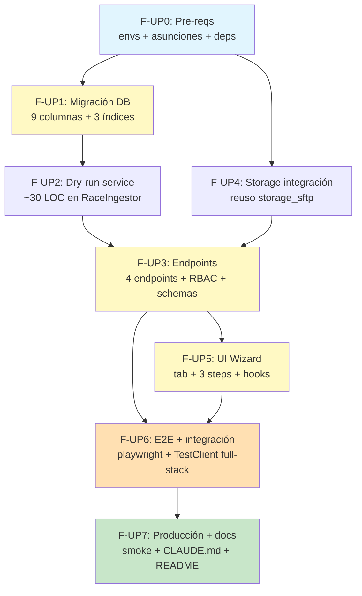

# Implementation Workflow — Upload UI de PDFs Copa Valle

**Source:** `docs/10-race-results/upload-design.md` (920 líneas, 23 decisiones cerradas) + `docs/10-race-results/upload-research.md`
**Strategy:** Systematic
**Depth:** Deep
**Generated:** 2026-05-20
**Estimated total:** 6.5–8 días-dev (1 backend + 1 frontend en paralelo) | **secuencial:** ~10 días
**Status:** Listo para ejecutar (23 decisiones cerradas, 8 asunciones a validar pre-arranque)
**Branch sugerido:** `race-results-v2-foundation` (continuar) o feature branch dedicado `feat/race-upload-ui`

---

## Requirements summary

### Funcionales (extraídos del design §1, §4, §5)

- Coach sube PDFs RESULTADOS (+ opcional GENERAL) desde UI web sin terminal.
- Wizard 3 pasos: **Upload → Confirmar metadata + matches → Preview & Commit**.
- Soporte multi-formato: `.pdf` / `.csv` / `.tsv` / `.txt` para RESULTADOS, solo `.pdf` para GENERAL.
- Dry-run real server-side: el wizard muestra `IngestReport` previo al commit con rollback transparente.
- Resolución inline de matches ambiguos top-3 (radio buttons en la misma vista, no modal separado).
- Idempotencia visible al usuario: SHA duplicado detectado en paso 1 con banner accionable + opción admin `force_reingest`.
- Histórico ingestas: `GET /imports/recent` listable desde UI con download de PDFs originales.
- RBAC: solo coach + admin. `force_reingest=True` requiere admin.
- Pipeline determinista F1.7 **intacto** — toda la lógica probada (305 tests) se envuelve, no se modifica.
- Storage de PDFs en SFTP/FTPS Hostinger con UUID en path (fallback local en dev). Retención permanente.

### No-funcionales

| Atributo | Target |
|---|---|
| p50 parse PDF típico (250 KB) | <3s local, <8s Render free tier (cold) |
| p95 commit completo (parse + storage + DB) | <60s incl. cold start |
| Coverage backend `upload_service.py` | ≥90% |
| Coverage endpoints `race_analysis` upload | ≥85% |
| Coverage frontend componentes nuevos | ≥85% |
| Cap tamaño PDF | 8 MB (env `RACE_MAX_PDF_MB`) |
| Timeout parse | 30s (env `RACE_PARSE_TIMEOUT_SECONDS`) |
| TTL `RaceImport` pending | 24h (env `RACE_PENDING_TTL_HOURS`) |
| Tests F1.7 existentes | 305/305 verdes durante toda la migración |
| Accesibilidad UI | 0 violaciones axe-core por step del wizard |
| Browsers soportados | Chrome, Safari, Firefox |
| 0 fugas PII en logs | sentinela inviolable (CLAUDE.md) |

### Out of scope MVP

- ❌ Crear atletas inline desde el wizard (link al CRUD existente).
- ❌ Editar metadata post-commit sin re-subir PDF (diferido F2).
- ❌ Rich text editor en `weather_notes` (texto plano).
- ❌ Polling / SSE para commit (síncrono <60s).
- ❌ Email automático al subir resultados (consistente con MVP race-results v1).
- ❌ Rate limiting en endpoints upload (operación poco frecuente, riesgo aceptado).
- ❌ Sandbox parser subprocess (mitigación por timeout suficiente para MVP).
- ❌ Multi-coach edición concurrente del mismo `parse_id` (ownership cross-coach bloquea).

---

## Roadmap visual


---

## DAG de dependencias



**Camino crítico:** F-UP0 → F-UP1 → F-UP2 → F-UP3 → F-UP5 → F-UP6 → F-UP7 (~7 días secuencial).

**Oportunidades paralelización:**
- **F-UP4 (storage)** y **F-UP2 (dry-run)** corren en paralelo tras F-UP1 (archivos distintos, agentes distintos).
- **F-UP5 (frontend)** puede arrancar con **mocks de endpoints** mientras F-UP3 termina sus tests (estimado: ahorro 1 día si dev backend y frontend distintos).
- **F-UP6 backend integration tests** se prepara mientras F-UP5 avanza componentes UI (quality-engineer corre en background con fixtures ya disponibles).

**Reducción real con paralelización 1 backend + 1 frontend:** ~6.5 días (vs 10 secuencial).

---

## Fase F-UP0 — Pre-requisitos

**Tiempo:** 0.5 día | **Riesgo:** Medio (bloqueador silencioso si envs no se confirman) | **Bloquea:** todo lo demás

### Prerequisitos

- [x] Branch `race-results-v2-foundation` activo
- [x] F1.7 race results completo y verde (305 tests, 98% cobertura)
- [x] Design `upload-design.md` aprobado (23 decisiones)
- [ ] Validar 8 asunciones del design §11 con coach (o documentarlas como aceptadas)
- [ ] Confirmar status de envs `HOSTINGER_SFTP_*` en Render (bloqueador R1 del design)

### Tareas atómicas

| # | Tarea | Agente | Comando | Deliverable |
|---|---|---|---|---|
| 0.1 | Verificar `HOSTINGER_SFTP_HOST/PORT/USER/PASS/REMOTE_DIR` + `HOSTINGER_PUBLIC_BASE_URL` en Render dashboard. Si missing → agregarlos antes de continuar | devops-architect | manual (consulta Render dashboard) | Screenshot/checklist de envs configuradas; o ticket abierto si falta acción del coach |
| 0.2 | Validar 8 asunciones design §11 con coach (sesión 15 min). Documentar resultados en `docs/10-race-results/upload-design.md` §11 actualizando estado a "aceptada" o registrando refinamiento | system-architect | manual (sesión coach) | Tabla §11 actualizada con campo "Estado: aceptada YYYY-MM-DD" o "refinada → ver decisión D-X" |
| 0.3 | Verificar deps Python ya presentes: `pdfplumber`, `defusedxml>=0.7`, `gpxpy`, `Pillow`, `paramiko` (de F1.6), `python-multipart` (FastAPI uploads) | backend-architect | `grep -E "pdfplumber\|defusedxml\|paramiko\|python-multipart" backend/requirements.txt` | Output positivo de grep; añadir si missing |
| 0.4 | Agregar nuevas envs al `.env.example`: `RACE_MAX_PDF_MB=8`, `RACE_PARSE_TIMEOUT_SECONDS=30`, `RACE_PENDING_TTL_HOURS=24` | devops-architect | manual | `.env.example` actualizado + doc en CLAUDE.md sección "Variables de entorno en producción" |
| 0.5 | Suite race actual sigue verde post-cambios `.env.example` (sanity check) | quality-engineer | `cd backend && pytest tests/services/race/ -x` | 305/305 verdes en ≤30s |
| 0.6 | Crear fixtures sintéticos negativos para tests futuros: `tests/fixtures/race/fake_pdf.txt` (200 bytes sin `%PDF-`), `tests/fixtures/race/fake_csv.bin` (200 bytes binarios no decodificables UTF-8) | quality-engineer | manual | 2 archivos en repo |

### Criterio de éxito

```bash
# Verificación end-to-end F-UP0:
grep "RACE_MAX_PDF_MB" backend/.env.example                       # output: 1 línea
grep "HOSTINGER_SFTP_HOST" backend/.env.example                   # output: ya presente F1.6
ls tests/fixtures/race/fake_pdf.txt tests/fixtures/race/fake_csv.bin  # ambos existen
cd backend && pytest tests/services/race/ -x                       # 305/305 verdes
# Envs Render confirmadas vía dashboard o issue abierto explícito si falta acción
```

### Rollback

- Sin cambios destructivos. Si una asunción §11 resulta falsa → re-plantear fase específica antes de seguir.
- `git checkout -- .env.example` para revertir si necesario.

### Decisiones tácticas del workflow

- **DT-1:** Si una env `HOSTINGER_SFTP_*` está vacía en Render al cierre de F-UP0, **bloquear F-UP4** y proceder con resto del workflow en modo "dev-only". Marcar UP7 como WIP hasta resolver.
- **DT-2:** Si asunción A3 (retención permanente) se refina a TTL, agregar tarea adicional en F-UP1 para columna `retention_until DATETIME NULL` (esfuerzo +0.25 día).

### Agente principal: **devops-architect** (coordinación) + **system-architect** (validación asunciones)

⚠️ **Bloqueador potencial:** envs `HOSTINGER_SFTP_*` (R1 del design). Sin estos, F-UP4 cae a fallback local efímero en Render free tier.

---

## Fase F-UP1 — Migración DB + modelo `RaceImport`

**Tiempo:** 0.5 día | **Riesgo:** Bajo (todas las columnas nullable) | **Depende de:** F-UP0

### Prerequisitos

- F-UP0 completo
- Pre-flight: snapshot dev DB antes de migrar (`mysqldump` local) para rollback rápido

### Tareas atómicas

| # | Tarea | Agente | Comando | Deliverable |
|---|---|---|---|---|
| 1.1 | Crear migración Alembic `8b9c0d1e2f3a` delta sobre `race_imports` (down_revision = `64c263edd07f` head F1.7) según design §3.4 | backend-architect | `cd backend && alembic revision -m "upload UI race PDFs delta"` | `backend/alembic/versions/8b9c0d1e2f3a_upload_ui_race_pdfs_delta.py` con 9 columnas + 3 índices + FK reversible |
| 1.2 | Actualizar modelo `backend/app/models/race_import.py` con 9 atributos nuevos (`event_id`, `kind`, `storage_path`, `storage_url`, `general_filename`, `general_sha256`, `general_storage_path`, `general_storage_url`, `parse_meta_json`) | backend-architect | `/sc:implement` | Modelo SQLAlchemy 2 con tipos correctos + relación `event: Mapped[Optional["RaceEvent"]] = relationship(...)` |
| 1.3 | Aplicar migración local y verificar `DESCRIBE race_imports` | backend-architect | `cd backend && alembic upgrade head` | Output `DESCRIBE` confirma 9 columnas nuevas |
| 1.4 | Probar downgrade reversible | quality-engineer | `cd backend && alembic downgrade -1 && alembic upgrade head` | Idempotente, sin errores |
| 1.5 | Tests unitarios modelo: instanciación con/sin campos opcionales, defaults correctos | quality-engineer | `/sc:test` | `tests/models/test_race_import.py` ≥5 tests verdes |
| 1.6 | Suite race F1.7 sigue verde post-migración | quality-engineer | `cd backend && pytest tests/services/race/` | 305/305 verdes |
| 1.7 | Verificar imports F1.7 legacy quedan correctamente con defaults (`event_id=NULL`, `kind='results'`) | quality-engineer | `cd backend && python -c "import asyncio; from app.database import async_session; async def chk():\n  async with async_session() as s:\n    rs = await s.execute('SELECT id, event_id, kind, storage_path FROM race_imports'); print(rs.fetchall())\nasyncio.run(chk())"` | Output: 3 imports legacy con `event_id=NULL`, `kind='results'`, `storage_path=NULL` |

### Criterio de éxito

```bash
cd backend
alembic upgrade head                                     # sin errores
alembic downgrade -1                                     # reversible
alembic upgrade head                                     # re-apply OK
pytest tests/models/test_race_import.py -x               # ≥5 tests verdes
pytest tests/services/race/ -x                           # 305/305 verdes
```

### Rollback

```bash
cd backend
alembic downgrade 64c263edd07f
git revert <commit-fase-up1>
mysql -e "DESCRIBE race_imports"   # confirmar estructura original
```

### Agente principal: **backend-architect** + **quality-engineer** (regresión)

---

## Fase F-UP2 — Service layer: dry-run real en `RaceIngestor`

**Tiempo:** 0.5 día | **Riesgo:** Bajo (~30 LOC, espejo de método existente) | **Depende de:** F-UP1

### Prerequisitos

- Modelo `RaceImport` actualizado (F-UP1)
- Estudio de `ingestor.py:138-402` para entender flujo `ingest_event` antes de espejar

### Tareas atómicas

| # | Tarea | Agente | Comando | Deliverable |
|---|---|---|---|---|
| 2.1 | Implementar `RaceIngestor.dry_run_event(...)` espejo de `ingest_event` con `await self.db.rollback()` al final en lugar de `commit()` | backend-architect | `/sc:implement` | Método en `backend/app/services/race/ingestor.py` con misma signature + retorna `IngestReport` ficticio con `warnings` enriquecido con `"DRY_RUN: no se persistieron cambios"` |
| 2.2 | Refactor mínimo: extraer cuerpo común de `ingest_event` y `dry_run_event` a método privado `_execute_ingest_flow(commit: bool = True)` si DRY (Don't Repeat Yourself) lo justifica. Si no, duplicación aceptada por simplicidad | refactoring-expert | `/sc:improve` | Refactor opcional; ambos métodos siguen pasando tests |
| 2.3 | Tests unitarios dry-run: mock `db.commit` para verificar que NO se llama; `db.rollback` SÍ se llama; `IngestReport` retornado tiene mismos conteos que `ingest_event` real | quality-engineer | `/sc:test` | `tests/services/race/test_dry_run.py` ≥6 tests verdes con `FakeAsyncSession` |
| 2.4 | Tests integración: ejecutar `dry_run_event` con PDF real `valida_iv_2026_resultados.pdf` → verificar 0 filas en `race_results` tras llamada | quality-engineer | `/sc:test` | Test verifica `SELECT COUNT(*) FROM race_results WHERE event_id=<dry_event_id>` == 0 |
| 2.5 | Suite race F1.7 sigue verde | quality-engineer | `cd backend && pytest tests/services/race/` | 305 + nuevos = ≥311 verdes |

### Criterio de éxito

```bash
cd backend
pytest tests/services/race/test_dry_run.py -x                    # ≥6 verdes
pytest tests/services/race/ -x                                    # ≥311 totales verdes
pytest tests/services/race/test_dry_run.py --cov=app.services.race.ingestor --cov-report=term-missing
# Coverage ingestor.py ≥95% (mantenido del baseline F1.7 98%)
```

### Rollback

`git revert <commit-fase-up2>` — sin cambios DB ni storage, totalmente reversible.

### Agente principal: **backend-architect**

---

## Fase F-UP3 — Endpoints backend (4 endpoints + RBAC + schemas + tests)

**Tiempo:** 1.5 días | **Riesgo:** Medio (multipart, magic bytes, ownership cross-coach, idempotencia) | **Depende de:** F-UP2 + F-UP4 (storage)

### Prerequisitos

- Dry-run en `RaceIngestor` funcional (F-UP2)
- `storage_sftp.upload_bytes` validado (F-UP4 paralelo)
- Patrón router multipart de referencia: `routers/training_sessions.py:690-786`

### Tareas atómicas

| # | Tarea | Agente | Comando | Deliverable |
|---|---|---|---|---|
| 3.1 | Schemas Pydantic en `backend/app/schemas/race_imports.py`: `ImportParseResponse`, `ImportDryRunRequest`, `ImportDryRunResponse`, `ImportCommitRequest`, `ImportCommitResponse`, `ImportListItem`, `EventHeaderPreview`, `MatchPreview`, `ParseWarning`, `DuplicateImportInfo` según design §4 | backend-architect | `/sc:implement` | 10 schemas Pydantic v2 con `model_config = ConfigDict(from_attributes=True)` |
| 3.2 | Service `backend/app/services/race/importer/upload_service.py` con clase `RaceImportUploadService` y métodos `parse(...)`, `dry_run(...)`, `commit(...)`, `list_recent(...)` según design §12 pseudocódigo | backend-architect | `/sc:implement` | Orquestador async, ≤400 LOC; reusa `pdf_parser`, `csv_parser`, `matcher`, `RaceIngestor`, `storage_sftp` |
| 3.3 | Helper `_validate_upload(file, allowed_exts, max_mb) -> bytes` con magic bytes + cap + ext whitelist (patrón `training_sessions.py:740-765`) | backend-architect | `/sc:implement` | Función reutilizable en service. PDF: `%PDF-` en bytes[0:5]. CSV: `.decode('utf-8')` + delimitador esperado en primera línea |
| 3.4 | Helper `_compute_sha256(content: bytes) -> str` | backend-architect | `/sc:implement` | Función trivial pero centralizada para tests |
| 3.5 | Helper `_check_duplicate(sha256, db) -> DuplicateImportInfo | None` | backend-architect | `/sc:implement` | Consulta `RaceImport` WHERE sha256=X AND status='committed' |
| 3.6 | Endpoint `POST /api/race-analysis/imports/parse` (multipart) en `backend/app/routers/race_analysis.py` | backend-architect | `/sc:implement` | RBAC `Depends(require_role([UserRole.admin, UserRole.coach]))`, retorna `ImportParseResponse` |
| 3.7 | Endpoint `POST /api/race-analysis/imports/{parse_id}/dry-run` (JSON body) | backend-architect | `/sc:implement` | Verifica ownership + status=pending, ejecuta `service.dry_run` |
| 3.8 | Endpoint `POST /api/race-analysis/imports/{parse_id}/commit` (JSON body con `confirm: bool` obligatorio) | backend-architect | `/sc:implement` | Subir PDFs antes de `db.commit()` final; `delete_object` best-effort en rollback (design §4.5) |
| 3.9 | Endpoint `GET /api/race-analysis/imports/recent?series_id=&limit=&status=` | backend-architect | `/sc:implement` | Lista paginada con join a `User.full_name` y `RaceEvent.name` |
| 3.10 | RBAC adicional `force_reingest=True` requiere admin role (validar en service, retornar 403 si coach intenta setearlo) | security-engineer | `/sc:implement` | Check explícito en `service.dry_run` y `service.commit` |
| 3.11 | Anti path-traversal: filename original solo se guarda en `RaceImport.filename`; storage_path se construye `race-imports/{series_id}/{uuid}.{ext}` server-side (design §6) | security-engineer | `/sc:implement` | Verificado en code review + test con filename `"../../etc/passwd.pdf"` |
| 3.12 | Timeout 30s en parse con `asyncio.wait_for(asyncio.to_thread(parse_results_pdf, path), timeout=settings.race_parse_timeout_seconds)` | backend-architect | `/sc:implement` | Excepción `TimeoutError` mapeada a HTTP 422 con mensaje "PDF demasiado complejo" |
| 3.13 | Tests TestClient backend `tests/routers/test_race_imports.py` (≥18 tests cubriendo: happy path, RBAC parent 403, RBAC coach cross-ownership 403, 400 archivo vacío, 413 oversized, 415 magic bytes, 422 PDF malformado, 409 SHA duplicado, 404 parse_id inexistente, idempotencia re-parse, dry-run rollback verificado, commit happy con storage mock, storage failure rollback BD) | quality-engineer | `/sc:test` | `tests/routers/test_race_imports.py` ≥18 verdes, coverage endpoints ≥85% |
| 3.14 | Tests unitarios service `tests/services/race/test_upload_service.py` (≥12 tests cubriendo magic bytes validation, sha256 computation, duplicate detection, reanudar pending, ownership check) | quality-engineer | `/sc:test` | ≥12 verdes, coverage `upload_service.py` ≥90% |
| 3.15 | Test fixture: PDF inflado a 9 MB on-the-fly para test 413 | quality-engineer | `/sc:test` | Fixture pytest `oversized_pdf` (BytesIO con padding) |
| 3.16 | Smoke test manual con `curl` o `httpie` (3 endpoints + listado) | quality-engineer | manual | Screenshots/log en PR description |

### Criterio de éxito

```bash
cd backend
pytest tests/routers/test_race_imports.py -x                                        # ≥18 verdes
pytest tests/services/race/test_upload_service.py -x                                # ≥12 verdes
pytest --cov=app.services.race.importer.upload_service \
       --cov=app.routers.race_analysis \
       --cov-report=term-missing tests/                                              # service ≥90%, router ≥85%

# Smoke test endpoints
curl -X POST http://localhost:8000/api/race-analysis/imports/parse \
  -H "Authorization: Bearer $COACH_TOKEN" \
  -F "results_file=@docs/10-race-results/snapshots/valida_iv_2026_resultados.pdf"
# → {"parse_id": 4, "results_sha256": "7f3a...", "detected_header": {...}, ...}
```

### Rollback

`git revert <commits-fase-up3>` — endpoints aislados, no afecta routers existentes. Service nuevo en archivo nuevo.

### Decisiones tácticas del workflow

- **DT-3:** Estructura `upload_service.py` como **clase con DI de session + storage** (no función suelta) para facilitar mocks en tests sin monkey-patching agresivo.
- **DT-4:** PDFs se suben a `race-imports/pending/{parse_id}/{uuid}.{ext}` en `parse`; en `commit` se mueven (rename SFTP) a `race-imports/{series_id}/{event_id}/{uuid}.{ext}`. Mitigación a "open implementation question" del design §12 apéndice.

### Agente principal: **backend-architect** + **security-engineer** (RBAC + path traversal + ownership) + **quality-engineer** (tests)

---

## Fase F-UP4 — Storage integración (PDFs en SFTP/FTPS)

**Tiempo:** 0.5 día | **Riesgo:** Bajo (reuso de wrapper F1.6 validado en producción) | **Depende de:** F-UP0 (envs verificadas)

### Prerequisitos

- F-UP0 completo (envs `HOSTINGER_SFTP_*` confirmadas en Render o fallback documentado)
- `services/training/storage_sftp.py` revisado (research §Storage SFTP)

### Tareas atómicas

| # | Tarea | Agente | Comando | Deliverable |
|---|---|---|---|---|
| 4.1 | Identificar puntos de uso en `upload_service.py` y crear helper `_upload_pdf_to_storage(bytes, series_id, parse_id, ext) -> tuple[storage_path, storage_url]` que delega a `storage_sftp.upload_bytes` con path strategy `race-imports/{series_id_or_pending}/{parse_id}/{uuid}.{ext}` | backend-architect | `/sc:implement` | Helper en `upload_service.py` |
| 4.2 | Verificar que `storage_sftp.delete_object(storage_path)` se invoca best-effort en rollback de commit (design §4.5) | backend-architect | `/sc:implement` | Try/except en cleanup; log warning si delete falla |
| 4.3 | Tests con mock SFTP: `tests/services/race/test_upload_storage.py` (≥8 tests cubriendo upload success, delete success, upload failure, delete best-effort sin raise) | quality-engineer | `/sc:test` | ≥8 verdes |
| 4.4 | Tests fallback local: temporalmente unset envs SFTP, verificar que upload usa `static/uploads/race-imports/` correctamente | quality-engineer | `/sc:test` | Test verifica fallback escribe a filesystem local |
| 4.5 | Verificar que `static/uploads/race-imports/` está incluido en mount estático de `main.py` (si no está, agregar a config equivalente al F1.6) | backend-architect | `/sc:implement` | `main.py` mount confirmado o extendido |
| 4.6 | Documentar en CLAUDE.md sección "Variables de entorno en producción" que `HOSTINGER_SFTP_*` ahora son **compartidas** entre F1.6 media y F-UP race imports | devops-architect | `/sc:document` | Sección actualizada |

### Criterio de éxito

```bash
cd backend
pytest tests/services/race/test_upload_storage.py -x        # ≥8 verdes
# Smoke local fallback
unset HOSTINGER_SFTP_HOST
pytest tests/services/race/test_upload_storage.py::test_fallback_local -x
ls static/uploads/race-imports/                              # archivo PDF creado en fallback
```

### Rollback

`git revert <commit-fase-up4>` — sin estructura nueva, solo helpers en `upload_service.py`.

### Agente principal: **backend-architect** (con devops-architect para verificar envs)

⚠️ **Bloqueado por asunción A-1 si A1 dispara TTL en lugar de retención permanente:** agregar cleanup task adicional, no es bloqueador real para esta fase.

---

## Fase F-UP5 — Frontend UI wizard (tab + 3 steps + hooks)

**Tiempo:** 2.5 días | **Riesgo:** Medio (state machine wizard, UX HITL matches, polling de status post-commit no aplica acá pero parse puede ser percibido lento) | **Depende de:** F-UP3

### Prerequisitos

- Endpoints backend funcionando (F-UP3) o mocks JSON listos
- Frontend Fase 1 actual operativo
- shadcn/ui + Tailwind + TanStack Query + React Hook Form + Zod ya disponibles

### Tareas atómicas

| # | Tarea | Agente | Comando | Deliverable |
|---|---|---|---|---|
| 5.1 | API client `frontend/src/api/raceImports.ts` con 4 funciones axios: `parseImport(filesFormData)`, `dryRunImport(parseId, body)`, `commitImport(parseId, body)`, `listRecentImports(params)` | react-ui-engineer | `/sc:implement` | Wrappers tipados con interfaces TS generadas desde schemas Pydantic |
| 5.2 | Hooks TanStack Query: `useImportParse()` (mutation), `useImportDryRun(parseId)` (mutation), `useImportCommit(parseId)` (mutation), `useImportsHistory(params)` (query) | react-ui-engineer | `/sc:implement` | `frontend/src/hooks/raceImports.ts` |
| 5.3 | Componente `RaceUploadZone` (≤60 LOC) en `frontend/src/components/race/RaceUploadZone.tsx` — dropzone PDF/CSV con drag&drop + validación cliente (ext + tamaño 8 MB) + estado idle/drag/preview | react-ui-engineer | `/sc:implement` | Clon simplificado de `MediaUploadZone` SIN thumbnails/consent/athlete_chips. `data-testid="race-upload-dropzone"` |
| 5.4 | Componente `EventMetaForm` con React Hook Form + Zod en `frontend/src/components/race/EventMetaForm.tsx` (validación `valida_num ∈ [1..7] ∪ {99}`, `temp ∈ [-10,50]`, `altitude ∈ [0,6000]`, `surface_condition` enum) | react-ui-engineer | `/sc:implement` | Form pre-rellenado desde `detected_header` con campos editables |
| 5.5 | Componente `MatchDecisionTable` en `frontend/src/components/race/MatchDecisionTable.tsx` — tabla con bib + nombre PDF + radios top-3 + "skip" + "crear después" (clon visual `AttendanceTable.tsx`) | react-ui-engineer | `/sc:implement` | Soporta filtro "Solo pendientes" + scroll interno si >10 filas |
| 5.6 | Componente `IngestReportCard` en `frontend/src/components/race/IngestReportCard.tsx` — resumen visual conteos + warnings colapsables | react-ui-engineer | `/sc:implement` | Render `IngestReport` con cards shadcn |
| 5.7 | Componente principal `RaceUploadWizard` en `frontend/src/components/race/RaceUploadWizard.tsx` con state machine de 3 pasos según design §5.5 | react-ui-engineer | `/sc:implement` | Stepper visual + back/forward preserva state + idle/parsing/success/error/duplicate states |
| 5.8 | Tab nueva "Cargar resultados" en `frontend/src/routes/results/RaceAnalysisPage.tsx` como **segunda tab** (entre "Nuevo análisis" y "Runs activos"). Deep-link `?tab=upload` funcional | react-ui-engineer | `/sc:implement` | Tab + integración con wizard + URL state sync |
| 5.9 | Manejo de estados error: 413 toast "Archivo demasiado grande", 415 toast "Formato no oficial", 422 banner expanded "Detalles parser", 409 banner amarillo SHA duplicado + checkbox `force_reingest` (visible solo si admin) | react-ui-engineer | `/sc:implement` | Casos cubiertos en wizard state machine |
| 5.10 | UX cold-start: banner "El primer commit del día puede tardar hasta 60s" en step 3 + loader explícito durante commit (mitigación R7 design) | react-ui-engineer | `/sc:implement` | Banner condicional + spinner shadcn |
| 5.11 | Componente `ImportHistoryTable` en `frontend/src/components/race/ImportHistoryTable.tsx` — lista imports recientes con links download PDF, marca legacy si `event_id IS NULL` | react-ui-engineer | `/sc:implement` | Tabla shadcn debajo del wizard en mismo tab |
| 5.12 | Tests vitest + RTL: cada componente nuevo + state machine wizard + hooks + `RaceAnalysisPage` integración + accessibility con jest-axe | quality-engineer | `/sc:test` | `frontend/tests/race-upload/*.test.tsx` ≥35 tests verdes, coverage ≥85% statements, 0 violaciones axe |
| 5.13 | Mock service worker (msw) o vitest mocks para axios responses en tests de hooks | quality-engineer | `/sc:test` | Mock fixtures en `frontend/tests/race-upload/__fixtures__/` |

### Criterio de éxito

```bash
cd frontend
npm run test -- race-upload                           # ≥35 verdes
npm run test:coverage -- src/components/race        # ≥85% statements
# Manual smoke
npm run dev   # localhost:5173 → /coach/race-analysis?tab=upload
# Arrastra valida_iv_2026_resultados.pdf → wizard avanza paso 1 → paso 2 → paso 3
```

### Rollback

`git revert <commits-fase-up5>` — tab nueva desaparece, resto SPA intacto.

### Decisiones tácticas del workflow

- **DT-5:** State del wizard vive en componente `RaceUploadWizard` (useState/useReducer), **no en Zustand global**. El wizard es scoped al tab; navegar fuera y volver reinicia. Si necesitamos persistencia → diferir F2.
- **DT-6:** Stepper visual con shadcn `Tabs` con `disabled` en pasos no alcanzados (no instalar nuevo componente Stepper si no existe en registry).

### Agente principal: **react-ui-engineer** + **quality-engineer**

---

## Fase F-UP6 — E2E playwright-cli + integración full-stack

**Tiempo:** 1 día | **Riesgo:** Medio (orquestación múltiples sistemas en E2E) | **Depende de:** F-UP5

### Prerequisitos

- Backend desplegado en local con `docker compose up`
- Frontend en dev mode (`npm run dev`)
- PDFs fixture en `docs/10-race-results/snapshots/`
- `playwright-cli` skill disponible

### Tareas atómicas

| # | Tarea | Agente | Comando | Deliverable |
|---|---|---|---|---|
| 6.1 | Setup playwright config `frontend/playwright.config.ts` (si no existe) con baseURL local, browser chromium, video/screenshot on failure | quality-engineer | `/sc:test` | Config + browsers instalados |
| 6.2 | Test E2E happy path: `frontend/tests/e2e/race-upload-happy.spec.ts` (login coach → tab upload → upload 2 PDFs → wait parse → editar EventMeta → confirm matches → step 3 → checkbox confirm → submit → assert success + verificar `RaceImport.status=committed` en DB) | quality-engineer | `playwright test race-upload-happy --headed` | 1 test E2E verde, screenshots cada paso |
| 6.3 | Test E2E error path 1: upload archivo > 8 MB → assert toast 413 | quality-engineer | `playwright test race-upload-oversized` | Verde |
| 6.4 | Test E2E error path 2: upload PDF no oficial (fixture `fake_pdf.txt` renombrado a `.pdf`) → assert toast 415/422 | quality-engineer | `playwright test race-upload-invalid` | Verde |
| 6.5 | Test E2E RBAC: login coach sin admin → checkbox `force_reingest` NO visible en banner SHA duplicado | quality-engineer | `playwright test race-upload-rbac` | Verde |
| 6.6 | Test integración full-stack TestClient + FakeSFTP en `backend/tests/integration/test_race_upload_full_stack.py` — invoca `/parse` → `/dry-run` → `/commit` end-to-end sin mock de service, valida fila persistida en BD + storage_url poblado | quality-engineer | `pytest tests/integration/test_race_upload_full_stack.py` | ≥3 tests verdes |
| 6.7 | Smoke test concurrency: 3 coaches paralelos suben mismo PDF → solo 1 ingresa, los otros 2 reciben 409 | quality-engineer | `pytest tests/integration/test_race_upload_concurrency.py` | Test verde |
| 6.8 | Screenshots formato markdown en `docs/10-race-results/upload-screenshots.md` para documentación coach | quality-engineer | manual | 1 archivo .md con 5-7 screenshots embed |

### Criterio de éxito

```bash
cd frontend
npx playwright test race-upload                       # 4 E2E verdes
cd ../backend
pytest tests/integration/test_race_upload_full_stack.py tests/integration/test_race_upload_concurrency.py -x   # ≥4 verdes
```

### Rollback

E2E tests no afectan código de prod. `git revert <commits-fase-up6>` si necesario.

### Decisiones tácticas del workflow

- **DT-7:** Si playwright-cli skill no está pre-configurado, usar el skill `playwright-cli` disponible (system reminder) para generar el scaffolding inicial.
- **DT-8:** E2E corren contra **docker compose local**, no contra Render staging. Esto evita flakiness por cold-start free tier. Smoke prod en F-UP7.

### Agente principal: **quality-engineer**

---

## Fase F-UP7 — Producción + documentación

**Tiempo:** 0.5 día | **Riesgo:** Bajo | **Depende de:** F-UP6

### Prerequisitos

- F-UP6 verde
- Envs `HOSTINGER_SFTP_*` configuradas en Render (resuelto en F-UP0 o issue abierto pre-deploy)
- PR aprobado y mergeado a `main`

### Tareas atómicas

| # | Tarea | Agente | Comando | Deliverable |
|---|---|---|---|---|
| 7.1 | Actualizar `CLAUDE.md` sección "Estado de implementación" agregando nueva tabla "Módulo Upload UI race-results (Fase 1.7+)" con paso 1-7 marcados ✅ | devops-architect | `/sc:document` | CLAUDE.md actualizado |
| 7.2 | Actualizar README/index docs race-results (`docs/10-race-results/README.md` o similar) eliminando instrucción CLI manual del coach, moviéndola a apéndice "Para devs / batch operations" | devops-architect | `/sc:document` | README rediseñado: flujo principal = UI; CLI = avanzado |
| 7.3 | Verificar deploy auto a Render tras merge a `main` (auto-deploy activado) | devops-architect | manual (Render dashboard) | Build OK, app responde 200 en `/health` |
| 7.4 | Smoke test producción: subir 1 PDF real (Válida IV ya ingestada → SHA duplicado esperado → banner accionable) | quality-engineer | manual desde browser prod | Screenshots de wizard funcional |
| 7.5 | Verificar PDFs subidos quedan accesibles en `HOSTINGER_PUBLIC_BASE_URL/race-imports/...` | devops-architect | manual (curl URL pública del fixture subido) | HTTP 200 + content-type `application/pdf` |
| 7.6 | Schedule task de cleanup `pending` 24h en `app/services/scheduled/cleanup.py` (si no existe el módulo, crear con APScheduler o similar registrado en `main.py` lifespan) | devops-architect | `/sc:implement` | Cron 03:00 UTC diario, log estructurado |
| 7.7 | Actualizar `docs/10-race-results/upload-design.md` §11 marcando todas las asunciones como "validada YYYY-MM-DD" o "refinada en workflow DT-X" | system-architect | manual | Doc auditable |
| 7.8 | Commit final con changelog en `docs/10-race-results/upload-completion-report.md` (resumen métricas reales vs estimado, decisiones tácticas activas, lessons learned) | system-architect | manual | 1 archivo nuevo |

### Criterio de éxito

```bash
# Verificación end-to-end post-deploy
curl https://mi-2yzi.onrender.com/health                          # 200 OK
# Login coach → /coach/race-analysis?tab=upload (browser)
# Subir PDF → wizard completo → fila persistida en MySQL Hostinger
mysql -h <hostinger> -e "SELECT id, status, storage_url, event_id FROM race_imports ORDER BY id DESC LIMIT 1"
# → status=committed, storage_url poblada
```

### Rollback

- Code: `git revert <merge-commit>` + redeploy manual desde Render.
- DB: `alembic downgrade 64c263edd07f` (deja columnas legacy F1.7 intactas; los 3 imports F1.7 originales no se ven afectados; los imports nuevos quedan huérfanos pero recuperables).
- Storage: PDFs en SFTP permanecen como huérfanos detectables (sin filas BD que los referencien). Cleanup nocturno los detectará por discrepancia.

### Agente principal: **devops-architect** + **system-architect** (documentación final)

---

## Risk register

| # | Riesgo | Fase | Prob | Impacto | Mitigación |
|---|---|---|---|---|---|
| R1 | Envs `HOSTINGER_SFTP_*` no configuradas en Render → PDFs efímeros en free tier | F-UP0, F-UP4, F-UP7 | Alta | Alto | Coordinar antes de F-UP4. Health check al iniciar app logguea WARNING si modo fallback. Documentado como bloqueador silencioso en design R1. |
| R2 | `pdfplumber` cuelga con PDF malicioso/corrupto | F-UP3 | Baja | Medio | `asyncio.wait_for(..., timeout=30)` → 422 + try/except amplio. Settings env `RACE_PARSE_TIMEOUT_SECONDS`. |
| R3 | Storage upload OK pero BD commit falla → PDF huérfano en SFTP | F-UP3 | Baja | Bajo | `delete_object` best-effort en except del service. Cleanup nocturno detecta huérfanos. |
| R4 | Coach abandona wizard tras paso 1 → `RaceImport.status=pending` acumula | F-UP3, F-UP7 | Media | Bajo | Cleanup nocturno con TTL 24h (F-UP7.6). |
| R5 | Coach sube PDF de temporada futura sin que sistema lo detecte | F-UP5 | Baja | Medio | `EventMeta.season` validado en `EventMetaForm` (Zod). Backend no infiere season automáticamente. |
| R6 | `force_reingest` mal usado por admin → duplicación inflada `competitors_created` | F-UP5 | Baja | Alto | Confirmation modal extra + banner explicativo comportamiento idempotente. Log estructurado. |
| R7 | Cold start Render >60s → wizard timeout en commit | F-UP5, F-UP6 | Media | Medio | Banner explícito en step 3. Loader visible. Aceptado como limitación free tier (F-UP5.10). |
| R8 | Coach sube PDF >8 MB | F-UP3, F-UP5 | Baja | Bajo | Cap cliente + servidor 8 MB. Toast 413 con mensaje accionable. |
| R9 | XSS via `weather_notes` campo libre | F-UP3, F-UP5 | Baja | Medio | Zod max 500 chars. Frontend nunca renderiza con `dangerouslySetInnerHTML`. |
| R10 | Race condition: 2 coaches suben mismo PDF simultáneamente | F-UP3 | Muy baja | Bajo | UNIQUE implícito `(sha256, status='committed')`. Segunda ingesta detecta duplicado y aborta. Cubierto F-UP6.7. |
| R11 | `defusedxml` desalineado: pdfplumber/pdfminer puede invocar XML interno con CVE | F-UP3 | Baja | Alto | Aceptado MVP. Mitigación F2: subprocess seccomp. |
| R12 | UX matches ambiguos confunde coach (typical 0-2 por válida pero edge cases con muchos atletas TyR nuevos) | F-UP5, F-UP6 | Media | Medio | Filtro "Solo pendientes" + scroll interno + tour interactivo opcional (post-MVP). E2E happy path valida. |
| R13 | Asunción A3 falsa (retención permanente no aceptable) → necesidad de TTL retroactivo | F-UP0, F-UP7 | Baja | Medio | Documentado en DT-2: si A3 cambia, +0.25 día migración para `retention_until`. |
| R14 | Tests playwright flaky por timing wizard | F-UP6 | Media | Bajo | Usar `expect.poll` + `waitForResponse` en lugar de `waitForTimeout`. |

---

## Quality gates entre fases

| Gate | Antes de | Criterio | Responsable |
|---|---|---|---|
| QG1 | F-UP0 → F-UP1 | Envs `HOSTINGER_SFTP_*` confirmadas (o issue abierto explícito) + asunciones validadas | devops-architect + system-architect |
| QG2 | F-UP1 → F-UP2 | Migración aplicada y reversible + 305 tests F1.7 verdes + ≥5 tests modelo nuevos | quality-engineer |
| QG3 | F-UP2 → F-UP3 | Dry-run rollback verificado en tests + 0 efecto en BD post-llamada | quality-engineer |
| QG4 | F-UP3 → F-UP5 | ≥18 tests TestClient verdes + ≥12 tests service verdes + coverage ≥90% service / ≥85% router + smoke curl OK | quality-engineer + security-engineer (RBAC tests) |
| QG5 | F-UP4 → F-UP3 | Tests mock SFTP + fallback local verdes | quality-engineer |
| QG6 | F-UP5 → F-UP6 | ≥35 tests vitest + 0 axe violations + smoke manual wizard 3 pasos | quality-engineer |
| QG7 | F-UP6 → F-UP7 | 4 E2E playwright verdes + integración full-stack verde + concurrency test verde | quality-engineer |
| QG8 | F-UP7 → CLOSED | Smoke prod + PDF accesible URL pública + cleanup task corriendo + docs actualizados | devops-architect + system-architect |

---

## Tests strategy completa

### Backend — pytest

| Categoría | Archivo | # tests | Threshold |
|---|---|---|---|
| Modelos | `tests/models/test_race_import.py` | ≥5 | — |
| Dry-run service | `tests/services/race/test_dry_run.py` | ≥6 | coverage ingestor ≥95% |
| Upload service | `tests/services/race/test_upload_service.py` | ≥12 | coverage service ≥90% |
| Storage integration | `tests/services/race/test_upload_storage.py` | ≥8 | — |
| Endpoints (TestClient) | `tests/routers/test_race_imports.py` | ≥18 | coverage router ≥85% |
| Integración full-stack | `tests/integration/test_race_upload_full_stack.py` | ≥3 | — |
| Concurrency | `tests/integration/test_race_upload_concurrency.py` | ≥1 | — |
| Regresión F1.7 | `tests/services/race/` | 305 | sin cambios |
| **Total backend** | | **≥358** | — |

```bash
# Comando único:
cd backend
pytest tests/models/test_race_import.py \
       tests/services/race/test_dry_run.py \
       tests/services/race/test_upload_service.py \
       tests/services/race/test_upload_storage.py \
       tests/routers/test_race_imports.py \
       tests/integration/test_race_upload_full_stack.py \
       tests/integration/test_race_upload_concurrency.py \
       --cov=app.services.race.importer.upload_service \
       --cov=app.services.race.ingestor \
       --cov=app.routers.race_analysis \
       --cov-report=term-missing -x
```

### Frontend — vitest + RTL

| Categoría | Archivo | # tests | Threshold |
|---|---|---|---|
| `RaceUploadZone` | `frontend/tests/race-upload/RaceUploadZone.test.tsx` | ≥5 | — |
| `EventMetaForm` | `frontend/tests/race-upload/EventMetaForm.test.tsx` | ≥6 | — |
| `MatchDecisionTable` | `frontend/tests/race-upload/MatchDecisionTable.test.tsx` | ≥5 | — |
| `IngestReportCard` | `frontend/tests/race-upload/IngestReportCard.test.tsx` | ≥3 | — |
| `RaceUploadWizard` (state machine) | `frontend/tests/race-upload/RaceUploadWizard.test.tsx` | ≥8 | — |
| `api/raceImports.ts` | `frontend/tests/race-upload/api.test.ts` | ≥4 | — |
| `RaceAnalysisPage` integración | `frontend/tests/race-upload/RaceAnalysisPage.test.tsx` | ≥3 | — |
| `ImportHistoryTable` | `frontend/tests/race-upload/ImportHistoryTable.test.tsx` | ≥3 | — |
| Accessibility (axe) | en cada archivo via `expect(container).toHaveNoViolations()` | — | 0 violaciones |
| **Total frontend** | | **≥37** | coverage ≥85% statements |

```bash
cd frontend
npm run test -- race-upload
npm run test:coverage -- src/components/race src/hooks/raceImports.ts src/api/raceImports.ts
```

### E2E — playwright-cli

| Test | Archivo | Comando | Cobertura |
|---|---|---|---|
| Happy path completo | `frontend/tests/e2e/race-upload-happy.spec.ts` | `npx playwright test race-upload-happy` | Login → upload 2 PDFs → editar meta → confirm matches → commit → assert DB |
| Oversized | `frontend/tests/e2e/race-upload-oversized.spec.ts` | `npx playwright test race-upload-oversized` | 413 toast |
| Invalid PDF | `frontend/tests/e2e/race-upload-invalid.spec.ts` | `npx playwright test race-upload-invalid` | 415/422 toast |
| RBAC coach | `frontend/tests/e2e/race-upload-rbac.spec.ts` | `npx playwright test race-upload-rbac` | force_reingest oculto |
| **Total E2E** | | **4 tests** | Runtime ≤90s |

```bash
cd frontend
npx playwright test race-upload --reporter=line
# Screenshots/videos en frontend/test-results/
```

### Comandos exactos playwright para flow upload

```bash
# Setup inicial (1 vez)
cd frontend
npx playwright install chromium

# Ejecutar todos los E2E race-upload
npx playwright test race-upload --headed --workers=1

# Solo happy path con video debug
npx playwright test race-upload-happy --headed --debug

# Generar report HTML
npx playwright test race-upload
npx playwright show-report
```

---

## Checklist exit

### Funcionalidad

- [ ] Coach sube PDFs desde UI sin terminal
- [ ] Wizard 3 pasos navegable forward/back preserva state
- [ ] Soporta `.pdf` + `.csv`/`.tsv`/`.txt` para RESULTADOS
- [ ] Soporta solo `.pdf` para GENERAL (opcional)
- [ ] Dry-run muestra preview sin escribir BD (verificado en logs)
- [ ] Matches ambiguos resolvibles inline con radios top-3
- [ ] SHA duplicado detectado en paso 1 con banner accionable
- [ ] `force_reingest` solo visible para admin
- [ ] Histórico ingestas listable + descarga PDFs originales
- [ ] Imports F1.7 legacy visibles marcados "sin PDF descargable"

### Calidad

- [ ] Coverage backend `upload_service.py` ≥90%
- [ ] Coverage backend router race_analysis upload ≥85%
- [ ] Coverage frontend componentes nuevos ≥85% statements
- [ ] Tests F1.7 (305) siguen verdes
- [ ] 0 violaciones axe-core en cada paso del wizard
- [ ] E2E happy path + 3 error paths verdes en chromium
- [ ] Smoke prod con PDF real OK
- [ ] Funciona Chrome + Safari + Firefox (test manual)

### Performance

- [ ] p50 parse PDF <3s local, <8s Render
- [ ] p95 commit completo <60s incl. cold start
- [ ] Timeout 30s parse activado (verificado con PDF artificial >30s)
- [ ] Backpressure NO requerido MVP (operación poco frecuente)

### Seguridad

- [ ] Magic bytes obligatorios PDF + CSV
- [ ] Cap 8 MB enforced cliente + servidor
- [ ] Anti path traversal (test con filename `../../etc/passwd.pdf`)
- [ ] RBAC coach + admin en todos endpoints
- [ ] Ownership cross-coach validado (test 403)
- [ ] Logs sin PII (auditoría manual con grep)

### Observability

- [ ] Logs estructurados con `user_id`, `sha256`, `kind` (sin nombres)
- [ ] Cleanup nocturno `pending` >24h activo
- [ ] PDFs en SFTP accesibles vía `HOSTINGER_PUBLIC_BASE_URL`

### Documentación

- [ ] CLAUDE.md actualizado con tabla nueva "Módulo Upload UI race-results"
- [ ] README race-results rediseñado (UI = flujo principal, CLI = apéndice)
- [ ] `upload-completion-report.md` con métricas reales vs estimadas + lessons learned
- [ ] `upload-design.md` §11 asunciones marcadas validadas
- [ ] Screenshots wizard en `upload-screenshots.md` para coach

---

## Execution recommendations

### Orden ejecutivo recomendado

```
Día 1 mañana:  F-UP0 (pre-reqs + envs Render + asunciones coach)
Día 1 tarde:   F-UP1 (migración) + F-UP4 paralelo (storage helpers)
Día 2:         F-UP2 (dry-run) + arrancar F-UP3 schemas/service
Día 3:         F-UP3 endpoints + tests (cierre backend)
Día 4-5:       F-UP5 frontend (componentes + wizard + hooks + tests vitest)
Día 6 mañana:  F-UP5 cierre (ImportHistoryTable + integración tab)
Día 6 tarde:   F-UP6 E2E playwright + integration full-stack
Día 7:         F-UP7 deploy + smoke prod + docs
```

### Paralelización 1 backend + 1 frontend

```
Día 1:    F-UP0 (ambos colaboran)
Día 2:    Backend: F-UP1 + F-UP2  |  Frontend: estudio design + mocks API
Día 3:    Backend: F-UP3 + F-UP4  |  Frontend: F-UP5 componentes base con mocks
Día 4:    Backend: cierre tests + smoke   |  Frontend: F-UP5 wizard + tests
Día 5:    Frontend: F-UP5 cierre + integración real endpoints
Día 6:    F-UP6 ambos (E2E es responsabilidad compartida)
Día 7:    F-UP7 (devops + system-architect)
```

**Ahorro estimado:** ~3 días vs secuencial. Total: **~6.5 días**.

### Comandos `/sc:` por fase

| Fase | Comandos recomendados |
|---|---|
| F-UP0 | `/sc:document` (asunciones) + manual envs |
| F-UP1 | `/sc:implement` + `/sc:test` |
| F-UP2 | `/sc:implement` + `/sc:test` |
| F-UP3 | `/sc:implement` + `/sc:test` + `/sc:analyze` (security review post) |
| F-UP4 | `/sc:implement` + `/sc:test` |
| F-UP5 | `/sc:implement` + `/sc:test` + `/sc:design` (revisión UX si dudas) |
| F-UP6 | `/sc:test` con playwright-cli skill |
| F-UP7 | `/sc:document` + manual deploy |

### Cuándo usar agentes específicos

- **F-UP0:** `devops-architect` (envs) + `system-architect` (asunciones)
- **F-UP1:** `backend-architect` + `quality-engineer`
- **F-UP2:** `backend-architect`
- **F-UP3:** `backend-architect` + `security-engineer` (RBAC + path traversal) + `quality-engineer`
- **F-UP4:** `backend-architect` + `devops-architect`
- **F-UP5:** `react-ui-engineer` + `quality-engineer`
- **F-UP6:** `quality-engineer`
- **F-UP7:** `devops-architect` + `system-architect`

### Próximo paso inmediato

**Arrancar F-UP0** con la siguiente orden:

```
/sc:implement F-UP0 race-upload: verificar envs HOSTINGER_SFTP_*
en Render dashboard, validar 8 asunciones design §11 con coach,
agregar RACE_MAX_PDF_MB=8, RACE_PARSE_TIMEOUT_SECONDS=30,
RACE_PENDING_TTL_HOURS=24 al .env.example, crear fixtures
sintéticos tests/fixtures/race/fake_pdf.txt + fake_csv.bin.
Verificar que pytest tests/services/race/ sigue 305/305 verde.
```

En paralelo: abrir sesión con coach para validación rápida de asunciones A1-A8 (15 min).

---

## Métricas tracking durante implementación

| Métrica | Cómo medir | Cadencia |
|---|---|---|
| Tests verdes backend | `pytest tests/` exit 0 | Cada commit |
| Tests verdes frontend | `npm run test` exit 0 | Cada commit |
| Coverage backend nuevo | `pytest --cov=app.services.race.importer --cov=app.routers.race_analysis` | Cierre cada fase |
| Coverage frontend nuevo | `npm run test:coverage -- src/components/race` | Cierre cada fase |
| Tiempo implementación real vs estimado | Track manual por fase | End of cada fase |
| Axe violations | `npm run test -- --reporter=verbose` (jest-axe inline) | Cierre F-UP5 |
| E2E runtime | `npx playwright test race-upload --reporter=line` | Cierre F-UP6 |
| p50 parse PDF | log estructurado `logger.info("parse_duration_ms=...")` | Smoke F-UP3 + prod F-UP7 |

---

## Decisiones tácticas del workflow (resumen)

Estas decisiones son adicionales a las 23 del design y se aplican durante implementación:

| # | Decisión | Fase | Justificación |
|---|---|---|---|
| DT-1 | Si envs `HOSTINGER_SFTP_*` missing al cierre F-UP0 → bloquear F-UP4 y marcar F-UP7 WIP | F-UP0 | Evita deploy prod inconsistente |
| DT-2 | Si asunción A3 cambia a TTL → +0.25 día F-UP1 para `retention_until` | F-UP0 | Plan B documentado |
| DT-3 | `RaceImportUploadService` como **clase con DI**, no función suelta | F-UP3 | Facilita mocks sin monkey-patch |
| DT-4 | PDFs en `race-imports/pending/{parse_id}/` durante parse, mueven a `race-imports/{series_id}/{event_id}/` en commit | F-UP3, F-UP4 | Resuelve open question §12 apéndice design |
| DT-5 | State wizard en `useState/useReducer` local, no Zustand global | F-UP5 | Scope limitado, persistencia diferida F2 |
| DT-6 | Stepper con shadcn `Tabs disabled`, no instalar nuevo componente | F-UP5 | Reuso sin nueva dep |
| DT-7 | Usar skill `playwright-cli` disponible si scaffolding no existe | F-UP6 | Aprovecha skill instalado |
| DT-8 | E2E contra docker compose local, smoke prod en F-UP7 | F-UP6 | Evita flakiness cold-start Render |

---

## Open questions / assumptions a re-validar mid-workflow

| # | Asunción (origen design §11) | Validar en fase | Riesgo si falla |
|---|---|---|---|
| A1 | Coach OK con re-subir PDF para corregir clima post-commit | F-UP5 UX review | Diseñar endpoint "editar metadata" F2 (+0.5 día) |
| A2 | Cap 8 MB cubre casos reales | F-UP3 smoke con PDFs históricos | Subir a 16 MB env (trivial) |
| A3 | Retención permanente aceptable | F-UP7 coach | TTL retroactivo (+0.5 día F2) |
| A4 | `force_reingest` solo admin | F-UP5 UX | Permitir coach con confirmación doble (re-trabajo UI +0.25 día) |
| A5 | Wizard 3 pasos preferido vs modal único | F-UP5 mockup coach | Re-diseño modal (+1 día UI) |
| A6 | TTL 24h pending OK | F-UP7 ops | Subir TTL a 7d (trivial env) |
| A7 | `weather_notes` texto plano suficiente | F-UP7 coach | Markdown editor F2 (+1 día) |
| A8 | `force_reingest` doc "operación emergencia" sin UX guiada | F-UP7 coach | Flow dedicado "Re-procesar" tab separado (+1 día F2) |

---

**Documento generado por spec-panel agent — `systematic` strategy, `deep` depth, alineado con formato `v2-implementation-workflow.md`.**

**Próximo paso ejecutivo:** confirmar arranque F-UP0 + sesión coach 15 min para asunciones.
