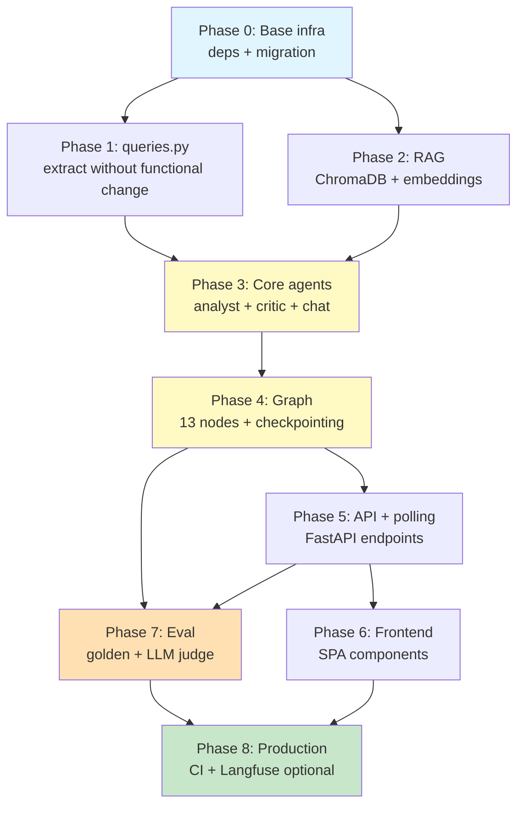
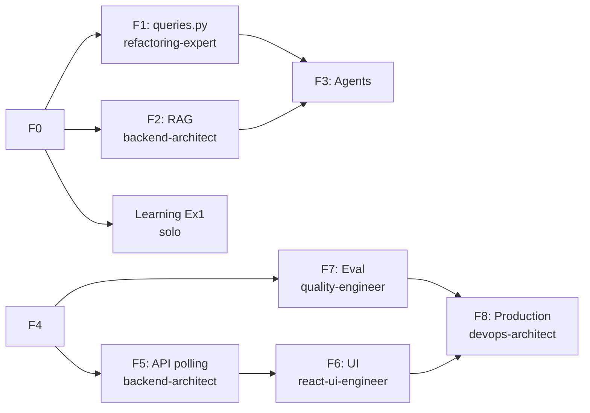

# Implementation Workflow — Race Results v2 Agentic

**Source:** `docs/10-race-results/v2-agentic-design.md` (1732 lines)
**Strategy:** Systematic
**Depth:** Deep
**Generated:** 2026-05-20
**Estimated total:** 14 dev-days + 12-13h parallel learning
**Status:** Ready to execute (19 closed decisions)

---

## Requirements summary

### Functional (extracted from design)

- Coach uploads PDF/CSV for a round from the web UI; current deterministic ingestion pipeline processes it
- AI agent generates interpretive analysis per athlete (gap, evolution, LTAD/PHV recommendations)
- Output available in 3 formats: markdown dashboard, downloadable PDF, consultative chat
- Per-athlete memory: each analysis remembers the last 3 prior insights
- HITL gates: coach approves at critical steps (parse warnings >5, TyR matches <85, final report pre-email)
- Email notification to coach when analysis finishes
- Learning mode toggle: agent explains what it does while doing it
- Ad-hoc chat post-analysis with session memory

### Non-functional

| Attribute | Target |
|---|---|
| p50 latency analysis 1 athlete | <30s |
| Coverage new code tests | ≥90% |
| Golden dataset eval score | ≥0.80 |
| PII leaks to Gemini | 0 (blocking sentinel test) |
| Concurrent runs | max 10 (backpressure) |
| Supported browsers | Chrome, Safari, Firefox |
| Cost per analysis | <$0.01 (Gemini Flash Lite) |
| Existing tests | 339/339 green throughout migration |

### Out of scope MVP

- ❌ Automatic email to parents (post-MVP)
- ❌ PWA push notifications
- ❌ Spond integration (Phase 2 roadmap)
- ❌ Multi-season cross-season comparison (future)
- ❌ Chat with cross-session history (session memory only MVP)
- ❌ DSPy / automatic prompt optimization

---

## Visual roadmap


---

## Dependency DAG



**Critical path:** F0 → F1 → F3 → F4 → F5 → F6 → F8 (~12 days)

**Parallelization opportunities:**
- Phase 2 (RAG) can run in parallel with Phase 1 (queries.py) — different files
- Phase 7 (Eval) can start with finished graph (F4), doesn't need to wait for UI (F6)
- Learning exercises 1-7 run in separate sandbox while prod phases advance

---

## Phase 0 — Base infra

**Time:** 0.5 day | **Risk:** Low | **Blocks:** everything else

### Prerequisites

- [x] Local docker compose functional (verified in previous session)
- [x] .env with AI_PROVIDER=google, AI_MODEL=gemini-2.5-flash-lite
- [ ] Confirmation of decision: raise AI_MAX_TOKENS 1024 → 8192

### Atomic tasks

| # | Task | Agent | Command | Deliverable |
|---|---|---|---|---|
| 0.1 | Add deps to `backend/requirements.txt` | devops-architect | `/sc:implement` | langgraph>=1.2.0, langchain-google-genai>=2.0.0, langgraph-checkpoint-sqlite>=2.0.5, chromadb>=0.5.20, langfuse>=3.0.0 (present but stack off until optional F8B), jinja2 (already), hypothesis (test). |
| 0.2 | Create Alembic migration `7a8b9c0d1e2f` with 4 new tables | backend-architect | `/sc:implement` | `backend/alembic/versions/7a8b9c0d1e2f_*.py` with athlete_ai_insights, agent_runs, agent_run_events, anonymization_mappings. Column `langfuse_trace_id` remains NULL until F8. |
| 0.3 | `docker-compose.langfuse.yml` + `docker-compose.langfuse.env.example` created (NOT started in F0) | devops-architect | `/sc:implement` | YAML + 6 services ready for F8B startup. Stack off in F0–F7. Primary audit via columns `athlete_ai_insights.cost_usd`, `latency_ms`, `tokens_in/out`. |
| 0.4 | Create folder structure `services/race/{ai,agents,rag,prompts}` | backend-architect | manual | empty tree with `__init__.py` |
| 0.5 | Update AI_MAX_TOKENS=8192 in .env and .env.example | devops-architect | manual | + document in CLAUDE.md variables section |
| 0.6 | Current race suite still green post-changes | quality-engineer | `pytest tests/services/race/` | 339/339 |

### Success criterion

```bash
# Phase 0 end-to-end verification:
docker compose up -d
docker compose exec mysql mysql -e "SHOW TABLES LIKE 'athlete_ai_insights'" # table exists
pytest tests/services/race/         # 339 green
```

### Rollback

```bash
alembic downgrade 64c263edd07f
git revert <commit-phase-0>
```

### Primary agent: **devops-architect**

---

## Phase 1 — Extract `queries.py` (safe refactor)

**Time:** 1 day | **Risk:** Medium (touches tested code) | **Depends on:** F0

### Prerequisites

- Phase 0 complete
- Analysis of which `analytics.py` functions will be reused in agent

### Atomic tasks

| # | Task | Agent | Command | Deliverable |
|---|---|---|---|---|
| 1.1 | Create `backend/app/services/race/queries.py` | refactoring-expert | `/sc:implement` | Pure functions: `load_athlete_results(athlete_id, season)`, `load_category_podium(cat_code, valida)`, `compute_gap_to_p1(...)`, `compute_evolution_dataframe(...)` |
| 1.2 | Move query logic from `analytics.py` → `queries.py` | refactoring-expert | `/sc:implement` | analytics.py now orchestrates; queries.py exposes primitives |
| 1.3 | analytics.py maintains intact public API (re-export) | refactoring-expert | `/sc:implement` | `from .queries import *` or wrappers |
| 1.4 | Existing tests pass without changes | quality-engineer | `pytest tests/services/race/` | 339/339 |
| 1.5 | New unit tests for queries.py | quality-engineer | `/sc:test` | ≥10 cases covering edge cases |

### Success criterion

- `services/race/queries.py` exists with ≥4 typed pure functions
- `analytics.py` import of queries.py works
- 339 original tests green
- Coverage queries.py ≥95%

### Rollback

`git revert <commit-phase-1>` — no migrations, fully reversible.

### Primary agent: **refactoring-expert** (with quality-engineer backup)

---

## Phase 2 — RAG layer over theoretical framework

**Time:** 1 day | **Risk:** Low | **Depends on:** F0 (parallelizable with F1)

### Prerequisites

- ChromaDB installed (Phase 0)
- `docs/01-marco-teorico.md` exists (verified in CLAUDE.md)
- Valid GEMINI_API_KEY in .env (AI_API_KEY already present)

### Atomic tasks

| # | Task | Agent | Command | Deliverable |
|---|---|---|---|---|
| 2.1 | Script `backend/app/services/race/rag/indexer.py` | backend-architect | `/sc:implement` | CLI: `python -m app.services.race.rag.indexer reindex` reads docs/01-*.md, chunks, embeddings via gemini-embedding-001, writes ChromaDB to `./data/chroma/` |
| 2.2 | Function `retrieve_principles(query, top_k=3) -> list[Citation]` | backend-architect | `/sc:implement` | `backend/app/services/race/rag/retriever.py` with Citation dataclass (chunk_id, source, content, score) |
| 2.3 | LangChain tool `consultar_marco_teorico` wrapping retriever | backend-architect | `/sc:implement` | `backend/app/services/race/rag/tools.py` for injecting into agents |
| 2.4 | Retriever tests with real theoretical framework | quality-engineer | `/sc:test` | Cases: "PHV windows of trainability" → returns correct chunks from section 3 |
| 2.5 | Idempotent reindex (chunk_id = sha256) | backend-architect | `/sc:implement` | Re-running indexer does not duplicate embeddings |
| 2.6 | Docker volume `./data/chroma` in docker-compose | devops-architect | manual | persists between restarts |

### Success criterion

```bash
python -m app.services.race.rag.indexer reindex
# Output: "Indexed N chunks from docs/01-marco-teorico.md"
python -m app.services.race.rag.retriever query "youth load 10-12 years"
# Output: top-3 relevant citations
pytest tests/services/race/rag/   # ≥6 green tests
```

### Rollback

- `rm -rf ./data/chroma/`
- `git revert <commit-phase-2>`

### Primary agent: **backend-architect** (data-analyst support)

---

## Phase 3 — Core agents (analyst + critic + chat)

**Time:** 2-3 days | **Risk:** High (LLM quality, iterative prompts) | **Depends on:** F1 + F2

### Prerequisites

- queries.py available (F1)
- RAG retriever available (F2)
- AI_MAX_TOKENS=8192 confirmed

### Atomic tasks

| # | Task | Agent | Command | Deliverable |
|---|---|---|---|---|
| 3.1 | Versioned prompts | backend-architect | `/sc:implement` | `services/race/agents/prompts/{race_analyst_v1.md, race_critic_v1.md, race_chat_v1.md}` with Jinja2 variables |
| 3.2 | `RaceAnalystAgent` (LangChain RunnableSequence) | backend-architect | `/sc:implement` | `services/race/agents/analyst.py` — input: athlete_data (anonymized) + memory + citations → output: AnalysisOutput pydantic |
| 3.3 | `RaceCriticAgent` (reviews analyst output, suggests refinements) | backend-architect | `/sc:implement` | `services/race/agents/critic.py` |
| 3.4 | `RaceChatAgent` (consultative chat, separate agent) | backend-architect | `/sc:implement` | `services/race/agents/chat.py` — session memory, RAG + recent insights |
| 3.5 | Structured output Pydantic schemas | backend-architect | `/sc:implement` | `services/race/schemas.py` — AnalysisOutput, Recommendation, RiskFlag, Citation |
| 3.6 | Unit tests with mock LLM | quality-engineer | `/sc:test` | Mock `langchain_google_genai.ChatGoogleGenerativeAI` to not call real API |
| 3.7 | Integration smoke test with real Gemini | quality-engineer | `pytest -m integration` | Marker `@pytest.mark.integration`, skip by default |

### Success criterion

- 3 .md prompts in `agents/prompts/`
- 3 agent classes with uniform interface `.invoke(input) -> Output`
- Unit tests with mock LLM green
- Integration smoke test (1 real case) generates parseable AnalysisOutput

### Rollback

`git revert <commits-phase-3>` — no DB, no new infra.

### Primary agent: **backend-architect** (security-engineer reviews prompts)

---

## Phase 4 — Graph + checkpointing (LangGraph)

**Time:** 1 day | **Risk:** Medium (state management, HITL) | **Depends on:** F3

### Prerequisites

- Core agents working (F3)
- Decision: SqliteSaver path `./data/langgraph_state.sqlite`

### Atomic tasks

| # | Task | Agent | Command | Deliverable |
|---|---|---|---|---|
| 4.1 | TypedDict `RaceAnalystState` | backend-architect | `/sc:implement` | `services/race/ai/state.py` — fields: athlete_id, season, valida_nums, raw_data, anonymized_data, mapping, metrics, principles, memory, draft_analysis, critic_feedback, final_analysis, errors[], events[] |
| 4.2 | 13 graph nodes | backend-architect | `/sc:implement` | `services/race/ai/nodes/` — one file per node: validate_input, load_race_data, anonymize, compute_metrics, retrieve_principles, recall_memory, analyst_agent, critic_agent, hitl_gate_review, persist_insight, rehydrate_names, render_outputs, notify_coach |
| 4.3 | Main graph with `StateGraph` + edges | backend-architect | `/sc:implement` | `services/race/ai/graph.py` — compile with SqliteSaver checkpoint |
| 4.4 | `interrupt()` function for HITL gates | backend-architect | `/sc:implement` | LangGraph native: hitl node emits interrupt, coach responds via API |
| 4.5 | Retry policy per node (exponential backoff) | backend-architect | `/sc:implement` | Decorator `@with_retry(max_attempts=3, backoff=2)` |
| 4.6 | Error handling: deterministic fallback | backend-architect | `/sc:implement` | If analyst_agent fails 3x → render message "analysis not available, see raw data" |
| 4.7 | Graph tests with mocked LLM | quality-engineer | `/sc:test` | ≥12 tests covering happy path + each error path + HITL |

### Success criterion

```python
from app.services.race.ai.graph import compiled_graph
state = compiled_graph.invoke({"athlete_id": 179, "season": 2026})
assert state["final_analysis"] is not None
assert "Mariana" not in str(state["events"])  # privacy check (pseudonym)
```

### Rollback

`git revert <commits-phase-4>` + `rm ./data/langgraph_state.sqlite`

### Primary agent: **backend-architect** (with security-engineer on HITL gates)

---

## Phase 5 — FastAPI endpoints + polling

**Time:** 0.5 days (3-4h) | **Risk:** Low (polling trivial vs complex SSE streamer, RBAC) | **Depends on:** F4

### Prerequisites

- Invocable graph (F4)

### Atomic tasks

| # | Task | Agent | Command | Deliverable |
|---|---|---|---|---|
| 5.1 | Router `backend/app/routers/race_analysis.py` | backend-architect | `/sc:implement` | 6 endpoints per design §9.1-9.7 |
| 5.2 | Pydantic request/response schemas | backend-architect | `/sc:implement` | `backend/app/schemas/race_ai.py` |
| 5.3 | RBAC dep: coach + admin only | security-engineer | `/sc:implement` | `require_role([coach, admin])` |
| 5.4 | Polling endpoint `GET /runs/{run_id}/status?since=<seq>` | backend-architect | `/sc:implement` | Returns `{state, progress_pct, current_node, estimated_seconds_remaining, new_events}` |
| 5.5 | HITL response endpoint `/runs/{run_id}/hitl/{step_id}` | backend-architect | `/sc:implement` | Coach POSTs decision, graph continues with `Command(resume=...)` |
| 5.6 | PDF download endpoint (weasyprint) | backend-architect | `/sc:implement` | Renders markdown to PDF with TyR branding (logo, colors) |
| 5.7 | Consultative chat endpoint | backend-architect | `/sc:implement` | POST query + session_id, returns complete JSON response (no streaming) |
| 5.8 | Backpressure max 10 concurrent runs | backend-architect | `/sc:implement` | Async semaphore + 429 if exceeded |
| 5.9 | Endpoint integration tests (TestClient) | quality-engineer | `/sc:test` | ≥15 tests covering auth, happy path, error, polling |
| 5.10 | Sentinel test: 0 PII in polling responses | security-engineer | `/sc:test` | Property test with hypothesis: 100 runs, none returns real name in `new_events` |

### Success criterion

```bash
curl -X POST http://localhost:8000/api/race-analysis/runs \
  -H "Authorization: Bearer $COACH_TOKEN" \
  -d '{"athlete_id": 179, "season": 2026}'
# → {"run_id": "uuid", "status_url": "/api/race-analysis/runs/uuid/status"}

watch -n 2 curl -s http://localhost:8000/api/race-analysis/runs/uuid/status
# → JSON with state updating every 2s until state="done"
```

### Rollback

`git revert <commits-phase-5>` — isolated endpoints, doesn't affect other routes.

### Primary agent: **backend-architect** + **security-engineer** (RBAC + privacy tests)

---

## Phase 6 — Frontend UI React

**Time:** 3-3.5 days | **Risk:** Medium (React polling, HITL UX) | **Depends on:** F5

### Prerequisites

- Working API endpoints (F5)
- Current Phase 1 frontend operational (Step 6 base SPA)

### Atomic tasks

| # | Task | Agent | Command | Deliverable |
|---|---|---|---|---|
| 6.1 | Hook `useRunStatus(runId)` (TanStack Query polling) | react-ui-engineer | `/sc:implement` | `useQuery` with `refetchInterval: 2000`, stops when `state ∈ {done, error}`, accumulates `new_events` |
| 6.2 | Hook `useStartRun()` (TanStack Query mutation) | react-ui-engineer | `/sc:implement` | POST /runs, returns run_id |
| 6.3 | Hook `useApproveStep(runId)` | react-ui-engineer | `/sc:implement` | POST /hitl with coach decision |
| 6.4 | `RaceAnalysisPage` (route `/coach/race-analysis`) | react-ui-engineer | `/sc:implement` | Layout with tabs: Upload, Active runs, Historical insights |
| 6.5 | `UploadZone` (drag-drop PDF/CSV) | react-ui-engineer | `/sc:implement` | shadcn dropzone + type + size validation |
| 6.6 | `AnalysisRunTimeline` (consumes polling) | react-ui-engineer | `/sc:implement` | Visual timeline with graph nodes + status + duration, updates every 2s |
| 6.7 | `HITLApprovalCard` (inline approval) | react-ui-engineer | `/sc:implement` | When `hitl_required` event arrives, render card with approve/edit/reject options |
| 6.8 | `MarkdownReportViewer` (react-markdown) | react-ui-engineer | `/sc:implement` | Renders final analysis with syntax highlighting + tables |
| 6.9 | `ChatConsole` (input + history) | react-ui-engineer | `/sc:implement` | Mutation POST `/chat`, spinner while `isPending`, complete JSON response |
| 6.10 | `ExplainModeBanner` (toggle + tooltip) | react-ui-engineer | `/sc:implement` | localStorage `race-explain-mode`, persistent banner on page |
| 6.11 | PDF download button | react-ui-engineer | `/sc:implement` | GET /pdf with `<a download>` |
| 6.12 | States: loading, error, empty | react-ui-engineer | `/sc:implement` | UX in each component |
| 6.13 | Vitest + RTL tests | quality-engineer | `/sc:test` | ≥20 tests, basic accessibility jest-axe |

### Success criterion

- Coach starts analysis from UI without terminal
- Timeline shows real-time progress
- HITL gate works end-to-end
- PDF downloads correctly
- Chat console responds with citations
- Explain mode toggle visible
- 3 browsers working

### Rollback

`git revert <commits-phase-6>` — route `/coach/race-analysis` disappears, rest of SPA intact.

### Primary agent: **react-ui-engineer**

---

## Phase 7 — Eval golden dataset + LLM judge

**Time:** 2 days | **Risk:** Medium (dataset quality) | **Depends on:** F4 (doesn't need UI)

### Prerequisites

- Working + agents graph (F4)
- 4 real athletes with loaded data (already done in local docker)

### Atomic tasks

| # | Task | Agent | Command | Deliverable |
|---|---|---|---|---|
| 7.1 | Build 10 golden cases | quality-engineer + data-analyst | `/sc:implement` | `backend/evals/race_analyst/golden/{case_001..010}.json` — use real V-I/II/III/IV data for Mariana, Miguel, Sofia, Jostin, Isabel + synthetic cases |
| 7.2 | Golden case schema | quality-engineer | `/sc:implement` | `{input: {...}, expected_themes: [...], forbidden_terms: [...], ideal_output: "..."}` |
| 7.3 | pytest runner `tests/evals/test_race_analyst_eval.py` | quality-engineer | `/sc:implement` | `pytest --golden` runs all, generates scoreboard |
| 7.4 | Rule-based scorer | quality-engineer | `/sc:implement` | Checks: theme presence, forbidden absence, reasonable length, valid markdown structure |
| 7.5 | LLM-as-judge prompt | quality-engineer | `/sc:implement` | `prompts/eval/judge_v1.md` — Gemini evaluates output vs ideal, score 0-1 with justification |
| 7.6 | Composite score 0.4 rule + 0.6 judge | quality-engineer | `/sc:implement` | Weighted average per case |
| 7.7 | Blocking CI hook | devops-architect | `/sc:implement` | GitHub Action: on each PR touching `agents/`, runs eval. Fails if avg score <0.75 |
| 7.8 | Initial baseline snapshot | quality-engineer | manual | Run eval once, save results as `golden/baseline_2026-05-XX.json` |

### Success criterion

```bash
pytest tests/evals/test_race_analyst_eval.py --golden
# Output:
# Case 001 (Mariana evolution): 0.82
# Case 002 (Sofia growing gap): 0.78
# ...
# Average: 0.80 ✓ (threshold 0.75)
```

### Rollback

`git revert <commits-phase-7>` — eval doesn't block without active CI hook.

### Primary agent: **quality-engineer** (data-analyst contributes real cases)

---

## Phase 8 — Production + observability

**Time:** 0.5–1.5 day (depending on option) | **Risk:** Low | **Depends on:** F6 + F7

### Key decision — observability

Two paths:

| Option | Infra cost | Setup | When |
|---|---|---|---|
| **8A — Audit-only DB (default MVP)** | 0 | 0.5 day | Default. Sufficient with <10 analyses/week, 1 coach. |
| **8B — Langfuse self-hosted (optional)** | ~$5/month VPS + ~2 GB RAM | +1 day | Only if: real Gemini cost >$10/month, or coach asks for visual dashboard, or serious prompt A/B testing planned. |

**Recommendation:** start with 8A. Migrate to 8B only when one of the above conditions is met.

### Atomic tasks — Option 8A (default)

| # | Task | Agent | Command | Deliverable |
|---|---|---|---|---|
| 8A.1 | Ensure columns `cost_usd`, `tokens_in/out`, `latency_ms`, `prompt_version` being populated in `athlete_ai_insights` | backend-architect | `/sc:implement` | After each run, row inserted with metrics |
| 8A.2 | Admin endpoint `GET /admin/ai-usage?days=30` aggregates metrics | backend-architect | `/sc:implement` | Total cost USD, p50/p95 latency, run count, fail rate |
| 8A.3 | Runtime budget guard: if `SUM(cost_usd) last 30d > $20` → blocks new runs + coach email | backend-architect | `/sc:implement` | Simple circuit breaker in `agents/runner.py` |
| 8A.4 | Basic ops runbook | devops-architect | `/sc:document` | `docs/10-race-results/runbook-ops.md` — what to do if: LLM down, eval fails, hung run, cost spike |
| 8A.5 | Production smoke test | quality-engineer | manual | 1 end-to-end run in prod, verify row in `athlete_ai_insights` with metrics |

**Success criterion 8A:**
- `SELECT cost_usd, latency_ms FROM athlete_ai_insights WHERE generated_at > NOW() - INTERVAL 7 DAY` returns populated rows
- Admin endpoint returns consistent aggregates
- Budget guard tested (mock row >$20)
- Runbook documented

### Atomic tasks — Option 8B (optional, only if activated)

| # | Task | Agent | Command | Deliverable |
|---|---|---|---|---|
| 8B.1 | Confirm `langfuse>=3.0.0` already in requirements.txt (added in F0.1) | devops-architect | manual | Verify |
| 8B.2 | Generate 3 openssl secrets + start `docker-compose.langfuse.yml` (created in F0.3) | devops-architect | `cp env.example env && openssl rand` × 3 + `docker compose -f docker-compose.langfuse.yml --env-file docker-compose.langfuse.env up -d` | Starts on :3001. NEXTAUTH_SECRET, SALT, ENCRYPTION_KEY. |
| 8B.3 | Implement `app/observability/langfuse.py` with FakeLangfuse fallback | backend-architect | `/sc:implement` | If `LANGFUSE_ENABLED=false` → total no-op |
| 8B.4 | Conditional `@observe` decorators on nodes | backend-architect | `/sc:implement` | Tags: athlete_id, season, prompt_version, coach_id |
| 8B.5 | Deploy Langfuse server (Hetzner VPS ~$5/month or coach's machine) | devops-architect | manual | LANGFUSE_HOST pointing there |
| 8B.6 | Langfuse variables in production .env Render | devops-architect | manual | `LANGFUSE_ENABLED=true` + HOST + keys |
| 8B.7 | Budget alert UI Langfuse $5/month | devops-architect | manual | Email coach + admin |
| 8B.8 | Backfill `langfuse_trace_id` in `athlete_ai_insights` going forward | — | automatic | Set via SDK |

**Success criterion 8B (if activated):**
- Langfuse UI shows traces of all new runs
- Disabling Langfuse (`LANGFUSE_ENABLED=false`) → agent still works, DB audit still complete

### Rollback

- **8A:** revert commits, no migration needed (DB columns already exist from F0).
- **8B:** `LANGFUSE_ENABLED=false`, `docker compose -f docker-compose.langfuse.yml down -v`, revert commits.

### Default `.env`

```
LANGFUSE_ENABLED=false   # default — activate only in option 8B
```

### Primary agent: **devops-architect** + backend-architect (8A.3 budget guard)

---

## Risk register

| Risk | Phase | Probability | Impact | Mitigation |
|---|---|---|---|---|
| analytics.py refactor breaks tests | F1 | Medium | High | quality-engineer runs suite after each commit; immediate rollback if red |
| Gemini rate limits / quota exhausted | F3, F8 | Low | Medium | Exponential backoff + fallback claude-sonnet via LangChain abstraction (1 line change) |
| Initial poor prompt quality | F3, F7 | High | High | Blocking eval framework (F7) detects before prod; iteration with baseline |
| HITL gates UX confusing for coach | F5, F6 | Medium | Medium | Interactive tour (proposal) + learning mode toggle |
| PII leak to Gemini | F3, F4, F5 | Low | **Critical** | hypothesis sentinel test 1000 inputs, blocking CI; mandatory security-engineer review |
| LangGraph state corruption after crash | F4 | Low | High | SQLite checkpointing + retry tests; states >1h auto-cancel |
| Polling overhead under load | F5, F6 | Low | Low | ~15 req/30s per run × N concurrent. Mitigation: max 10 runs; ETag/304 if state unchanged |
| Irrelevant RAG retrieval | F2, F3 | Medium | Medium | Specific retrieval tests; chunking + top_k tuning |
| LLM cost spikes | F8 | Low | Medium | DB budget guard (8A) blocks if `SUM(cost_usd) 30d > $20`; Langfuse alert optional (8B) |
| Golden dataset insufficient | F7 | Medium | High | Iterate: start with 5 cases, grow to 20 in first 2 prod weeks |

---

## Quality gates between phases

| Gate | Before | Criterion | Responsible |
|---|---|---|---|
| QG1 | Phase 1 → 3 | Race suite 339/339 green | quality-engineer |
| QG2 | Phase 2 → 3 | RAG retrieval test cases green | quality-engineer |
| QG3 | Phase 3 → 4 | Gemini integration smoke test OK | quality-engineer |
| QG4 | Phase 4 → 5 | PII leak property test (1000 inputs) green | security-engineer |
| QG5 | Phase 5 → 6 | RBAC tests + polling performance test green (10 concurrent runs <500ms p95) | security-engineer |
| QG6 | Phase 6 → 8 | UI works in 3 browsers + accessibility | react-ui-engineer |
| QG7 | Phase 7 → 8 | Eval baseline ≥0.75 | quality-engineer |
| QG8 | Phase 8 → MVP | Prod smoke test OK + runbook ready | devops-architect |

---

## Parallel learning exercises

| Ex | When to run | Topic | Time | Parallelizable with phase |
|---|---|---|---|---|
| Ex1 — Hello-world LangGraph (3 linear nodes) | Before/during F0 | StateGraph fundamentals | 1h | F0 |
| Ex2 — Add HITL gate (interrupt) | During F1 | `interrupt()` + Command(resume) | 1h | F1 |
| Ex3 — In-memory memory (MemorySaver) | During F2 | Checkpointing patterns | 1.5h | F2 |
| Ex4 — RAG with ChromaDB | During F2 (reinforces) | Embeddings + retrieval | 2h | F2 |
| Ex5 — Langfuse tracing (decorator @observe) | **OPTIONAL** — only if 8B is activated | Observability | 1.5h | F8B |
| Ex6 — Multi-agent supervisor | During F4 | Coordination patterns | 2-3h | F4 |
| Ex7 — Eval framework | During F7 (reinforces) | LLM-as-judge | 2h | F7 |
| Ex8 — TanStack Query polling pattern | During F5 | refetchInterval + incremental events | 1h | F5 |

**Total learning time:** ~12-13h | **Guide agent:** `learning-guide` with `/sc:explain`

Each exercise in isolated sandbox (`backend/sandbox/learning/ej_N/`) — does NOT touch prod code.

---

## Identified parallelizable tasks



**Identified parallel streams:**
- Stream A (deterministic backend): F0 → F1
- Stream B (RAG): F0 → F2
- Stream C (learning): Ex1 → Ex8 (linear in sandbox, doesn't block prod)
- Stream D (post-graph): F5 || F7 (then converges in F8)

---

## MVP exit checklist

### Functionality

- [ ] Coach uploads PDF/CSV from UI without terminal
- [ ] Deterministic pipeline ingests correctly (337+ tests green)
- [ ] Analyst agent generates interpretive analysis
- [ ] Critic agent refines output
- [ ] HITL gates work (parse warnings, TyR matches, final report)
- [ ] Per-athlete memory recalls last 3 insights
- [ ] PDF download with TyR branding
- [ ] Chat console responds with theoretical framework citations
- [ ] Coach notification email when done
- [ ] Explain mode toggle visible in UI

### Quality

- [ ] Golden eval ≥0.80 average
- [ ] New code coverage ≥90%
- [ ] PII leak property test (1000 inputs) green
- [ ] 339 race v1 tests still green
- [ ] Basic accessibility (jest-axe) green
- [ ] Works Chrome + Safari + Firefox

### Performance

- [ ] p50 latency analysis <30s
- [ ] Cost per analysis <$0.01 (verified via `athlete_ai_insights.cost_usd`; Langfuse if 8B active)
- [ ] Max 10 concurrent runs (backpressure active)
- [ ] Stable polling during 10 concurrent runs without degradation >500ms p95

### Observability (default 8A)

- [ ] Metric columns (`cost_usd`, `tokens_in/out`, `latency_ms`, `prompt_version`) populated in `athlete_ai_insights`
- [ ] Endpoint `/admin/ai-usage` returns aggregates
- [ ] DB budget guard active (blocks if >$20/30d)
- [ ] Ops runbook written

### Observability (optional 8B — only if activated)

- [ ] Langfuse self-hosted UP on :3001
- [ ] Traces of all runs visible
- [ ] Budget alert UI configured

### Documentation

- [ ] CLAUDE.md updated with Phase 1.8 status (race-results-v2)
- [ ] docs/10-race-results/v2-implementation-workflow.md (this file) updated with real metrics
- [ ] Ops runbook `docs/10-race-results/runbook-ops.md`
- [ ] Decision log if new ones arise during implementation

---

## Execution recommendations

### Recommended executive order

```
Day 1:    F0 (morning) + Ex1 (afternoon)
Day 2:    F1 + Ex2
Day 3:    F2 (parallel with rest of F1) + Ex3/4
Days 4-6: F3 + Ex5
Day 7:    F4 + Ex6
Day 8:    F5 + Ex8 (parallel, F5 takes only 3-4h)
Days 9-11: F6
Days 12-13: F7 + Ex7 (parallel with F6)
Day 14:   F8 + prod smoke
```

### `/sc:` commands by phase

| Phase | Recommended commands |
|---|---|
| F0 | `/sc:implement` + `/sc:test` |
| F1 | `/sc:improve` + `/sc:test` |
| F2 | `/sc:implement` + `/sc:test` |
| F3 | `/sc:implement` + `/sc:document` (prompts) |
| F4 | `/sc:implement` + `/sc:test` + `/sc:explain` |
| F5 | `/sc:implement` + `/sc:test` |
| F6 | `/sc:implement` + `/sc:test` |
| F7 | `/sc:implement` + `/sc:test` |
| F8 | `/sc:implement` + `/sc:document` |

### When to use `/sc:spawn`

- F2 + F3 prep in parallel (different files)
- F5 + F7 after F4 (testing in parallel with API)
- All learning exercises in isolated sandbox

### Immediate next step

**Start Phase 0** with a single commit:

```
/sc:implement Phase 0 race-results-v2: add deps requirements.txt
(without langfuse, deferred to optional F8), create Alembic migration
7a8b9c0d1e2f with 4 tables (athlete_ai_insights, agent_runs,
agent_run_events, anonymization_mappings) per
docs/10-race-results/v2-agentic-design.md §3. Verify the
339 existing tests still green post changes.
```

In parallel: start Ex1 (hello-world LangGraph) in `backend/sandbox/learning/ej1/`.

---

## Metrics tracking during implementation

| Metric | How to measure | Cadence |
|---|---|---|
| Green tests | `pytest` exit code 0 | Every commit |
| New code coverage | `pytest --cov=app.services.race.ai --cov=app.services.race.agents` | End of each phase |
| Real vs estimated implementation time | Manual tracking per phase | End of phase |
| Eval score | `pytest --golden` | Each prompt change |
| Accumulated LLM cost | `SUM(cost_usd) FROM athlete_ai_insights` (default) or Langfuse dashboard if 8B | Daily post F8 |

---

## Open questions / assumptions to validate

| # | Assumption | Validate with | Risk if fails |
|---|---|---|---|
| A1 | Raising AI_MAX_TOKENS to 8192 is accepted by Gemini Flash Lite | Integration test F3 | Adjust prompt length |
| A2 | ~~Langfuse self-hosted doesn't saturate resources~~ — **Decision 2026-05-20:** Langfuse deferred to optional F8. Primary audit in DB. | n/a default; smoke F8B if activated | n/a default |
| A3 | Coach accepts inline HITL UX (cards) vs modal | UX test F6 with coach | Redesign flow |
| A4 | gemini-embedding-001 multilingual Spanish quality sufficient | F2 tests with docs/01 | Fallback local sentence-transformers |
| A5 | 10 golden cases sufficient for baseline | F7 eval | Expand to 20 |
| A6 | weasyprint renders TyR-branded markdown OK | F5 test | Investigate alt (Gotenberg) |
| A7 | ~~SSE stable behind Render free tier~~ — **Decision 2026-05-20:** polling eliminates this concern. Standard HTTP GET works in any provider | n/a | n/a |

---

**Document generated by `/sc:workflow` — `systematic` strategy, `deep` depth, `detailed` format, `parallel-streams` enabled.**

**Next executive step:** confirm start of Phase 0 + Ex1 parallel.
