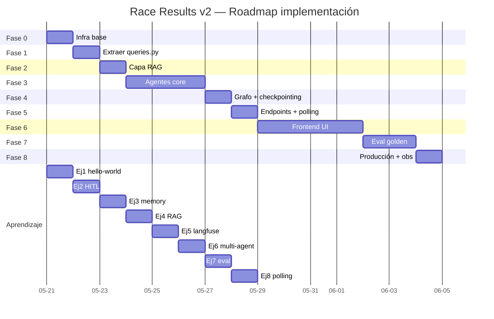
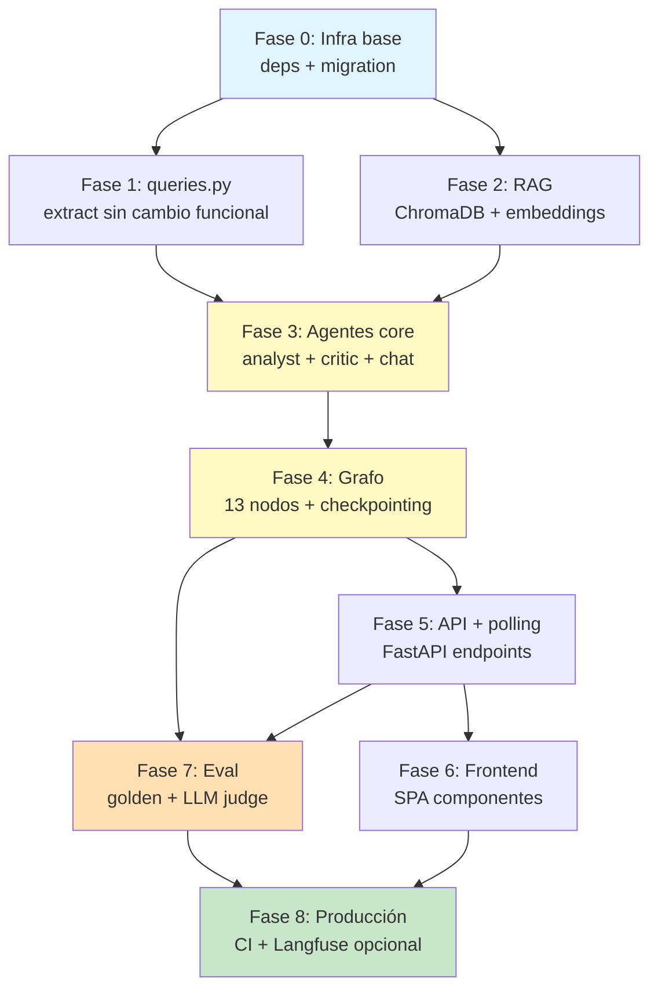
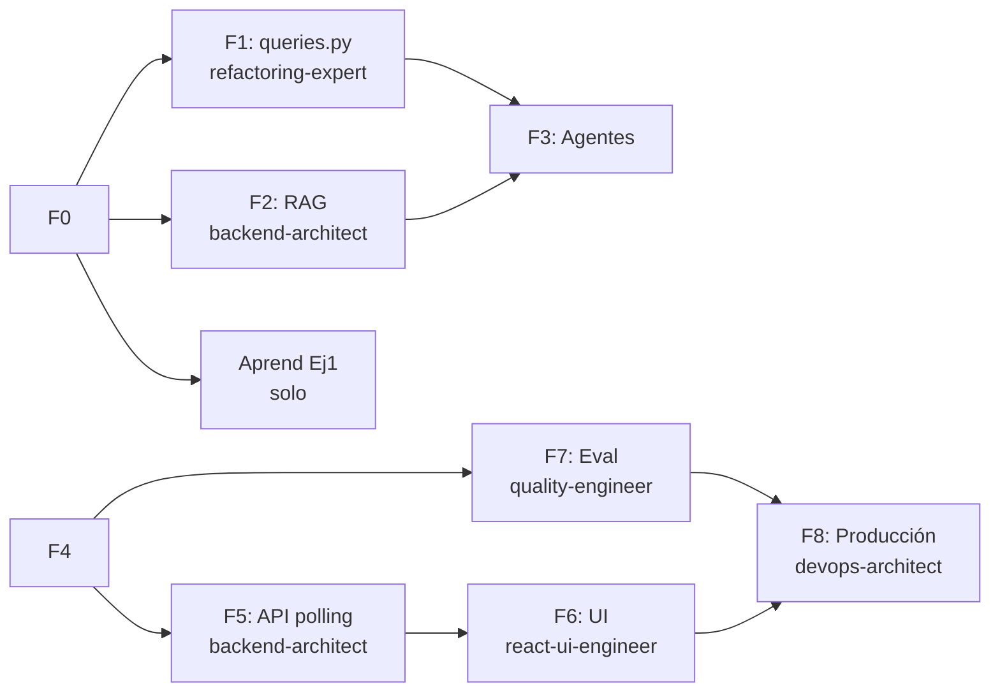

# Implementation Workflow — Race Results v2 Agentic

**Source:** `docs/10-race-results/v2-agentic-design.md` (1732 líneas)
**Strategy:** Systematic
**Depth:** Deep
**Generated:** 2026-05-20
**Estimated total:** 14 días-dev + 12-13h aprendizaje paralelo
**Status:** Listo para ejecutar (19 decisiones cerradas)

---

## Requirements summary

### Funcionales (extraídos del design)

- Coach sube PDF/CSV de válida desde UI web; pipeline ingesta determinista actual lo procesa
- Agente IA genera análisis interpretativo por atleta (gap, evolución, recomendaciones LTAD/PHV)
- Output disponible en 3 formatos: dashboard markdown, PDF descargable, chat consultivo
- Memoria por atleta: cada análisis recuerda los últimos 3 insights previos
- HITL gates: coach aprueba en pasos críticos (parse warnings >5, matches TyR <85, reporte final pre-email)
- Notificación email coach al terminar análisis
- Modo aprendizaje toggle: agente explica qué hace mientras lo hace
- Chat ad-hoc post-análisis con memoria de sesión

### No-funcionales

| Atributo | Target |
|---|---|
| p50 latencia análisis 1 atleta | <30s |
| Coverage tests código nuevo | ≥90% |
| Eval golden dataset score | ≥0.80 |
| PII leaks Gemini | 0 (test sentinela bloqueante) |
| Concurrent runs | máx 10 (backpressure) |
| Browsers soportados | Chrome, Safari, Firefox |
| Cost por análisis | <$0.01 (Gemini Flash Lite) |
| Tests existentes | 339/339 verdes durante toda migración |

### Out of scope MVP

- ❌ Email automático a padres (post-MVP)
- ❌ Push notifications PWA
- ❌ Integración Spond (Fase 2 roadmap)
- ❌ Multi-temporada cross-season comparison (futuro)
- ❌ Chat con historial cross-sesión (solo session memory MVP)
- ❌ DSPy / prompt optimization automática

---

## Roadmap visual



---

## DAG de dependencias



**Camino crítico:** F0 → F1 → F3 → F4 → F5 → F6 → F8 (~12 días)

**Oportunidades paralelización:**
- Fase 2 (RAG) puede correr en paralelo con Fase 1 (queries.py) — diferentes archivos
- Fase 7 (Eval) puede arrancar con grafo terminado (F4), no necesita esperar UI (F6)
- Ejercicios aprendizaje 1-7 corren en sandbox separado mientras avanzan fases prod

---

## Fase 0 — Infra base

**Tiempo:** 0.5 día | **Riesgo:** Bajo | **Bloquea:** todo lo demás

### Prerequisitos

- [x] Docker compose local funcional (verificado en sesión anterior)
- [x] .env con AI_PROVIDER=google, AI_MODEL=gemini-2.5-flash-lite
- [ ] Confirmación de decisión: subir AI_MAX_TOKENS 1024 → 8192

### Tareas atómicas

| # | Tarea | Agente | Comando | Deliverable |
|---|---|---|---|---|
| 0.1 | Agregar deps a `backend/requirements.txt` | devops-architect | `/sc:implement` | langgraph>=1.2.0, langchain-google-genai>=2.0.0, langgraph-checkpoint-sqlite>=2.0.5, chromadb>=0.5.20, langfuse>=3.0.0 (presente pero stack apagado hasta F8B), jinja2 (ya), hypothesis (test). |
| 0.2 | Crear migración Alembic `7a8b9c0d1e2f` con 4 tablas nuevas | backend-architect | `/sc:implement` | `backend/alembic/versions/7a8b9c0d1e2f_*.py` con athlete_ai_insights, agent_runs, agent_run_events, anonymization_mappings. Columna `langfuse_trace_id` permanece NULL hasta F8. |
| 0.3 | `docker-compose.langfuse.yml` + `docker-compose.langfuse.env.example` creados (NO levantados en F0) | devops-architect | `/sc:implement` | YAML + 6 servicios listos para F8B startup. Stack apagado en F0–F7. Audit primario vía columnas `athlete_ai_insights.cost_usd`, `latency_ms`, `tokens_in/out`. |
| 0.4 | Crear estructura carpetas `services/race/{ai,agents,rag,prompts}` | backend-architect | manual | árbol vacío con `__init__.py` |
| 0.5 | Actualizar AI_MAX_TOKENS=8192 en .env y .env.example | devops-architect | manual | + documentar en CLAUDE.md sección variables |
| 0.6 | Suite race actual sigue verde post-cambios | quality-engineer | `pytest tests/services/race/` | 339/339 |

### Criterio de éxito

```bash
# Verificación end-to-end Fase 0:
docker compose up -d
docker compose exec mysql mysql -e "SHOW TABLES LIKE 'athlete_ai_insights'" # tabla existe
pytest tests/services/race/         # 339 verdes
```

### Rollback

```bash
alembic downgrade 64c263edd07f
git revert <commit-fase-0>
```

### Agente principal: **devops-architect**

---

## Fase 1 — Extracción `queries.py` (refactor seguro)

**Tiempo:** 1 día | **Riesgo:** Medio (toca código testeado) | **Depende de:** F0

### Prerequisitos

- Fase 0 completada
- Análisis de qué funciones de `analytics.py` se reusarán en agente

### Tareas atómicas

| # | Tarea | Agente | Comando | Deliverable |
|---|---|---|---|---|
| 1.1 | Crear `backend/app/services/race/queries.py` | refactoring-expert | `/sc:implement` | Funciones puras: `load_athlete_results(athlete_id, season)`, `load_category_podium(cat_code, valida)`, `compute_gap_to_p1(...)`, `compute_evolution_dataframe(...)` |
| 1.2 | Mover lógica de queries desde `analytics.py` → `queries.py` | refactoring-expert | `/sc:implement` | analytics.py ahora orquesta; queries.py expone primitivas |
| 1.3 | analytics.py mantiene API pública intacta (re-export) | refactoring-expert | `/sc:implement` | `from .queries import *` o wrappers |
| 1.4 | Tests existentes pasan sin cambios | quality-engineer | `pytest tests/services/race/` | 339/339 |
| 1.5 | Nuevos tests unitarios para queries.py | quality-engineer | `/sc:test` | ≥10 casos cubriendo edge cases |

### Criterio de éxito

- `services/race/queries.py` existe con ≥4 funciones puras tipadas
- `analytics.py` import de queries.py funciona
- 339 tests originales verdes
- Coverage queries.py ≥95%

### Rollback

`git revert <commit-fase-1>` — sin migraciones, reversible total.

### Agente principal: **refactoring-expert** (con quality-engineer backup)

---

## Fase 2 — Capa RAG sobre marco teórico

**Tiempo:** 1 día | **Riesgo:** Bajo | **Depende de:** F0 (paralelizable con F1)

### Prerequisitos

- ChromaDB instalado (Fase 0)
- `docs/01-marco-teorico.md` existe (verificado en CLAUDE.md)
- GEMINI_API_KEY válida en .env (AI_API_KEY ya)

### Tareas atómicas

| # | Tarea | Agente | Comando | Deliverable |
|---|---|---|---|---|
| 2.1 | Script `backend/app/services/race/rag/indexer.py` | backend-architect | `/sc:implement` | CLI: `python -m app.services.race.rag.indexer reindex` lee docs/01-*.md, chunkea, embeddings via gemini-embedding-001, escribe ChromaDB en `./data/chroma/` |
| 2.2 | Función `retrieve_principles(query, top_k=3) -> list[Citation]` | backend-architect | `/sc:implement` | `backend/app/services/race/rag/retriever.py` con dataclass Citation (chunk_id, source, content, score) |
| 2.3 | Tool LangChain `consultar_marco_teorico` wrapping retriever | backend-architect | `/sc:implement` | `backend/app/services/race/rag/tools.py` para inyectar en agentes |
| 2.4 | Tests retriever con marco teórico real | quality-engineer | `/sc:test` | Casos: "ventana entrenabilidad PHV" → retorna chunks correctos sección 3 |
| 2.5 | Reindex idempotente (chunk_id = sha256) | backend-architect | `/sc:implement` | Re-correr indexer no duplica embeddings |
| 2.6 | Volume Docker `./data/chroma` en docker-compose | devops-architect | manual | persiste entre restarts |

### Criterio de éxito

```bash
python -m app.services.race.rag.indexer reindex
# Output: "Indexed N chunks from docs/01-marco-teorico.md"
python -m app.services.race.rag.retriever query "carga juvenil 10-12 años"
# Output: top-3 citations relevantes
pytest tests/services/race/rag/   # ≥6 tests verdes
```

### Rollback

- `rm -rf ./data/chroma/`
- `git revert <commit-fase-2>`

### Agente principal: **backend-architect** (data-analyst soporte)

---

## Fase 3 — Agentes core (analyst + critic + chat)

**Tiempo:** 2-3 días | **Riesgo:** Alto (calidad LLM, prompts iterativos) | **Depende de:** F1 + F2

### Prerequisitos

- queries.py disponible (F1)
- RAG retriever disponible (F2)
- AI_MAX_TOKENS=8192 confirmado

### Tareas atómicas

| # | Tarea | Agente | Comando | Deliverable |
|---|---|---|---|---|
| 3.1 | Prompts versionados | backend-architect | `/sc:implement` | `services/race/agents/prompts/{race_analyst_v1.md, race_critic_v1.md, race_chat_v1.md}` con variables Jinja2 |
| 3.2 | `RaceAnalystAgent` (LangChain RunnableSequence) | backend-architect | `/sc:implement` | `services/race/agents/analyst.py` — input: athlete_data (anonimizado) + memory + citations → output: AnalysisOutput pydantic |
| 3.3 | `RaceCriticAgent` (revisa output analyst, sugiere refinamientos) | backend-architect | `/sc:implement` | `services/race/agents/critic.py` |
| 3.4 | `RaceChatAgent` (chat consultivo, agente separado) | backend-architect | `/sc:implement` | `services/race/agents/chat.py` — session memory, RAG + recent insights |
| 3.5 | Schemas Pydantic outputs estructurados | backend-architect | `/sc:implement` | `services/race/schemas.py` — AnalysisOutput, Recommendation, RiskFlag, Citation |
| 3.6 | Tests unitarios mock LLM | quality-engineer | `/sc:test` | Mock `langchain_google_genai.ChatGoogleGenerativeAI` para no llamar API real |
| 3.7 | Smoke test integración con Gemini real | quality-engineer | `pytest -m integration` | Marker `@pytest.mark.integration`, skip por default |

### Criterio de éxito

- 3 prompts .md en `agents/prompts/`
- 3 clases agente con interface uniforme `.invoke(input) -> Output`
- Unit tests con mock LLM verdes
- Smoke test integración (1 caso real) genera AnalysisOutput parseable

### Rollback

`git revert <commits-fase-3>` — sin DB, sin infra nueva.

### Agente principal: **backend-architect** (security-engineer revisa prompts)

---

## Fase 4 — Grafo + checkpointing (LangGraph)

**Tiempo:** 1 día | **Riesgo:** Medio (state management, HITL) | **Depende de:** F3

### Prerequisitos

- Agentes core funcionando (F3)
- Decisión: SqliteSaver path `./data/langgraph_state.sqlite`

### Tareas atómicas

| # | Tarea | Agente | Comando | Deliverable |
|---|---|---|---|---|
| 4.1 | TypedDict `RaceAnalystState` | backend-architect | `/sc:implement` | `services/race/ai/state.py` — campos: athlete_id, season, valida_nums, raw_data, anonymized_data, mapping, metrics, principles, memory, draft_analysis, critic_feedback, final_analysis, errors[], events[] |
| 4.2 | 13 nodos del grafo | backend-architect | `/sc:implement` | `services/race/ai/nodes/` — un archivo por nodo: validate_input, load_race_data, anonymize, compute_metrics, retrieve_principles, recall_memory, analyst_agent, critic_agent, hitl_gate_review, persist_insight, rehydrate_names, render_outputs, notify_coach |
| 4.3 | Grafo principal con `StateGraph` + edges | backend-architect | `/sc:implement` | `services/race/ai/graph.py` — compile con SqliteSaver checkpoint |
| 4.4 | Función `interrupt()` para HITL gates | backend-architect | `/sc:implement` | LangGraph nativo: nodo hitl emite interrupt, coach responde via API |
| 4.5 | Retry policy por nodo (exponential backoff) | backend-architect | `/sc:implement` | Decorator `@with_retry(max_attempts=3, backoff=2)` |
| 4.6 | Error handling: fallback determinista | backend-architect | `/sc:implement` | Si analyst_agent falla 3x → render mensaje "análisis no disponible, ver datos crudos" |
| 4.7 | Tests grafo con LLM mockeado | quality-engineer | `/sc:test` | ≥12 tests cubriendo happy path + cada error path + HITL |

### Criterio de éxito

```python
from app.services.race.ai.graph import compiled_graph
state = compiled_graph.invoke({"athlete_id": 179, "season": 2026})
assert state["final_analysis"] is not None
assert "Mariana" not in str(state["events"])  # privacy check (pseudónimo)
```

### Rollback

`git revert <commits-fase-4>` + `rm ./data/langgraph_state.sqlite`

### Agente principal: **backend-architect** (con security-engineer en HITL gates)

---

## Fase 5 — Endpoints FastAPI + polling

**Tiempo:** 0.5 días (3-4h) | **Riesgo:** Bajo (polling trivial vs streamer SSE complejo, RBAC) | **Depende de:** F4

### Prerequisitos

- Grafo invocable (F4)

### Tareas atómicas

| # | Tarea | Agente | Comando | Deliverable |
|---|---|---|---|---|
| 5.1 | Router `backend/app/routers/race_analysis.py` | backend-architect | `/sc:implement` | 6 endpoints según design §9.1-9.7 |
| 5.2 | Schemas request/response Pydantic | backend-architect | `/sc:implement` | `backend/app/schemas/race_ai.py` |
| 5.3 | RBAC dep: solo coach + admin | security-engineer | `/sc:implement` | `require_role([coach, admin])` |
| 5.4 | Endpoint polling `GET /runs/{run_id}/status?since=<seq>` | backend-architect | `/sc:implement` | Retorna `{state, progress_pct, current_node, estimated_seconds_remaining, new_events}` |
| 5.5 | Endpoint HITL response `/runs/{run_id}/hitl/{step_id}` | backend-architect | `/sc:implement` | Coach POST decisión, grafo continúa con `Command(resume=...)` |
| 5.6 | Endpoint PDF descarga (weasyprint) | backend-architect | `/sc:implement` | Renderiza markdown a PDF con branding TyR (logo, colores) |
| 5.7 | Endpoint chat consultivo | backend-architect | `/sc:implement` | POST query + session_id, retorna respuesta completa JSON (sin streaming) |
| 5.8 | Backpressure máx 10 runs concurrentes | backend-architect | `/sc:implement` | Semaphore async + 429 si excede |
| 5.9 | Tests integración endpoints (TestClient) | quality-engineer | `/sc:test` | ≥15 tests cubriendo auth, happy path, error, polling |
| 5.10 | Test sentinela: 0 PII en polling responses | security-engineer | `/sc:test` | Property test con hypothesis: 100 runs, ninguno retorna nombre real en `new_events` |

### Criterio de éxito

```bash
curl -X POST http://localhost:8000/api/race-analysis/runs \
  -H "Authorization: Bearer $COACH_TOKEN" \
  -d '{"athlete_id": 179, "season": 2026}'
# → {"run_id": "uuid", "status_url": "/api/race-analysis/runs/uuid/status"}

watch -n 2 curl -s http://localhost:8000/api/race-analysis/runs/uuid/status
# → JSON con state actualizándose cada 2s hasta state="done"
```

### Rollback

`git revert <commits-fase-5>` — endpoints aislados, no afecta otras rutas.

### Agente principal: **backend-architect** + **security-engineer** (RBAC + privacy tests)

---

## Fase 6 — Frontend UI React

**Tiempo:** 3-3.5 días | **Riesgo:** Medio (polling en React, UX HITL) | **Depende de:** F5

### Prerequisitos

- API endpoints funcionando (F5)
- Frontend Fase 1 actual operativo (Paso 6 base SPA)

### Tareas atómicas

| # | Tarea | Agente | Comando | Deliverable |
|---|---|---|---|---|
| 6.1 | Hook `useRunStatus(runId)` (TanStack Query polling) | react-ui-engineer | `/sc:implement` | `useQuery` con `refetchInterval: 2000`, se detiene cuando `state ∈ {done, error}`, acumula `new_events` |
| 6.2 | Hook `useStartRun()` (TanStack Query mutation) | react-ui-engineer | `/sc:implement` | POST /runs, retorna run_id |
| 6.3 | Hook `useApproveStep(runId)` | react-ui-engineer | `/sc:implement` | POST /hitl con decisión coach |
| 6.4 | `RaceAnalysisPage` (ruta `/coach/race-analysis`) | react-ui-engineer | `/sc:implement` | Layout con tabs: Upload, Runs activos, Insights históricos |
| 6.5 | `UploadZone` (drag-drop PDF/CSV) | react-ui-engineer | `/sc:implement` | shadcn dropzone + validación tipo + tamaño |
| 6.6 | `AnalysisRunTimeline` (consume polling) | react-ui-engineer | `/sc:implement` | Timeline visual con nodos del grafo + status + duration, actualiza cada 2s |
| 6.7 | `HITLApprovalCard` (aprobación inline) | react-ui-engineer | `/sc:implement` | Cuando llega evento `hitl_required`, render card con opciones aprobar/editar/rechazar |
| 6.8 | `MarkdownReportViewer` (react-markdown) | react-ui-engineer | `/sc:implement` | Render análisis final con syntax highlighting + tablas |
| 6.9 | `ChatConsole` (input + history) | react-ui-engineer | `/sc:implement` | Mutation POST `/chat`, spinner mientras `isPending`, respuesta JSON completa |
| 6.10 | `ExplainModeBanner` (toggle + tooltip) | react-ui-engineer | `/sc:implement` | localStorage `race-explain-mode`, banner persistente en page |
| 6.11 | PDF download button | react-ui-engineer | `/sc:implement` | GET /pdf con `<a download>` |
| 6.12 | Estados: loading, error, empty | react-ui-engineer | `/sc:implement` | UX en cada componente |
| 6.13 | Tests Vitest + RTL | quality-engineer | `/sc:test` | ≥20 tests, accesibilidad básica jest-axe |

### Criterio de éxito

- Coach inicia análisis desde UI sin terminal
- Timeline muestra progreso real-time
- HITL gate funciona end-to-end
- PDF descarga correctamente
- Chat consultivo responde con citations
- Toggle explain mode visible
- 3 browsers funcionando

### Rollback

`git revert <commits-fase-6>` — ruta `/coach/race-analysis` desaparece, resto SPA intacto.

### Agente principal: **react-ui-engineer**

---

## Fase 7 — Eval golden dataset + LLM judge

**Tiempo:** 2 días | **Riesgo:** Medio (calidad del dataset) | **Depende de:** F4 (no necesita UI)

### Prerequisitos

- Grafo + agentes funcionando (F4)
- 4 atletas reales con datos cargados (ya hecho en local docker)

### Tareas atómicas

| # | Tarea | Agente | Comando | Deliverable |
|---|---|---|---|---|
| 7.1 | Construir 10 casos golden | quality-engineer + data-analyst | `/sc:implement` | `backend/evals/race_analyst/golden/{case_001..010}.json` — usar datos reales V-I/II/III/IV de Mariana, Miguel, Sofia, Jostin, Isabel + casos sintéticos |
| 7.2 | Schema caso golden | quality-engineer | `/sc:implement` | `{input: {...}, expected_themes: [...], forbidden_terms: [...], ideal_output: "..."}` |
| 7.3 | Runner pytest `tests/evals/test_race_analyst_eval.py` | quality-engineer | `/sc:implement` | `pytest --golden` corre todos, genera scoreboard |
| 7.4 | Rule-based scorer | quality-engineer | `/sc:implement` | Verifica: presencia themes, ausencia forbidden, longitud razonable, estructura markdown válida |
| 7.5 | LLM-as-judge prompt | quality-engineer | `/sc:implement` | `prompts/eval/judge_v1.md` — Gemini evalúa output vs ideal, score 0-1 con justificación |
| 7.6 | Score compuesto 0.4 rule + 0.6 judge | quality-engineer | `/sc:implement` | Weighted average por caso |
| 7.7 | CI hook bloqueante | devops-architect | `/sc:implement` | GitHub Action: en cada PR que toque `agents/`, corre eval. Falla si score promedio <0.75 |
| 7.8 | Baseline snapshot inicial | quality-engineer | manual | Correr eval 1 vez, guardar resultados como `golden/baseline_2026-05-XX.json` |

### Criterio de éxito

```bash
pytest tests/evals/test_race_analyst_eval.py --golden
# Output:
# Case 001 (Mariana evolución): 0.82
# Case 002 (Sofia gap creciente): 0.78
# ...
# Average: 0.80 ✓ (threshold 0.75)
```

### Rollback

`git revert <commits-fase-7>` — eval no bloquea sin CI hook activo.

### Agente principal: **quality-engineer** (data-analyst aporta casos reales)

---

## Fase 8 — Producción + observability

**Tiempo:** 0.5–1.5 día (según opción) | **Riesgo:** Bajo | **Depende de:** F6 + F7

### Decisión clave — observability

Dos rutas:

| Opción | Costo infra | Setup | Cuándo |
|---|---|---|---|
| **8A — Audit-only DB (default MVP)** | 0 | 0.5 día | Por defecto. Suficiente con <10 análisis/semana, 1 coach. |
| **8B — Langfuse self-hosted (opcional)** | ~$5/mes VPS + ~2 GB RAM | +1 día | Solo si: costo Gemini >$10/mes real, o coach pide dashboard visual, o se planea A/B prompts en serio. |

**Recomendación:** arrancar con 8A. Migrar a 8B solo cuando una de las condiciones arriba se cumpla.

### Tareas atómicas — Opción 8A (default)

| # | Tarea | Agente | Comando | Deliverable |
|---|---|---|---|---|
| 8A.1 | Asegurar columnas `cost_usd`, `tokens_in/out`, `latency_ms`, `prompt_version` poblándose en `athlete_ai_insights` | backend-architect | `/sc:implement` | Tras cada run, fila insertada con métricas |
| 8A.2 | Endpoint admin `GET /admin/ai-usage?days=30` agrega métricas | backend-architect | `/sc:implement` | Total cost USD, p50/p95 latencia, run count, fail rate |
| 8A.3 | Budget guard en runtime: si `SUM(cost_usd) últimos 30d > $20` → bloquea nuevos runs + email coach | backend-architect | `/sc:implement` | Circuit breaker simple en `agents/runner.py` |
| 8A.4 | Runbook ops básico | devops-architect | `/sc:document` | `docs/10-race-results/runbook-ops.md` — qué hacer si: LLM cae, eval falla, run colgado, costo dispara |
| 8A.5 | Smoke test producción | quality-engineer | manual | 1 run end-to-end en prod, verificar fila en `athlete_ai_insights` con métricas |

**Criterio éxito 8A:**
- `SELECT cost_usd, latency_ms FROM athlete_ai_insights WHERE generated_at > NOW() - INTERVAL 7 DAY` devuelve filas pobladas
- Endpoint admin retorna agregados consistentes
- Budget guard testeado (mock fila >$20)
- Runbook documentado

### Tareas atómicas — Opción 8B (opcional, solo si activado)

| # | Tarea | Agente | Comando | Deliverable |
|---|---|---|---|---|
| 8B.1 | Confirmar `langfuse>=3.0.0` ya está en requirements.txt (agregado en F0.1) | devops-architect | manual | Verificar |
| 8B.2 | Generar 3 secretos openssl + levantar `docker-compose.langfuse.yml` (creado en F0.3) | devops-architect | `cp env.example env && openssl rand` × 3 + `docker compose -f docker-compose.langfuse.yml --env-file docker-compose.langfuse.env up -d` | Levanta en :3001. NEXTAUTH_SECRET, SALT, ENCRYPTION_KEY. |
| 8B.3 | Implementar `app/observability/langfuse.py` con FakeLangfuse fallback | backend-architect | `/sc:implement` | Si `LANGFUSE_ENABLED=false` → no-op total |
| 8B.4 | Decorators `@observe` condicionales en nodos | backend-architect | `/sc:implement` | Tag: athlete_id, season, prompt_version, coach_id |
| 8B.5 | Deploy Langfuse server (VPS Hetzner ~$5/mes o máquina coach) | devops-architect | manual | LANGFUSE_HOST apuntando ahí |
| 8B.6 | Variables Langfuse en .env producción Render | devops-architect | manual | `LANGFUSE_ENABLED=true` + HOST + keys |
| 8B.7 | Budget alert UI Langfuse $5/mes | devops-architect | manual | Email coach + admin |
| 8B.8 | Backfill `langfuse_trace_id` en `athlete_ai_insights` going forward | — | automático | Set via SDK |

**Criterio éxito 8B (si se activa):**
- Langfuse UI muestra traces de todos los runs nuevos
- Apagar Langfuse (`LANGFUSE_ENABLED=false`) → agente sigue funcionando, audit DB sigue completo

### Rollback

- **8A:** revert commits, no migración necesaria (columnas DB ya existen desde F0).
- **8B:** `LANGFUSE_ENABLED=false`, `docker compose -f docker-compose.langfuse.yml down -v`, revert commits.

### Default `.env`

```
LANGFUSE_ENABLED=false   # default — activar solo en opción 8B
```

### Agente principal: **devops-architect** + backend-architect (8A.3 budget guard)

---

## Risk register

| Riesgo | Fase | Probabilidad | Impacto | Mitigación |
|---|---|---|---|---|
| Refactor analytics.py rompe tests | F1 | Media | Alto | quality-engineer ejecuta suite tras cada commit; rollback inmediato si rojo |
| Gemini rate limits / cuota agotada | F3, F8 | Baja | Medio | Exponential backoff + fallback claude-sonnet vía abstracción LangChain (1 línea cambiar) |
| Prompts iniciales calidad baja | F3, F7 | Alta | Alto | Eval framework bloqueante (F7) detecta antes de prod; iteración con baseline |
| HITL gates UX confusa coach | F5, F6 | Media | Medio | Tour interactivo (propuesta) + modo aprendizaje toggle |
| PII leak a Gemini | F3, F4, F5 | Baja | **Crítico** | Test sentinela hypothesis 1000 inputs, bloqueante CI; security-engineer review obligatorio |
| LangGraph state corruption tras crash | F4 | Baja | Alto | Checkpointing SQLite + tests retry; estados >1h auto-cancelar |
| Polling overhead bajo carga | F5, F6 | Baja | Bajo | ~15 req/30s por run × N concurrentes. Mitigación: límite 10 runs; ETag/304 si state no cambió |
| RAG retrieval irrelevante | F2, F3 | Media | Medio | Tests específicos retrieval; ajuste chunking + top_k |
| Costo LLM dispara | F8 | Baja | Medio | Budget guard DB (8A) bloquea si `SUM(cost_usd) 30d > $20`; Langfuse alert opcional (8B) |
| Eval golden dataset insuficiente | F7 | Media | Alto | Iterar: empezar con 5 casos, crecer a 20 en primeras 2 semanas prod |

---

## Quality gates entre fases

| Gate | Antes de | Criterio | Responsable |
|---|---|---|---|
| QG1 | Fase 1 → 3 | Suite race 339/339 verde | quality-engineer |
| QG2 | Fase 2 → 3 | RAG retrieval test cases verdes | quality-engineer |
| QG3 | Fase 3 → 4 | Smoke test integración Gemini OK | quality-engineer |
| QG4 | Fase 4 → 5 | Test PII leak property (1000 inputs) verde | security-engineer |
| QG5 | Fase 5 → 6 | RBAC tests + polling performance test verde (10 runs concurrentes <500ms p95) | security-engineer |
| QG6 | Fase 6 → 8 | UI funciona 3 browsers + accesibilidad | react-ui-engineer |
| QG7 | Fase 7 → 8 | Eval baseline ≥0.75 | quality-engineer |
| QG8 | Fase 8 → MVP | Smoke test producción OK + runbook listo | devops-architect |

---

## Ejercicios aprendizaje paralelos

| Ej | Cuándo correr | Tema | Tiempo | Paralelizable con fase |
|---|---|---|---|---|
| Ej1 — Hello-world LangGraph (3 nodos lineales) | Antes/durante F0 | Fundamentos StateGraph | 1h | F0 |
| Ej2 — Agregar HITL gate (interrupt) | Durante F1 | `interrupt()` + Command(resume) | 1h | F1 |
| Ej3 — Memory in-memory (MemorySaver) | Durante F2 | Checkpointing patterns | 1.5h | F2 |
| Ej4 — RAG con ChromaDB | Durante F2 (refuerza) | Embeddings + retrieval | 2h | F2 |
| Ej5 — Langfuse tracing (decorator @observe) | **OPCIONAL** — solo si se activa opción 8B | Observability | 1.5h | F8B |
| Ej6 — Multi-agent supervisor | Durante F4 | Coordination patterns | 2-3h | F4 |
| Ej7 — Eval framework | Durante F7 (refuerza) | LLM-as-judge | 2h | F7 |
| Ej8 — TanStack Query polling pattern | Durante F5 | refetchInterval + eventos incrementales | 1h | F5 |

**Total tiempo aprendizaje:** ~12-13h | **Agente guía:** `learning-guide` con `/sc:explain`

Cada ejercicio en sandbox aislado (`backend/sandbox/learning/ej_N/`) — NO toca código prod.

---

## Tareas paralelizables identificadas



**Streams paralelos identificados:**
- Stream A (backend determinista): F0 → F1
- Stream B (RAG): F0 → F2
- Stream C (aprendizaje): Ej1 → Ej8 (lineal en sandbox, no bloquea prod)
- Stream D (post-grafo): F5 || F7 (luego converge en F8)

---

## Checklist exit MVP

### Funcionalidad

- [ ] Coach sube PDF/CSV desde UI sin terminal
- [ ] Pipeline determinista ingesta correctamente (337+ tests verdes)
- [ ] Agente analyst genera análisis interpretativo
- [ ] Agente critic refina output
- [ ] HITL gates funcionan (parse warnings, matches TyR, reporte final)
- [ ] Memoria por atleta recall últimos 3 insights
- [ ] PDF descarga con branding TyR
- [ ] Chat consultivo responde con citations marco-teorico
- [ ] Email notificación coach al terminar
- [ ] Toggle explain mode visible en UI

### Calidad

- [ ] Eval golden ≥0.80 promedio
- [ ] Coverage código nuevo ≥90%
- [ ] Test PII leak property (1000 inputs) verde
- [ ] 339 tests race v1 siguen verdes
- [ ] Accesibilidad básica (jest-axe) verde
- [ ] Funciona Chrome + Safari + Firefox

### Performance

- [ ] p50 latencia análisis <30s
- [ ] Cost por análisis <$0.01 (verificado vía `athlete_ai_insights.cost_usd`; Langfuse si 8B activo)
- [ ] Máx 10 runs concurrentes (backpressure activo)
- [ ] Polling estable durante 10 runs concurrentes sin degradación >500ms p95

### Observability (default 8A)

- [ ] Columnas métricas (`cost_usd`, `tokens_in/out`, `latency_ms`, `prompt_version`) pobladas en `athlete_ai_insights`
- [ ] Endpoint `/admin/ai-usage` retorna agregados
- [ ] Budget guard DB activo (bloquea si >$20/30d)
- [ ] Runbook ops escrito

### Observability (opcional 8B — solo si activado)

- [ ] Langfuse self-hosted UP en :3001
- [ ] Traces de todos runs visibles
- [ ] Budget alert UI configurado

### Documentación

- [ ] CLAUDE.md actualizado con estado Fase 1.8 (race-results-v2)
- [ ] docs/10-race-results/v2-implementation-workflow.md (este archivo) actualizado con métricas reales
- [ ] Runbook ops `docs/10-race-results/runbook-ops.md`
- [ ] Decisión log si surgen nuevas durante implementación

---

## Execution recommendations

### Orden ejecutivo recomendado

```
Día 1:    F0 (mañana) + Ej1 (tarde)
Día 2:    F1 + Ej2
Día 3:    F2 (paralelo con resto F1) + Ej3/4
Día 4-6:  F3 + Ej5
Día 7:    F4 + Ej6
Día 8:    F5 + Ej8 (paralelo, F5 tarda solo 3-4h)
Día 9-11: F6
Día 12-13: F7 + Ej7 (paralelo con F6)
Día 14:   F8 + smoke prod
```

### Comandos `/sc:` por fase

| Fase | Comandos recomendados |
|---|---|
| F0 | `/sc:implement` + `/sc:test` |
| F1 | `/sc:improve` + `/sc:test` |
| F2 | `/sc:implement` + `/sc:test` |
| F3 | `/sc:implement` + `/sc:document` (prompts) |
| F4 | `/sc:implement` + `/sc:test` + `/sc:explain` |
| F5 | `/sc:implement` + `/sc:test` |
| F6 | `/sc:implement` + `/sc:test` |
| F7 | `/sc:implement` + `/sc:test` |
| F8 | `/sc:implement` + `/sc:document` |

### Cuándo usar `/sc:spawn`

- F2 + F3 prep en paralelo (diferentes archivos)
- F5 + F7 después de F4 (testing en paralelo con API)
- Ejercicios aprendizaje todos en sandbox aislado

### Próximo paso inmediato

**Arrancar Fase 0** con un solo commit:

```
/sc:implement Fase 0 race-results-v2: agregar deps requirements.txt
(sin langfuse, diferido a F8 opcional), crear migración Alembic
7a8b9c0d1e2f con 4 tablas (athlete_ai_insights, agent_runs,
agent_run_events, anonymization_mappings) según
docs/10-race-results/v2-agentic-design.md §3. Verificar que los
339 tests existentes siguen verdes post cambios.
```

En paralelo: arrancar Ej1 (hello-world LangGraph) en `backend/sandbox/learning/ej1/`.

---

## Métricas tracking durante implementación

| Métrica | Cómo medir | Cadencia |
|---|---|---|
| Tests verdes | `pytest` exit code 0 | Cada commit |
| Coverage nuevo código | `pytest --cov=app.services.race.ai --cov=app.services.race.agents` | Cada fase end |
| Tiempo implementación real vs estimado | Track manual por fase | End of fase |
| Eval score | `pytest --golden` | Cada cambio prompts |
| Cost LLM acumulado | `SUM(cost_usd) FROM athlete_ai_insights` (default) o Langfuse dashboard si 8B | Diario post F8 |

---

## Open questions / assumptions a validar

| # | Asunción | Validar con | Riesgo si falla |
|---|---|---|---|
| A1 | Subir AI_MAX_TOKENS a 8192 acepta Gemini Flash Lite | Test integración F3 | Adjust prompts longitud |
| A2 | ~~Langfuse self-hosted no satura recursos~~ — **Decisión 2026-05-20:** Langfuse diferido a F8 opcional. Audit primario en DB. | n/a default; smoke F8B si se activa | n/a default |
| A3 | Coach acepta UX HITL inline (cards) vs modal | UX test F6 con coach | Re-diseñar flujo |
| A4 | gemini-embedding-001 multilingual español calidad suficiente | Tests F2 con docs/01 | Fallback sentence-transformers local |
| A5 | 10 casos golden suficientes para baseline | F7 eval | Expandir a 20 |
| A6 | weasyprint renderiza markdown TyR-branded OK | Test F5 | Investigar alt (Gotenberg) |
| A7 | ~~SSE estable detrás de Render free tier~~ — **Decisión 2026-05-20:** polling elimina esta preocupación. HTTP GET estándar funciona en cualquier provider | n/a | n/a |

---

**Documento generado por `/sc:workflow` — `systematic` strategy, `deep` depth, `detailed` format, `parallel-streams` enabled.**

**Próximo paso ejecutivo:** confirmar arranque Fase 0 + Ej1 paralelo.
