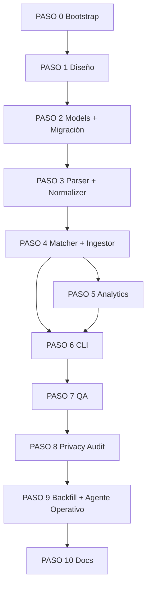

# Workflow — Implementación Módulo Resultados Copa Valle

**Fecha:** 2026-05-19
**Diseño base:** [`design.md`](./design.md)
**Estado:** Pendiente kickoff
**Fase:** 1.7

---

## Mapa rápido

```
PASO 0  Bootstrap: agente data-analyst (Opus) + deps + carpetas
PASO 1  Diseño técnico cerrado (data-analyst Opus)
PASO 2  Modelos SQLAlchemy + migración Alembic (fastapi-architect Opus)
PASO 3  Servicio pdf_parser + normalizer + tests parser (data-analyst Opus)
PASO 4  Servicio matcher + ingestor + tests (data-analyst Opus)
PASO 5  Analytics (4 funciones) + tests (data-analyst Opus)
PASO 6  CLI ingest_race.py (typer) (data-analyst Opus)
PASO 7  Test plan + fixtures PDF (quality-engineer Opus)
PASO 8  Auditoría privacidad menores (data-privacy-guard Opus)
PASO 9  Backfill Válidas I–IV + agente results-analyst.md final (data-analyst Opus)
PASO 10 Docs + completion report
```

---

## Convención: invocación de agentes Opus

Cada paso indica el agente responsable. Todos se ejecutan con override de modelo a `opus` vía el parámetro `model` del Agent tool, incluso si el frontmatter del agente declara otro modelo.

Ejemplo de invocación:

```
Agent({
  subagent_type: "fastapi-architect",
  model: "opus",
  description: "Modelos race",
  prompt: "..."
})
```

Agentes nuevos a crear (`.claude/agents/`):

- `data-analyst.md` — frontmatter `model: opus`
- `results-analyst.md` — frontmatter `model: opus` (este es el agente final que el coach usará operativamente; los anteriores son de implementación)

---

## Principios transversales

1. Idioma respuestas → español.
2. Privacidad menores: nombres completos solo en respuestas autenticadas; nunca en logs INFO ni en reportes club agregados.
3. Reusar capa `app/services/` con submódulo `race/` (no romper convenciones Fase 1).
4. Todos los tests pasan antes de pasar al siguiente PASO.
5. Conventional Commits: `feat(race):`, `fix(race):`, `test(race):`, etc.
6. No abstracciones prematuras. Cada función un propósito claro.
7. Backend antes que CLI. CLI antes que agente operativo.

---

## PASO 0 — Bootstrap

**Agente:** `data-analyst` (Opus). **Modelo override:** `opus`.

### Tareas

0.1. Crear `.claude/agents/data-analyst.md`:

```markdown
---
name: data-analyst
description: "Diseña pipelines de ingestión de resultados deportivos, parsing de PDFs, normalización fuzzy y analíticas longitudinales sobre MySQL/pandas."
model: opus
memory: user
---

Eres un ingeniero de datos especializado en análisis deportivo longitudinal.
Trabajas en el backend del Club Deportivo Trocha y Ruta. Stack: FastAPI + SQLAlchemy async + MySQL + pandas + rapidfuzz + pdfplumber.

Tu trabajo cubre: extracción estructurada de PDFs de resultados, normalización de nombres y clubes con tolerancia a typos, persistencia transaccional, y modelos analíticos simples (regresión lineal sobre n pequeño).

Restricciones inviolables:
- Datos de menores: nunca log nombres completos en INFO.
- Match a athletes existentes: nunca auto-asignar; siempre coach confirma.
- Análisis agregados club: sin feedback individual sobre menores.
- Predicciones con n<5: marcar confidence:low.
```

0.2. Crear carpeta `backend/app/services/race/` con `__init__.py` vacío.

0.3. Crear carpeta `docs/10-race-results/snapshots/` para fixtures PDF.

0.4. Añadir a `backend/requirements.txt`:

```
pdfplumber==0.11.4
rapidfuzz==3.10.1
pandas==2.2.3
Unidecode==1.3.8
typer[all]==0.13.1
```

0.5. `pip install -r requirements.txt` en `.venv` local.

### Criterio aceptación

- [ ] Agente `data-analyst.md` creado con `model: opus`.
- [ ] Carpetas `services/race/` y `docs/10-race-results/snapshots/` creadas.
- [ ] Dependencias instaladas y `pip freeze` consistente con requirements.

---

## PASO 1 — Diseño técnico cerrado

**Agente:** `data-analyst` (Opus).

### Tareas

1.1. Validar [`design.md`](./design.md) leyendo Válida IV (ya en `~/Downloads/`):
- Confirmar que 22 categorías cubren todas las observadas.
- Confirmar mapping `code` ↔ texto PDF (case-insensitive).
- Confirmar que todos los corredores TyR de Válida IV se detectan con fuzzy ≥85.

1.2. Documentar edge cases observados en Válida IV:
- Dorsal 1411 categoría Teteros aparece en GENERAL pero no en RESULTADOS (anomalía registrar).
- Tiempo `0:04:33` Matias Sabogal INF_A (warning).
- Filas con ciudad/club `0` (rider 1305): tratar `city_raw="" club_raw=""`.
- Categoría duplicada `INF_A FEMENINO`/`INF_A`/`INF_B FEMENINO`/`INF_B`: parser debe distinguir por keyword `FEMENINO`.

1.3. Generar archivo `docs/10-race-results/edge-cases.md` con lista.

### Criterio aceptación

- [ ] 22 codes mapeados sin ambigüedad.
- [ ] Edge cases documentados.
- [ ] Lista de corredores TyR esperados para Válida IV (oracle para tests).

---

## PASO 2 — Modelos + migración Alembic

**Agente:** `fastapi-architect` (Opus override).

### Tareas

2.1. Crear `backend/app/models/race_category.py`, `race_event.py`, `rider.py`, `race_result.py` según `design.md §3`.

2.2. Definir enums:
- `SurfaceCondition(str, Enum)`: `seca`, `humeda`, `barro`, `lluvia`, `mixta`
- `ResultStatus(str, Enum)`: `FINISHED`, `DNF`, `DSQ`, `MINUS_LAPS`
- `CategoryGender(str, Enum)`: `M`, `F`, `MIXED`
- `CategoryTier(str, Enum)`: `menores`, `juvenil`, `adulto`, `master`

Usar `values_callable` consistente con `MaturationStatus` existente.

2.3. Registrar modelos en `backend/app/models/__init__.py`.

2.4. Generar migración:

```bash
cd backend && alembic revision --autogenerate -m "agrega tablas race_event, race_category, rider, race_result"
```

2.5. Revisar migración manual:
- Constraints unique según `design.md §3`.
- Índices: `idx_rider_name_norm`, `idx_rider_is_tyr`, `idx_result_event_position`, `idx_result_rider_event`, `idx_result_category_points`.
- VIEW `season_standings` añadida con `op.execute(...)`.

2.6. Seed `race_categories` con 22 entradas (script independiente, no en migración para evitar acoplar data a schema).

2.7. `alembic upgrade head` local, validar tablas y view.

### Criterio aceptación

- [ ] 4 tablas + 1 view creadas.
- [ ] Seed de categorías insertado (22 filas).
- [ ] `alembic downgrade -1 && alembic upgrade head` corre sin errores.

---

## PASO 3 — pdf_parser + normalizer + tests

**Agente:** `data-analyst` (Opus).

### Tareas

3.1. `backend/app/services/race/normalizer.py`:
- `normalize_name(s: str) -> str`
- `normalize_club(s: str) -> str`
- `is_trocha_y_ruta(club: str) -> bool` (rapidfuzz ≥85 vs variantes)
- `parse_time(raw: str) -> tuple[ResultStatus, Optional[int], int]` retorna `(status, seconds, laps_down)`
- `parse_category_header(s: str) -> Optional[str]` retorna `code` o `None`

3.2. `backend/app/services/race/pdf_parser.py`:
- `ResultsRow` dataclass: `position`, `bib`, `name`, `city`, `club`, `time_raw`, `points`
- `parse_results_pdf(path: Path) -> dict[str, list[ResultsRow]]` (clave = category code)
- `parse_general_pdf(path: Path) -> dict[str, list[GeneralRow]]` similar con puntos por válida

Implementación:
- `pdfplumber.open(path)` por página.
- Detecta línea con `CAT:` para agrupar.
- `page.extract_tables()` con `table_settings` ajustados.
- Maneja header repetido y filas multi-página.

3.3. Tests `backend/tests/services/race/test_parser.py`:
- Fixtures: copiar Válida IV PDFs a `backend/tests/fixtures/race/valida_iv_2026_resultados.pdf` y `..._general.pdf`.
- Test: parser retorna 22 categorías para RESULTADOS Válida IV.
- Test: parser extrae 11 filas para Teteros Sin Pedales.
- Test: `parse_time("0:03:32")` → `(FINISHED, 212, 0)`.
- Test: `parse_time("DNF")` → `(DNF, None, 0)`.
- Test: `parse_time("(-1 VUELTA)")` → `(MINUS_LAPS, None, 1)`.
- Test: `is_trocha_y_ruta("Club Trocha y Ruta")` → `True`.
- Test: `is_trocha_y_ruta("TROCHY RUTA")` → `True`.
- Test: `is_trocha_y_ruta("Club Caña y Trapiche")` → `False`.

### Criterio aceptación

- [ ] Parser extrae 22 categorías + 287 corredores totales en Válida IV.
- [ ] Todos los 10+ corredores TyR oracle de PASO 1 detectados.
- [ ] Tests pasan (≥15 tests).

---

## PASO 4 — matcher + ingestor + tests

**Agente:** `data-analyst` (Opus).

### Tareas

4.1. `backend/app/services/race/matcher.py`:
- `MatchCandidate` dataclass: `athlete_id`, `full_name`, `score`, `age_decimal`, `reason`
- `match_athletes(rider: Rider, athletes: list[Athlete], threshold=0.90) -> list[MatchCandidate]`
- Solo invoca si `rider.is_trocha_y_ruta`.
- Score: `rapidfuzz.fuzz.token_set_ratio(rider.full_name_normalized, athlete.full_name_normalized)`.
- Boost +5 si categoría compatible (`age_min <= age_decimal <= age_max + 0.5`).
- Retorna top-3 con score >= threshold.

4.2. `backend/app/services/race/ingestor.py`:
- `RaceIngestor(db: AsyncSession)`
- `async def ingest_event(meta: EventMeta, results: dict[code, list[ResultsRow]], match_decisions: dict[bib, athlete_id|None]) -> IngestReport`
- Transacción única:
  1. Upsert `race_events` por `(season, copa_code, valida_num)`.
  2. Por cada row: upsert `riders` por `(full_name_normalized, club_normalized)`.
  3. Insert `race_results` con UNIQUE.
- Idempotente (re-ingest no duplica).
- `IngestReport`: `event_id`, `riders_created`, `riders_updated`, `results_inserted`, `tyr_count`, `warnings`.

4.3. `EventMeta` schema (Pydantic):
- `season`, `copa_code`, `valida_num`, `name`, `event_date`, `location`, `climate`, `temperature_c`, `surface_condition`, `altitude_msnm`, `weather_notes`.

4.4. Tests `tests/services/race/test_ingestor.py`:
- Ingest Válida IV fixture.
- Verifica conteos: 22 categorías, ~287 results, ~10 TyR.
- Re-ingest mismo PDF: `results_inserted=0`.
- `tests/services/race/test_matcher.py`: ≥5 casos con athletes seed.

### Criterio aceptación

- [ ] Ingest Válida IV en <5 segundos.
- [ ] Re-ingest idempotente.
- [ ] Matcher retorna top-3 ordenado por score.
- [ ] Tests pasan (≥10 tests adicionales).

---

## PASO 5 — Analytics + tests

**Agente:** `data-analyst` (Opus).

### Tareas

5.1. `backend/app/services/race/analytics.py` con 4 funciones:

```python
async def athlete_progression(db, rider_id: int) -> pd.DataFrame:
    """Columnas: valida_num, event_date, category_code, position,
       time_seconds, points, gap_to_winner_seconds, gap_to_winner_pct.
       Ordenado por event_date asc."""

async def podium_gap(db, category_id: int, season: int) -> pd.DataFrame:
    """Por cada corredor TyR de la categoría:
       valida_num, position, gap_to_p1_seconds, gap_to_p3_seconds, gap_pct.
       NULL si no participó."""

async def club_ranking(db, season: int) -> dict:
    """{
      'by_category': [...],
      'total_points': int,
      'total_podiums': int,
      'total_wins': int,
      'active_riders': int,
      'distribution_by_tier': {menores: N, juvenil: N, ...}
    }"""

async def projection(db, rider_id: int, next_event_id: int) -> dict:
    """{
      'rider_id': int,
      'expected_position': float,
      'expected_position_range': [low, high],
      'expected_time_seconds': float | None,
      'n_samples': int,
      'confidence': 'low' | 'medium' | 'high'  # low si n<5
    }"""
```

5.2. Implementación:
- pandas para joins/groupby.
- Regresión: `np.polyfit(deg=1)` sobre `position` vs `valida_num` para proyección.
- Confidence: low n<5, medium 5-8, high >8.

5.3. Tests `tests/services/race/test_analytics.py`:
- Seed: 4 válidas, 1 rider TyR con resultados conocidos.
- Test: progresión retorna 4 filas ordenadas.
- Test: gap_to_p1 calculado correctamente.
- Test: club_ranking suma puntos por categoría.
- Test: projection con n=4 marca `confidence: low`.

### Criterio aceptación

- [ ] 4 funciones implementadas con tipo de retorno consistente.
- [ ] Tests pasan (≥10 tests).
- [ ] DataFrames son JSON-serializables (`.to_dict("records")`).

---

## PASO 6 — CLI ingest_race.py

**Agente:** `data-analyst` (Opus).

### Tareas

6.1. Crear `backend/scripts/ingest_race.py` con typer:

```
ingest_race.py ingest --results PATH --general PATH [opciones]
ingest_race.py analyze evolution --rider-name STR | --rider-id INT
ingest_race.py analyze gap --category-code CODE --season INT
ingest_race.py analyze ranking --season INT [--output PATH.md]
ingest_race.py analyze projection --rider-name STR --next-valida INT
ingest_race.py riders list [--tyr-only] [--unmatched]
ingest_race.py riders link --rider-id INT --athlete-id INT
```

6.2. Flujo interactivo `ingest`:
1. Parsea ambos PDFs.
2. Detecta `season`, `valida_num`, `name` desde header del PDF (fallback prompt si no detecta).
3. Pregunta condiciones: clima, temp, superficie, msnm, notas.
4. Muestra resumen: N categorías, M corredores, K TyR.
5. Por cada TyR sin match previo:
   - Llama `match_athletes()`, muestra top-3, coach elige (`1/2/3/skip/new`).
6. Confirma `[y/N]`, ejecuta ingest.
7. Imprime `IngestReport` + comparativa vs válida anterior (puestos TyR).

6.3. Flag `--non-interactive` lee `match_decisions.yaml` y `event_meta.yaml`.

6.4. Imprimir analytics en tablas con `rich` (ya disponible vía typer).

### Criterio aceptación

- [ ] `python scripts/ingest_race.py ingest --results A.pdf --general B.pdf` corre end-to-end en local.
- [ ] Ingest Válida IV completa flujo interactivo en <2 minutos.
- [ ] `--non-interactive` para CI/tests.

---

## PASO 7 — Test plan + fixtures

**Agente:** `quality-engineer` (Opus).

### Tareas

7.1. Auditar cobertura PASOS 3-6. Identificar gaps.

7.2. Añadir tests faltantes:
- Edge cases parser: PDFs con páginas vacías, OCR ilegible (simular), categoría sin corredores.
- Concurrencia: 2 ingests simultáneos del mismo PDF (lock).
- Idempotencia: cambiar `points` y re-ingest actualiza (decidir UPSERT vs ignore).
- Validación rango tiempo por tier (Teteros 2-10min, Infantil 25-50min, Elite 80-120min).

7.3. Generar `tests/services/race/fixtures/`:
- Copia PDFs Válida IV (resultados + general).
- PDFs sintéticos con casos edge (generados con `reportlab` o copiados con anonimización).

7.4. Documentar test plan en `docs/10-race-results/qa.md`.

### Criterio aceptación

- [ ] Cobertura ≥85% en `services/race/`.
- [ ] Test plan documentado.
- [ ] Suite completa corre en <30s.

---

## PASO 8 — Auditoría privacidad menores

**Agente:** `data-privacy-guard` (Opus override).

### Tareas

8.1. Auditar todo `services/race/` + `scripts/ingest_race.py`:
- Ningún `logger.info()` con nombre completo de menor.
- Reportes agregados (`club_ranking`, `podium_gap`) no incluyen feedback individual.
- `analytics.athlete_progression()` solo accesible si coach autenticado (cuando llegue endpoint).
- CLI no escribe a stdout nombres completos por defecto; usa `--show-names` flag.

8.2. Auditar fixtures: PDFs almacenados en repo, ¿hay riesgo? (sí — son públicos por federación, OK; documentar política).

8.3. Generar `docs/10-race-results/privacy-audit.md`.

### Criterio aceptación

- [ ] Sin filtraciones detectadas.
- [ ] Política de fixtures documentada.
- [ ] CLI default conservador con nombres.

---

## PASO 9 — Backfill Válidas I-IV + agente operativo final

**Agente:** `data-analyst` (Opus).

### Tareas

9.1. Coach provee PDFs Válidas I (Sevilla 31-ene), II (Ginebra 28-feb), III (La Cumbre 19-abr). Válida IV ya disponible.

9.2. Ingest secuencial I→II→III→IV. Por cada una:
- Captura condiciones desde memoria/notas del coach.
- Confirma matches TyR (cache se reusa entre válidas).
- Verifica continuidad de `rider_id` entre válidas (mismo nombre + club).

9.3. Reporte post-backfill `docs/10-race-results/backfill-2026.md`:
- Conteos por válida.
- Riders TyR únicos en temporada.
- Top 3 hallazgos analíticos (evolución más destacada, mayor gap, predicción válida V).

9.4. Crear `.claude/agents/results-analyst.md` (agente operativo final del coach):

```markdown
---
name: results-analyst
description: "Ingiere resultados de válidas Copa Valle XCO, normaliza fuzzy, marca corredores Trocha y Ruta y produce analíticas (evolución, gap podio, ranking club, proyección)."
model: opus
memory: user
---

Eres el agente operativo de análisis de resultados del Club Trocha y Ruta.

Tu trabajo:
1. Recibir rutas a PDFs RESULTADOS + GENERAL de una válida.
2. Invocar `scripts/ingest_race.py ingest` en modo interactivo.
3. Conducir captura de condiciones (clima, temp, superficie, msnm, notas).
4. Confirmar matches a athletes TyR (top-3 ranking).
5. Reportar resumen: nuevos riders, comparativa vs válida anterior, hallazgos clave.
6. Bajo demanda: invocar `analyze evolution|gap|ranking|projection`.

Restricciones:
- Nombres completos solo en outputs autenticados al coach.
- Proyecciones n<5 → confidence:low + advertencia explícita.
- Sin recomendaciones de entrenamiento (eso es `sports-science-advisor`).
- Sin acceso a datos médicos.
```

### Criterio aceptación

- [ ] 4 válidas ingestadas con condiciones documentadas.
- [ ] `results-analyst.md` creado y funcional.
- [ ] Reporte backfill generado.

---

## PASO 10 — Docs + completion report

**Agente:** `data-analyst` (Opus).

### Tareas

10.1. Actualizar `CLAUDE.md` raíz: añadir bloque "Estado de implementación — Módulo Resultados Copa (Fase 1.7)" con tabla pasos.

10.2. Generar `docs/10-race-results/COMPLETION_REPORT.md`:
- Resumen de lo entregado.
- Comandos clave para el coach.
- Próximos pasos (V Palmira 01-ago será primer test real del agente operativo).

10.3. Actualizar `docs/README.md` con link a `10-race-results/`.

10.4. Commit final con mensaje:

```
feat(race): agrega módulo de ingesta y análisis de resultados Copa Valle

Implementa pipeline completo de ingestión de PDFs oficiales (RESULTADOS +
GENERAL) con normalización fuzzy, persistencia en MySQL y analíticas
longitudinales (evolución, gap podio, ranking club, proyección).
Backfill Válidas I-IV temporada 2026 completado. Operación CLI vía
scripts/ingest_race.py orquestado por agente results-analyst (Opus).
```

### Criterio aceptación

- [ ] CLAUDE.md actualizado.
- [ ] Reporte completion publicado.
- [ ] Commit limpio sin amend.

---

## Resumen de agentes por paso

| Paso | Agente | Modelo |
|---|---|---|
| 0 | data-analyst (crear) | opus |
| 1 | data-analyst | opus |
| 2 | fastapi-architect | opus (override) |
| 3 | data-analyst | opus |
| 4 | data-analyst | opus |
| 5 | data-analyst | opus |
| 6 | data-analyst | opus |
| 7 | quality-engineer | opus |
| 8 | data-privacy-guard | opus (override) |
| 9 | data-analyst + results-analyst (crear) | opus |
| 10 | data-analyst | opus |

---

## Dependencias entre pasos



PASOS 5 y 6 se pueden paralelizar tras PASO 4. PASOS 7 y 8 son secuenciales (privacy depende de QA estable).

---

## Ejecución sugerida

Tres frentes paralelos posibles:

- **Sprint 1 (1-2 días):** PASOS 0, 1, 2 — bases técnicas.
- **Sprint 2 (2-3 días):** PASOS 3, 4 secuenciales; PASO 5 puede solapar al final de 4.
- **Sprint 3 (1-2 días):** PASOS 6, 7, 8 — CLI + calidad + privacidad.
- **Sprint 4 (1 día):** PASOS 9, 10 — backfill operativo + docs.

Total estimado: 5-8 días de trabajo enfocado.
