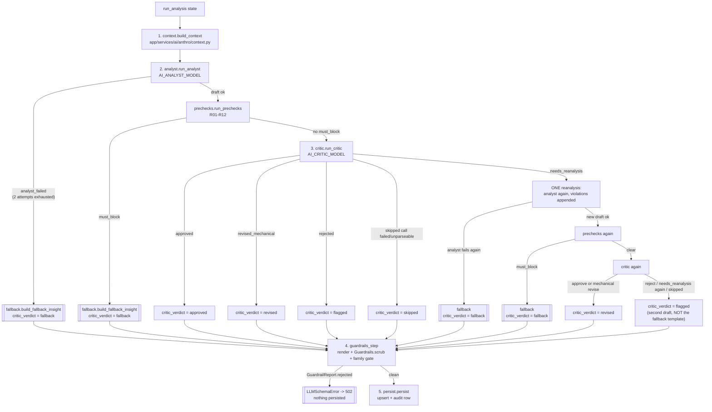

# Traceable growth AI — Design

Feature `specs/042-traceable-growth-ai`. Branch `feat/042-traceable-growth-ai`. Waves 1-3
shipped and verified (see `docs/implementation-status.md` for the step table and
`docs/technical-notes.md` for the dated changelog). This document is for the developer who,
a year from now, needs to change the anthropometry pipeline, the shared LLM factory, or the
family delivery gate without re-deriving why each piece is shaped the way it is.

Full requirements: `specs/042-traceable-growth-ai/spec.md` (FR-001..FR-036). Full schema
detail: `specs/042-traceable-growth-ai/data-model.md` — this document restates its state
machine (§2) because that machine is the single hardest thing in this feature to hold in
your head from the code alone, but `data-model.md` is still the source of truth if the two
ever disagree. Contracts for each surface live in `specs/042-traceable-growth-ai/contracts/`.

**Verification note**: everything below was checked by reading the committed code at the
paths cited, or by running the offline `pytest` lane (aiosqlite in-memory, both
`AI_USE_LANGCHAIN` values). Nothing here was checked against a live MySQL, a real model API
key, or Render — see `docs/20-traceable-growth-ai/qa.md` for what is still open and why.

## 1. The five-step pipeline

`backend/app/services/ai/anthro/pipeline.py::run_analysis(state, config)` is the single
entry point. It replaces the two feature-033 use cases (`PHVExplainerUseCase`,
`AnthropometricRecordExplainerUseCase` — both kept alive only for their own unit tests) for
both traced endpoints: per-measurement analysis and the PHV explainer.



### What each step owns

| Step | File | Owns | Never does |
|---|---|---|---|
| 1. Context | `context.py::build_context` | Assembles `AnalysisContext` (identity, deltas, longitudinal series, growth summary, training window, previous structured insight) through the existing allow-list (`app/services/ai/context_builders.py::sanitize_insight_context`), then renders the same sanitized dicts into the six Jinja text blocks the prompt expects, in the same function call. | Never calls an LLM; never fails in practice (no network I/O it can't degrade around — a missing `db`/`club_id` degrades a field to `None`, it never raises). |
| 2. Analyst | `analyst.py::run_analyst` | One prompt render (`AI_ANTHRO_PROMPT_VERSION`) + one call to `role="analyst"` (`AI_ANALYST_MODEL`), with exactly one repair retry on unparseable/invalid JSON (`_MAX_ATTEMPTS = 2`, mirrors `race/agents/analyst.py::_generate_v3`). | Never decides what happens after two failed attempts — it reports `analyst_failed=True` and lets `pipeline.py` route to fallback. Never builds a fallback itself. |
| 3. Critic | `critic.py::run_critic` | One call to `role="critic"` (`AI_CRITIC_MODEL`), classifying the raw three-value LLM verdict (`approve\|revise\|reject`) plus the mechanical/interpretative split of `revise` violations into its own five-value `CriticDecision` (`approved`, `revised_mechanical`, `needs_reanalysis`, `rejected`, `skipped`) — **not** the persisted `critic_verdict`, see §1.2 below. | Never re-invokes the analyst itself (that second call, when it happens, belongs to `pipeline.py`) and never re-runs its own review a second time in one call. |
| 4. Guardrails | `guardrails_step.py::guardrails_step` | Renders the final `insight` to the plain-prose column value (`render_markdown_free`), runs the existing `Guardrails.scrub_with_report` (last defence, shared with every other AI use case) over that text, raises `LLMSchemaError` on rejection, and evaluates (never invents copy for) the family delivery gate. | Never decides which of the four possible insight sources (analyst draft, critic's `revised_output`, second-attempt draft, fallback template) is "the" final one — that was already resolved by step 3 and `pipeline.py` before this step runs. |
| 5. Persist | `persist.py::persist` | Upserts the cache row (`(athlete_id, anthropometric_record_id, use_case)`) with all nine new columns plus the pre-existing ones, and writes the audit row (fact + identifiers only, never the generated text). | Never sanitizes or re-renders anything — it persists `state["guardrail_rendered_text"]` verbatim, exactly what step 4 already scrubbed. |

### 1.1 Why a plain sequential orchestrator, not a `StateGraph` (research R-03)

`plan.md`'s own framing called this "a small LangGraph graph"; the shipped code is a plain
`async def run_analysis(state, config)` doing five sequential `await`s, with **no
`StateGraph`, no sqlite checkpointer, and no HITL interrupt** (`pipeline.py:8-22`). This was
a deliberate lead decision (`research.md` R-03), not a shortcut:

- LangGraph earns its cost through checkpointing, `interrupt()`, conditional routing, and
  fan-out. This pipeline needs none of those — no resume-after-restart, no human-in-the-loop
  pause (unlike the race stack, which genuinely pauses for coach review), and only one
  conditional branch shape (fail early → skip the rest → fallback) repeated at two points.
- Without a checkpointer, a `StateGraph` here would be a dict-threading loop plus an import.
- Every step keeps the exact `async def step(state: dict, config: Optional[dict]) -> dict`
  signature a LangGraph node would have — including `guardrails_step`'s literal function
  name, fixed by the pseudocode in `contracts/trace-metadata-allowlist.md` §4.1:

  ```text
  state = await context(state, config)
  state = await analyst(state, config)
  state = await critic(state, config)
  state = await guardrails_step(state, config)
  state = await persist(state, config)
  ```

  This is what makes a future promotion to a real `StateGraph` a mechanical wrapping of
  existing functions, not a rewrite, if a future branching need (a second HITL-style pause,
  say) ever justifies the graph machinery's cost.
- `config` is threaded into every step for one reason only: to carry the Langfuse
  `callbacks` fragment that `pipeline.py` opens once, in its own root span
  (`llm_tracing(...)` at `pipeline.py:281`), and pass down unchanged. Steps that never call
  an LLM (`context`, `guardrails_step`, `persist`) still accept `config` — and immediately
  `del` it — purely for signature uniformity across the five steps.

### 1.2 Three vocabularies, deliberately never conflated

Reading any of `critic.py`, `pipeline.py` or `schemas.py` without this table first is the
single most common way to introduce a bug here (`data-model.md` §2.4 calls this out as a
"collision to hold in mind"):

| Vocabulary | Where | Values | Who produces it |
|---|---|---|---|
| Critic LLM raw verdict | `AnthropometryCriticVerdict.verdict` (`schemas.py:122`) | `approve \| revise \| reject` | The critic model's JSON response, one call. |
| `CriticDecision` | `critic.py::run_critic` return, `critic_decision` key | `approved`, `revised_mechanical`, `needs_reanalysis`, `rejected`, `skipped` | `critic.py` alone — folds the raw verdict, the mechanical/interpretative rule-id split, and "did the call even succeed" into one value. |
| Persisted `critic_verdict` | `AthleteAIExplanation.critic_verdict` (DB column, API field) | `approved \| revised \| flagged \| fallback \| skipped` | `pipeline.py` alone — folds `CriticDecision` **and** the precheck result **and** the outcome of the (at most one) reanalysis. |

`guardrails_step.py` defends this at runtime: it raises `ValueError` if it ever receives a
`critic_verdict` outside the five persisted values (`guardrails_step.py:223-229`) — a
guard against someone accidentally threading the three-value raw vocabulary through by
mistake.

### 1.3 The two-sequential-LLM-call latency budget exception

This pipeline can call an LLM up to **four** times in the worst case (analyst → critic →
reanalysis of the analyst → critic of the reanalysis), normally two (analyst → critic). This
is a documented, deliberate exception to the project's general write budget (p95 ≤ 1500 ms) —
`plan.md` §Constitution Check (row IV) and §Complexity Tracking record it explicitly:

> "Analysis endpoints exceed the p95 ≤ 1500 ms write budget (two sequential LLM calls,
> ~20-40 s locally) ... Single-call without critic rejected by the owner (safety)."

Local target: **p95 ≤ 45 s**. The documented exit, if that target is exceeded in production,
is to convert `pipeline.run_analysis` into a submitted run polled for completion — the same
submit-and-poll shape the race stack already uses (`routers/race_imports.py`: parse →
dry-run → commit) — rather than continuing to block the HTTP response. `latency_ms`
(persisted by `persist.py`, measured end-to-end by `pipeline.py` from context-build through
persist, not just the LLM calls) is precisely the metric that would show this budget being
crossed in production; nothing currently alerts on it automatically. `app/routers/ai.py`'s
module docstring repeats the same exception for the two endpoints that call this pipeline
(`routers/ai.py:60-70`).

Why a single call without a critic was rejected: this is the same reasoning the constitution
gives extra weight to youth psychological-assessment safeguards (Principle V) — the owner
chose safety-by-review over latency.

## 2. The generation state machine

This reproduces `data-model.md` §3 (the source of truth) faithfully, annotated with the
exact `pipeline.py` branch that implements each transition, so a change to one can be
checked against the other.

```text
draft ──► prechecked ──► reviewed ──► ┬─► APPROVED
                                      ├─► REVISED
                                      ├─► FLAGGED
                                      ├─► FALLBACK
                                      └─► SKIPPED
```

### 2.1 The two paths that skip the critic call entirely

Both are deliberate — FR-014: "the critic call is skipped to avoid spending a call whose
verdict cannot change the outcome."

1. **Analyst failure** (`pipeline.py:320-328`): if `analyst.run_analyst` exhausts both
   attempts (`analyst_failed=True`), the pipeline goes straight to
   `fallback.build_fallback_insight` with `critic_verdict="fallback"`. The critic is never
   invoked — there is no draft for it to review.
2. **Precheck `must_block`** (`pipeline.py:330-339`): after a valid draft, `run_prechecks`
   (R01-R12, `prechecks.py`) runs. If any violation has `must_block=True` (privacy/LTAD/
   grounding rules R01, R02, R04, R06, R09, R11, R12 — see the catalogue table at
   `prechecks.py:14-30`), the pipeline again goes straight to the fallback template, again
   skipping the critic — a blocking issue found deterministically cannot be un-found by a
   critic's opinion, so spending the call would only add latency and cost.

Both paths converge on the **same** deterministic fallback builder
(`fallback.py::build_fallback_insight`), which is itself a valid `AnthropometryInsightV1`
(never a hand-written string outside the schema) — this is what lets the frontend's v2
renderer treat a `critic_verdict="fallback"` row with zero special-casing (`fallback.py:14-21`).

### 2.2 The critic-reached paths (precheck passed, no `must_block`)

`critic.run_critic` returns one of five `CriticDecision` values (§1.2); `pipeline.py` maps
four of them directly:

| `CriticDecision` | Persisted `critic_verdict` | Notes |
|---|---|---|
| `approved` | `APPROVED` | If the precheck found any non-blocking (confidence-only) violation, `_apply_confidence_low_override` (`pipeline.py:156-170`) forces `confidence.level="low"` regardless of what the analyst reported — a full replacement of the `Confidence` object, never a concatenation, so the `3 <= len(reason) <= 200` bound holds deterministically. |
| `revised_mechanical` | `REVISED` | The critic's own `revised_output` is adopted directly — no second analyst call. Only reachable when every violation is mechanical (R04, R06, R07, R09, R10, R12) and the critic supplied a schema-valid revision. |
| `rejected` | `FLAGGED` | No second analyst call — FR-013's "at most one revision" is spent on `revise`, never on `reject`. |
| `skipped` | `SKIPPED` | Critic call failed, timed out, or returned unparseable/invalid JSON. `critic.py` itself already forced `confidence.level="low"` with a fixed, non-technical reason (`_apply_skipped_confidence`) before returning. |

### 2.3 The single bounded revision (`needs_reanalysis`)

This is the one path with real branching. `needs_reanalysis` fires when the critic says
`revise` but at least one violation is interpretative (R01, R02, R03, R05, R08, R11, CTX01,
CTX02 — or any rule id the critic invents outside both known sets, treated conservatively as
interpretative) — a case only the analyst, not the critic, can correctly re-reason about.

`pipeline.py` re-invokes the analyst **exactly once** (`_MAX_ATTEMPTS` inside `analyst.py` is
about JSON-repair retries within one call, not this outer reanalysis — the two are unrelated
counters), with the critic's violations appended into the `previous_analysis_block` prompt
slot (`_augment_context_blocks_with_critic_feedback`, `pipeline.py:173-209` — chosen over
adding a new Jinja variable, which would require editing the prompt contract file outside
this task's ownership). The second attempt runs through prechecks and the critic again:

| Second attempt outcome | Persisted `critic_verdict` | `structured_json` holds |
|---|---|---|
| Second analyst call also fails | `FALLBACK` | The deterministic template — same as §2.1. |
| Second draft's precheck hits `must_block` | `FALLBACK` | Same template. |
| Second critic call returns `approve` or `revised_mechanical` | `REVISED` | The second attempt's (possibly critic-revised) draft. The whole run counts as `REVISED` even though the *last* critic call approved outright — the run as a whole needed a correction. |
| Second critic call returns `reject`, `needs_reanalysis` again, or `skipped` | `FLAGGED` | **The second attempt's own draft — never the fallback template.** FR-013's one allowed revision is now spent; the coach sees real, if imperfect, content marked "Con observaciones", not a synthetic placeholder. |

This last row is easy to get backwards: a second `needs_reanalysis` does **not** loop again
(there is no third analyst call) and does **not** fall back — it lands on `FLAGGED` with the
real second draft. Fallback is reserved strictly for "the analyst produced nothing usable" or
"a blocking safety rule fired", never for "the critic still wasn't satisfied twice."

### 2.4 Guardrails as the final, non-negotiable gate

Regardless of which of the six paths above produced `insight` + `critic_verdict`,
`guardrails_step.py` runs the same `Guardrails.scrub_with_report` used by every other AI use
case in the project, over the rendered prose. A rejection here (`GuardrailReport.rejected` —
3+ violations, or any `anthropometry_insight_v1`-specific privacy rule) raises
`LLMSchemaError`, mapped to the same `502` the legacy use case already produced
(`contracts/measurement-analysis-api.md` §5: "Unchanged mapping; now can also fire from
guardrails_step.py"). **Nothing is persisted** when this fires — it is not a sixth state in
the enum, it aborts the run entirely, same as the legacy path always has.

## 3. The nine columns, and why they live on the cache row

`backend/app/models/ai_explanation.py:72-113`, Alembic revision `686ce1d873f3`
(`down_revision = 45cd705c6b54`) — single head. **CLAUDE.md previously named the head as
`45cd705c6b54`; that line is now stale and is corrected by this feature's own docs wave
(T085)** — if you find a copy of CLAUDE.md still citing `45cd705c6b54` or the older
`2a8baa967cc6`, the code (`alembic heads`) is authoritative, not the doc.

| Column | Type | Purpose |
|---|---|---|
| `schema_version` | `String(8)`, nullable | Row-format discriminator. `NULL` = legacy free prose (feature 033); `"v2"` = structured, this feature. **Never** the string `"v1"` — a v1-shaped row is `NULL`, so `IS NOT NULL` alone answers "is this a 042 row?". |
| `structured_json` | `JSON`, nullable | `AnthropometryInsightV1.model_dump(mode="json")`. Populated for every `schema_version="v2"` row, including `critic_verdict="fallback"` rows — the fallback template is itself a valid instance of the schema. |
| `critic_verdict` | `String(16)`, nullable | One of the five persisted values from §2. |
| `prompt_version` | `String(32)`, nullable | The `AI_ANTHRO_PROMPT_VERSION` active when *this* row was generated — read from `state`, never re-read from `settings` at persist time, so a later rollback of the setting cannot retroactively relabel old rows. |
| `tokens_in` / `tokens_out` | `Integer`, nullable | Summed across the analyst call and, when it ran, the critic call (both calls, if a reanalysis happened). |
| `cost_usd` | `Numeric(10, 6)`, nullable | Six decimals, matching `compute_cost_usd`'s own rounding (`app/services/llm/pricing.py`, moved there from `race/agents/pricing.py`). |
| `latency_ms` | `Integer`, nullable | Wall-clock time of the **whole pipeline run** (context build through persist) — not just the LLM calls. This is the metric that would show the §1.3 budget exception being exceeded. |
| `langfuse_trace_id` | `String(64)`, nullable | `NULL` whenever `LANGFUSE_ENABLED=false` (always true in production) — by construction, not a bug. |

**Why nine nullable columns on the existing cache table, not a new `ai_generation` table**
(`plan.md` §Complexity Tracking): the cache row *is* the generation — one row per
`(athlete_id, anthropometric_record_id, use_case)`, and the telemetry describing a
generation belongs beside the text it describes. All nine columns are nullable with no
`server_default`, so the migration is instant DDL on MySQL 8.0+: no backfill, no table
rewrite. The alternative considered and rejected was reusing `agent_runs` (the race stack's
own generation-tracking table) — rejected because `agent_runs` has race-only `NOT NULL`
columns and feeds `RACE_AI_BUDGET_USD_30D`, which the owner explicitly does not want this
stack counted against (see §5).

**Why `text` stays `NOT NULL` and is populated even for `schema_version="v2"` rows**: every
pre-existing reader of `AthleteAIExplanation.text` — email templates, PDF generation, any
code this feature did not touch — keeps working with zero changes. `guardrails_step.py`
renders the final `insight` to plain prose (`render_markdown_free`, fixed section order,
`confidence.reason`/`data_gaps` deliberately excluded — they're analysis metadata, not
narrative) and `persist.py` writes exactly that string, unmodified, to `text`. There is only
one rendering path, not two that could drift.

The nine columns are read-only outside `persist.py` (`data-model.md` §6 invariant 5) — no
other module in this feature writes them directly.

## 4. The shared factory and the adapter

### 4.1 One factory, two stacks, one-way inheritance

`backend/app/services/llm/factory.py::build_chat_llm(..., role=, stack="app"|"race")` is
the single place in the monorepo that knows how to construct a LangChain chat model for a
configured provider (`anthropic`, `google`, `openai`, `claude-cli`). It was extracted from
`app/services/race/agents/_llm.py` in Wave 1 so that `app/services/ai/` could build the same
kind of client without importing anything from the `race` package.

The rule this factory exists to protect (`factory.py:16-20`, restated in CLAUDE.md): **the
app stack may never read a `RACE_AI_*` variable; the race stack may read `AI_*` as a
fallback only when its own `RACE_AI_*` variable is empty.** Two independent resolver
functions enforce this at the only two points where stack-specific config resolution
happens:

- `resolve_app_config(...)` (`factory.py:296-329`) — reads only `AI_PROVIDER`,
  `AI_ANALYST_MODEL`/`AI_CRITIC_MODEL`, `AI_MODEL`, `AI_API_KEY`, `AI_TEMPERATURE`,
  `AI_BASE_URL`. Never touches a `RACE_AI_*` name.
- `resolve_race_config(...)` (`factory.py:255-293`) — reads `RACE_AI_PROVIDER`, falling
  back to `AI_PROVIDER` when empty; same one-way fallback for the API key
  (`_resolve_race_api_key`, only when the *resolved* race provider equals `AI_PROVIDER`) and
  for temperature (`RACE_AI_TEMPERATURE`, default `0.4`).

The builders themselves (`_build_anthropic_llm`, `_build_google_llm`, `_build_openai_llm`,
`_build_claude_cli_llm`) never read `settings` — they receive an already-resolved
`ProviderConfig` and are shared, unmodified, by both stacks. This is what makes the
inheritance rule enforceable by code review at two functions instead of scattered across
every call site: any new stack-specific env var only ever needs to be added to one of the
two resolvers, never to a builder.

`anthro/analyst.py` and `anthro/critic.py` call `build_chat_llm(role="analyst"|"critic",
stack="app")` directly — this pipeline is **not** routed through the `LangChainProvider`
adapter described next; it talks to the shared factory and `app/services/llm/calls.py::call_llm`
directly (`analyst.py:240-241`, `critic.py:413-414`).

### 4.2 The adapter: `LangChainProvider`

`backend/app/services/ai/providers/langchain_provider.py` is a different thing: it
implements the pre-existing `LLMProvider` protocol (`ChatCompletion` + `StructuredOutput`)
on top of a `BaseChatModel` built by the same factory (`stack="app"`), so that the **five
legacy, single-shot use cases** — session assistant clarify/draft, monthly report, monthly
report blocks, family newsletter v2 — can run through LangChain behind `AI_USE_LANGCHAIN`
without their call sites, prompts, or response shape changing at all. It is selected inside
`app/services/ai/factory.py`'s existing provider-factory branch when `AI_USE_LANGCHAIN=true`
(the default).

Two things distinguish it from the anthro pipeline's direct factory usage:

- It preserves `system`/`human` message role separation (`_to_messages`,
  `langchain_provider.py:47-66`) — the five bridged use cases already distinguished a system
  prompt from user turns, and that must not change with the transport swap. `llm/calls.py`'s
  `call_llm`, by contrast, collapses everything into one `HumanMessage`, because the race
  pipeline it was extracted from never distinguished the two.
- `complete_json` implements structured output as JSON-in-the-prompt + Pydantic validation,
  **not** `with_structured_output()` — two of the four supported providers (claude-cli,
  OpenAI via Ollama) don't reliably support tool-calling (`spec.md` Assumptions).

The `FakeLLMProvider` short-circuit in `app/services/ai/factory.py` is checked **before**
the `AI_USE_LANGCHAIN` branch — `AI_ENABLED=false` and the roughly 40 existing
`fake.last_request` privacy assertions never see this adapter at all.

### 4.3 Why the race shims still exist

`app/services/race/agents/_llm.py`, `app/services/race/agents/pricing.py`, and
`app/services/race/observability.py` are now thin re-export shims over
`app/services/llm/{factory,calls,pricing,observability}.py` — not deleted. Roughly 30 race
tests `monkeypatch.setattr` those exact module paths (e.g.
`app.services.race.agents._llm.build_chat_llm`), and several production modules
(`race/agents/analyst.py`, `critic.py`, `chat.py`, `race/ai/nodes/persist_insight.py`,
`race/eval/judge.py`) still import from those paths too. Rewriting every monkeypatch target
and import in the same wave that extracted the shared factory was rejected
(`plan.md` §Complexity Tracking) as unnecessary risk to the blocking race golden eval; the
shims are scheduled for removal in a future feature, never this one.

Two of the three shims are simple `from ... import ...` re-exports (pure functions and
immutable dispatch dicts — safe to copy the reference once). `race/observability.py` is not:
it needs a `ModuleType` subclass with custom `__getattr__`/`__setattr__` to delegate its four
pieces of process-mutable state (`_client`, `_warned_missing_keys`, `_create_client`,
`_handler_class`) to the real module's own attributes, so that a test's
`monkeypatch.setattr(race_observability, "_client", ...)` and the real module's `global
_client` reads/writes stay the *same* storage rather than silently diverging under
concurrency (`race/observability.py:1-40` docstring walks through exactly why a plain
`from ... import _client` would break under `asyncio.gather`).

## 5. The family delivery gate — enforced at three independent layers

FR-016 / `data-model.md` §3 invariant: **family delivery is `critic_verdict ∈ {approved,
revised}` and nothing else** — never "flagged with a caveat", never "fallback text is still
better than nothing." This is deliberately checked in more than one place, not because any
one of them is untrusted, but because each layer serves a different caller:

1. **`guardrails_step.py::guardrails_step`** (`guardrails_step.py:263-268`) — computes
   `family_deliverable = critic_verdict in FAMILY_DELIVERABLE_VERDICTS` as part of the
   pipeline's own return value, for the **POST** (generate) response the coach sees
   immediately after triggering a generation. `FAMILY_DELIVERABLE_VERDICTS = frozenset({
   "approved", "revised"})` is defined here and imported everywhere else that needs the same
   set, so the literal exists in exactly one place.
2. **`app/routers/ai.py::_family_gate_blocks`** (`routers/ai.py:288-302`) — gates the
   **GET** cache reads (`phv-explanation`, `measurements/{record_id}/explanation`) **by the
   requester's role**, not by the `?audience=` query parameter: a parent (`UserRole.parent`)
   with a cached row whose `critic_verdict` is `flagged`/`fallback`/`skipped` gets `204`,
   identical to "no analysis yet." A coach requesting `?audience=family` to preview still
   sees the real, marked content — the coach is the human in the loop, so the gate is keyed
   on who is asking, not on which audience copy was requested. `critic_verdict IS NULL`
   (a feature-033 legacy row) is always treated as deliverable — this feature never
   retroactively censors pre-critic content (`data-model.md` §6 invariant 3).
3. **`app/routers/growth.py`** (`growth.py:154-162`, inside the function that builds
   `latest_ai_analysis` for the 040 growth-summary tab) — the identical check, independently
   applied to the summary line embedded in the Crecimiento tab: `critic_verdict=None` is
   returned to a parent viewer even when the row itself carries a real verdict
   (`growth.py:180`), and the row is skipped entirely (`return None`) if its verdict is
   outside the deliverable set for that viewer.

A fourth layer exists outside this document's backend scope but is worth knowing about: the
frontend renders a `null`/absent analysis identically to "no analysis yet" on every
family-facing surface (see `frontend/src/components/ai/AnthropometricRecordExplanationCard.tsx`
and `frontend/src/components/athletes/growth/LatestAnalysisLine.tsx`) — because the three
backend layers above already return nothing (`204`, or a `null` `latest_ai_analysis`) for a
non-deliverable verdict, the frontend never even receives `flagged`/`fallback`/`skipped` on
a family-facing request; it has no separate gate of its own to get wrong. If you are hunting
for "why doesn't the parent see this analysis" and none of the three backend checks above
explain it, the frontend is not where to look next — start over at §5's three layers.

Coach-facing surfaces show all five states, with `flagged` and `fallback` labelled
distinctly ("Con observaciones" vs. the fallback copy) so a coach can tell "the model said
something questionable" from "the model didn't run at all."

## 6. Tracing: the root span, and what leaves the process

`pipeline.py::run_analysis` opens exactly one Langfuse span per run
(`llm_tracing(trace_name=f"anthro-{use_case}", session_id=..., trace_seed=session_id)`,
`pipeline.py:281-286`) and threads its `callbacks` fragment into every step that calls an
LLM. `session_id` is derived via `keyed_session_id` — an HMAC over
`f"{use_case}:{athlete.id}:{target_record.id}"` keyed by `settings.jwt_secret_key`, stable
across process restarts (a deliberate owner tradeoff: a per-process salt would be stronger
but would break trace grouping for the same athlete across a redeploy) and domain-separated
from both the race pseudonymizer's own salt and the plain (enumerable) `anonymous_session_id`
helper it replaces for new call sites. The same helper now backs the race chat trace too
(FR-024) — one HMAC domain-separation scheme, not two ad hoc ones.

Trace **content** (prompt/response bodies) is redact-always in every configuration — the
Langfuse client's `mask()` callback (`observability_metadata.py::build_mask`) replaces
`input`/`output` with `"[redacted]"` unconditionally, regardless of
`LANGFUSE_STRUCTURAL_METADATA`. That flag only ever affects the separate `metadata` channel,
and only by way of `StructuralMetadata` — a marker type whose constructor validates every key
against the closed `ALLOWED_METADATA_KEYS` allow-list and rejects (raises, not silently
drops) any key outside it, plus a combination rule that forbids two or more of `sex` /
`age_group` / `maturation_status` / `category` ever traveling together (a club of ~20 minors
makes any two of those combined into an equivalence class smaller than the k-anonymity
threshold the rest of the project already treats as unsafe — see
`observability_metadata.py`'s module docstring for the arithmetic). `guardrails_step.py`
attaches its own `guardrail_rule_ids`/`guardrail_scrub_count`/`critic_verdict` this way
(`build_structural_metadata(...)`, `guardrails_step.py:270-274`), and it does so
unconditionally — the function itself returns `None` when the flag is off, so no call site
needs to branch on `LANGFUSE_STRUCTURAL_METADATA` itself.

## 7. Things a future change here should not get wrong

- Don't compare `AnthropometryInsightV1.schema_version` (insight payload version, always
  `"v1"` today) with `AthleteAIExplanation.schema_version` (row-format discriminator, `NULL`
  or `"v2"`) — they answer different questions and happen to share a name (`schemas.py:6-23`,
  `data-model.md` §0).
- Don't add a new key to `ALLOWED_METADATA_KEYS` without re-reading
  `contracts/trace-metadata-allowlist.md` in full — the combination rule in
  `_QUASI_IDENTIFIER_KEYS` is independent of the allow-list itself and exists precisely so a
  well-intentioned PR that "activates" a second quasi-identifier field doesn't silently
  violate it.
- Don't route a new use case through `app/services/llm/calls.py::call_llm` if it needs
  system/human role separation preserved — that function collapses everything to one
  `HumanMessage`. Use the `LangChainProvider` adapter's `_to_messages` pattern instead.
- Don't delete the race shims (`race/agents/_llm.py`, `race/agents/pricing.py`,
  `race/observability.py`) without first re-pointing the ~30 tests that monkeypatch those
  exact module paths — see §4.3.
- A `FLAGGED` outcome from the second (post-reanalysis) critic call keeps the **second
  draft**, never the fallback template — see the last row of the table in §2.3. This is the
  single easiest state-machine branch to get backwards from a skim of `pipeline.py`.
